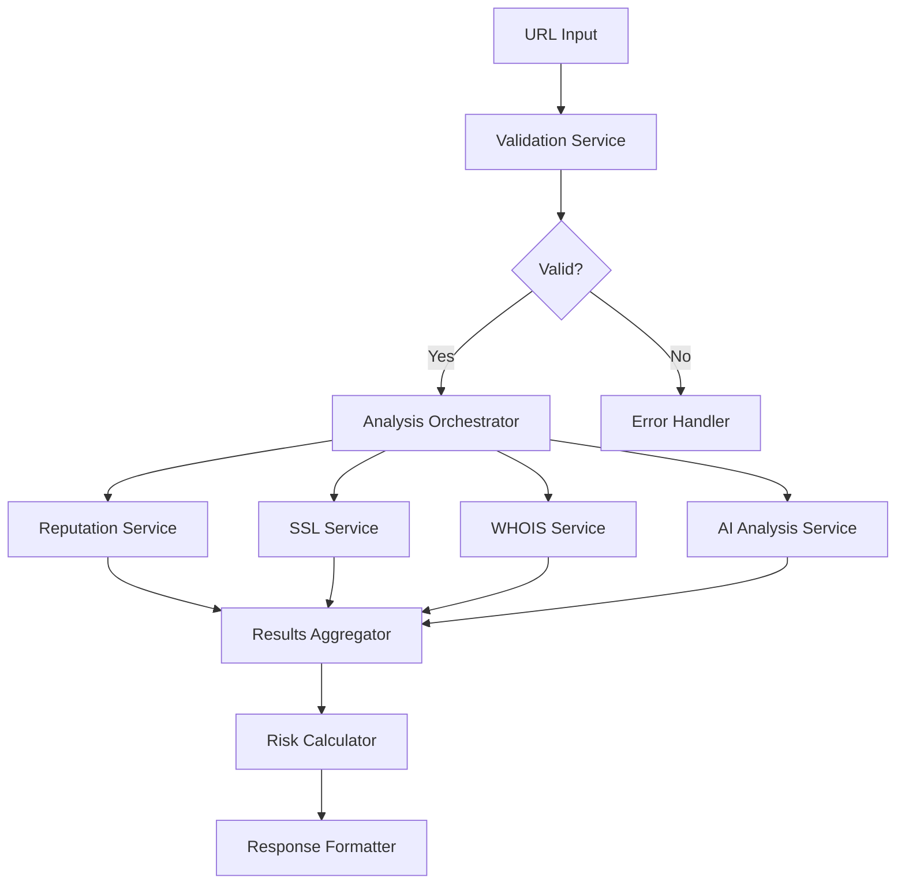
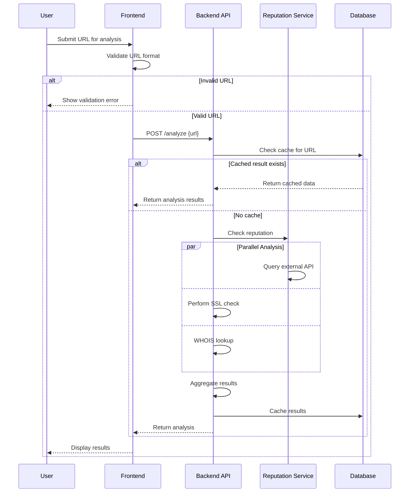
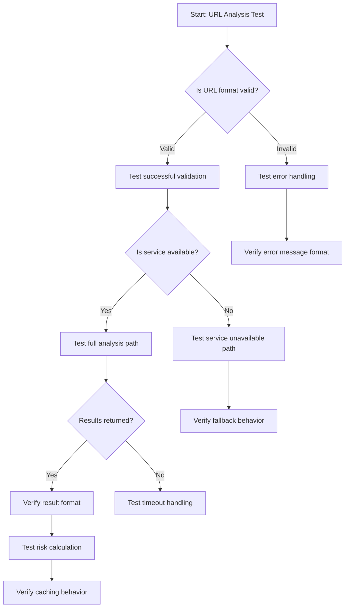

# /create-implementation-plan Task

When this command is used, execute the following task:

<!-- Powered by BMAD™ Core -->

# Create Implementation Plan Task

## Purpose

Ultra think to generate an extremely detailed, prescriptive implementation plan that enables less advanced models to execute story development without making complex architectural decisions. This task leverages models with superior reasoning capabilities to create comprehensive technical guidance.

IMPORTANT: The implementation plan MUST be technology-specific and align with the project's preferred stack and standards. Pull platform, language, framework, testing, and tooling details from authoritative sources (see 1.4). Specify exact modules, file paths, public APIs, framework conventions, build/test tools, and dependency versions so a junior developer can implement without making architectural decisions.

## CRITICAL Prerequisites

- **Story Status**: Target story must exist and be in "Approved" status
- **Architecture Context**: All relevant architecture documents must be accessible

## SEQUENTIAL Task Execution

**IMPORTANT WORKFLOW NOTE**:

- For new implementation plans: Execute sections 1, 3.1-3.9 to generate complete plan
- Upon user acceptance of plan: Immediately execute section 3.10 to save file
- For existing plan re-evaluation: Execute sections 1, 2 to update existing plan file

### 1. Verify Planning Mode and Context

#### 1.1 Confirm Planning Mode

- Always tell the user that you are attempting to generate an enhanced implementation plan before proceeding further
- Verify that we are operating in planning mode
- If not in planning mode, HALT and instruct: "This task requires planning mode. Please enable planning mode before proceeding."

#### 1.2 Load Target Story

- Identify the target story file from user input
- Load and validate story structure and status
- Ensure story has complete Acceptance Criteria and basic Tasks/Subtasks
- Extract story context, requirements, and existing Dev Notes

#### 1.3 Check for Existing Implementation Plan

- **CRITICAL**: Check if implementation plan file already exists
- Implementation plan file naming convention: `{story-filename}-implementation-plan.md`
- Example: For `story-2-1-multi-factor-scoring-algorithm.md`, check for `story-2-1-multi-factor-scoring-algorithm-implementation-plan.md`
- If implementation plan exists:
  - Load existing implementation plan content
  - Note creation date and last modification time
  - Proceed to re-evaluation workflow (Section 2)
- If implementation plan does not exist:
  - Proceed to new implementation plan generation workflow (Section 3)
  - Plan will be saved to new file upon completion

#### 1.4 Load Architecture Context

- Load all architecture documents to have a clear understanding of the entire system
- Specifically load files from `bmad-core/core-config.yaml` → `devLoadAlwaysFiles` (e.g., `docs/architecture/tech-stack.md`, `coding-standards.md`, `unified-project-structure.md`, `source-tree.md`, `development-workflow.md`)
- If available, include platform-specific files in `docs/architecture/` (web, mobile, desktop/service)
- If provided, incorporate preferences from `bmad-core/data/technical-preferences.md`
- Extract existing code patterns, conventions, and technical standards
- Identify relevant languages, frameworks, test frameworks, build tools, and design patterns already in use
- Record the authoritative sources used (file names) in the plan's Metadata section
- Use `unified-project-structure.md` as the source of truth for all file/folder paths (including test file locations) and override any generic defaults (e.g., do NOT assume `__tests__` unless explicitly defined there)

**Interface/UI Documentation Check (Technology-Agnostic):**

If the story involves ANY user interface or client-facing changes (web, mobile, desktop):

- Read relevant UI/client documentation under `docs/architecture/` (look for: frontend, ui, client, web, mobile, ios, android, desktop, electron, view, component, design)
- If present, also read any consolidated UI specs (e.g., `docs/front-end-spec.md`) without assuming web-only context
- Incorporate platform-appropriate patterns and requirements into the plan:
  - Component/view architecture and reusability patterns
  - Styling/appearance conventions appropriate to the platform
  - State management approaches
  - Input handling and validation patterns
  - Responsiveness/adaptivity across form factors
  - Accessibility standards applicable to the target platform
- Ensure the plan aligns with the established UI/client architecture for the project

### 2. Re-Evaluate Existing Implementation Plan (If Plan File Exists)

#### 2.1 Implementation Status Assessment

- **CRITICAL**: Compare existing implementation plan against current codebase state
- Identify which plan components have been implemented:
  - Check for files/modules mentioned in the plan
  - Verify if architectural decisions have been implemented
  - Assess completion of component structures and interfaces
  - Review implementation of data flow strategies

#### 2.2 Codebase Evolution Analysis

- **CRITICAL**: Analyze changes since plan creation that affect the plan
- Identify new patterns, libraries, or conventions introduced
- Check for architectural changes that impact the plan
- Note dependency updates or new framework integrations
- Document any conflicts between plan and current codebase state

#### 2.3 Plan Amendment Generation

- **CRITICAL**: Generate specific amendments to existing plan based on analysis
- Document what has been implemented vs. what remains
- Suggest updates to outdated architectural decisions
- Recommend adjustments based on new codebase patterns
- Note any new risks or pitfalls discovered
- Update test strategies based on current testing infrastructure

#### 2.4 Updated Plan Output

- Create updated implementation plan with:
  - Original plan sections (preserved for context)
  - "Plan Amendments" section with specific updates
  - "Implementation Status" section tracking completion
  - Updated metadata (last reviewed date, amendments made)
- Save updated plan to the same implementation plan file
- **HALT** after completing re-evaluation - do not proceed to Section 3

### 3. Generate New Implementation Plan (If No Plan File Exists)

### 3.1 Analyze Existing Codebase Patterns

#### 3.1.1 Code Pattern Analysis

- Thoroughly examine existing source code in relevant directories
- Identify established patterns for:
  - Component/module organization
  - Error handling approaches
  - Data validation strategies
  - Testing structures and conventions
  - API integration patterns
  - State management approaches
  - Caching

#### 3.1.2 Technical Stack Assessment

- Document current technology stack and versions
- Identify preferred libraries and their usage patterns
- Note any constraints or limitations in the current setup
- Catalog available utilities and helper functions

#### 3.1.3 Integration Point Mapping

- Map all external service integrations
- Document internal service communication patterns
- Identify data flow paths and transformation points
- Note authentication and authorization mechanisms

### 3.2 Generate Architectural Decisions

#### 3.2.1 Design Pattern Selection

- **CRITICAL**: Choose specific design patterns based on story requirements
- Document WHY each pattern was selected (provide clear rationale)
- Reference existing codebase examples where patterns are already used
- Specify how patterns will be adapted for this specific story

#### 3.2.2 Library and Framework Choices (Technology-Specific)

- Select specific languages, frameworks, libraries, and tools required (runtime, UI/toolkit, build, test, packaging)
- Document exact version requirements and compatibility considerations
- Explain why chosen over alternatives (aligned to `tech-stack.md` and coding standards)
- Note any new dependencies that need explicit approval and add them to the Dependency Policy

#### 3.2.3 Module Organization Strategy

- Define exact file structure and naming conventions
- Specify interface boundaries and responsibilities
- Document how new code integrates with existing architecture
- Plan for future extensibility and maintenance

#### 3.2.4 API Endpoint Contract Analysis

- **CRITICAL**: Identify and document any proposed changes to API endpoints including types/schemas, error contracts, states that may be exposed to third parties or a frontend
- **For projects at v1.0.0+ (major releases)**: Analyze breaking change impact and upgrade paths
  - Document affected consumers and integration points
  - Plan backward compatibility strategies where feasible
  - Identify required user communication and migration documentation
  - **MANDATORY**: Mark breaking changes for explicit user verification before implementation
- Document new API endpoints, modified request/response schemas, or removed interfaces
- Specify API endpoint versioning strategy for changes (if applicable)
- Note authentication, authorization, or rate limiting changes
- Plan API endpoint documentation updates and change communication strategy

### 3.3 Define Component Structure

#### 3.3.1 Detailed Module Design (Technology-Specific)

- Specify exact class/function/component structures using project idioms
- Define public APIs and method signatures (types/schemas, error contracts, states)
- Document parameter types and return values (or DTO schemas)
- Specify exact file and directory paths following `unified-project-structure.md` and `source-tree.md`
- Plan internal implementation boundaries and extension points

#### 3.3.2 Interface and Type Definitions

- Create comprehensive type definitions
- Specify data contracts between components
- Define validation rules and constraints
- Plan for error propagation and handling

#### 3.3.3 Dependency Management

- Map all dependencies between new components
- Plan dependency injection patterns
- Define service registration and lifecycle management
- Document circular dependency prevention strategies

### 3.4 Generate System Architecture Diagrams

#### 3.4.1 Component Relationship Mapping

- **CRITICAL**: Create Mermaid graph diagrams showing component dependencies
- Map module interactions and data flow between components
- Document service communication patterns and boundaries
- Show external service integration points
- Include database schema relationships where applicable

**Example Format:**



#### 3.4.2 Data Flow Architecture

- Create visual representation of data movement through system
- Document state management patterns and data persistence flows
- Show caching layers and invalidation strategies
- Map validation and transformation points
- For client platforms, consider adding view/state transition diagrams

### 3.5 Create Interaction Sequence Diagrams

#### 3.5.1 User Flow Sequences

- **CRITICAL**: Generate Mermaid sequence diagrams for each acceptance criteria
- Map participant interactions (User, UI, API, Services, Database, External APIs)
- Document message flows, responses, and error paths
- Include conditional logic (alt/opt blocks) and loops
- Show async operations and callbacks

**Example Format:**



#### 3.5.2 System Integration Sequences

- Map service-to-service communications and API calls
- Document async operations, callbacks, and event flows
- Show error propagation and recovery mechanisms
- Include authentication and authorization sequences

#### 3.5.3 Error Handling Flow Diagrams

- Create sequence diagrams for error scenarios
- Document error boundaries and containment strategies
- Show graceful degradation and fallback patterns
- Map logging and monitoring touchpoints

### 3.6 Generate Implementation Pseudo-Code

#### 3.6.1 Core Algorithm Pseudo-Code

- **CRITICAL**: Create language-agnostic pseudo-code for complex business logic
- Document step-by-step algorithmic flows with clear sequences
- Include conditional logic (IF/ELSE/SWITCH) and iteration (FOR/WHILE)
- Show data processing pipelines and transformation steps
- Document validation logic sequences and error handling

**Example Format:**

```
FUNCTION analyzeUrl(url)
    // Input validation
    IF NOT isValidUrl(url) THEN
        RETURN Error("Invalid URL format")
    END IF

    // Check cache first
    cachedResult = cache.get(url)
    IF cachedResult EXISTS AND NOT isExpired(cachedResult) THEN
        LOG("Cache hit for URL: " + url)
        RETURN cachedResult
    END IF

    // Initialize analysis context
    analysisContext = {
        url: url,
        timestamp: getCurrentTime(),
        riskFactors: []
    }

    // Parallel analysis execution
    PARALLEL
        reputationScore = performReputationAnalysis(url)
        sslInfo = performSslAnalysis(url)
        whoisData = performWhoisAnalysis(url)
        aiAnalysis = performAiAnalysis(url)
    END PARALLEL

    // Risk calculation logic
    overallRisk = 0
    FOR EACH riskFactor IN [reputationScore, sslInfo, whoisData, aiAnalysis]
        IF riskFactor.hasErrors THEN
            LOG("Error in analysis: " + riskFactor.error)
            CONTINUE
        END IF
        overallRisk = overallRisk + (riskFactor.score * riskFactor.weight)
    END FOR

    // Normalize and categorize risk
    normalizedRisk = min(max(overallRisk, 0), 100)
    riskCategory = CASE normalizedRisk
        WHEN < 30 THEN "LOW"
        WHEN < 70 THEN "MEDIUM"
        ELSE "HIGH"
    END CASE

    // Build result object
    result = {
        url: url,
        analysis: {
            reputation: reputationScore,
            ssl: sslInfo,
            whois: whoisData,
            ai: aiAnalysis
        },
        overallRisk: normalizedRisk,
        riskCategory: riskCategory,
        timestamp: analysisContext.timestamp
    }

    // Cache and return
    cache.set(url, result, TTL=3600)
    LOG("Analysis completed for URL: " + url)
    RETURN result
END FUNCTION
```

#### 3.6.2 Interface/Signature Stubs (Technology-Specific)

- Provide language/framework-specific function/class/component signatures
- Provide test skeletons with exact file names and test IDs mapped to ACs
- Include configuration snippets (e.g., build/test runner configs) if needed

#### 3.6.2 State Management Pseudo-Code

- Define state transitions and update procedures
- Document side effects and triggers for state changes
- Show validation rules and business constraints
- Include rollback and error recovery logic

#### 3.6.3 Business Logic Decision Trees

- Create pseudo-code for complex decision-making processes
- Document branching logic and condition evaluations
- Show scoring algorithms and weighting calculations
- Include rule engine patterns and configuration handling

### 3.7 Create Test Scenario Diagrams

#### 3.7.1 Test Case Flow Charts

- **CRITICAL**: Generate Mermaid flowcharts for test scenarios covering each acceptance criteria
- Create decision trees showing all test paths including edge cases
- Document boundary conditions and negative test scenarios
- Map integration test flows and end-to-end user journeys

**Example Format:**



#### 3.7.2 Mock Interaction Patterns

- Document external service mocking strategies with sequence diagrams
- Define test data fixtures and setup procedures
- Show test database setup and teardown flows
- Map performance test scenarios and load patterns

#### 3.7.3 Integration Test Sequences

- Create sequence diagrams for integration test scenarios
- Document API contract testing approaches
- Show cross-service communication test patterns
- Define monitoring and observability validation tests
- Specify exact test file locations and naming conventions per `unified-project-structure.md` (do not invent folder names)

### 3.8 Document Code Patterns and Conventions

#### 3.8.1 Existing Pattern Adoption

- **CRITICAL**: Identify and document existing codebase patterns to follow
- Specify naming conventions and code organization rules
- Document commenting and documentation requirements
- Note any project-specific coding standards

#### 3.8.2 Reusable Components and Utilities

- Identify existing utilities that should be reused
- Plan for new reusable components creation
- Document component interfaces and usage patterns
- Plan for component testing and documentation

### 3.9 Identify Potential Pitfalls and Mitigation

#### 3.9.1 Technical Risk Assessment

- **CRITICAL**: Identify known pitfalls specific to the chosen approach
- Document common mistakes and how to avoid them
- Plan for technical debt considerations
- Define code quality gates and validation steps

#### 3.9.2 Performance and Security Considerations

- Identify potential performance bottlenecks
- Document security vulnerabilities and protection measures
- Plan for scalability and resource optimization
- Define monitoring and alerting strategies

#### 3.9.3 Maintenance and Extensibility Planning

- Document future extension points and patterns
- Plan for backward compatibility requirements
- Define deprecation and migration strategies
- Document knowledge transfer and onboarding requirements

#### 3.9.4 Technology-Specific Guardrails

- Provide a Dependency Policy listing explicitly approved new dependencies (if any) and prohibited categories for this story
- Provide a Do-Not-Do list (e.g., avoid cross-cutting refactors, schema changes, or architectural changes unless listed)
- Define Observability requirements (logs/metrics/traces) and where to add them
- Define Rollout/Recovery guidance where applicable (feature toggles, rollback plan)
- Foldering Guardrail: Test and source file paths must follow `unified-project-structure.md`; avoid generic defaults like `__tests__` unless explicitly defined there

### 3.10 Save Implementation Plan to File (Execute Immediately After Plan Acceptance)

#### 3.10.1 Create Implementation Plan Document

- **CRITICAL**: As soon as the user accepts the complete implementation plan, immediately save it as separate markdown file
- File name: `{story-filename}-implementation-plan.md`
- Save in same directory as story file (`docs/stories/`)
- **TIMING**: This step executes immediately upon plan acceptance, not at task completion

#### 3.10.2 Implementation Plan File Structure

- **File Header**: Include metadata and story reference
- **All Required Sections**: Complete implementation plan content from sections 3.1-3.9
- **Creation Metadata**: Date created, BMad version, model used

**Implementation Plan File Template:**

```markdown
# Implementation Plan: {Story Title}

## Metadata

- **Story File**: {story-filename}.md
- **Created**: {current-date}
- **Last Updated**: {current-date}
- **BMad Version**: {version}
- **Generated By**: {model-name}

## Story Reference

[Brief summary of story and acceptance criteria]

## Implementation Plan Sections

[All sections from Section 4 below]

## Implementation Status

- [ ] Planning Complete
- [ ] Architecture Decisions Implemented
- [ ] Component Structure Built
- [ ] Integration Points Connected
- [ ] Testing Complete
- [ ] Story Acceptance Criteria Met

## Traceability Matrix

| AC ID | Acceptance Criterion (summary) | Test IDs               | Modules/Files/Classes/Functions | Notes                      |
| ----- | ------------------------------ | ---------------------- | ------------------------------- | -------------------------- |
| AC-1  | {short description}            | T-XXX-001, T-XXX-INT-A | path/to/moduleA, ClassB.methodC | {edge cases, dependencies} |
| AC-2  | {short description}            | T-XXX-002              | path/to/componentD, functionE   | {negative cases, perf}     |

Instructions:

- Every AC must map to one or more concrete Test IDs and specific code locations.
- Keep IDs consistent across code and tests. Update this table if scope changes.

## Questions & Decisions Ledger

### Open Questions for James

| Q#  | Title         | Context (what you’re doing)   | Question (what’s unclear) | Options considered | Preferred by Junior | Date         |
| --- | ------------- | ----------------------------- | ------------------------- | ------------------ | ------------------- | ------------ |
| Q1  | {brief title} | {file/task/section reference} | {precise question}        | {A/B/C}            | {proposed}          | {YYYY-MM-DD} |

### Resolved Decisions

| D#  | Title         | Decision          | Rationale    | Alternatives Considered     | Date         | Impacted Sections              |
| --- | ------------- | ----------------- | ------------ | --------------------------- | ------------ | ------------------------------ |
| D1  | {brief title} | {chosen approach} | {why chosen} | {rejected A/B with reasons} | {YYYY-MM-DD} | {Traceability, Tests, Modules} |
```

## Output Requirements

### Implementation Plan File Content

The implementation plan file must contain ALL sections:

1. **Architectural Decisions**: Complete with rationale and examples
2. **Component Structure**: Detailed with interfaces and boundaries
3. **Data Flow Strategy**: Comprehensive with patterns and policies
4. **Integration Points**: Specific with contracts and error handling
5. **Error Handling Strategy**: Detailed with scenarios and responses
6. **Test Strategy**: Exact with scenarios and data
7. **Step-by-Step Implementation**: Ordered with checkpoints
8. **Code Patterns & Conventions**: Specific with examples
9. **Potential Pitfalls & Mitigation**: Comprehensive with solutions
10. **API Contract Changes**: Document any backend/frontend interface modifications, breaking changes, and version considerations
11. **Traceability Matrix**: Map each Acceptance Criterion → test IDs → modules/files/classes/functions
12. **Interfaces & Contracts**: Explicit names, signatures, schemas, state transitions, and error contracts
13. **Dependency Policy**: Explicit approvals and prohibited changes
14. **Observability**: What to log/measure and thresholds
15. **Rollout/Recovery**: Toggle/rollback guidance where relevant
16. **Questions & Decisions Ledger**: Open questions; resolved decisions with dates and rationale

### Quality Standards

- **Specificity**: All guidance must be actionable and specific
- **Rationale**: Every decision must include clear reasoning
- **Examples**: Reference existing codebase patterns where applicable
- **Completeness**: Cover all aspects of the story implementation
- **Clarity**: Write for Sonnet 4 to execute without interpretation
- **Technology Specificity**: Specify frameworks, versions, file paths, commands, test runner configuration, and naming conventions consistent with `tech-stack.md` and `source-tree.md`
- **Version Awareness**: For projects at v1.0.0+, always consider the impact of changes on existing users and API consumers, document upgrade paths, and flag breaking changes for explicit user verification

### Validation Checklist

Before completing the task, verify:

- [ ] All Implementation Plan sections are fully populated
- [ ] Every architectural decision includes rationale
- [ ] Specific code patterns and examples are provided
- [ ] Test scenarios cover all acceptance criteria
- [ ] Implementation steps are sequential and checkpointed
- [ ] Potential pitfalls are identified with mitigation strategies
- [ ] Integration with existing codebase is clearly documented
- [ ] Error handling covers all failure scenarios
- [ ] API Contract Changes documented if any backend/frontend interface modifications are planned
- [ ] For v1.0.0+ projects: Breaking changes identified and marked for user verification
- [ ] Traceability Matrix links every AC to test IDs and code locations
- [ ] Dependency Policy defined with approvals/prohibitions
- [ ] Observability and Rollout guidance provided where applicable

## Success Criteria

### For New Implementation Plans:

The implementation plan is complete when:

1. **Sonnet 4 Readiness**: The plan contains sufficient technology-specific detail for Sonnet 4 to implement without making architectural decisions
2. **Decision Completeness**: All significant technical decisions are made and documented with rationale
3. **Pattern Consistency**: The plan follows established codebase patterns and conventions
4. **Risk Mitigation**: All known risks are identified with specific mitigation strategies
5. **Test Coverage**: Complete test strategy covers all functionality and edge cases
6. **Implementation Clarity**: Step-by-step implementation is clear and unambiguous
7. **Immediate File Save**: Implementation plan saved to separate markdown file immediately upon user acceptance

### For Existing Implementation Plan Re-evaluation:

The plan re-evaluation is complete when:

1. **Current State Assessment**: Complete analysis of implementation status vs. original plan
2. **Gap Analysis**: Clear identification of completed, pending, and modified requirements
3. **Amendment Documentation**: Specific updates to plan based on codebase evolution
4. **Updated Guidance**: Revised implementation steps reflecting current state
5. **Risk Updates**: New or changed risks identified and mitigated
6. **File Updates**: Implementation plan file updated with amendments and new metadata

## Notes

- This task should typically take 15-30 minutes to complete thoroughly
- The quality of the implementation plan directly impacts the success of the subsequent development execution
- Focus on being prescriptive rather than descriptive - tell Sonnet 4 exactly what to do, not what to consider
- When in doubt, be more detailed rather than less detailed
