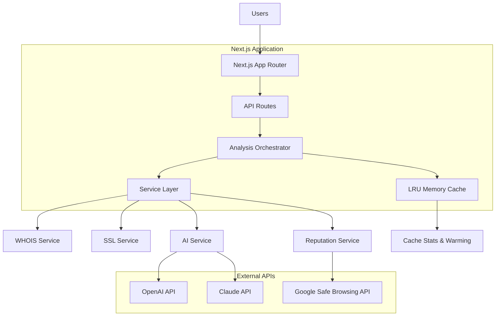
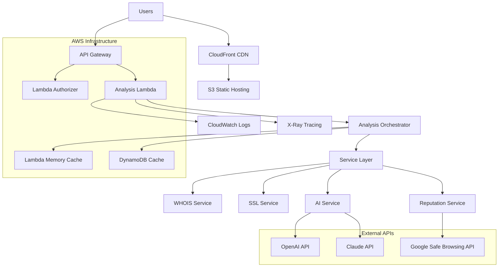
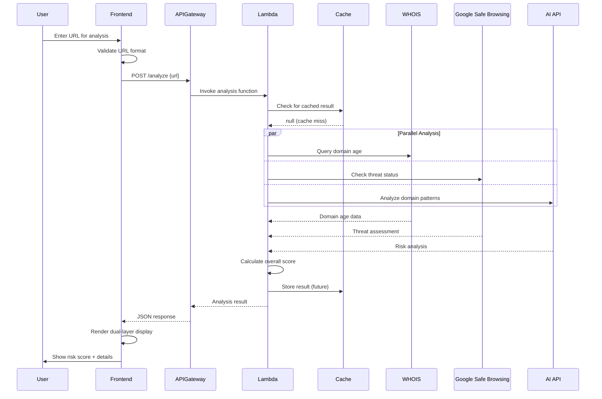

# Scam Checker Web App Fullstack Architecture Document

## Introduction

This document outlines the complete fullstack architecture for **Scam Checker Web App**, including backend systems, frontend implementation, and their integration. It serves as the single source of truth for AI-driven development, ensuring consistency across the entire technology stack.

This unified approach combines what would traditionally be separate backend and frontend architecture documents, streamlining the development process for modern fullstack applications where these concerns are increasingly intertwined.

### Starter Template or Existing Project

Based on your PRD, this is a **brownfield project** built on **Next.js foundation** that's already been initialized. This provides several architectural advantages:

- **Next.js Full-Stack Framework** - Unified frontend/backend with API routes
- **Built-in Serverless Support** - Perfect for AWS deployment strategy  
- **Optimized Performance** - Server-side rendering and static optimization
- **TypeScript Ready** - Type safety across full stack

**Analysis:** The Next.js foundation aligns perfectly with your dual-user experience requirements (simple UI + technical details) and serverless AWS deployment strategy.

## High Level Architecture

### Platform and Infrastructure Choice

**Current Platform:** Next.js Full-Stack Application (Development)
**Production Platform:** AWS Serverless (Planned)

**Current Implementation:**
- **Frontend & Backend:** Next.js App Router with API routes
- **Deployment:** Single Node.js process (development mode)
- **Caching:** In-memory LRU cache with eviction policies
- **External APIs:** Direct service integration
- **Monitoring:** Console logging and built-in Next.js telemetry

**Production Target (AWS Serverless):**
- **Frontend:** S3 + CloudFront (global CDN)
- **Backend:** Lambda functions + API Gateway
- **Caching:** In-memory (Lambda) with DynamoDB persistence layer
- **Monitoring:** CloudWatch + X-Ray
- **CI/CD:** GitHub Actions + Terraform
- **DNS:** Route 53

**Deployment Strategy:** Dual-mode architecture supporting development simplicity and production scalability

### Technical Summary

**Current Implementation:** The Scam Checker is built as a **Next.js full-stack application** with integrated API routes for development efficiency. It features a sophisticated **service orchestration layer** that coordinates parallel execution of analysis services (WHOIS, SSL, reputation, AI) through an abstraction pattern supporting multiple providers. The system implements **in-memory LRU caching** with eviction policies, memory tracking, and cache warming for optimal performance.

**Production Evolution:** The architecture is designed for seamless migration to **AWS serverless infrastructure** where API routes become Lambda functions, static assets deploy to S3/CloudFront, and caching extends to DynamoDB persistence. The **service abstraction layer** enables provider flexibility (OpenAI/Claude for AI, Google Safe Browsing for reputation) while the **orchestrator pattern** ensures consistent parallel processing across deployment modes.

**Key Innovation:** Dual-mode architecture supporting rapid development iteration with Next.js while maintaining production scalability through serverless transformation.

### Repository Structure

**Structure:** Terraform-driven AWS monorepo
**Infrastructure Tool:** Terraform with modular structure
**Package Organization:** Clear separation of concerns with shared types

### High-Level Architecture Diagram

#### Current Implementation (Development Mode)


#### Production Target (AWS Serverless)


### Architectural Patterns

**Core Patterns (Implemented):**
- **Service Abstraction Pattern:** Provider-agnostic service interfaces enabling AI provider switching (OpenAI/Claude) and reputation service flexibility - _Rationale:_ Enables A/B testing, cost optimization, and vendor risk mitigation
- **Orchestration Pattern:** Parallel service execution with timeout handling and fallback strategies - _Rationale:_ Maximizes performance while ensuring reliability under service failures
- **Factory Pattern:** Service instantiation with environment-specific configuration injection - _Rationale:_ Eliminates singletons, improves testability, enables seamless dev/prod transitions
- **Builder Pattern:** Fluent API for complex service configuration with type safety - _Rationale:_ Simplifies service setup and reduces configuration errors
- **LRU Cache Pattern:** Memory-efficient caching with intelligent eviction and cache warming - _Rationale:_ Optimizes performance while preventing memory exhaustion

**UI/Frontend Patterns:**
- **Component-Based UI:** Reusable React components with shadcn/ui design system - _Rationale:_ Consistent dual-layer interface (simple + technical views)
- **Dual-Layer Display Pattern:** Progressive disclosure from simple risk scores to detailed technical analysis - _Rationale:_ Serves both consumer and technical audiences effectively

**Integration Patterns:**
- **API Gateway Pattern:** Centralized external API orchestration with rate limiting and error handling - _Rationale:_ Manages costs, reliability, and observability across multiple external services
- **Cache-Aside Pattern:** Multi-tier caching (memory + future persistence) with TTL management - _Rationale:_ Reduces external API costs and improves response times
- **Error Recovery Pattern:** Graceful degradation with partial results when services fail - _Rationale:_ Maintains user experience even during external service outages

### Deployment Modes

The architecture supports two distinct deployment modes, each optimized for different phases of the development lifecycle:

#### Development Mode (Current)
**Deployment Model:** Next.js full-stack application
**Key Characteristics:**
- **Unified Process:** Frontend and backend run in single Node.js process
- **Hot Reloading:** Instant feedback during development with Next.js dev server
- **Simple Dependencies:** No external infrastructure requirements beyond Node.js
- **Direct Integration:** API routes directly call service layer without network overhead
- **In-Memory State:** All caching and state management in application memory
- **Local External APIs:** External API calls made directly from development machine

**Advantages:** Rapid development iteration, simple debugging, no infrastructure setup required
**Trade-offs:** Single point of failure, limited scalability, development-only configuration

#### Production Mode (Planned - AWS Serverless)
**Deployment Model:** Distributed serverless architecture
**Key Characteristics:**
- **Separated Concerns:** Frontend (S3/CloudFront) and backend (Lambda) independently scalable
- **Automatic Scaling:** Lambda functions scale based on demand with zero cold-start optimization
- **Global Distribution:** CloudFront CDN ensures worldwide performance
- **Persistent Caching:** DynamoDB provides durable cache layer across Lambda invocations
- **Infrastructure as Code:** Terraform manages all AWS resources with version control
- **Monitoring Integration:** CloudWatch and X-Ray provide comprehensive observability

**Advantages:** Infinite scalability, global performance, cost efficiency, operational resilience
**Trade-offs:** Increased complexity, cold start considerations, distributed debugging challenges

#### Migration Strategy
**Shared Components:** Service layer, business logic, and data models remain identical across both modes
**Configuration Layer:** Environment-specific builders inject appropriate dependencies (memory cache vs DynamoDB)
**Testing Approach:** Development mode enables rapid testing; staging environment validates serverless behavior
**Rollout Plan:** Blue-green deployment with gradual traffic shifting to validate serverless architecture

## Tech Stack

| Category | Technology | Version | Purpose | Rationale |
|----------|------------|---------|---------|-----------|
| **Frontend Language** | TypeScript | 5.9.2 | Type-safe frontend development | Prevents runtime errors, enhances developer experience |
| **Frontend Framework** | Next.js | 15.5.2 | React-based fullstack framework | Latest features, improved performance, enhanced DX |
| **UI Library** | React | 19.1.1 | User interface library | Component-based architecture, virtual DOM |
| **Validation** | Zod | 4.1.5 | Schema validation | Type-safe validation, runtime checking |
| **AI Integration** | OpenAI | 5.16.0 | AI content analysis | GPT models for URL risk analysis |
| **Backend Language** | TypeScript | 5.9.2 | Serverless function development | Shared types with frontend, familiar syntax |
| **Backend Framework** | AWS Lambda | Node.js 22.x | Serverless compute functions | Latest Node.js features, improved performance, AWS support |
| **API Style** | REST | OpenAPI 3.0 | HTTP-based API design | Simple, well-understood, excellent tooling |
| **Cache Interface** | NoOp (Pass-through) | Custom | Initial no-op caching with DynamoDB future | Start simple, add DynamoDB caching when cost-justified |
| **File Storage** | AWS S3 | Latest | Static assets and builds | Integrated with CloudFront, cost-effective |
| **Authentication** | AWS Cognito | Latest | User management (future) | Native AWS integration, JWT tokens |
| **Frontend Testing** | Jest + RTL | 30.1.1/16.3.0 | Unit and integration testing | Standard React testing, great DX |
| **Backend Testing** | Jest + Supertest | 30.1.1/7.1.4 | API testing | Node.js standard, AWS Lambda compatible |
| **E2E Testing** | Playwright | 1.55.0 | End-to-end browser testing | Cross-browser, reliable, excellent reporting |
| **Build Tool** | Next.js Dev Server | 15.5.2 | Fast development builds | Built-in HMR, optimized for React |
| **Bundler** | Next.js built-in | 15.5.2 | Production bundling | Latest optimizations, automatic splitting |
| **IaC Tool** | Terraform | 1.6.x | Infrastructure provisioning | Version control, state management, AWS native |
| **CI/CD** | GitHub Actions | Latest | Automated deployment | Free for public repos, Terraform integration |
| **Monitoring** | CloudWatch | Latest | Logging and metrics | Native AWS integration, Lambda insights |
| **Logging** | AWS X-Ray | Latest | Distributed tracing | Track requests across Lambda functions |
| **CSS Framework** | Tailwind CSS | 4.1.12 | Utility-first styling | Rapid development, consistent design tokens |

## Data Models

### AnalysisRequest

**Purpose:** Represents a URL analysis request with metadata for tracking and caching

**Key Attributes:**
- `id`: string - Unique identifier for the analysis request
- `url`: string - The URL being analyzed (validated and normalized)
- `requestedAt`: Date - Timestamp of the analysis request
- `clientIp`: string - Client IP for rate limiting and abuse prevention
- `userAgent`: string - User agent for analytics and bot detection
- `apiKey`: string | null - API key if accessed programmatically

#### TypeScript Interface

```typescript
interface AnalysisRequest {
  id: string;
  url: string;
  requestedAt: Date;
  clientIp: string;
  userAgent: string;
  apiKey?: string;
}
```

### AnalysisResult

**Purpose:** Complete analysis results for a URL including risk score and detailed findings

**Key Attributes:**
- `requestId`: string - Reference to the originating request
- `overallScore`: number - 0-100 risk score for the URL
- `riskLevel`: RiskLevel - GREEN/YELLOW/RED classification
- `completedAt`: Date - When analysis finished
- `domainAge`: DomainAnalysis - WHOIS domain age analysis
- `reputation`: ReputationAnalysis - Google Safe Browsing reputation data
- `contentAnalysis`: ContentAnalysis - AI-based content analysis
- `recommendations`: string[] - User-appropriate recommendations

#### TypeScript Interface

```typescript
interface AnalysisResult {
  requestId: string;
  overallScore: number;
  riskLevel: 'GREEN' | 'YELLOW' | 'RED';
  completedAt: Date;
  domainAge: DomainAnalysis;
  reputation: ReputationAnalysis;
  contentAnalysis: ContentAnalysis;
  recommendations: string[];
}
```

### DomainAnalysis

**Purpose:** Domain age and WHOIS information from Node.js WHOIS library

#### TypeScript Interface

```typescript
interface DomainAnalysis {
  ageInDays: number | null;
  registrationDate: Date | null;
  expirationDate: Date | null;
  registrar: string | null;
  score: number;
  confidence: number;
}
```

### ContentAnalysis

**Purpose:** AI-generated analysis of domain and website characteristics

#### TypeScript Interface

```typescript
interface ContentAnalysis {
  summary: string;
  technicalDetails: string;
  scamIndicators: string[];
  confidence: number;
  score: number;
  model: string;
}
```

## API Specification

```yaml
openapi: 3.0.0
info:
  title: Scam Checker API
  version: 1.0.0
  description: |
    REST API for analyzing URLs for scam indicators using multi-factor analysis.
    Supports both simple consumer responses and detailed technical analysis.

servers:
  - url: https://api.scam-checker.example.com/v1
    description: Production API
  - url: https://staging-api.scam-checker.example.com/v1  
    description: Staging API

paths:
  /analyze:
    post:
      summary: Analyze URL for scam indicators
      description: |
        Performs comprehensive analysis of a URL using multiple factors:
        - Domain age analysis via WHOIS
        - Reputation checking via Google Safe Browsing
        - AI-powered content analysis
        
        Returns both simple consumer-friendly results and detailed technical data.
      requestBody:
        required: true
        content:
          application/json:
            schema:
              type: object
              required:
                - url
              properties:
                url:
                  type: string
                  format: uri
                  description: URL to analyze for scam indicators
                  example: "https://suspicious-site.example.com"
                includeDetails:
                  type: boolean
                  default: true
                  description: Include detailed technical analysis
      responses:
        '200':
          description: Analysis completed successfully
          content:
            application/json:
              schema:
                $ref: '#/components/schemas/AnalysisResponse'
        '400':
          description: Invalid request parameters
        '429':
          description: Rate limit exceeded
        '500':
          description: Internal server error

  /health:
    get:
      summary: Health check endpoint
      description: Returns API health status and external service availability
      responses:
        '200':
          description: Service is healthy

components:
  schemas:
    AnalysisResponse:
      type: object
      properties:
        requestId:
          type: string
        url:
          type: string
        overallScore:
          type: integer
          minimum: 0
          maximum: 100
        riskLevel:
          type: string
          enum: [GREEN, YELLOW, RED]
        recommendations:
          type: array
          items:
            type: string
        analysis:
          type: object
          properties:
            domain:
              $ref: '#/components/schemas/DomainAnalysis'
            reputation:
              $ref: '#/components/schemas/ReputationAnalysis'
            content:
              $ref: '#/components/schemas/ContentAnalysis'
```

## Components

### Frontend Components

#### URLAnalysisForm
**Responsibility:** Handles URL input validation and submission for both web and API users
**Key Interfaces:**
- `onSubmit(url: string, options: AnalysisOptions)` - Submit URL for analysis
- `onValidationError(errors: ValidationError[])` - Handle input validation
**Technology Stack:** React component with shadcn/ui Input, Lucide icons, Zod validation

#### ResultsDisplay
**Responsibility:** Renders dual-layer results (simple view + expandable technical details)
**Key Interfaces:**
- `displayResult(result: AnalysisResult)` - Main result rendering
- `toggleDetailView(section: string)` - Expand/collapse technical details
**Technology Stack:** React with Tailwind conditional styling, Lucide icons for expand/collapse

### Backend Components

#### AnalysisOrchestrator
**Responsibility:** Coordinates multiple external API calls and aggregates results
**Key Interfaces:**
- `analyzeURL(request: AnalysisRequest): Promise<AnalysisResult>`
- `getCachedResult(url: string): Promise<AnalysisResult | null>`
**Technology Stack:** AWS Lambda function (Node.js 22), TypeScript 5.9.2, async/await orchestration

#### CacheManager
**Responsibility:** Abstract caching interface with pass-through default implementation
**Key Interfaces:**
- `get(key: string): Promise<T | null>`
- `set(key: string, value: T, ttl: number): Promise<void>`
- `invalidate(pattern: string): Promise<void>`
**Technology Stack:** TypeScript interface with NoOpCache pass-through implementation and future DynamoDB adapter

## Service Integration

### Service Abstraction Layer

The application implements a **provider-agnostic service architecture** enabling flexible integration with multiple external APIs through consistent interfaces:

#### WhoisService (Direct Implementation)
- **Purpose:** Domain age analysis and WHOIS registration data
- **Implementation:** Node.js `whois` library v2.15.0 with direct protocol queries
- **Key Features:**
  - Domain age calculation with registration/expiration date parsing
  - Registrar information extraction
  - Error handling for inaccessible or malformed WHOIS records
  - Configurable timeout and retry logic
- **Performance:** Direct protocol queries, no external API dependencies
- **Caching:** 24-hour TTL for WHOIS records (minimal change frequency)

#### ReputationService (Configurable Provider)
- **Purpose:** URL threat detection and reputation analysis
- **Current Provider:** Google Safe Browsing API v4
- **Implementation:** HTTP API integration with threat database lookup
- **Key Features:**
  - Multiple threat type detection (malware, phishing, unwanted software)
  - Bulk URL checking capabilities
  - Provider abstraction for future reputation service integration
- **Authentication:** API key-based authentication
- **Rate Limits:** 10,000 requests/day (free tier), scalable pricing available
- **Caching:** 30-minute TTL for reputation checks (balance security vs performance)

#### AIService (Multi-Provider Support)
- **Purpose:** Intelligent domain and URL pattern analysis
- **Supported Providers:** OpenAI (GPT-4), Anthropic (Claude)
- **Implementation:** Provider-specific adapters with unified response format
- **Key Features:**
  - Configurable AI provider selection via environment variables
  - Advanced prompt management for URL risk assessment
  - Cost tracking and budget controls
  - Fallback strategies between providers
- **Analysis Capabilities:**
  - Domain name pattern recognition
  - URL structure analysis
  - Content risk assessment
  - Scam indicator identification
- **Cost Optimization:** 1-hour TTL caching, token usage monitoring
- **Rate Limiting:** Provider-specific limits with automatic backoff

#### SSLService (Certificate Analysis)
- **Purpose:** SSL/TLS certificate validation and risk assessment
- **Implementation:** Node.js `tls` module with certificate chain analysis
- **Key Features:**
  - Certificate authority validation
  - Expiration date monitoring
  - Self-signed certificate detection
  - Certificate chain trust verification
- **Performance:** Direct TLS handshake, no external API dependencies
- **Caching:** 6-hour TTL for certificate data (balance security vs performance)

### Service Orchestration

#### AnalysisOrchestrator
- **Coordination:** Manages parallel execution of all service calls
- **Timeout Management:** Individual service timeouts with overall request limits
- **Error Recovery:** Partial result aggregation when services fail
- **Performance Optimization:** Concurrent service execution reduces total response time
- **Observability:** Service-level performance metrics and error tracking

## Core Workflows

### 1. URL Analysis Workflow (Web UI)



## Caching Architecture

### Current Implementation: Sophisticated In-Memory Caching

The application implements a **multi-tier LRU cache system** with advanced memory management:

#### CacheManager Features
- **LRU Eviction:** Least-recently-used items automatically removed when capacity limits reached
- **TTL Support:** Time-to-live expiration for each cache entry with automatic cleanup
- **Memory Tracking:** Real-time monitoring of cache memory usage with configurable limits
- **Cache Warming:** Proactive population of frequently accessed data
- **Statistics:** Hit/miss ratios, memory usage, and performance metrics
- **Prefix Namespacing:** Multiple cache instances with isolated key spaces

#### Cache Configuration
- **Service-Specific Caches:** Separate cache instances for WHOIS, SSL, reputation, and AI analysis
- **Configurable TTLs:** WHOIS (24 hours), SSL (6 hours), AI analysis (1 hour), reputation (30 minutes)
- **Memory Limits:** Default 50MB per cache instance with 80% eviction threshold
- **Development Mode:** All caches in-memory with process lifecycle

#### Performance Characteristics
- **Cache Hit Performance:** Sub-millisecond retrieval for cached results
- **Memory Efficiency:** Automatic eviction prevents memory exhaustion
- **Graceful Degradation:** Cache misses fall back to external API calls

### Future Enhancement: DynamoDB Persistence Layer

When deployed to AWS Lambda, caching will extend to include persistent storage:

#### Table: `scam-checker-cache`

**Primary Key Design:**
- **Partition Key (PK):** `url_hash` (String) - SHA-256 hash of normalized URL
- **Sort Key (SK):** `analysis_version` (String) - Version for cache invalidation (e.g., "v1.0")

**DynamoDB Features Utilized:**
- **TTL (Time to Live):** Auto-expire cache entries after 24 hours
- **On-Demand Pricing:** Pay-per-request, no provisioned capacity

## Frontend Architecture

### Component Architecture

#### Project Tree (src-rooted)
```
scam-checker/
├── src/                              # Application source code
│   ├── app/                          # Next.js App Router directory
│   │   ├── globals.css               # Global styles
│   │   ├── layout.tsx                # Root layout component
│   │   ├── page.tsx                  # Home page component
│   │   ├── loading.tsx               # Loading UI component
│   │   ├── error.tsx                 # Error UI component
│   │   └── api/                      # API route handlers (development/local)
│   │       └── analyze/              # URL analysis endpoints
│   │           └── route.ts          # Main analysis API endpoint
│   │
│   ├── components/                   # Reusable React components
│   │   ├── ui/                       # Base UI components (shadcn/ui)
│   │   │   ├── button.tsx            # Core button component
│   │   │   ├── input.tsx             # Form input component
│   │   │   ├── card.tsx              # Card layout component
│   │   │   ├── badge.tsx             # Status/label badges
│   │   │   ├── progress.tsx          # Progress indicators
│   │   │   ├── alert.tsx             # Alert/notification component
│   │   │   └── spinner.tsx           # Loading spinner
│   │   │
│   │   ├── analysis/                 # URL analysis specific components
│   │   │   ├── url-input-form.tsx    # Main URL submission form
│   │   │   ├── risk-display.tsx      # Risk score visualization
│   │   │   ├── technical-details.tsx # Technical analysis results
│   │   │   ├── explanation-panel.tsx # AI-generated explanations
│   │   │   ├── loading-states.tsx    # Analysis loading indicators
│   │   │   └── result-summary.tsx    # Quick results overview
│   │   │
│   │   └── layout/                   # Layout and navigation components
│   │       ├── header.tsx            # Main site header
│   │       ├── footer.tsx            # Site footer
│   │       ├── navigation.tsx        # Navigation menu
│   │       └── sidebar.tsx           # Technical details sidebar
│   │
│   ├── lib/                          # Shared utilities and configurations
│   │   ├── utils.ts                  # General utility functions
│   │   ├── validation.ts             # URL validation logic
│   │   ├── cache.ts                  # Client-side caching utilities
│   │   ├── api-client.ts             # API communication layer
│   │   └── analysis/                 # Analysis engine utilities
│   │       ├── whois.ts              # WHOIS integration (client helpers)
│   │       ├── ssl.ts                # SSL certificate display helpers
│   │       ├── reputation.ts         # Reputation data formatting
│   │       └── scoring.ts            # Risk scoring display logic
│   │
│   ├── types/                        # TypeScript type definitions
│   │   ├── analysis.ts               # Analysis result types
│   │   ├── api.ts                    # API request/response types
│   │   └── ui.ts                     # UI component prop types
│   │
│   └── hooks/                        # Custom React hooks
│       ├── use-analysis.ts           # URL analysis hook
│       ├── use-debounce.ts           # Input debouncing hook
│       └── use-local-storage.ts      # Local storage state hook
│
└── public/                           # Static assets
    ├── images/                       # Image assets
    ├── icons/                        # Icon assets
    └── favicon.ico                   # Site favicon
```

### State Management Architecture

#### State Structure
```typescript
// stores/analysisStore.ts - Zustand store
interface AnalysisState {
  currentUrl: string;
  isAnalyzing: boolean;
  currentResult: AnalysisResult | null;
  recentAnalyses: AnalysisResult[];
  viewMode: 'simple' | 'technical';
  expandedSections: Set<string>;
  
  analyzeUrl: (url: string) => Promise<void>;
  toggleViewMode: () => void;
  toggleSection: (sectionId: string) => void;
  clearResult: () => void;
}
```

### Frontend Services Layer

#### API Client Setup
```typescript
// lib/api-client.ts
class ApiClient {
  private baseUrl: string;
  private apiKey?: string;
  
  constructor(config?: { baseUrl?: string; apiKey?: string }) {
    this.baseUrl = config?.baseUrl || process.env.NEXT_PUBLIC_API_URL || '/api';
    this.apiKey = config?.apiKey;
  }
  
  async analyze(url: string, options?: AnalysisOptions): Promise<AnalysisResult> {
    return this.request<AnalysisResult>('/analyze', {
      method: 'POST',
      body: JSON.stringify({ url, ...options }),
    });
  }
}

// Factory function (preferred over singletons for testability)
export const createApiClient = (config?: Parameters<typeof ApiClient>[0]) => 
  new ApiClient(config);
```

## Backend Architecture

### Service Architecture

#### Serverless Architecture

##### Function Organization
```
lambda/
├── functions/
│   ├── analyze/
│   │   ├── handler.ts          # Main analysis handler
│   │   ├── orchestrator.ts     # Analysis orchestration logic
│   │   └── index.ts           # Lambda entry point
│   └── health/
│       └── handler.ts          # Health check handler
├── services/
│   ├── whoisService.ts        # WHOIS library integration
│   ├── safeBrowsingService.ts # Google Safe Browsing API
│   ├── aiAnalysisService.ts   # OpenAI/Claude integration
│   ├── scoringService.ts      # Risk scoring logic
│   ├── cacheService.ts        # Cache abstraction
│   ├── service-factory.ts     # Service factory pattern
│   └── service-builder.ts     # Service configuration builder
└── utils/
    ├── logger.ts               # CloudWatch logging
    └── errors.ts               # Error handling
```

#### Service Factory and Builder

The backend uses a Factory Pattern with a Builder to manage service instantiation, replacing singletons for better testability and configuration management.

```typescript
// services/service-factory.ts
export class ServiceFactory {
  static createReputationService(config?: Partial<SafeBrowsingConfig>): ReputationService {
    return new ReputationService(config)
  }
  
  static createWhoisService(config?: WhoisConfig): WhoisService {
    return new WhoisService(config)
  }
  
  static createSSLService(config?: SSLConfig): SSLService {
    return new SSLService(config)
  }
  
  static createAIURLAnalyzer(config?: AIAnalyzerConfig): AIURLAnalyzer {
    return new AIURLAnalyzer(config)
  }
  
  static createAnalysisServices(config?: ServicesConfig): AnalysisServices {
    return {
      reputation: this.createReputationService(config?.reputation),
      whois: this.createWhoisService(config?.whois),
      ssl: this.createSSLService(config?.ssl),
      aiAnalyzer: this.createAIURLAnalyzer(config?.ai)
    }
  }
}

// services/service-builder.ts
export class ServiceBuilder {
  private config: ServicesConfig = {}

  withReputationConfig(config: Partial<SafeBrowsingConfig>): ServiceBuilder {
    this.config.reputation = { ...this.config.reputation, ...config }
    return this
  }

  withEnvironment(env: 'development' | 'staging' | 'production'): ServiceBuilder {
    // Apply environment-specific defaults
    return this
  }

  build(): AnalysisServices {
    return ServiceFactory.createAnalysisServices(this.config)
  }
}

// functions/analyze/handler.ts
const services = new ServiceBuilder()
  .withEnvironment(process.env.NODE_ENV as any)
  .withReputationConfig({
    apiKey: process.env.GOOGLE_SAFE_BROWSING_API_KEY,
    timeout: 5000
  })
  .build()
```

### Authentication and Authorization

For MVP - no authentication required. Future implementation would include API key validation via Lambda Authorizer.

## Unified Project Structure

```plaintext
scam-checker/
├── README.md                          # Project overview and setup
├── .gitignore                         # Git ignore patterns
├── .env.example                       # Environment variables template
├── .env.local                         # Local env vars (gitignored)
├── package.json                       # Dependencies and scripts
├── next.config.ts                     # Next.js configuration
├── tailwind.config.ts                 # Tailwind CSS configuration
├── tsconfig.json                      # TypeScript configuration
├── jest.config.js                     # Jest testing configuration
├── cypress.config.ts                  # Cypress E2E testing configuration
│
├── src/                               # Application source code
│   ├── app/                           # Next.js App Router directory
│   ├── components/                    # Reusable React components (ui/ analysis/ layout/)
│   ├── lib/                           # Shared utilities and configurations
│   ├── types/                         # TypeScript type definitions
│   └── hooks/                         # Custom React hooks
│
├── public/                            # Static assets
│
├── tests/                             # Test files organized by type
│   ├── __mocks__/                     # Mock implementations
│   ├── unit/                          # Unit tests
│   ├── integration/                   # Integration tests
│   └── e2e/                           # End-to-end tests (Playwright/Cypress)
│
├── infrastructure/                    # Infrastructure as Code
│   ├── aws/                           # AWS-specific infrastructure
│   │   ├── lambda/                    # Lambda function configurations
│   │   ├── api-gateway/               # API Gateway configurations
│   │   └── cloudfront/                # CloudFront configurations
│   ├── terraform/                     # Terraform configuration (if used)
│   │   ├── main.tf
│   │   ├── variables.tf
│   │   └── outputs.tf
│   └── scripts/                       # Deployment and utility scripts
│       ├── deploy.sh                  # Deployment script
│       └── local-setup.sh             # Local environment setup
│
└── docs/                              # Project documentation
    ├── prd/                           # Product requirements (sharded)
    ├── architecture/                  # Architecture documentation (sharded)
    ├── epic-*.md                      # Epic documentation files
    └── stories/                       # User story files
```
## Development Workflow

### For Humans (Operator Flow)
- Activate persona:
  - Senior (James): `/BMad:agents:dev` (agent shows `*help`).
  - Junior (Julee): `/BMad:agents:dev-junior` (agent shows `*help`).
- Plan the story (complex step – planning mode recommended):
  - Run `*plan-story-impl {story_path}`; review and iterate until the plan matches expectations.
  - On acceptance, the plan is saved/updated at `docs/stories/{story-filename}-implementation-plan.md`.
  - Note: “Enable Claude Code planning mode” applies to the planning step itself, not persona activation.
- Implement the story (persona‑driven):
  - As Julee: run `*develop-story {story_path}`. Junior requires a complete plan and follows it literally.
  - As James: optionally use `*develop-story {story_path}` for senior‑led implementation.
- Commands are persona‑driven: do not pass `developer_type`; behavior derives from the active agent persona.
- Review implementation:
  - As James: run `*review-story-impl {story_path}`; actionable feedback is added to the story (Must Fix, Should Improve, Consider for Future, Positives).
- Address review feedback (persona‑driven):
  - As Julee: run `*address-story-impl-review {story_path}`; resolve Must Fix first, then Should Improve.
- Manual checkpoints: after planning, after implementation, and after addressing feedback, manually verify diffs and the story’s File List (AI can make mistakes).

### Agent Protocols During Task Execution
- When executing `*plan-story-impl` (Senior): Produce and maintain a prescriptive implementation plan file adjacent to the story. The plan must include Architectural Decisions, Component Structure, Data Flow, Test Strategy, a Traceability Matrix mapping each Acceptance Criterion to concrete test IDs and modules, a Dependency Policy, Observability guidance, and Rollout/Recovery. Update Plan Amendments and Traceability whenever deviating.
- When executing `*develop-story` (Senior & Junior):
  - Preconditions: For junior work, a complete plan must exist. Halt if missing or incomplete.
  - Process: Implement per plan and project standards (see [Coding Standards](#coding-standards)), enforce project structure (see [Unified Project Structure](#unified-project-structure)), and follow [Testing Strategy](#testing-strategy) for lane selection and coverage depth.
  - Validation cadence: Run lint + type‑check (`npm run check`) and relevant tests after each meaningful change; seniors validate after every file change. Maintain the story’s File List accurately.
  - UI work: For any UI/client changes, perform visual verification with Playwright MCP against [Front‑end Spec](./front-end-spec.md) in addition to unit/integration/E2E tests.
    - Viewports: Desktop (Desktop Chrome), Tablet (iPad Pro), Mobile (iPhone 12) as configured in Playwright.
    - Scope: Validate layout, states, and interactions for affected screens/components against spec sections (e.g., Unified Results header, Risk Gauge, Recommendation Alert, Interactive URL behavior, Key Findings, Technical Accordion).
    - Artifacts: Capture screenshots and, where relevant, short videos via Playwright MCP; link artifact paths (e.g., `playwright-report`) in the story’s Dev Agent Record.
    - Ownership: The UX Expert solely owns `docs/front-end-spec.md`. Developers must not modify the spec.
    - Gate: If visuals deviate from the spec, either correct the implementation to comply or raise a question to the UX Expert. Do not move the story to Ready for Review until the discrepancy is resolved. Do not update the spec yourself.
    - Reference: See `CLAUDE.md` → “Playwright MCP” (mandatory usage).
  - Constraints: Do not introduce unapproved dependencies; do not change API contracts unless explicitly documented in the plan and aligned with [API Specification](#api-specification). Timebox uncertainty and document questions (junior) or Plan Amendments (senior).
- When executing `*review-story-impl` (Senior): Evaluate alignment with the plan, [Coding Standards](#coding-standards), Architecture, Security, Performance, and [Testing Strategy](#testing-strategy). Add a “Dev Review Feedback” section to the story with categorized items (Must Fix, Should Improve, Consider for Future, Positive Highlights). Block approval if traceability is broken, unapproved dependencies exist, undocumented API changes are detected, or project structure conventions are violated.
  - Visual verification (Playwright MCP): For frontend changes (e.g., `*review-story-impl 3-18`), run Playwright MCP checks against [Front‑end Spec](./front-end-spec.md) across Desktop/Tablet/Mobile.
    - Confirm: Unified results header composition, risk gauge placement/animation, recommendation alert variants, URL link warning dialogs by risk tier, responsive truncation rules, Key Findings prominence, and technical accordion behavior.
    - Ownership: UX Expert owns `docs/front-end-spec.md`; developers must not modify it.
    - Require: Screenshot set and notes for any deviations; block approval if visuals don’t match the spec or lack rationale/approved spec updates. If compliance is not feasible, ensure a question is raised to the UX Expert and keep the story out of Approved/merge state until resolved.
  - When executing `*address-story-impl-review` (Junior & Senior): Resolve Must Fix items first, then Should Improve. After each change, re‑run validations and targeted tests, update the story’s File List, and synchronize the plan (Traceability/Amendments). Prepare the story for final review with all validations green.

Shared references: [Coding Standards](#coding-standards), [Testing Strategy](#testing-strategy), [API Specification](#api-specification), [Frontend Architecture](#frontend-architecture), [Unified Project Structure](#unified-project-structure).

### Local Setup
- Node v22.x; npm v10+; Playwright browsers (`npx playwright install --with-deps`).
- App URL: `http://localhost:3000`. Support “live-local” tests using real dev DB and sandbox/test keys where applicable.

### Story State Transitions
- Draft → Approved → In Dev → Ready for Review → Changes Required | Approved → Done
- Require passing validations/tests and complete artifacts (plan, File List, review section) at each transition.

### Validations and Tests
- Project validation: `npm run check` (lint + type-check).
- Unit: `npm run test:unit`; Integration: `npm run test:integration`.
- E2E UI: Playwright projects below; run user-flows on PRs, live-local on demand/nightly.
- Cadence: Senior after each file; Junior frequently + at checkpoints; halt on repeated failures/timeboxes.
- Visual checks: For any UI-related changes, run Playwright MCP visual verification against `docs/front-end-spec.md` (Desktop/Tablet/Mobile). Developers must not edit the spec; escalate discrepancies to the UX Expert and pause progression to Ready for Review until resolved.

### Playwright Projects (Canonical)
- Projects are defined in `playwright.config.ts`:
  - `stubbed` → `testMatch` targets `tests/e2e/user-flows/**`. Use stubs via test fixtures (e.g., `page.route`) to stabilize external/unstable endpoints.
  - `live-local` → `testMatch` targets `tests/e2e/live/**`. No stubs; `workers: 1` to avoid state bleed and API limits.

### Test Lanes and Structure
```
tests/
  unit/                      # Jest unit
  integration/               # Jest integration
  e2e/
    user-flows/              # Deterministic, stubbed browser flows  (PR-blocking)
    live/                    # Live-local flows, real DB + real APIs (optional)
```
- Deterministic user-flows: critical journeys + 1–2 edges; stabilize via routing/mocks and fixed seeds/time.
- Live-local flows: minimal coverage of core journeys; hit real providers with test/sandbox creds.

### Required Scripts
- `test` → `jest --coverage`
- `test:unit` → `jest tests/unit`
- `test:integration` → `jest tests/integration`
- `test:e2e:user-flows` → `playwright test --project=stubbed`
- `test:e2e:live` → `BASE_URL=http://localhost:3000 playwright test --project=live-local`

### Data, Auth, Stability
- Auth: optionally generate and reuse a `storageState` in global setup.
- Data: seed through API/DB helpers; tests must not depend on order. Clean up in live tests.
- Stability: eliminate randomness/time in stubbed flows using deterministic seeds and frozen clocks where applicable.

### Playwright MCP Lifecycle & Cleanup (mandatory)
- Ownership: Any task that opens a Playwright MCP browser session must also close it before completing the task.
- Close order: Close pages and contexts, then end the session via the MCP server’s provided close/shutdown action.
- Required action: After finishing, invoke the MCP actions to close all created pages/contexts and terminate the MCP session. Do not leave sessions running between tasks.
- Failure handling: If a task errors or is interrupted, perform an MCP cleanup step before exiting to ensure no sessions remain running.
## Deployment Architecture

### Deployment Strategy

**Frontend Deployment:**
- **Platform:** AWS S3 + CloudFront
- **Build Command:** `npm run build && npm run export`
- **Output Directory:** `.next/out` (static export)
- **CDN/Edge:** CloudFront global distribution with edge caching

**Backend Deployment:**
- **Platform:** AWS Lambda + API Gateway
- **Build Command:** `npm run build:lambda`
- **Deployment Method:** Terraform apply with built artifacts

### Environments

| Environment | Frontend URL | Backend URL | Purpose |
|------------|-------------|-------------|---------|
| Development | http://localhost:3000 | http://localhost:3000/api | Local development |
| Staging | https://staging.scam-checker.example.com | https://staging-api.scam-checker.example.com | Pre-production testing |
| Production | https://scam-checker.example.com | https://api.scam-checker.example.com | Live environment |

## Security and Performance

### Security Requirements

**Frontend Security:**
- CSP Headers: Strict Content Security Policy without unsafe-inline or unsafe-eval
- XSS Prevention: React's built-in escaping + input sanitization with DOMPurify
- Secure Storage: No sensitive data in localStorage; session data in memory only

**Backend Security:**
- Input Validation: Zod schema validation on all API inputs
- Rate Limiting: API Gateway throttling - 100 requests/second burst, 50 requests/second sustained
- CORS Policy: Strict origin allowlist - production frontend domain only

### Performance Optimization

**Frontend Performance:**
- Bundle Size Target: < 200KB gzipped for initial load
- Loading Strategy: Code splitting by route, lazy loading for technical details
- Caching Strategy: CloudFront edge caching for static assets (1 year)

**Backend Performance:**
- Response Time Target: < 3 seconds for complete analysis
- Caching Strategy: NoOp cache initially, future DynamoDB with 24-hour TTL
## Testing Strategy
### Pyramid & ownership
```
         E2E (10%)  → Playwright
      Integration (30%) → Jest (+ Supertest / MSW)
Unit & Component (60%) → Jest + React Testing Library
```
- **Do not expand E2E to compensate for missing unit/integration tests.** Keep E2E fast and purposeful.

## Directories (authoritative)
```
tests/
  unit/
    components/      # React components (RTL)
    services/        # Backend/service units
    utils/           # Pure utilities
    lib/             # Frontend libs (validation, api-client, etc.)
  integration/
    api/             # Route handlers / Lambda handlers w/ Supertest
    services/        # Service composition + config edges
    workflows/       # API-level workflows (no browser)
  e2e/
    user-flows/      # Stubbed browser flows (deterministic)
    live/            # Live-local browser flows (real services)
```
### E2E — User-flows (deterministic, PR-blocking)
**Purpose:** Validate business-critical journeys in the browser, quickly and deterministically.

**Prescriptions**
- **Locators:** `getByRole` / `getByLabel` / `getByPlaceholder` or `getByTestId`. Add stable `data-testid` where needed.
- **Auto-wait:** use locator API; never `waitForTimeout`.
- **Stubs:** route only *external and flaky* calls (e.g., Safe Browsing, WHOIS, AI). Keep contract-level assertions minimal.
- **Tame UI flake:** disable animations; set `timezoneId: 'Australia/Melbourne'`, `locale: 'en-AU'`.
- **Artifacts:** `trace: 'on-first-retry'`, screenshots/videos on failure.
- **Scope:** happy path + one failure path per journey. Push branching to unit/integration.
### E2E — Live-local (real DB + real APIs, optional/nightly)
**Purpose:** Smoke the **real wiring** end-to-end on the local dev stack.

**Prescriptions**
- **No stubs.** The app must be configured with **provider sandbox/test keys**.
- **Isolation:** per-test tenant/user; clean up after.
- **Concurrency:** `workers: 1` (serialize) unless proven safe.
- **Small surface:** ~3–6 flows max (login, analyze URL, error path, uploads/email loops).
- **CI:** run nightly and on demand; non-blocking for PRs but tracked.
### Integration tests (Jest)
**Purpose:** Validate module composition and external edges without the browser.

**Prescriptions**
- **API routes / Lambdas:** test with **Supertest** (or framework request helpers) in a node environment; cover auth, validation, error mapping, and 3P failure modes.
- **HTTP boundaries:** use **MSW (node)** to simulate external HTTP (Safe Browsing, WHOIS, AI). Prefer MSW over ad-hoc `nock` for unified mocks across browser/node.
- **Config matrix:** run with representative environment flags (feature toggles, cache on/off).
### Unit tests (Jest)
**Purpose:** Validate pure logic deterministically and exhaustively.

**Prescriptions**
- **Targets:** scoring, validators (Zod schemas), normalization, mappers, small services.
- **Granularity:** single responsibility per test; table-driven when useful.
- **Snapshots:** only for stable, intentionally serialized output; otherwise prefer explicit assertions.
- **Coverage:** 80%+ per package; do not chase coverage with meaningless tests.
### React component tests (Jest + RTL)
**Purpose:** Validate component contracts and user-observable behavior.

**Prescriptions**
- **Queries first:** `getByRole` / `getByLabel` / `getByText` (avoid class/DOM structure assertions).
- **Stateful UI:** test interactions (typing, clicking, toggling view modes), not implementation details.
- **Network:** mock via **MSW (browser)**; assert user-visible outcomes (spinners, errors, rendered results).
- **Accessibility:** ensure roles/names are present; include at least one expectation that would fail on an a11y regression per complex component.
### Mocking policy (Jest) — opinionated
1. **Mock at the boundary.**  
   - External HTTP (Safe Browsing, WHOIS, AI): **MSW** only.  
   - Time/randomness: `jest.useFakeTimers()` + seeded randomness.  
   - File/OS/crypto only if necessary; prefer real implementations in Node where stable.
2. **Don’t mock what you own.**  
   - Internal modules/services should be tested *real* in unit/integration unless isolation is required for a specific failure mode. Prefer **spies** (`jest.spyOn`) over full module mocks to assert calls.
3. **Determinism > cleverness.**  
   - No network in unit/integration tests; no sleeps; no real time.  
   - Stick to **fixed inputs and explicit assertions**. Avoid broad snapshots.
4. **One source of truth for HTTP mocks.**  
   - Reuse **MSW handlers** across unit (node), integration, and RTL tests to keep contracts consistent. Handlers live in `tests/__mocks__/http/…`.
5. **Contract tests for external APIs.**  
   - For each provider, include: happy path, rate limit, timeout, malformed response. Handlers mimic real payloads.
### Playwright configuration (normative)
- Two projects:
  - `stubbed` → `testMatch: ['e2e/user-flows/**/*.spec.ts']`, fixture enables stubs via `page.route`.
  - `live-local` → `testMatch: ['e2e/live/**/*.spec.ts']`, fixture **does not** install routes; `workers: 1`.
- Shared `use`: `baseURL` (env-overrideable), `testIdAttribute: 'data-testid'`, `trace`, `screenshot`, `video`, `timezoneId`, `locale`.
### Test data & factories
- Use minimal **factory utilities** (plain functions or `@faker-js/faker` with a fixed seed) per domain type.  
- Keep factories in `tests/__mocks__/factories/**`. Never inline opaque JSON blobs in tests.
### Required scripts
- `test`, `test:unit`, `test:integration`, `test:e2e:user-flows`, `test:e2e:live`, `test:all` (run live last).
- CI must treat `test:e2e:user-flows` as **required**; schedule `test:e2e:live` nightly.
## Frontend Component Implementation Guidelines

Always use shadcn/ui components before creating custom implementations.

### Component Selection Hierarchy
```
1. Check shadcn/ui → Use if available
2. Check shadcn blocks/patterns
3. Compose existing shadcn primitives
4. If none apply → Custom (requires justification)
```

### Pre-Implementation Checklist
```
## Component: [Name]
- [ ] Searched shadcn/ui components
- [ ] Checked shadcn blocks
- [ ] Reviewed similar shadcn implementations
- [ ] Selected primary + supporting components
- [ ] If custom: justification and approval recorded
```

### Common Component Mappings (must use)

| UI Need | shadcn Component |
|---------|------------------|
| Navigation bar | NavigationMenu |
| Mobile menu | Sheet |
| Modal/Dialog | Dialog |
| Dropdown menu | DropdownMenu/Select |
| Forms | Form + react-hook-form |
| Loading states | Skeleton |
| Notifications | Toast/Sonner |
| Error messages | Alert |
| Data tables | Table/DataTable |
| Tabs/Accordions | Tabs/Accordion |

### Implementation Process
Use `npx shadcn@latest add <component>` to add required components, implement, add tests, and document usage. Custom components must include a justification file and follow shadcn styling patterns.

### Hydration Safety Checklist

Before implementing any component with dynamic content, ensure SSR/CSR compatibility:

**Required Checks:**
- [ ] No Date/Time values in initial state (use static initial values)
- [ ] No Math.random() or crypto.getRandomValues() in initial render
- [ ] Client-only operations wrapped in useEffect with isClient guard
- [ ] Form state properly initialized with consistent values
- [ ] Debug information is hydration-safe (no dynamic timestamps)
- [ ] Tested with multiple page reloads to verify event handlers remain bound

**Safe Pattern Example:**
```typescript
// Client detection pattern for browser-only operations
const [isClient, setIsClient] = useState(false)
useEffect(() => {
  setIsClient(true)
}, [])

// Use for any client-specific rendering
if (isClient) {
  // Browser-only code here
}
```

**Common Hydration Pitfalls:**
- Using `window`, `document`, or `localStorage` during initial render
- Generating different IDs/keys on server vs client
- Conditional rendering based on user-agent or browser detection
- Dynamic timestamps or random values in initial state

See detailed guidance in `docs/architecture/frontend-component-guidelines.md`.

## Coding Standards

### Critical Fullstack Rules

- **Type Sharing:** Always define types in `/shared/types` and import from there
- **API Calls:** Never make direct HTTP calls from components - always use the api-client service layer
- **Environment Variables:** Access only through config objects, never `process.env` directly in business logic
- **Error Handling:** All Lambda handlers must use the standard error middleware
- **State Updates:** Never mutate Zustand state directly - always use actions
- **Input Validation:** Always validate user input with Zod schemas before processing

### Naming Conventions

| Element | Frontend | Backend | Example |
|---------|----------|---------|---------|
| Components | PascalCase | - | `UserProfile.tsx` |
| Hooks | camelCase with 'use' | - | `useAuth.ts` |
| API Routes | - | kebab-case | `/api/analyze-url` |
| Lambda Functions | - | camelCase | `analyzeHandler.ts` |

## Error Handling Strategy

### Error Response Format

```typescript
interface ApiError {
  error: {
    code: string;           // Machine-readable error code
    message: string;        // User-friendly message
    details?: Record<string, any>; // Technical details
    timestamp: string;      // ISO timestamp
    requestId: string;      // Correlation ID for tracing
    degraded?: boolean;     // Indicates partial results available
    failedServices?: string[]; // Which external services failed
  };
}
```

### Error Handling Principles

- **Graceful Degradation:** Return partial results when possible
- **User-Friendly Messages:** Clear, actionable error messages
- **Technical Transparency:** Detailed errors for developers
- **Resilience Patterns:** Retry, circuit breaker, fallbacks

## Monitoring and Observability

### Monitoring Stack

- **Frontend Monitoring:** CloudWatch RUM (Real User Monitoring)
- **Backend Monitoring:** CloudWatch Logs, Metrics, and X-Ray
- **Error Tracking:** CloudWatch Logs Insights with alerts
- **Performance Monitoring:** CloudWatch Performance Insights

### Key Metrics

**Frontend Metrics:**
- Core Web Vitals (LCP, FID, CLS)
- JavaScript errors and their stack traces
- API response times from client perspective
- User interactions and page load times

**Backend Metrics:**
- Request rate (requests per second)
- Error rate (4xx and 5xx responses)
- Response time (P50, P95, P99)
- Lambda cold start frequency and duration
- External API success rates

---

## Document Version History

| Date | Version | Description | Author |
|------|---------|-------------|---------|
| 2024-01-15 | 1.0 | Initial architecture document | Winston (Architect AI) |

---

*This document serves as the definitive architectural guide for the Scam Checker Web App fullstack implementation.*
