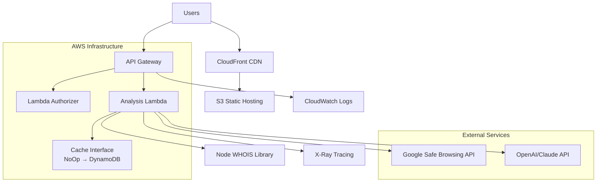
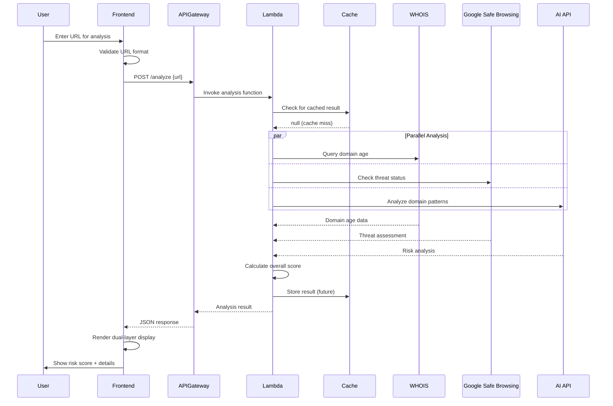

# Scam Checker Web App Fullstack Architecture Document

## Introduction

This document outlines the complete fullstack architecture for **Scam Checker Web App**, including backend systems, frontend implementation, and their integration. It serves as the single source of truth for AI-driven development, ensuring consistency across the entire technology stack.

This unified approach combines what would traditionally be separate backend and frontend architecture documents, streamlining the development process for modern fullstack applications where these concerns are increasingly intertwined.

### Starter Template or Existing Project

Based on your PRD, this is a **brownfield project** built on **Next.js foundation** that's already been initialized. This provides several architectural advantages:

- **Next.js Full-Stack Framework** - Unified frontend/backend with API routes
- **Built-in Serverless Support** - Perfect for AWS deployment strategy  
- **Optimized Performance** - Server-side rendering and static optimization
- **TypeScript Ready** - Type safety across full stack

**Analysis:** The Next.js foundation aligns perfectly with your dual-user experience requirements (simple UI + technical details) and serverless AWS deployment strategy.

## High Level Architecture

### Platform and Infrastructure Choice

**Platform:** AWS Full Stack (Single Region)
**Key Services:** 
- **Frontend:** S3 + CloudFront (global CDN)
- **Backend:** Lambda + API Gateway  
- **Caching:** Abstracted cache interface (NoOp initially, future DynamoDB)
- **Monitoring:** CloudWatch + X-Ray
- **CI/CD:** GitHub Actions + Terraform
- **DNS:** Route 53

**Deployment Regions:** Single region (us-east-1) with CloudFront global distribution

### Technical Summary

The Scam Checker employs a **simplified AWS serverless architecture** with Next.js frontend deployed via **S3/CloudFront** and **Lambda functions** handling API orchestration through **API Gateway**. The system uses an **abstracted caching interface** allowing flexible backend selection (NoOp initially, future DynamoDB) based on cost optimization, with **CloudWatch** for monitoring and **Terraform** for infrastructure as code.

### Repository Structure

**Structure:** Terraform-driven AWS monorepo
**Infrastructure Tool:** Terraform with modular structure
**Package Organization:** Clear separation of concerns with shared types

### High-Level Architecture Diagram



### Architectural Patterns

- **Jamstack Architecture:** Static generation with serverless APIs - _Rationale:_ Optimal performance for content delivery with dynamic API analysis
- **API Gateway Pattern:** Centralized external API orchestration - _Rationale:_ Manages rate limits, caching, and error handling for multiple external services
- **Component-Based UI:** Reusable React components with shadcn/ui - _Rationale:_ Consistent dual-layer interface (simple + technical views)
- **Repository Pattern:** Abstract external API access - _Rationale:_ Enables testing and easy service provider switching
- **Factory Pattern:** Service instantiation with configuration injection - _Rationale:_ Eliminates singletons, improves testability, enables environment-specific configs
- **Builder Pattern:** Fluent API for complex service configuration - _Rationale:_ Simplified service setup with type safety and environment defaults
- **Cache-Aside Pattern:** In-memory result caching - _Rationale:_ Reduces external API costs and improves response times

## Tech Stack

| Category | Technology | Version | Purpose | Rationale |
|----------|------------|---------|---------|-----------|
| **Frontend Language** | TypeScript | 5.9.2 | Type-safe frontend development | Prevents runtime errors, enhances developer experience |
| **Frontend Framework** | Next.js | 15.5.2 | React-based fullstack framework | Latest features, improved performance, enhanced DX |
| **UI Library** | React | 19.1.1 | User interface library | Component-based architecture, virtual DOM |
| **Validation** | Zod | 4.1.5 | Schema validation | Type-safe validation, runtime checking |
| **AI Integration** | OpenAI | 5.16.0 | AI content analysis | GPT models for URL risk analysis |
| **Backend Language** | TypeScript | 5.9.2 | Serverless function development | Shared types with frontend, familiar syntax |
| **Backend Framework** | AWS Lambda | Node.js 22.x | Serverless compute functions | Latest Node.js features, improved performance, AWS support |
| **API Style** | REST | OpenAPI 3.0 | HTTP-based API design | Simple, well-understood, excellent tooling |
| **Cache Interface** | NoOp (Pass-through) | Custom | Initial no-op caching with DynamoDB future | Start simple, add DynamoDB caching when cost-justified |
| **File Storage** | AWS S3 | Latest | Static assets and builds | Integrated with CloudFront, cost-effective |
| **Authentication** | AWS Cognito | Latest | User management (future) | Native AWS integration, JWT tokens |
| **Frontend Testing** | Jest + RTL | 30.1.1/16.3.0 | Unit and integration testing | Standard React testing, great DX |
| **Backend Testing** | Jest + Supertest | 30.1.1/7.1.4 | API testing | Node.js standard, AWS Lambda compatible |
| **E2E Testing** | Playwright | 1.55.0 | End-to-end browser testing | Cross-browser, reliable, excellent reporting |
| **Build Tool** | Next.js Dev Server | 15.5.2 | Fast development builds | Built-in HMR, optimized for React |
| **Bundler** | Next.js built-in | 15.5.2 | Production bundling | Latest optimizations, automatic splitting |
| **IaC Tool** | Terraform | 1.6.x | Infrastructure provisioning | Version control, state management, AWS native |
| **CI/CD** | GitHub Actions | Latest | Automated deployment | Free for public repos, Terraform integration |
| **Monitoring** | CloudWatch | Latest | Logging and metrics | Native AWS integration, Lambda insights |
| **Logging** | AWS X-Ray | Latest | Distributed tracing | Track requests across Lambda functions |
| **CSS Framework** | Tailwind CSS | 4.1.12 | Utility-first styling | Rapid development, consistent design tokens |

## Data Models

### AnalysisRequest

**Purpose:** Represents a URL analysis request with metadata for tracking and caching

**Key Attributes:**
- `id`: string - Unique identifier for the analysis request
- `url`: string - The URL being analyzed (validated and normalized)
- `requestedAt`: Date - Timestamp of the analysis request
- `clientIp`: string - Client IP for rate limiting and abuse prevention
- `userAgent`: string - User agent for analytics and bot detection
- `apiKey`: string | null - API key if accessed programmatically

#### TypeScript Interface

```typescript
interface AnalysisRequest {
  id: string;
  url: string;
  requestedAt: Date;
  clientIp: string;
  userAgent: string;
  apiKey?: string;
}
```

### AnalysisResult

**Purpose:** Complete analysis results for a URL including risk score and detailed findings

**Key Attributes:**
- `requestId`: string - Reference to the originating request
- `overallScore`: number - 0-100 risk score for the URL
- `riskLevel`: RiskLevel - GREEN/YELLOW/RED classification
- `completedAt`: Date - When analysis finished
- `domainAge`: DomainAnalysis - WHOIS domain age analysis
- `reputation`: ReputationAnalysis - Google Safe Browsing reputation data
- `contentAnalysis`: ContentAnalysis - AI-based content analysis
- `recommendations`: string[] - User-appropriate recommendations

#### TypeScript Interface

```typescript
interface AnalysisResult {
  requestId: string;
  overallScore: number;
  riskLevel: 'GREEN' | 'YELLOW' | 'RED';
  completedAt: Date;
  domainAge: DomainAnalysis;
  reputation: ReputationAnalysis;
  contentAnalysis: ContentAnalysis;
  recommendations: string[];
}
```

### DomainAnalysis

**Purpose:** Domain age and WHOIS information from Node.js WHOIS library

#### TypeScript Interface

```typescript
interface DomainAnalysis {
  ageInDays: number | null;
  registrationDate: Date | null;
  expirationDate: Date | null;
  registrar: string | null;
  score: number;
  confidence: number;
}
```

### ContentAnalysis

**Purpose:** AI-generated analysis of domain and website characteristics

#### TypeScript Interface

```typescript
interface ContentAnalysis {
  summary: string;
  technicalDetails: string;
  scamIndicators: string[];
  confidence: number;
  score: number;
  model: string;
}
```

## API Specification

```yaml
openapi: 3.0.0
info:
  title: Scam Checker API
  version: 1.0.0
  description: |
    REST API for analyzing URLs for scam indicators using multi-factor analysis.
    Supports both simple consumer responses and detailed technical analysis.

servers:
  - url: https://api.scam-checker.example.com/v1
    description: Production API
  - url: https://staging-api.scam-checker.example.com/v1  
    description: Staging API

paths:
  /analyze:
    post:
      summary: Analyze URL for scam indicators
      description: |
        Performs comprehensive analysis of a URL using multiple factors:
        - Domain age analysis via WHOIS
        - Reputation checking via Google Safe Browsing
        - AI-powered content analysis
        
        Returns both simple consumer-friendly results and detailed technical data.
      requestBody:
        required: true
        content:
          application/json:
            schema:
              type: object
              required:
                - url
              properties:
                url:
                  type: string
                  format: uri
                  description: URL to analyze for scam indicators
                  example: "https://suspicious-site.example.com"
                includeDetails:
                  type: boolean
                  default: true
                  description: Include detailed technical analysis
      responses:
        '200':
          description: Analysis completed successfully
          content:
            application/json:
              schema:
                $ref: '#/components/schemas/AnalysisResponse'
        '400':
          description: Invalid request parameters
        '429':
          description: Rate limit exceeded
        '500':
          description: Internal server error

  /health:
    get:
      summary: Health check endpoint
      description: Returns API health status and external service availability
      responses:
        '200':
          description: Service is healthy

components:
  schemas:
    AnalysisResponse:
      type: object
      properties:
        requestId:
          type: string
        url:
          type: string
        overallScore:
          type: integer
          minimum: 0
          maximum: 100
        riskLevel:
          type: string
          enum: [GREEN, YELLOW, RED]
        recommendations:
          type: array
          items:
            type: string
        analysis:
          type: object
          properties:
            domain:
              $ref: '#/components/schemas/DomainAnalysis'
            reputation:
              $ref: '#/components/schemas/ReputationAnalysis'
            content:
              $ref: '#/components/schemas/ContentAnalysis'
```

## Components

### Frontend Components

#### URLAnalysisForm
**Responsibility:** Handles URL input validation and submission for both web and API users
**Key Interfaces:**
- `onSubmit(url: string, options: AnalysisOptions)` - Submit URL for analysis
- `onValidationError(errors: ValidationError[])` - Handle input validation
**Technology Stack:** React component with shadcn/ui Input, Lucide icons, Zod validation

#### ResultsDisplay
**Responsibility:** Renders dual-layer results (simple view + expandable technical details)
**Key Interfaces:**
- `displayResult(result: AnalysisResult)` - Main result rendering
- `toggleDetailView(section: string)` - Expand/collapse technical details
**Technology Stack:** React with Tailwind conditional styling, Lucide icons for expand/collapse

### Backend Components

#### AnalysisOrchestrator
**Responsibility:** Coordinates multiple external API calls and aggregates results
**Key Interfaces:**
- `analyzeURL(request: AnalysisRequest): Promise<AnalysisResult>`
- `getCachedResult(url: string): Promise<AnalysisResult | null>`
**Technology Stack:** AWS Lambda function (Node.js 22), TypeScript 5.9.2, async/await orchestration

#### CacheManager
**Responsibility:** Abstract caching interface with pass-through default implementation
**Key Interfaces:**
- `get(key: string): Promise<T | null>`
- `set(key: string, value: T, ttl: number): Promise<void>`
- `invalidate(pattern: string): Promise<void>`
**Technology Stack:** TypeScript interface with NoOpCache pass-through implementation and future DynamoDB adapter

## External APIs

### Node.js WHOIS Library

- **Purpose:** Domain age analysis and registration information via direct WHOIS queries
- **Documentation:** https://www.npmjs.com/package/whois
- **Implementation:** Server-side Node.js library in Lambda functions
- **Authentication:** None required (direct WHOIS protocol queries)
- **Rate Limits:** No external API limits, only WHOIS server rate limiting

### Google Safe Browsing API

- **Purpose:** URL reputation and threat detection (malware, phishing, unwanted software)
- **Documentation:** https://developers.google.com/safe-browsing/v4/
- **Base URL(s):** `https://safebrowsing.googleapis.com/v4/`
- **Authentication:** API key as parameter (`key={api_key}`)
- **Rate Limits:** 10,000 requests/day (free), higher limits available

### OpenAI/Claude API

- **Purpose:** Comprehensive AI analysis of domain and website characteristics
- **Documentation:** https://platform.openai.com/docs or https://docs.anthropic.com/
- **Base URL(s):** `https://api.openai.com/v1/` or `https://api.anthropic.com/v1/`
- **Authentication:** Bearer token (`Authorization: Bearer {token}`)
- **Rate Limits:** Varies by tier and model

## Core Workflows

### 1. URL Analysis Workflow (Web UI)



## Database Schema

### Current State: No Database (Pass-through Cache)

For the MVP, we're using a **NoOp cache implementation** with no persistent storage. All data is ephemeral and computed on-demand.

### Future State: DynamoDB Schema

When caching becomes necessary based on cost/performance metrics, here's the DynamoDB schema:

#### Table: `scam-checker-cache`

**Primary Key Design:**
- **Partition Key (PK):** `url_hash` (String) - SHA-256 hash of normalized URL
- **Sort Key (SK):** `analysis_version` (String) - Version for cache invalidation (e.g., "v1.0")

**DynamoDB Features Utilized:**
- **TTL (Time to Live):** Auto-expire cache entries after 24 hours
- **On-Demand Pricing:** Pay-per-request, no provisioned capacity

## Frontend Architecture

### Component Architecture

#### Project Tree (src-rooted)
```
scam-checker/
├── src/                              # Application source code
│   ├── app/                          # Next.js App Router directory
│   │   ├── globals.css               # Global styles
│   │   ├── layout.tsx                # Root layout component
│   │   ├── page.tsx                  # Home page component
│   │   ├── loading.tsx               # Loading UI component
│   │   ├── error.tsx                 # Error UI component
│   │   └── api/                      # API route handlers (development/local)
│   │       └── analyze/              # URL analysis endpoints
│   │           └── route.ts          # Main analysis API endpoint
│   │
│   ├── components/                   # Reusable React components
│   │   ├── ui/                       # Base UI components (shadcn/ui)
│   │   │   ├── button.tsx            # Core button component
│   │   │   ├── input.tsx             # Form input component
│   │   │   ├── card.tsx              # Card layout component
│   │   │   ├── badge.tsx             # Status/label badges
│   │   │   ├── progress.tsx          # Progress indicators
│   │   │   ├── alert.tsx             # Alert/notification component
│   │   │   └── spinner.tsx           # Loading spinner
│   │   │
│   │   ├── analysis/                 # URL analysis specific components
│   │   │   ├── url-input-form.tsx    # Main URL submission form
│   │   │   ├── risk-display.tsx      # Risk score visualization
│   │   │   ├── technical-details.tsx # Technical analysis results
│   │   │   ├── explanation-panel.tsx # AI-generated explanations
│   │   │   ├── loading-states.tsx    # Analysis loading indicators
│   │   │   └── result-summary.tsx    # Quick results overview
│   │   │
│   │   └── layout/                   # Layout and navigation components
│   │       ├── header.tsx            # Main site header
│   │       ├── footer.tsx            # Site footer
│   │       ├── navigation.tsx        # Navigation menu
│   │       └── sidebar.tsx           # Technical details sidebar
│   │
│   ├── lib/                          # Shared utilities and configurations
│   │   ├── utils.ts                  # General utility functions
│   │   ├── validation.ts             # URL validation logic
│   │   ├── cache.ts                  # Client-side caching utilities
│   │   ├── api-client.ts             # API communication layer
│   │   └── analysis/                 # Analysis engine utilities
│   │       ├── whois.ts              # WHOIS integration (client helpers)
│   │       ├── ssl.ts                # SSL certificate display helpers
│   │       ├── reputation.ts         # Reputation data formatting
│   │       └── scoring.ts            # Risk scoring display logic
│   │
│   ├── types/                        # TypeScript type definitions
│   │   ├── analysis.ts               # Analysis result types
│   │   ├── api.ts                    # API request/response types
│   │   └── ui.ts                     # UI component prop types
│   │
│   └── hooks/                        # Custom React hooks
│       ├── use-analysis.ts           # URL analysis hook
│       ├── use-debounce.ts           # Input debouncing hook
│       └── use-local-storage.ts      # Local storage state hook
│
└── public/                           # Static assets
    ├── images/                       # Image assets
    ├── icons/                        # Icon assets
    └── favicon.ico                   # Site favicon
```

### State Management Architecture

#### State Structure
```typescript
// stores/analysisStore.ts - Zustand store
interface AnalysisState {
  currentUrl: string;
  isAnalyzing: boolean;
  currentResult: AnalysisResult | null;
  recentAnalyses: AnalysisResult[];
  viewMode: 'simple' | 'technical';
  expandedSections: Set<string>;
  
  analyzeUrl: (url: string) => Promise<void>;
  toggleViewMode: () => void;
  toggleSection: (sectionId: string) => void;
  clearResult: () => void;
}
```

### Frontend Services Layer

#### API Client Setup
```typescript
// lib/api-client.ts
class ApiClient {
  private baseUrl: string;
  private apiKey?: string;
  
  constructor(config?: { baseUrl?: string; apiKey?: string }) {
    this.baseUrl = config?.baseUrl || process.env.NEXT_PUBLIC_API_URL || '/api';
    this.apiKey = config?.apiKey;
  }
  
  async analyze(url: string, options?: AnalysisOptions): Promise<AnalysisResult> {
    return this.request<AnalysisResult>('/analyze', {
      method: 'POST',
      body: JSON.stringify({ url, ...options }),
    });
  }
}

// Factory function (preferred over singletons for testability)
export const createApiClient = (config?: Parameters<typeof ApiClient>[0]) => 
  new ApiClient(config);
```

## Backend Architecture

### Service Architecture

#### Serverless Architecture

##### Function Organization
```
lambda/
├── functions/
│   ├── analyze/
│   │   ├── handler.ts          # Main analysis handler
│   │   ├── orchestrator.ts     # Analysis orchestration logic
│   │   └── index.ts           # Lambda entry point
│   └── health/
│       └── handler.ts          # Health check handler
├── services/
│   ├── whoisService.ts        # WHOIS library integration
│   ├── safeBrowsingService.ts # Google Safe Browsing API
│   ├── aiAnalysisService.ts   # OpenAI/Claude integration
│   ├── scoringService.ts      # Risk scoring logic
│   ├── cacheService.ts        # Cache abstraction
│   ├── service-factory.ts     # Service factory pattern
│   └── service-builder.ts     # Service configuration builder
└── utils/
    ├── logger.ts               # CloudWatch logging
    └── errors.ts               # Error handling
```

#### Service Factory and Builder

The backend uses a Factory Pattern with a Builder to manage service instantiation, replacing singletons for better testability and configuration management.

```typescript
// services/service-factory.ts
export class ServiceFactory {
  static createReputationService(config?: Partial<SafeBrowsingConfig>): ReputationService {
    return new ReputationService(config)
  }
  
  static createWhoisService(config?: WhoisConfig): WhoisService {
    return new WhoisService(config)
  }
  
  static createSSLService(config?: SSLConfig): SSLService {
    return new SSLService(config)
  }
  
  static createAIURLAnalyzer(config?: AIAnalyzerConfig): AIURLAnalyzer {
    return new AIURLAnalyzer(config)
  }
  
  static createAnalysisServices(config?: ServicesConfig): AnalysisServices {
    return {
      reputation: this.createReputationService(config?.reputation),
      whois: this.createWhoisService(config?.whois),
      ssl: this.createSSLService(config?.ssl),
      aiAnalyzer: this.createAIURLAnalyzer(config?.ai)
    }
  }
}

// services/service-builder.ts
export class ServiceBuilder {
  private config: ServicesConfig = {}

  withReputationConfig(config: Partial<SafeBrowsingConfig>): ServiceBuilder {
    this.config.reputation = { ...this.config.reputation, ...config }
    return this
  }

  withEnvironment(env: 'development' | 'staging' | 'production'): ServiceBuilder {
    // Apply environment-specific defaults
    return this
  }

  build(): AnalysisServices {
    return ServiceFactory.createAnalysisServices(this.config)
  }
}

// functions/analyze/handler.ts
const services = new ServiceBuilder()
  .withEnvironment(process.env.NODE_ENV as any)
  .withReputationConfig({
    apiKey: process.env.GOOGLE_SAFE_BROWSING_API_KEY,
    timeout: 5000
  })
  .build()
```

### Authentication and Authorization

For MVP - no authentication required. Future implementation would include API key validation via Lambda Authorizer.

## Unified Project Structure

```plaintext
scam-checker/
├── README.md                          # Project overview and setup
├── .gitignore                         # Git ignore patterns
├── .env.example                       # Environment variables template
├── .env.local                         # Local env vars (gitignored)
├── package.json                       # Dependencies and scripts
├── next.config.ts                     # Next.js configuration
├── tailwind.config.ts                 # Tailwind CSS configuration
├── tsconfig.json                      # TypeScript configuration
├── jest.config.js                     # Jest testing configuration
├── cypress.config.ts                  # Cypress E2E testing configuration
│
├── src/                               # Application source code
│   ├── app/                           # Next.js App Router directory
│   ├── components/                    # Reusable React components (ui/ analysis/ layout/)
│   ├── lib/                           # Shared utilities and configurations
│   ├── types/                         # TypeScript type definitions
│   └── hooks/                         # Custom React hooks
│
├── public/                            # Static assets
│
├── tests/                             # Test files organized by type
│   ├── __mocks__/                     # Mock implementations
│   ├── unit/                          # Unit tests
│   ├── integration/                   # Integration tests
│   └── e2e/                           # End-to-end tests (Playwright/Cypress)
│
├── infrastructure/                    # Infrastructure as Code
│   ├── aws/                           # AWS-specific infrastructure
│   │   ├── lambda/                    # Lambda function configurations
│   │   ├── api-gateway/               # API Gateway configurations
│   │   └── cloudfront/                # CloudFront configurations
│   ├── terraform/                     # Terraform configuration (if used)
│   │   ├── main.tf
│   │   ├── variables.tf
│   │   └── outputs.tf
│   └── scripts/                       # Deployment and utility scripts
│       ├── deploy.sh                  # Deployment script
│       └── local-setup.sh             # Local environment setup
│
└── docs/                              # Project documentation
    ├── prd/                           # Product requirements (sharded)
    ├── architecture/                  # Architecture documentation (sharded)
    ├── epic-*.md                      # Epic documentation files
    └── stories/                       # User story files
```

## Development Workflow

### Local Development Setup

#### Prerequisites
```bash
node --version  # v22.x required
npm --version   # v10.x or higher
aws --version   # AWS CLI v2
terraform --version  # v1.6.x
```

#### Development Commands
```bash
# Start all services (frontend + mock API)
npm run dev

# Run tests
npm run test                 # All tests
npm run test:unit            # Unit tests only
npm run test:integration     # Integration tests (mocked external services)
npm run test:e2e             # E2E UI tests (Playwright)
npm run test:e2e:services    # E2E service tests (real external APIs)

# Build commands
npm run build         # Build frontend
npm run build:lambda  # Build Lambda functions
```

### Development Process Requirements

#### External Service Integration Development

When developing or modifying services in `src/lib/analysis/` that integrate with external APIs:

1. Unit Tests First: Write comprehensive unit tests with mocked external services
   - Mock all external API calls using msw/nock or similar
   - Test business logic, edge cases, and error scenarios
   - Achieve minimum 80% coverage
2. E2E Service Test Requirement: Create corresponding E2E test in `tests/e2e/services/`
   - Naming: `{service-name}.e2e.ts` (e.g., `reputation-service.e2e.ts`)
   - Purpose: Verify integration wiring with real external endpoints
   - Scope: Authentication, request/response format, and basic error handling
3. CI/CD Integration: Both test suites must pass before deployment
   - Unit/integration tests on every commit
   - E2E service tests before production deployment; failures block deploy

## Deployment Architecture

### Deployment Strategy

**Frontend Deployment:**
- **Platform:** AWS S3 + CloudFront
- **Build Command:** `npm run build && npm run export`
- **Output Directory:** `.next/out` (static export)
- **CDN/Edge:** CloudFront global distribution with edge caching

**Backend Deployment:**
- **Platform:** AWS Lambda + API Gateway
- **Build Command:** `npm run build:lambda`
- **Deployment Method:** Terraform apply with built artifacts

### Environments

| Environment | Frontend URL | Backend URL | Purpose |
|------------|-------------|-------------|---------|
| Development | http://localhost:3000 | http://localhost:3000/api | Local development |
| Staging | https://staging.scam-checker.example.com | https://staging-api.scam-checker.example.com | Pre-production testing |
| Production | https://scam-checker.example.com | https://api.scam-checker.example.com | Live environment |

## Security and Performance

### Security Requirements

**Frontend Security:**
- CSP Headers: Strict Content Security Policy without unsafe-inline or unsafe-eval
- XSS Prevention: React's built-in escaping + input sanitization with DOMPurify
- Secure Storage: No sensitive data in localStorage; session data in memory only

**Backend Security:**
- Input Validation: Zod schema validation on all API inputs
- Rate Limiting: API Gateway throttling - 100 requests/second burst, 50 requests/second sustained
- CORS Policy: Strict origin allowlist - production frontend domain only

### Performance Optimization

**Frontend Performance:**
- Bundle Size Target: < 200KB gzipped for initial load
- Loading Strategy: Code splitting by route, lazy loading for technical details
- Caching Strategy: CloudFront edge caching for static assets (1 year)

**Backend Performance:**
- Response Time Target: < 3 seconds for complete analysis
- Caching Strategy: NoOp cache initially, future DynamoDB with 24-hour TTL

## Testing Strategy

### Testing Pyramid

```
         E2E Tests (10%)
        /           \
    Integration Tests (30%)
    /                    \
Frontend Unit (30%)  Backend Unit (30%)
```

### Test Organization

The testing structure follows a dedicated top-level `tests/` directory with explicit separation of concerns:

#### Directory Structure
```
tests/
├── __mocks__/                   # Mock implementations
├── unit/                        # Unit tests
│   ├── components/              # Frontend component tests
│   ├── services/                # Backend service tests
│   ├── utils/                   # Utility function tests
│   └── lib/                     # Library tests
├── integration/                 # Integration tests
│   ├── api/                     # API endpoint tests
│   ├── services/                # Service integration tests
│   └── workflows/               # End-to-end workflow tests
└── e2e/                         # End-to-end browser tests
    ├── user-flows/              # Complete user journey tests
    ├── api-scenarios/           # API scenario tests
    ├── cross-browser/           # Browser compatibility tests
    └── services/                # Real external service integration tests
```

#### Test Types and Locations

- Unit Tests: `tests/unit/` - Test functions, components, and classes in isolation
- Integration Tests: `tests/integration/` - Test components working together and API endpoints
- E2E UI Tests: `tests/e2e/` - Complete user workflows using Playwright/Cypress
- E2E Service Tests: `tests/e2e/services/` - Real external API integrations

#### Required E2E Service Tests

- Reputation Service: `tests/e2e/services/reputation-service.e2e.ts`
- WHOIS Service: `tests/e2e/services/whois-service.e2e.ts`
- AI Service: `tests/e2e/services/ai-service.e2e.ts`
- SSL Service: `tests/e2e/services/ssl-service.e2e.ts`

#### E2E Service Test Configuration

- Separate suite: run with `npm run test:e2e:services`
- Use dedicated test API keys and safe test domains
- Respect rate limits; implement delays as needed
- Graceful failure with clear error messages when services unavailable

#### File Naming Conventions

- Unit tests: `*.test.ts` or `*.spec.ts`
- Integration tests: `*.integration.test.ts`
- E2E tests: `*.e2e.test.ts`

Coverage target: 80% minimum across all test types

## Frontend Component Implementation Guidelines

Always use shadcn/ui components before creating custom implementations.

### Component Selection Hierarchy
```
1. Check shadcn/ui → Use if available
2. Check shadcn blocks/patterns
3. Compose existing shadcn primitives
4. If none apply → Custom (requires justification)
```

### Pre-Implementation Checklist
```
## Component: [Name]
- [ ] Searched shadcn/ui components
- [ ] Checked shadcn blocks
- [ ] Reviewed similar shadcn implementations
- [ ] Selected primary + supporting components
- [ ] If custom: justification and approval recorded
```

### Common Component Mappings (must use)

| UI Need | shadcn Component |
|---------|------------------|
| Navigation bar | NavigationMenu |
| Mobile menu | Sheet |
| Modal/Dialog | Dialog |
| Dropdown menu | DropdownMenu/Select |
| Forms | Form + react-hook-form |
| Loading states | Skeleton |
| Notifications | Toast/Sonner |
| Error messages | Alert |
| Data tables | Table/DataTable |
| Tabs/Accordions | Tabs/Accordion |

### Implementation Process
Use `npx shadcn@latest add <component>` to add required components, implement, add tests, and document usage. Custom components must include a justification file and follow shadcn styling patterns.

See detailed guidance in `docs/architecture/frontend-component-guidelines.md`.

## Coding Standards

### Critical Fullstack Rules

- **Type Sharing:** Always define types in `/shared/types` and import from there
- **API Calls:** Never make direct HTTP calls from components - always use the api-client service layer
- **Environment Variables:** Access only through config objects, never `process.env` directly in business logic
- **Error Handling:** All Lambda handlers must use the standard error middleware
- **State Updates:** Never mutate Zustand state directly - always use actions
- **Input Validation:** Always validate user input with Zod schemas before processing

### Naming Conventions

| Element | Frontend | Backend | Example |
|---------|----------|---------|---------|
| Components | PascalCase | - | `UserProfile.tsx` |
| Hooks | camelCase with 'use' | - | `useAuth.ts` |
| API Routes | - | kebab-case | `/api/analyze-url` |
| Lambda Functions | - | camelCase | `analyzeHandler.ts` |

## Error Handling Strategy

### Error Response Format

```typescript
interface ApiError {
  error: {
    code: string;           // Machine-readable error code
    message: string;        // User-friendly message
    details?: Record<string, any>; // Technical details
    timestamp: string;      // ISO timestamp
    requestId: string;      // Correlation ID for tracing
    degraded?: boolean;     // Indicates partial results available
    failedServices?: string[]; // Which external services failed
  };
}
```

### Error Handling Principles

- **Graceful Degradation:** Return partial results when possible
- **User-Friendly Messages:** Clear, actionable error messages
- **Technical Transparency:** Detailed errors for developers
- **Resilience Patterns:** Retry, circuit breaker, fallbacks

## Monitoring and Observability

### Monitoring Stack

- **Frontend Monitoring:** CloudWatch RUM (Real User Monitoring)
- **Backend Monitoring:** CloudWatch Logs, Metrics, and X-Ray
- **Error Tracking:** CloudWatch Logs Insights with alerts
- **Performance Monitoring:** CloudWatch Performance Insights

### Key Metrics

**Frontend Metrics:**
- Core Web Vitals (LCP, FID, CLS)
- JavaScript errors and their stack traces
- API response times from client perspective
- User interactions and page load times

**Backend Metrics:**
- Request rate (requests per second)
- Error rate (4xx and 5xx responses)
- Response time (P50, P95, P99)
- Lambda cold start frequency and duration
- External API success rates

---

## Document Version History

| Date | Version | Description | Author |
|------|---------|-------------|---------|
| 2024-01-15 | 1.0 | Initial architecture document | Winston (Architect AI) |

---

*This document serves as the definitive architectural guide for the Scam Checker Web App fullstack implementation.*
