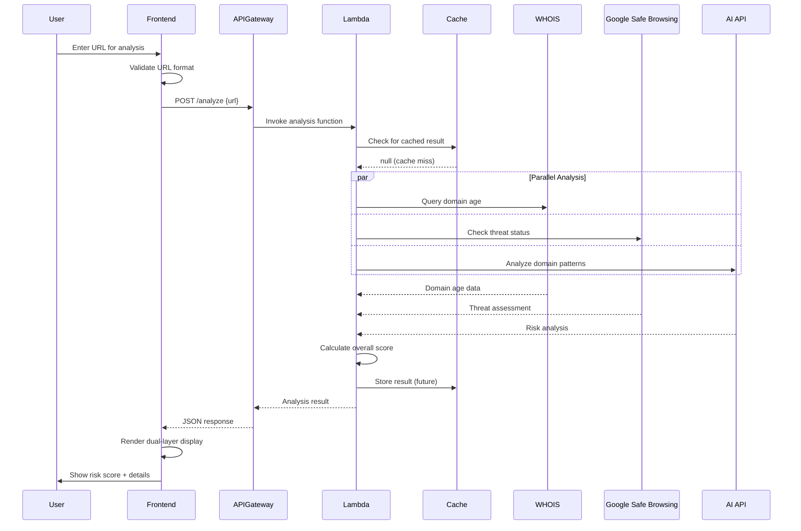

# Core Workflows

## 1. URL Analysis Workflow (Web UI)

```mermaid
sequenceDiagram
    participant User
    participant Frontend
    participant APIGateway
    participant Lambda
    participant Cache
    participant WHOIS
    participant GSB as Google Safe Browsing
    participant AI as AI API
    
    User->>Frontend: Enter URL for analysis
    Frontend->>Frontend: Validate URL format
    Frontend->>APIGateway: POST /analyze {url}
    APIGateway->>Lambda: Invoke analysis function
    
    Lambda->>Cache: Check for cached result
    Cache-->>Lambda: null (cache miss)
    
    par Parallel Analysis
        Lambda->>WHOIS: Query domain age
        and
        Lambda->>GSB: Check threat status
        and
        Lambda->>AI: Analyze domain patterns
    end
    
    WHOIS-->>Lambda: Domain age data
    GSB-->>Lambda: Threat assessment
    AI-->>Lambda: Risk analysis
    
    Lambda->>Lambda: Calculate overall score
    Lambda->>Cache: Store result (future)
    Lambda-->>APIGateway: Analysis result
    APIGateway-->>Frontend: JSON response
    
    Frontend->>Frontend: Render dual-layer display
    Frontend->>User: Show risk score + details
```
