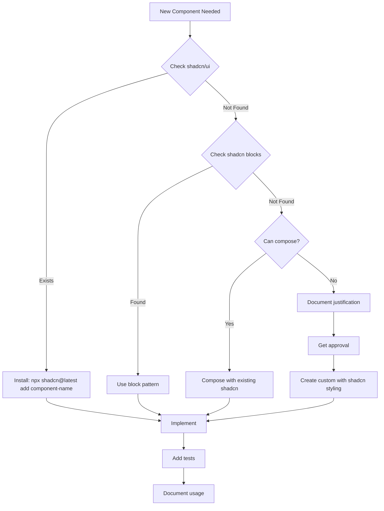

# Frontend Component Implementation Guidelines

## Overview

This document defines the mandatory process for selecting and implementing UI components in the Scam Checker application. The primary principle is: **Always use shadcn/ui components before creating custom implementations.**

## 1. Component Selection Hierarchy (MANDATORY)

When implementing ANY UI component, follow this strict hierarchy:

```
1. CHECK: Does shadcn/ui have this component?
   ├─ YES → Use shadcn component
   └─ NO  → Continue to step 2

2. CHECK: Can shadcn blocks/patterns solve this?
   ├─ YES → Use shadcn blocks (navbar-*, etc.)
   └─ NO  → Continue to step 3

3. CHECK: Can we compose existing shadcn primitives?
   ├─ YES → Compose using shadcn components
   └─ NO  → Continue to step 4

4. CHECK: Is there a Radix UI primitive for this?
   ├─ YES → Build on Radix UI with shadcn styling
   └─ NO  → Create custom component (requires justification)
```

## 2. Pre-Implementation Checklist

Before implementing ANY component, complete this checklist:

```markdown
## Component: [Component Name]

### shadcn/ui Component Analysis
- [ ] Searched shadcn/ui components: `npx shadcn@latest list`
- [ ] Checked shadcn/ui blocks for patterns
- [ ] Reviewed similar shadcn implementations

### Available shadcn Components to Use:
- [ ] Primary component: ___________
- [ ] Supporting components: ___________
- [ ] Can achieve with composition: YES/NO

### If Custom Implementation Required:
- Justification: ___________
- Why shadcn doesn't work: ___________
- Approved by: ___________
```

## 3. Common Component Mappings (ALWAYS USE THESE)

| UI Need | shadcn Component | DO NOT Create Custom |
|---------|-----------------|---------------------|
| Navigation bar | NavigationMenu | ❌ Custom nav |
| Mobile menu | Sheet | ❌ Custom overlay |
| Modal/Dialog | Dialog | ❌ Custom modal |
| Dropdown menu | DropdownMenu | ❌ Custom dropdown |
| Forms | Form + react-hook-form | ❌ Raw form elements |
| Loading states | Skeleton | ❌ Custom loaders |
| Notifications | Toast/Sonner | ❌ browser alert() |
| Error messages | Alert | ❌ Custom error divs |
| Data tables | Table + DataTable | ❌ Custom tables |
| Date selection | Calendar/DatePicker | ❌ Custom date inputs |
| Selection lists | Select/Combobox | ❌ Custom selects |
| Tabs | Tabs | ❌ Custom tab navigation |
| Accordions | Accordion | ❌ Custom collapsibles |
| Progress indicators | Progress | ❌ Custom progress bars |
| Tooltips | Tooltip | ❌ Custom tooltips |
| Popovers | Popover | ❌ Custom popovers |
| Command palette | Command | ❌ Custom command menu |
| Context menus | ContextMenu | ❌ Custom right-click menu |
| Sidebar navigation | Sidebar | ❌ Custom sidebar |
| Breadcrumbs | Breadcrumb | ❌ Custom breadcrumbs |
| Pagination | Pagination | ❌ Custom pagination |
| Avatar/Profile | Avatar | ❌ Custom avatar |
| Badges/Pills | Badge | ❌ Custom badges |
| Cards | Card | ❌ Custom cards |
| Carousels | Carousel | ❌ Custom carousels |
| Sliders | Slider | ❌ Custom sliders |
| Switches/Toggles | Switch | ❌ Custom toggles |
| Radio groups | RadioGroup | ❌ Custom radios |
| Checkboxes | Checkbox | ❌ Custom checkboxes |
| Text areas | Textarea | ❌ Custom textareas |
| Separators | Separator | ❌ Custom dividers |
| Scroll areas | ScrollArea | ❌ Custom scroll containers |
| Aspect ratios | AspectRatio | ❌ Custom aspect boxes |
| Collapsible sections | Collapsible | ❌ Custom collapsibles |
| Hover cards | HoverCard | ❌ Custom hover displays |
| Toggle buttons | Toggle | ❌ Custom toggle buttons |
| Toggle groups | ToggleGroup | ❌ Custom button groups |

## 4. Implementation Process



## 5. Story Template Addition

Every story MUST include this section:

```markdown
## Component Analysis

### Required UI Components
1. [Component 1]: 
   - shadcn component: [name or "none"]
   - Installation: `npx shadcn@latest add [component]`
   
2. [Component 2]:
   - shadcn component: [name or "none"]
   - Justification if custom: [reason]

### shadcn Components to Install
```bash
# Install all required shadcn components
npx shadcn@latest add navigation-menu sheet form skeleton alert toast
```

### Custom Components Required
- [Component]: [Justification]
```

## 6. Code Review Checklist

Add to all PR reviews:

```markdown
## UI Component Checklist
- [ ] All shadcn components checked before custom implementation
- [ ] Component analysis documented in story
- [ ] No duplicate functionality with shadcn components
- [ ] Custom components have written justification
- [ ] Used shadcn styling patterns for any custom components
- [ ] Followed cn() utility for className merging
- [ ] Used CSS variables for theming
- [ ] Maintained accessibility standards
```

## 7. Development Workflow Commands

These scripts are available in package.json:

```bash
# List all available shadcn components
npm run ui:list

# Add a specific shadcn component
npm run ui:add [component-name]

# Check shadcn documentation
npm run ui:check

# Browse shadcn blocks
npm run ui:blocks

# Add multiple components at once
npx shadcn@latest add dialog sheet form toast alert
```

## 8. Developer Onboarding Checklist

### Before Creating ANY Component

1. **STOP** - Do not create custom components
2. **SEARCH** - Run `npm run ui:list` or check https://ui.shadcn.com/docs/components
3. **BROWSE** - Check https://ui.shadcn.com/blocks for patterns
4. **INSTALL** - Use `npm run ui:add [component-name]`
5. **COMPOSE** - Use existing shadcn components together
6. **DOCUMENT** - If custom needed, document why in story

### Common Mistakes to Avoid

❌ **Creating custom navigation** - Use NavigationMenu
```bash
npx shadcn@latest add navigation-menu
```

❌ **Building custom modals** - Use Dialog/Sheet
```bash
npx shadcn@latest add dialog sheet
```

❌ **Making custom forms** - Use Form components
```bash
npx shadcn@latest add form
npm install react-hook-form @hookform/resolvers
```

❌ **Writing custom dropdowns** - Use DropdownMenu/Select
```bash
npx shadcn@latest add dropdown-menu select
```

❌ **Building loading states** - Use Skeleton
```bash
npx shadcn@latest add skeleton
```

❌ **Custom error displays** - Use Alert
```bash
npx shadcn@latest add alert
```

❌ **Browser alerts** - Use Toast/Sonner
```bash
npx shadcn@latest add toast sonner
```

## 9. Component Composition Examples

### Good: Composing shadcn Components
```tsx
// ✅ GOOD: Compose existing shadcn components
import { Card, CardHeader, CardTitle, CardContent } from '@/components/ui/card'
import { Button } from '@/components/ui/button'
import { Input } from '@/components/ui/input'
import { Form, FormField, FormItem, FormLabel } from '@/components/ui/form'

export function LoginCard() {
  return (
    <Card>
      <CardHeader>
        <CardTitle>Login</CardTitle>
      </CardHeader>
      <CardContent>
        <Form>
          {/* Composed using shadcn primitives */}
        </Form>
      </CardContent>
    </Card>
  )
}
```

### Bad: Creating Custom Components
```tsx
// ❌ BAD: Creating custom modal instead of using Dialog
export function CustomModal({ isOpen, onClose, children }) {
  if (!isOpen) return null
  
  return (
    <div className="fixed inset-0 bg-black/50">
      <div className="fixed top-1/2 left-1/2 transform -translate-x-1/2">
        {/* Custom implementation - DO NOT DO THIS */}
      </div>
    </div>
  )
}

// ✅ GOOD: Use shadcn Dialog instead
import { Dialog, DialogContent, DialogHeader } from '@/components/ui/dialog'
```

## 10. Custom Component Justification Template

If you MUST create a custom component, create a justification file:

`src/components/custom/[component-name]/JUSTIFICATION.md`

```markdown
# Custom Component Justification

## Component Name
[Name]

## Why shadcn/ui Cannot Be Used
[Detailed explanation]

## Alternatives Considered
1. [shadcn component] - Why it doesn't work
2. [Composition approach] - Why it doesn't work

## Implementation Approach
- Will follow shadcn styling patterns
- Will use cn() utility
- Will maintain accessibility standards

## Approved By
- Name: [Approver]
- Date: [Date]
```

## 11. Validation Rules

### Pre-commit Checks
- No new files in `/components` without corresponding shadcn imports
- No `className` manipulation without `cn()` utility
- No inline styles except for dynamic values
- No custom overlay/modal/dropdown patterns

### CI/CD Checks
- All components must have shadcn imports or justification files
- Custom components must follow naming convention: `Custom[ComponentName]`
- Test coverage required for all custom components

## 12. Resources

### Official Documentation
- [shadcn/ui Components](https://ui.shadcn.com/docs/components)
- [shadcn/ui Blocks](https://ui.shadcn.com/blocks)
- [shadcn/ui Themes](https://ui.shadcn.com/themes)
- [Radix UI Primitives](https://www.radix-ui.com/primitives)

### Internal Documentation
- [Component Patterns](./component-patterns.md)
- [Theming Guide](./theming-guide.md)
- [Accessibility Standards](./accessibility-standards.md)

## 13. Migration Guide for Existing Custom Components

For components already created custom, follow this migration priority:

### Priority 1 (Must Fix Immediately)
1. Navigation → NavigationMenu
2. Mobile Menu → Sheet
3. Forms → Form + react-hook-form
4. Modals → Dialog

### Priority 2 (Fix in Next Sprint)
1. Dropdowns → DropdownMenu/Select
2. Loading States → Skeleton
3. Notifications → Toast/Sonner
4. Error Messages → Alert

### Priority 3 (Plan for Future)
1. Custom buttons → Button variants
2. Custom inputs → Input with Form
3. Custom cards → Card components
4. Custom tables → DataTable

## Enforcement

This guideline is **MANDATORY** for all frontend development. Violations will result in:
1. PR rejection
2. Required refactoring before merge
3. Documentation in technical debt log

## Updates

This document should be reviewed and updated:
- When new shadcn components are released
- When new patterns emerge
- Quarterly for relevance

Last Updated: 2025-08-30
Version: 1.0