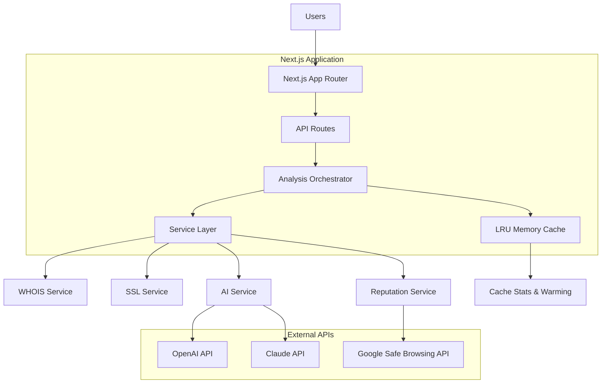
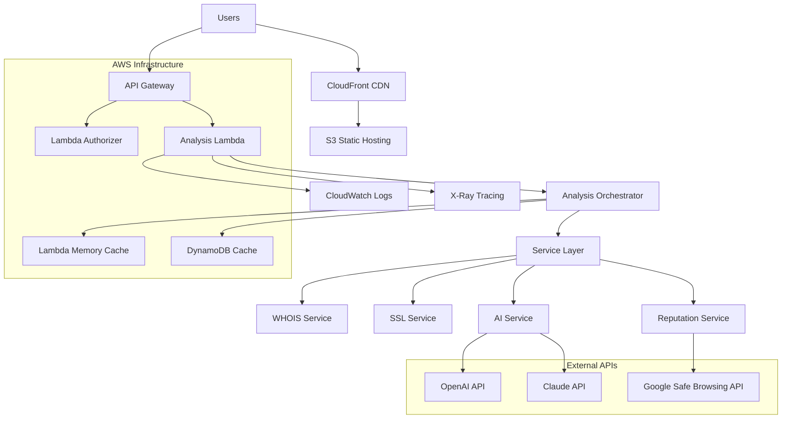

# High Level Architecture

## Platform and Infrastructure Choice

**Current Platform:** Next.js Full-Stack Application (Development)
**Production Platform:** AWS Serverless (Planned)

**Current Implementation:**
- **Frontend & Backend:** Next.js App Router with API routes
- **Deployment:** Single Node.js process (development mode)
- **Caching:** In-memory LRU cache with eviction policies
- **External APIs:** Direct service integration
- **Monitoring:** Console logging and built-in Next.js telemetry

**Production Target (AWS Serverless):**
- **Frontend:** S3 + CloudFront (global CDN)
- **Backend:** Lambda functions + API Gateway
- **Caching:** In-memory (Lambda) with DynamoDB persistence layer
- **Monitoring:** CloudWatch + X-Ray
- **CI/CD:** GitHub Actions + Terraform
- **DNS:** Route 53

**Deployment Strategy:** Dual-mode architecture supporting development simplicity and production scalability

## Technical Summary

**Current Implementation:** The Scam Checker is built as a **Next.js full-stack application** with integrated API routes for development efficiency. It features a sophisticated **service orchestration layer** that coordinates parallel execution of analysis services (WHOIS, SSL, reputation, AI) through an abstraction pattern supporting multiple providers. The system implements **in-memory LRU caching** with eviction policies, memory tracking, and cache warming for optimal performance.

**Production Evolution:** The architecture is designed for seamless migration to **AWS serverless infrastructure** where API routes become Lambda functions, static assets deploy to S3/CloudFront, and caching extends to DynamoDB persistence. The **service abstraction layer** enables provider flexibility (OpenAI/Claude for AI, Google Safe Browsing for reputation) while the **orchestrator pattern** ensures consistent parallel processing across deployment modes.

**Key Innovation:** Dual-mode architecture supporting rapid development iteration with Next.js while maintaining production scalability through serverless transformation.

## Repository Structure

**Structure:** Terraform-driven AWS monorepo
**Infrastructure Tool:** Terraform with modular structure
**Package Organization:** Clear separation of concerns with shared types

## High-Level Architecture Diagram

### Current Implementation (Development Mode)

### Production Target (AWS Serverless)

## Architectural Patterns

**Core Patterns (Implemented):**
- **Service Abstraction Pattern:** Provider-agnostic service interfaces enabling AI provider switching (OpenAI/Claude) and reputation service flexibility - _Rationale:_ Enables A/B testing, cost optimization, and vendor risk mitigation
- **Orchestration Pattern:** Parallel service execution with timeout handling and fallback strategies - _Rationale:_ Maximizes performance while ensuring reliability under service failures
- **Factory Pattern:** Service instantiation with environment-specific configuration injection - _Rationale:_ Eliminates singletons, improves testability, enables seamless dev/prod transitions
- **Builder Pattern:** Fluent API for complex service configuration with type safety - _Rationale:_ Simplifies service setup and reduces configuration errors
- **LRU Cache Pattern:** Memory-efficient caching with intelligent eviction and cache warming - _Rationale:_ Optimizes performance while preventing memory exhaustion

**UI/Frontend Patterns:**
- **Component-Based UI:** Reusable React components with shadcn/ui design system - _Rationale:_ Consistent dual-layer interface (simple + technical views)
- **Dual-Layer Display Pattern:** Progressive disclosure from simple risk scores to detailed technical analysis - _Rationale:_ Serves both consumer and technical audiences effectively

**Integration Patterns:**
- **API Gateway Pattern:** Centralized external API orchestration with rate limiting and error handling - _Rationale:_ Manages costs, reliability, and observability across multiple external services
- **Cache-Aside Pattern:** Multi-tier caching (memory + future persistence) with TTL management - _Rationale:_ Reduces external API costs and improves response times
- **Error Recovery Pattern:** Graceful degradation with partial results when services fail - _Rationale:_ Maintains user experience even during external service outages

## Deployment Modes

The architecture supports two distinct deployment modes, each optimized for different phases of the development lifecycle:

### Development Mode (Current)
**Deployment Model:** Next.js full-stack application
**Key Characteristics:**
- **Unified Process:** Frontend and backend run in single Node.js process
- **Hot Reloading:** Instant feedback during development with Next.js dev server
- **Simple Dependencies:** No external infrastructure requirements beyond Node.js
- **Direct Integration:** API routes directly call service layer without network overhead
- **In-Memory State:** All caching and state management in application memory
- **Local External APIs:** External API calls made directly from development machine

**Advantages:** Rapid development iteration, simple debugging, no infrastructure setup required
**Trade-offs:** Single point of failure, limited scalability, development-only configuration

### Production Mode (Planned - AWS Serverless)
**Deployment Model:** Distributed serverless architecture
**Key Characteristics:**
- **Separated Concerns:** Frontend (S3/CloudFront) and backend (Lambda) independently scalable
- **Automatic Scaling:** Lambda functions scale based on demand with zero cold-start optimization
- **Global Distribution:** CloudFront CDN ensures worldwide performance
- **Persistent Caching:** DynamoDB provides durable cache layer across Lambda invocations
- **Infrastructure as Code:** Terraform manages all AWS resources with version control
- **Monitoring Integration:** CloudWatch and X-Ray provide comprehensive observability

**Advantages:** Infinite scalability, global performance, cost efficiency, operational resilience
**Trade-offs:** Increased complexity, cold start considerations, distributed debugging challenges

### Migration Strategy
**Shared Components:** Service layer, business logic, and data models remain identical across both modes
**Configuration Layer:** Environment-specific builders inject appropriate dependencies (memory cache vs DynamoDB)
**Testing Approach:** Development mode enables rapid testing; staging environment validates serverless behavior
**Rollout Plan:** Blue-green deployment with gradual traffic shifting to validate serverless architecture
