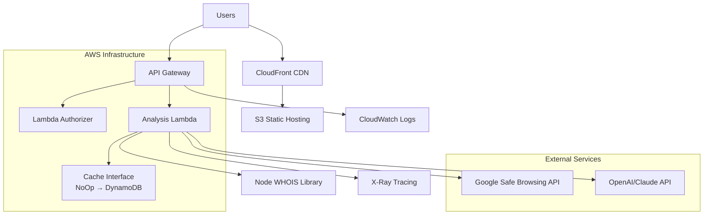

# High Level Architecture

## Platform and Infrastructure Choice

**Platform:** AWS Full Stack (Single Region)
**Key Services:** 
- **Frontend:** S3 + CloudFront (global CDN)
- **Backend:** Lambda + API Gateway  
- **Caching:** Abstracted cache interface (NoOp initially, future DynamoDB)
- **Monitoring:** CloudWatch + X-Ray
- **CI/CD:** GitHub Actions + Terraform
- **DNS:** Route 53

**Deployment Regions:** Single region (us-east-1) with CloudFront global distribution

## Technical Summary

The Scam Checker employs a **simplified AWS serverless architecture** with Next.js frontend deployed via **S3/CloudFront** and **Lambda functions** handling API orchestration through **API Gateway**. The system uses an **abstracted caching interface** allowing flexible backend selection (NoOp initially, future DynamoDB) based on cost optimization, with **CloudWatch** for monitoring and **Terraform** for infrastructure as code.

## Repository Structure

**Structure:** Terraform-driven AWS monorepo
**Infrastructure Tool:** Terraform with modular structure
**Package Organization:** Clear separation of concerns with shared types

## High-Level Architecture Diagram

## Architectural Patterns

- **Jamstack Architecture:** Static generation with serverless APIs - _Rationale:_ Optimal performance for content delivery with dynamic API analysis
- **API Gateway Pattern:** Centralized external API orchestration - _Rationale:_ Manages rate limits, caching, and error handling for multiple external services
- **Component-Based UI:** Reusable React components with shadcn/ui - _Rationale:_ Consistent dual-layer interface (simple + technical views)
- **Repository Pattern:** Abstract external API access - _Rationale:_ Enables testing and easy service provider switching
- **Cache-Aside Pattern:** In-memory result caching - _Rationale:_ Reduces external API costs and improves response times
