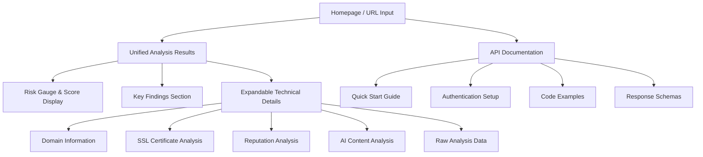
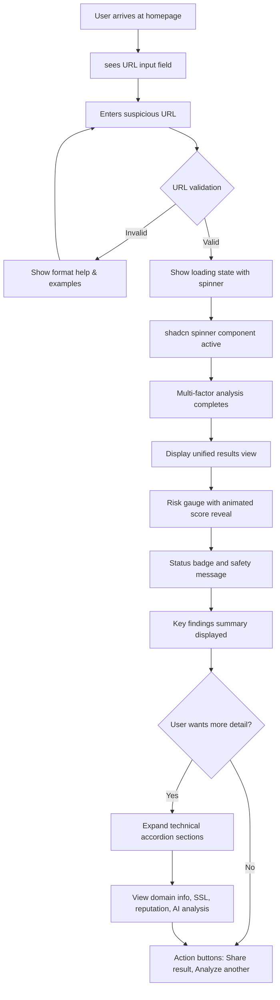
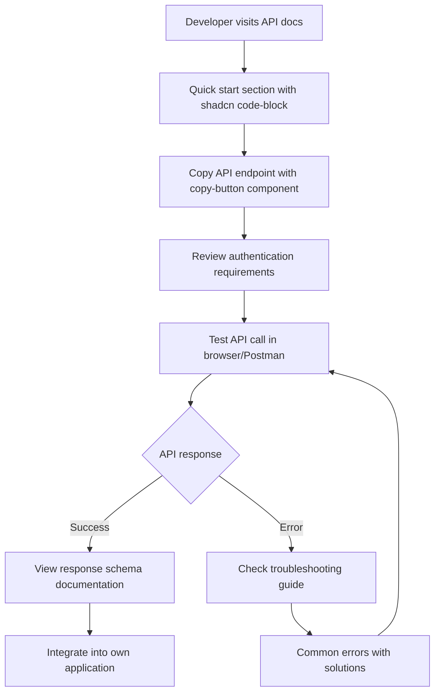

# Scam Checker Web App UI/UX Specification

This document defines the user experience goals, information architecture, user flows, and visual design specifications for Scam Checker Web App's user interface. It serves as the foundation for visual design and frontend development, ensuring a cohesive and user-centered experience.

## Change Log

| Date | Version | Description | Author |
|------|---------|-------------|---------|
| 2025-08-29 | 1.0 | Initial specification creation with shadcn/ui integration | Sally (UX Expert) |
| 2025-08-30 | 1.1 | Added mandatory reference to Frontend Component Implementation Guidelines | James (Senior Developer) |
| 2025-09-02 | 1.2 | Unified view redesign - consolidated Simple and Technical views with progressive disclosure | Sally (UX Expert) |

## Overall UX Goals & Principles

### Target User Personas

**Primary User: General Consumer (Non-Tech-Savvy)**
- Needs simple, clear risk indicators without technical jargon
- Wants easy-to-understand explanations of potential threats  
- Requires intuitive, minimal-friction experience
- Expects immediate, actionable recommendations (safe/caution/danger)

**Secondary User: Tech-Savvy Developer**
- Wants detailed technical analysis and raw data
- Needs API access for integration into their own tools
- Desires deeper insights into detection methodology
- Appreciates expandable technical details and diagnostic information

### Usability Goals

1. **Ease of learning:** New users can analyze their first URL and understand results within 30 seconds
2. **Efficiency of use:** Regular users can complete URL checks in under 15 seconds from input to result
3. **Error prevention:** Clear validation prevents invalid URLs, with helpful formatting guidance
4. **Trust building:** Visual indicators and explanations build user confidence in safety assessments
5. **Progressive disclosure:** Technical details available on-demand without overwhelming casual users

### Design Principles

1. **Trust through transparency** - Clear explanations of how we determine safety scores build user confidence
2. **Simplicity first, depth on demand** - Essential information upfront, technical details available for those who want them
3. **Immediate visual feedback** - Color-coded safety indicators provide instant risk assessment
4. **Consistent safety language** - Use standardized terminology (Safe/Caution/Danger) across all interfaces
5. **Performance equals trust** - Fast analysis and response times reinforce the tool's reliability

## Information Architecture (IA)

### Site Map / Screen Inventory



**Key Screens:**
- **Homepage**: Clean URL input with instant validation, powered by shadcn input components
- **Analysis Results**: Unified view with risk gauge, key findings, and progressive disclosure via shadcn accordion
- **API Documentation**: Developer-focused with shadcn code-block and copy-button components

### Navigation Structure

**Primary Navigation:** Simple 3-section navigation using shadcn navbar-06 component (icon-based for clean appearance)
- Home (Shield icon) - URL analysis interface
- API (Code icon) - Developer documentation  
- About (Info icon) - How it works explanation

**Secondary Navigation:** Progressive disclosure within results view
- Accordion sections for technical details (expandable on demand)
- Action buttons for additional functions (share, analyze new URL)

**Breadcrumb Strategy:** Minimal breadcrumbs only on API documentation pages due to simple 2-level hierarchy

## User Flows

### Primary Flow: URL Safety Analysis

**User Goal:** Quickly determine if a suspicious URL is safe to visit

**Entry Points:** 
- Direct homepage visit
- Shared link from social media/messaging
- Browser bookmark

**Success Criteria:** User receives clear safety assessment and actionable recommendation within 15 seconds

#### Flow Diagram



#### Edge Cases & Error Handling:
- Invalid URL format: Inline validation with helpful examples
- Network timeout: Retry mechanism with clear error messaging  
- API service down: Graceful degradation with cached basic checks
- Malicious URL detected: Prominent warning with shadcn banner component
- Analysis inconclusive: Clear messaging about limitations and manual review suggestion

**Notes:** Uses shadcn status, spinner, banner, and accordion components for consistent visual feedback and progressive disclosure throughout the flow

### Secondary Flow: API Integration for Developers

**User Goal:** Integrate scam checking into their own application via API

**Entry Points:**
- Homepage API link
- Search engine results for "scam checking API"
- Developer documentation referrals

**Success Criteria:** Developer successfully makes first API call and understands response structure

#### Flow Diagram



#### Edge Cases & Error Handling:
- Missing API key: Clear authentication error with setup link
- Rate limiting: Response headers explanation with shadcn code examples
- Invalid request format: Schema validation errors with correction suggestions
- Service limits reached: Upgrade path information with pricing

**Notes:** Heavy use of shadcn copy-button and code-block components for developer experience

## Wireframes & Visual References

### Homepage Layout (Desktop)

```
┌─────────────────────────────────────────────────────────────────┐
│ ┌─────────────────────────────────────────────────────────────┐ │
│ │ [Shield] ScamChecker    [Home] [API] [About]    [Theme] [?] │ │ <- navbar-06
│ └─────────────────────────────────────────────────────────────┘ │
│                                                                   │
│                    ┌──────────────────────────┐                  │
│                    │    Is this URL safe?     │                  │ <- H1 heading
│                    └──────────────────────────┘                  │
│                                                                   │
│          ┌─────────────────────────────────────────────┐        │
│          │ 🔍  Enter URL to check...                  │        │ <- Input field
│          └─────────────────────────────────────────────┘        │
│                                                                   │
│                    ┌──────────────────────┐                      │
│                    │    Analyze URL →     │                      │ <- Primary button
│                    └──────────────────────┘                      │
│                                                                   │
│               Try: example.com | suspicious-site.net              │ <- Helper text
│                                                                   │
└─────────────────────────────────────────────────────────────────┘
```

### Results View (Desktop) - Unified View

```
┌─────────────────────────────────────────────────────────────────┐
│ Navigation Bar (same as homepage)                                │
├─────────────────────────────────────────────────────────────────┤
│                                                                   │
│  ┌─────────────────────────────────────────────────────────┐   │
│  │                                                           │   │
│  │  wikipedia.org                                            │   │ <- H2 Domain
│  │                                                           │   │
│  │            ╭────────────────────────╮                    │   │
│  │            │         94/100         │                    │   │ <- Risk gauge
│  │            │    ████████████████    │                    │   │ <- Visual progress
│  │            │       SAFE TO VISIT    │                    │   │ <- Status message
│  │            ╰────────────────────────╯                    │   │
│  │                                                           │   │
│  │  ┌───────────────────────────────────────────────┐      │   │
│  │  │ ℹ Recommendation: Standard security checks     │      │   │
│  │  │   passed. Always verify before sharing info.   │      │   │ <- Recommendation
│  │  └───────────────────────────────────────────────┘      │   │
│  │                                                           │   │
│  │  🔗 https://wikipedia.org                                │   │ <- Clickable URL
│  │                                                           │   │
│  │  ✓ Clean reputation according to Google Safe Browsing    │   │
│  │  ✓ Established domain (24 years old)                     │   │ <- Key findings
│  │  ✓ Valid SSL certificate                                 │   │
│  │  ✓ AI analysis: legitimate category (score: 50)          │   │
│  │                                                           │   │
│  │  ▼ Domain Information (Established)                      │   │
│  │  ▼ SSL Certificate (Valid)                               │   │ <- Expandable
│  │  ▼ Reputation Analysis (Safe)                            │   │ <- Technical
│  │  ▼ AI Content Analysis (85% confidence)                 │   │ <- Sections
│  │  ▼ Raw Analysis Data (JSON)                              │   │
│  │                                                           │   │
│  │  [Copy Link] [Share & Export] [Check Another URL]       │   │ <- Actions
│  │                                                           │   │
│  └─────────────────────────────────────────────────────────┘   │
│                                                                   │
└─────────────────────────────────────────────────────────────────┘
```

### Mobile Layout (Responsive)

```
┌─────────────────┐
│ ☰ ScamChecker 🔍│ <- Collapsed nav
├─────────────────┤
│                 │
│  Is this URL    │
│     safe?       │
│                 │
│ ┌─────────────┐ │
│ │Enter URL... │ │ <- Full width
│ └─────────────┘ │
│                 │
│ ┌─────────────┐ │
│ │  Analyze →  │ │
│ └─────────────┘ │
│                 │
├─────────────────┤
│     Results:    │
│                 │
│ wikipedia.org   │ <- Domain
│                 │
│   ┌────────┐    │
│   │   94   │    │ <- Compact gauge
│   │  SAFE  │    │
│   └────────┘    │
│                 │
│ ┌─────────────┐ │
│ │ ℹ Standard  │ │ <- Recommendation
│ │ checks pass │ │    Alert (compact)
│ └─────────────┘ │
│                 │
│ 🔗 https://...  │ <- Ellipsized URL
│                 │
│ ✓ Good reputation│
│ ✓ 24 year domain│ <- Key findings
│ ✓ Valid SSL     │
│ ✓ AI: legitimate│
│                 │
│ ▼ More Details  │ <- Expandable
│ [Check Another] │ <- Primary action
└─────────────────┘
```

### URL Link Behavior Specification

#### Interactive URL Link Component

**Purpose:** Provide direct access to the analyzed URL with appropriate safety warnings

**Visual Design:**
- **Icon**: 🔗 link icon prefix
- **Desktop**: Full URL displayed (e.g., "https://wikipedia.org/wiki/Example")
- **Tablet**: Truncated with middle ellipsis (e.g., "https://wikipedia.org...Example")
- **Mobile**: Domain or heavily truncated (e.g., "https://...")

**Interaction Behavior:**

| Risk Level | Score Range | Click Behavior | User Experience |
|------------|-------------|----------------|-----------------|
| **Safe** | 80-100 | Direct navigation | Opens URL immediately in new tab |
| **Moderate** | 60-79 | Direct navigation | Opens URL immediately in new tab |
| **Caution** | 40-59 | Warning dialog | Shows confirmation before navigation |
| **High Risk** | 20-39 | Warning dialog | Shows strong warning before navigation |
| **Danger** | 0-19 | Warning dialog | Shows critical warning before navigation |

#### Warning Dialog Specification

**For URLs with score < 60:**

```
┌─────────────────────────────────────────┐
│ ⚠️ Security Warning                      │
├─────────────────────────────────────────┤
│ This website has failed security checks. │
│ Visiting it may put your data at risk.   │
│                                          │
│ Score: 45/100 (CAUTION)                  │
│                                          │
│ Are you sure you want to continue?       │
│                                          │
│ [Cancel]        [Continue at Own Risk]   │
└─────────────────────────────────────────┘
```

**Dialog Variants by Risk Level:**
- **Caution (40-59)**: Yellow warning with moderate language
- **High Risk (20-39)**: Orange warning with stronger language
- **Danger (0-19)**: Red warning with critical language and additional disclaimers

**Implementation Details:**
- Uses shadcn Dialog component with AlertTriangle icon
- Warning message adapts based on risk score
- "Continue at Own Risk" button styled as destructive variant
- Opens URL in new tab if user confirms
- Tracks warning dialog interactions for analytics

### Component Visual Specifications

#### Risk Score Gauge Component
```
Score 0-33 (Danger):     ████░░░░░░░░░░░░ 
Score 34-66 (Caution):   ████████████░░░░
Score 67-100 (Safe):     ████████████████

Colors transition smoothly:
- Red (#EF4444) → Orange (#F59E0B) → Green (#10B981)
- Background segments: Gray-200 (#E5E7EB)
- Animated fill on load (1.5s duration)
```

## Comprehensive Error State Documentation

### Error Taxonomy & Visual Treatment

| Error Type | Severity | Visual Treatment | User Message | Recovery Action | Technical Details |
|------------|----------|------------------|--------------|-----------------|-------------------|
| **Invalid URL Format** | Low | Inline red text + shake animation | "Please enter a valid URL (e.g., https://example.com)" | Show format examples | Client-side validation |
| **Network Timeout** | Medium | Yellow banner + spinner | "Taking longer than expected. Please wait..." | Auto-retry (3x) + manual retry button | 30s timeout, exponential backoff |
| **Service Unavailable** | High | Red banner with icon | "Our service is temporarily unavailable. Please try again later." | Retry button + status page link | 503 response handling |
| **Rate Limit Exceeded** | Medium | Orange banner + timer | "Too many requests. Please wait 60 seconds." | Countdown timer + retry | 429 response, X-RateLimit headers |
| **Analysis Failed** | High | Red alert box | "Unable to analyze this URL. It may be blocked or inaccessible." | Try different URL + contact support | Various 4xx/5xx responses |
| **Partial Results** | Low | Yellow info box | "Some checks couldn't be completed. Results may be incomplete." | View available results + retry full scan | Graceful degradation |
| **Malicious URL Blocked** | Critical | Full-screen red warning | "⚠️ DANGER: This site is known to be malicious. Do not visit." | Go back + report details | Immediate block, no bypass |
| **Connection Lost** | Medium | Toast notification | "Connection lost. Reconnecting..." | Auto-reconnect | WebSocket/polling failure |

### Error State Visual Components

```tsx
// Error Banner Component Structure
<Banner variant="error" icon={<AlertCircle />}>
  <BannerTitle>Service Temporarily Unavailable</BannerTitle>
  <BannerDescription>
    Our analysis service is experiencing issues. Your request has been queued.
  </BannerDescription>
  <BannerAction onClick={retry}>Try Again</BannerAction>
  <BannerAction variant="ghost" href="/status">Check Status</BannerAction>
</Banner>
```

## Data Visualization Specifications

### Risk Score Display Components

#### Primary Score Visualization (Hero Display)
- **Component**: Custom circular progress gauge
- **Size**: 200px diameter (desktop), 120px (mobile)
- **Animation**: Count-up from 0 with easing over 1.5s
- **Color Interpolation**: 
  ```
  0-33:   HSL(0, 84%, 60%)    // Red
  34-66:  HSL(35, 92%, 50%)   // Orange  
  67-100: HSL(142, 71%, 45%)  // Green
  ```
- **Typography**: Score number in 48px bold, status text in 18px medium

#### Visual Implementation
```tsx
<div className="relative w-48 h-48">
  {/* Background ring */}
  <svg className="transform -rotate-90 w-48 h-48">
    <circle cx="96" cy="96" r="88" stroke="#E5E7EB" strokeWidth="12" fill="none" />
    {/* Animated progress ring */}
    <circle 
      cx="96" cy="96" r="88" 
      stroke={scoreColor} 
      strokeWidth="12" 
      fill="none"
      strokeDasharray={`${circumference} ${circumference}`}
      strokeDashoffset={offset}
      className="transition-all duration-1500 ease-out"
    />
  </svg>
  {/* Center content */}
  <div className="absolute inset-0 flex flex-col items-center justify-center">
    <motion.span className="text-5xl font-bold">
      {animatedScore}
    </motion.span>
    <span className="text-sm uppercase tracking-wider">{status}</span>
  </div>
</div>
```

#### Secondary Score Displays
- **Inline Badge**: Horizontal pill with mini gauge (height: 32px)
- **Compact Card**: Square card with centered score (80x80px)
- **List Item**: Left-aligned score with right-aligned status

### Risk Factor Breakdown Visualization

```
Domain Age       ████████████░░░░  75/100
SSL Certificate  ████████████████  100/100  
Content Analysis ████████░░░░░░░░  50/100
Reputation       ████░░░░░░░░░░░░  25/100
─────────────────────────────────────────
Overall Score    ████████████░░░░  63/100 (CAUTION)
```

## Content Strategy & Microcopy Guidelines

### Security State Messaging Matrix

| Score Range | Status | Primary Message | Secondary Message | Action CTA | Icon |
|-------------|--------|-----------------|-------------------|------------|------|
| **80-100** | SAFE | "This site appears safe to visit" | "Standard security checks passed. Always verify before sharing personal information." | "Visit Site Safely" | ✓ CheckCircle |
| **60-79** | MODERATE | "Proceed with normal caution" | "Some minor concerns detected but no major red flags. Use standard web safety practices." | "Proceed with Caution" | ℹ Info |
| **40-59** | CAUTION | "Be careful with this site" | "Multiple risk indicators detected. Avoid entering sensitive information." | "View Risk Details" | ⚠ AlertTriangle |
| **20-39** | HIGH RISK | "We recommend avoiding this site" | "Significant security concerns detected. Only proceed if you trust the source." | "See Why It's Risky" | ⚠ AlertTriangle |
| **0-19** | DANGER | "Do not visit this site" | "Critical security threats detected. This site may attempt to steal your information or harm your device." | "Go Back to Safety" | 🚫 XCircle |

### Contextual Help Messages

```yaml
url_input:
  placeholder: "Enter a URL to check (e.g., https://example.com)"
  helper: "Paste any suspicious link to check if it's safe"
  error_invalid: "That doesn't look like a valid URL. Try: https://example.com"
  error_empty: "Please enter a URL to analyze"

analysis_states:
  initiating: "Starting security analysis..."
  checking_domain: "Checking domain reputation..."
  scanning_ssl: "Verifying SSL certificate..."
  analyzing_content: "Analyzing page content..."
  calculating_score: "Calculating safety score..."
  
tooltips:
  domain_age: "Older domains are generally more trustworthy"
  ssl_status: "Secure connection protects your data in transit"
  reputation: "Based on reports from security databases"
  content_analysis: "AI-powered detection of scam patterns"
```

## Mobile-Specific Interaction Specifications

### Touch Interactions & Gestures

#### Touch Gestures
- **Tap to Expand**: Tap accordion headers to reveal technical details
- **Pull-to-Refresh**: Re-analyze current URL
- **Long Press**: Copy URL or share results

#### Mobile-Optimized Components

##### Unified Mobile Results Layout
```
┌─────────────────────┐
│    URL Input Area   │ <- Fixed top
├─────────────────────┤
│   ┌────────┐        │
│   │   94   │        │ <- Gauge prominent
│   │  SAFE  │        │
│   └────────┘        │
│                     │
│ Safe to visit       │ <- Clear message
│                     │
│ ✓ Good reputation   │
│ ✓ 24 year domain    │ <- Key findings
│ ✓ Valid SSL         │
│ ✓ AI: legitimate    │
│                     │
│ ▽ Technical Details │ <- Tap to expand
│   Domain Info       │
│   SSL Certificate   │
│   Reputation Data   │
│   AI Analysis       │
│                     │
│ [Check Another URL] │
└─────────────────────┘
```

##### Mobile Navigation Pattern
- **Thumb-Friendly Zones**: Primary actions within bottom 25% of screen
- **One-Handed Operation**: All critical actions reachable with thumb
- **Touch Target Sizes**: Minimum 48x48px, 8px spacing between targets

##### Mobile-Specific Components
```tsx
// Mobile URL Input with Native Features
<div className="fixed top-0 w-full p-4 bg-white shadow-lg">
  <input 
    type="url"
    inputMode="url"  // Mobile keyboard optimization
    autoComplete="url"
    autoCapitalize="none"
    spellCheck="false"
    className="w-full h-14 text-lg" // Larger for mobile
  />
  <button className="w-full h-14 mt-2 text-lg font-medium">
    Analyze URL
  </button>
</div>

// Unified Results with Expandable Sections
<UnifiedResults>
  <RiskGaugeSection score={score} status={status} />
  <KeyFindingsSection findings={findings} />
  <TechnicalAccordion sections={technicalData} />
</UnifiedResults>
```

### Mobile Performance Optimizations
- **Lazy Load**: Technical details only load when accessed
- **Image Optimization**: No decorative images on mobile
- **Reduced Animations**: Simpler transitions to preserve battery
- **Offline Support**: Cache recent checks for offline viewing

## API Documentation Specifications

### Developer Portal Structure

#### API Endpoints

```yaml
Base URL: https://api.scamchecker.com/v1

Endpoints:
  - POST /analyze
    Description: Analyze a single URL for safety
    Rate Limit: 100 requests/minute
    Request:
      url: string (required)
      detailed: boolean (optional, default: false)
      checks: array (optional, default: all)
    Response:
      score: number (0-100)
      status: enum (safe|moderate|caution|danger)
      factors: object
      timestamp: ISO 8601
      
  - POST /analyze/batch
    Description: Analyze multiple URLs (max 100)
    Rate Limit: 10 requests/minute
    
  - GET /analyze/{id}
    Description: Retrieve previous analysis by ID
    Cache: 24 hours
```

#### Code Examples Section

```tsx
// Interactive code example component
<CodeTabs defaultValue="curl">
  <CodeTabsList>
    <CodeTabsTrigger value="curl">cURL</CodeTabsTrigger>
    <CodeTabsTrigger value="javascript">JavaScript</CodeTabsTrigger>
    <CodeTabsTrigger value="python">Python</CodeTabsTrigger>
    <CodeTabsTrigger value="go">Go</CodeTabsTrigger>
  </CodeTabsList>
  
  <CodeTabsContent value="curl">
    <CodeBlock language="bash" showLineNumbers>
      {`curl -X POST https://api.scamchecker.com/v1/analyze \\
  -H "Authorization: Bearer YOUR_API_KEY" \\
  -H "Content-Type: application/json" \\
  -d '{"url": "https://example.com"}'`}
    </CodeBlock>
    <CopyButton text={curlExample} />
  </CodeTabsContent>
  
  <CodeTabsContent value="javascript">
    <CodeBlock language="javascript" showLineNumbers>
      {javascriptExample}
    </CodeBlock>
    <CopyButton text={javascriptExample} />
  </CodeTabsContent>
</CodeTabs>
```

#### SDK Documentation
```markdown
## Official SDKs

### Node.js / JavaScript
npm install @scamchecker/sdk

### Python
pip install scamchecker

### Go
go get github.com/scamchecker/sdk-go

### PHP
composer require scamchecker/sdk
```

### Rate Limiting & Authentication

```yaml
Authentication:
  Type: Bearer Token
  Header: Authorization: Bearer <token>
  
Rate Limits:
  Free Tier: 100 requests/day
  Basic: 1,000 requests/day
  Pro: 10,000 requests/day
  Enterprise: Unlimited
  
Headers:
  X-RateLimit-Limit: Total requests allowed
  X-RateLimit-Remaining: Requests remaining
  X-RateLimit-Reset: Unix timestamp for reset
```

**Notes:** Heavy use of shadcn copy-button and code-block components for developer experience

## Component Library / Design System

**Design System Approach:** Leverage shadcn/ui as the foundational design system, with custom security-focused component variants and specialized components for URL analysis display.

**CRITICAL REQUIREMENT:** Before implementing ANY UI component, developers MUST read and follow the [Frontend Component Implementation Guidelines](./architecture/frontend-component-guidelines.md). This document defines the mandatory process for selecting shadcn/ui components and prevents unnecessary custom component creation.

### Core Components

#### Security Status Indicator
**Purpose:** Display URL safety assessment with immediate visual clarity

**Variants:** 
- Safe (Green): `status="online"` with emerald color override
- Caution (Yellow): `status="degraded"` with amber color override  
- Danger (Red): `status="offline"` with red color override

**States:** Default, loading (with pulse animation), error
- Loading state uses shadcn spinner component overlay
- Error state shows retry mechanism

**Usage Guidelines:** Always pair with explanatory text, never rely on color alone for accessibility

**shadcn Implementation:** Extended status component with custom color mappings and security-specific terminology

#### Risk Score Display
**Purpose:** Show 0-100 numerical safety score with visual weight

**Variants:**
- Large hero display (homepage results)
- Compact inline display (API documentation examples)
- Mobile-optimized single line

**States:** Loading (counting animation), final score, error state

**Usage Guidelines:** Score always accompanied by contextual risk category (Safe/Caution/Danger)

**shadcn Implementation:** Custom rating component with filled/unfilled segments instead of stars, uses gradient-text for visual impact

#### URL Input Field  
**Purpose:** Primary interaction point for URL submission

**Variants:** 
- Homepage hero input (large, prominent)
- Inline analysis input (compact for repeat usage)

**States:** Empty, typing, validating, valid, invalid, analyzing

**Usage Guidelines:** Immediate validation feedback, example URLs for guidance

**shadcn Implementation:** Enhanced input component with real-time validation styling and integrated loading state

#### Analysis Results Panel
**Purpose:** Display comprehensive safety analysis with progressive disclosure in a unified interface

**Visual Hierarchy Structure:**
- **Analysis Results** (H1): Primary section heading with maximum visual weight
- **URL Security Report** (H3): Secondary section identifier 
- **Domain Name** (H2): Prominently displayed extracted domain name
- **Technical Analysis** (H3): Container for detailed technical information

**Component Structure:**
1. **Analysis Results Header** (H1): Primary section title with `text-4xl font-bold`
2. **URL Security Report** (H3): Section identifier with `text-2xl font-semibold`
3. **Domain Header** (H2): Extracted domain name with `text-3xl font-semibold`
4. **Risk Gauge**: Visual circular progress with score and status
5. **Recommendation Alert**: Dynamic alert based on risk level
6. **URL Link**: Clickable link with appropriate safety warnings
7. **Technical Analysis Section** (H3): Container for expandable technical details
   - **Key Findings**: Subdued summary component (moved inside Technical Analysis)
   - **Domain Information**: Expandable accordion section
   - **SSL Certificate**: Expandable accordion section
   - **Reputation Analysis**: Expandable accordion section
   - **AI Content Analysis**: Expandable accordion section

**Variants:**
- **Desktop**: Full domain header, complete URL display, spacious layout
- **Mobile**: Compact domain, ellipsized URL, condensed recommendation alert

**States:** Loading, complete, error, partial results

**Usage Guidelines:** Domain and gauge always visible first, recommendation alert provides clear guidance, URL link includes safety warnings for risky sites

**shadcn Implementation:** Combination of typography (H1 for Analysis Results, H3 for URL Security Report, H2 for domain), custom risk gauge, alert component for recommendations, button/link for URL, and accordion components for technical details

**Key Findings Component Redesign:**
- **Visual Positioning**: Moved inside Technical Analysis section as first expandable item
- **Border Styling**: Replace prominent colored borders with subtle `border-gray-200 dark:border-gray-700`
- **Vertical Spacing**: Reduce padding from `p-3` to `p-2` for more compact appearance  
- **Typography**: 
  - Finding titles: Downgrade from `text-sm font-medium` to `text-xs font-normal`
  - Badge text: Maintain readability while reducing visual weight
- **Background**: Use more subdued background colors with lower opacity (50% → 25%)
- **Purpose**: Provide quick summary without overwhelming the main analysis flow

**Technical Analysis Section Restructuring:**
- **Section Header**: Use H3 styling (`text-2xl font-semibold`) with Technical Analysis icon
- **Container Role**: Acts as parent container for all expandable technical details
- **Child Components Order**:
  1. **Key Findings** (redesigned as subdued summary)
  2. **Domain Information** (existing accordion)
  3. **SSL Certificate Analysis** (existing accordion) 
  4. **Reputation Analysis** (existing accordion)
  5. **AI Content Analysis** (existing accordion)
  6. **Raw Analysis Data** (existing accordion)
- **Progressive Disclosure**: Each item expands independently within the section
- **Visual Grouping**: Consistent accordion styling with proper hierarchy indentation

#### API Code Examples
**Purpose:** Developer-friendly code snippets with easy copying

**Variants:**
- cURL examples
- JavaScript/Node.js examples  
- Python examples
- Response JSON examples

**States:** Default, copied (success feedback)

**Usage Guidelines:** Always include copy button, syntax highlighting for readability

**shadcn Implementation:** code-block component with integrated copy-button, language-specific syntax highlighting

#### Loading States
**Purpose:** Professional feedback during analysis process

**Variants:**
- Initial analysis: Ring spinner with "Analyzing URL..." message
- Background refresh: Subtle pulse indicator
- Component loading: Skeleton placeholders

**States:** Active, completing, error

**Usage Guidelines:** Always communicate what's happening, expected duration when possible

**shadcn Implementation:** Multiple spinner variants (ring for hero, pulse for inline, skeleton for content areas)

## Branding & Style Guide

**Brand Guidelines:** Professional security tool aesthetic emphasizing trust, clarity, and reliability. Design language should feel authoritative without being intimidating to general users.

### Color Palette

| Color Type | Hex Code | Usage |
|------------|----------|-------|
| Primary | `#3B82F6` (Blue-500) | Primary actions, links, focus states |
| Secondary | `#6B7280` (Gray-500) | Secondary text, subtle UI elements |
| Accent | `#8B5CF6` (Violet-500) | Interactive highlights, gradients |
| Success | `#10B981` (Emerald-500) | Safe URLs, positive confirmations |
| Warning | `#F59E0B` (Amber-500) | Caution URLs, important notices |
| Error | `#EF4444` (Red-500) | Danger URLs, destructive actions |
| Neutral | `#F8FAFC, #E2E8F0, #64748B` | Text hierarchy, borders, backgrounds |

### Typography

#### Font Families
- **Primary:** `Inter, system-ui, sans-serif` (Web-safe, professional)
- **Secondary:** `ui-sans-serif, system-ui` (System fallback)
- **Monospace:** `ui-monospace, 'SF Mono', 'Cascadia Code', monospace` (Code examples, technical data)

#### Type Scale

| Element | Size | Weight | Line Height | Usage |
|---------|------|--------|-------------|-------|
| H1 | `text-4xl (36px)` | `font-bold (700)` | `leading-tight (1.25)` | Page titles, Analysis Results header |
| H2 | `text-3xl (30px)` | `font-semibold (600)` | `leading-tight (1.25)` | Domain headers |
| H3 | `text-2xl (24px)` | `font-semibold (600)` | `leading-snug (1.375)` | Section headings, URL Security Report |
| Body | `text-base (16px)` | `font-normal (400)` | `leading-relaxed (1.625)` | Main content |
| Small | `text-sm (14px)` | `font-normal (400)` | `leading-normal (1.5)` | Supporting text |

**Domain Header Responsive Typography:**
- **Desktop (≥1024px)**: H2 size - `text-3xl (30px)`, `font-semibold (600)`
- **Tablet (640-1023px)**: H3 size - `text-2xl (24px)`, `font-semibold (600)`  
- **Mobile (<640px)**: Large body - `text-lg (18px)`, `font-semibold (600)`

**Domain Text Truncation:**
- **Max width**: `max-w-md` for readability
- **Overflow**: `text-overflow: ellipsis` with `overflow: hidden`
- **Tooltip**: Show full domain on hover for truncated text

### Iconography

**Icon Library:** Lucide React (included with shadcn/ui)

**Core Security Icons:**
- Shield: Brand identity and security emphasis
- AlertTriangle: Warning states and caution indicators  
- CheckCircle: Success states and safe confirmations
- XCircle: Error states and danger alerts
- Code: API and technical sections
- Eye: Analysis and inspection processes

**Usage Guidelines:** 
- Use 24px icons for primary actions
- Use 16px icons for inline elements
- Maintain consistent stroke width (2px)
- Icons should always have accessible labels

### Spacing & Layout

**Grid System:** CSS Grid and Flexbox with Tailwind utilities

**Container Strategy:**
- Max width: `max-w-7xl (1280px)` for main content
- Padding: `px-4 sm:px-6 lg:px-8` responsive horizontal padding
- Vertical rhythm: `space-y-6` for section spacing

**Component Spacing:**
- Tight: `gap-2 (8px)` for related elements
- Normal: `gap-4 (16px)` for component internal spacing  
- Loose: `gap-8 (32px)` for section separation

**Spacing Scale:** Following Tailwind's 4px base unit system
- `space-1` (4px): Icon margins
- `space-4` (16px): Component padding
- `space-8` (32px): Section margins
- `space-16` (64px): Page section separation

## Accessibility Requirements

**Standard:** WCAG 2.1 AA compliance with select AAA enhancements for critical security interactions

### Key Requirements

**Visual:**
- Color contrast ratios: 4.5:1 minimum for normal text, 3:1 for large text and UI components
- Focus indicators: Visible 2px outline with 2px offset, using CSS outline-offset property
- Text sizing: Minimum 16px base font size, scalable up to 200% without horizontal scrolling

**Interaction:**
- Keyboard navigation: Complete functionality accessible via keyboard only, logical tab order
- Screen reader support: Proper ARIA labels, roles, and live regions for dynamic content updates
- Touch targets: Minimum 44×44px clickable areas, adequate spacing between interactive elements

**Content:**
- Alternative text: Descriptive alt text for icons and status indicators, empty alt="" for decorative elements
- Heading structure: Logical H1-H6 hierarchy, no skipped levels, single H1 per page
- Form labels: Explicit labels for all inputs, error messages associated with form controls via aria-describedby

### Testing Strategy

**Automated Testing:**
- axe-core integration for continuous accessibility scanning
- Lighthouse accessibility audits in CI/CD pipeline
- Color contrast validation with tools like Stark or Colour Contrast Analyser

**Manual Testing:**
- Keyboard-only navigation testing across all user flows
- Screen reader testing with NVDA (Windows) and VoiceOver (macOS)
- Mobile accessibility testing with TalkBack (Android) and VoiceOver (iOS)
- Zoom testing up to 400% magnification

**Critical Security-Specific Requirements:**

**Risk Communication:**
- URL safety status MUST be communicated through multiple channels: color, text, and icons
- Screen readers receive explicit "Safe," "Caution," or "Danger" announcements
- High contrast mode support for Windows users

**Error States:**
- Form validation errors announced immediately via aria-live="assertive"
- Clear recovery instructions provided for all error conditions
- Timeout warnings with option to extend analysis time

**Loading States:**
- Analysis progress communicated to screen readers via aria-live="polite"
- Estimated completion times provided when possible
- Cancel/abort options clearly available and announced

**Technical Implementation:**
- All shadcn components inherit baseline accessibility features
- Custom security components extend ARIA patterns appropriately  
- Focus management for modal dialogs and dynamic content updates
- Reduced motion support via prefers-reduced-motion media query

## Responsiveness Strategy

### Breakpoints

| Breakpoint | Min Width | Max Width | Target Devices |
|------------|-----------|-----------|----------------|
| Mobile | `0px` | `639px` | Smartphones, small tablets in portrait |
| Tablet | `640px` | `1023px` | Tablets, small laptops |
| Desktop | `1024px` | `1535px` | Desktop computers, large laptops |
| Wide | `1536px` | `-` | Large monitors, ultrawide displays |

### Adaptation Patterns

**Layout Changes:** 
- Mobile: Single column layout with full-width components, simplified navigation via hamburger menu
- Tablet: Hybrid layout with collapsible sections, touch-optimized interaction targets
- Desktop: Multi-column layout with sidebar navigation, hover states enabled
- Wide: Maximum content width maintained, additional whitespace for comfortable reading

**Navigation Changes:**
- Mobile: shadcn navbar-06 hamburger menu with full-screen overlay navigation
- Tablet: Icon-based navigation with tooltips, collapsible secondary navigation
- Desktop: Full horizontal navigation with text labels, persistent secondary menus
- Wide: Navigation remains desktop-sized, content areas expand with generous margins

**Content Priority:**
- Mobile: URL input field prominent, results simplified to essential safety information only
- Tablet: Balanced view with expandable technical details available via tabs
- Desktop: Side-by-side simple/technical views, comprehensive information display
- Wide: Enhanced technical detail panels, additional context and educational content

**Interaction Changes:**
- Mobile: Touch-first design, 44px minimum touch targets, tap to expand accordions
- Tablet: Hybrid touch/cursor support, medium-sized interactive elements  
- Desktop: Mouse-optimized hover states, keyboard shortcuts, precise click targets
- Wide: Enhanced hover effects, additional interactive features for power users

**URL Display Responsive Strategy:**
- Mobile (≤639px): Show domain only or heavily truncated with "..." (e.g., "example.com" or "https://...")
- Tablet (640-1023px): Middle ellipsis truncation preserving protocol and end (e.g., "https://example.com...page.html")
- Desktop (1024-1535px): Full URL display up to reasonable length (~80 characters)
- Wide (≥1536px): Complete URL display with no truncation

### Critical Responsive Considerations

**URL Input Field:**
- Mobile: Full-width input with large, easy-to-tap submit button
- Tablet: Balanced proportions with adequate padding for thumb typing
- Desktop: Centered input with optimal width for URL display (~600px)

**Results Display:**
- Mobile: Domain header, compact gauge, condensed recommendation alert, ellipsized URL
- Tablet: Balanced layout with medium-sized gauge and truncated URL display  
- Desktop: Full domain header, complete URL display, spacious unified layout with all elements prominent

**API Documentation:**
- Mobile: Minimal code examples, copy buttons prominent, scrollable code blocks
- Tablet: Standard code examples with horizontal scroll when needed
- Desktop: Full code examples with syntax highlighting, multiple language tabs

**Performance Optimization:**
- Progressive image loading for different screen densities
- Responsive typography scaling maintains readability across all devices
- Touch-friendly spacing on mobile without compromising desktop information density

## Animation & Micro-interactions

### Motion Principles

**Purposeful Animation:** Every animation serves a functional purpose - providing feedback, guiding attention, or communicating state changes. No decorative animations that could distract from security assessment tasks.

**Trust Through Consistency:** Predictable motion patterns build user confidence in the tool's reliability. Animation timing and easing follow consistent patterns across all interactions.

**Performance Conscious:** All animations respect `prefers-reduced-motion` settings and degrade gracefully on lower-end devices to maintain accessibility and performance.

**Security-Appropriate Timing:** Animation durations are calibrated for security context - quick enough to feel responsive, slow enough to communicate importance of safety decisions.

### Key Animations

#### URL Analysis Progress
- **Motion:** Spinner with growing progress ring indicating analysis stages
- **Duration:** Variable (2-15 seconds based on actual analysis time)
- **Easing:** `cubic-bezier(0.4, 0, 0.2, 1)` for smooth, professional feel
- **shadcn Implementation:** Enhanced spinner component with progress indication

#### Risk Score Reveal  
- **Motion:** Count-up animation from 0 to final score with color transition
- **Duration:** 1.5 seconds for dramatic effect and comprehension
- **Easing:** `cubic-bezier(0.16, 1, 0.3, 1)` for satisfying bounce
- **shadcn Implementation:** Custom rating component with gradient-text color transitions

#### Status Indicator Transitions
- **Motion:** Scale pulse on status change with color fade transition  
- **Duration:** 400ms for immediate recognition without startle
- **Easing:** `cubic-bezier(0.34, 1.56, 0.64, 1)` for attention-getting bounce
- **shadcn Implementation:** Extended status component with motion-effect wrapper

#### Results Panel Entrance
- **Motion:** Slide up with fade-in using shadcn motion-effect component
- **Duration:** 500ms to allow user focus shift from input to results
- **Easing:** `cubic-bezier(0.25, 0.46, 0.45, 0.94)` for smooth entry
- **shadcn Implementation:** MotionEffect with `slide={{ direction: 'up', offset: 30 }}` and `fade`

#### Error State Feedback
- **Motion:** Gentle shake animation for input validation errors
- **Duration:** 300ms for immediate feedback without aggression  
- **Easing:** `cubic-bezier(0.36, 0, 0.66, -0.56)` for natural shake feel
- **shadcn Implementation:** Motion variants on input component validation states

#### Loading State Transitions
- **Motion:** Skeleton placeholder morphing to actual content
- **Duration:** 200ms synchronous transition to prevent jarring content shifts
- **Easing:** `linear` for seamless morphing effect
- **shadcn Implementation:** Custom skeleton components that match final content layout

#### Accordion Expand/Collapse (Technical Details)
- **Motion:** Smooth height transition with content fade-in/out
- **Duration:** 250ms for responsive feel without being jarring
- **Easing:** `cubic-bezier(0.4, 0, 0.2, 1)` for natural expansion
- **shadcn Implementation:** Enhanced accordion component with staggered content animation

#### Copy Button Success Feedback
- **Motion:** Scale pulse with checkmark icon transition
- **Duration:** 150ms for immediate satisfaction feedback
- **Easing:** `cubic-bezier(0.68, -0.55, 0.265, 1.55)` for celebratory bounce
- **shadcn Implementation:** Copy-button component with integrated success animation

### Critical Animation Guidelines

**Reduced Motion Support:** 
- All animations respect `@media (prefers-reduced-motion: reduce)`
- Essential state changes remain visible through color/text changes
- Loading indicators switch to static progress bars

**Performance Optimization:**
- GPU-accelerated transforms (translate3d, scale, opacity) preferred over layout properties
- Animation frame rate capped at 60fps to prevent performance issues
- Complex animations only trigger on user interaction, not automatically

**Security Context Considerations:**
- Dangerous URL results avoid celebratory animations, use somber transitions
- Critical warnings use assertive motion (faster, more direct) to communicate urgency
- Success states use satisfying motion to reinforce positive security decisions

## Performance Considerations

### Performance Goals

- **Page Load:** Initial page load complete within 2 seconds on 3G connection
- **Interaction Response:** UI interactions respond within 100ms for immediate feedback
- **Animation FPS:** Maintain 60fps for all animations and transitions across target devices

### Design Strategies

**Component Optimization:**
- shadcn/ui components provide optimized baseline performance with tree-shaking support
- Custom security components built using composition rather than creating large monolithic components
- Lazy loading for non-critical components (API documentation, technical detail panels)

**Asset Strategy:**
- SVG icons from Lucide React for scalable, efficient iconography
- System fonts prioritized to eliminate web font loading delays
- Minimal custom CSS beyond Tailwind utilities to reduce bundle size

**Loading Strategy:**
- Critical CSS inlined for immediate first paint
- Progressive enhancement allows basic functionality before full JavaScript load
- URL analysis can begin before all UI components are fully loaded

**State Management Performance:**
- Local component state preferred over global state for better performance isolation
- URL analysis results cached in memory to prevent duplicate API calls
- Form validation runs synchronously for immediate feedback without network delays

**Network Optimization:**
- API responses designed for minimal payload size while maintaining necessary security detail
- Stale-while-revalidate caching strategy for non-critical content
- Request deduplication prevents multiple simultaneous analyses of same URL

**Bundle Size Management:**
- shadcn components imported individually to minimize bundle size
- Code splitting ensures API documentation doesn't impact main application load
- Tree-shaking configuration removes unused Tailwind utilities and component code

**Runtime Performance:**
- Virtual scrolling for large technical detail sections on mobile
- Debounced URL validation to prevent excessive processing during typing
- Memoization for expensive security score calculations and formatting

## Onboarding Flow Specification

### First-Time User Experience

#### Welcome Modal (Desktop) / Full Screen (Mobile)
```
┌──────────────────────────────────────────┐
│         Welcome to ScamChecker! 🛡️        │
│                                           │
│   Keep your browsing safe with instant   │
│      URL security verification            │
│                                           │
│  ┌─────────────────────────────────────┐ │
│  │  [1]  How It Works                  │ │
│  │       ────────────                   │ │
│  │  We analyze URLs for:               │ │
│  │  • SSL Certificate validity         │ │
│  │  • Domain age and reputation        │ │
│  │  • Known scam patterns              │ │
│  │  • AI-powered content analysis      │ │
│  └─────────────────────────────────────┘ │
│                                           │
│  [Skip Tour]          [Next: Try It →]   │
└──────────────────────────────────────────┘
```

#### Interactive Tutorial Steps

```yaml
step_1_introduction:
  title: "Welcome to ScamChecker"
  content: "Keep your browsing safe with instant URL verification"
  action: "Get Started"
  dismissible: true

step_2_try_example:
  title: "Try an Example"
  content: "Let's check a safe site to see how it works"
  prefill_url: "https://wikipedia.org"
  highlight: url_input_field
  tooltip: "Click 'Analyze' to check this URL"
  
step_3_understand_results:
  title: "Understanding Your Results"
  content: "Here's what each indicator means"
  highlights:
    - score_display: "Safety score from 0-100"
    - status_badge: "Quick visual assessment"
    - factors_list: "What we checked"
  pulse_animation: true
  
step_4_advanced_features:
  title: "For Technical Users"
  content: "Switch to Technical View for detailed analysis"
  highlight: tab_switcher
  optional: true
  
step_5_api_mention:
  title: "Need API Access?"
  content: "Integrate ScamChecker into your own apps"
  show_if: user_type == "developer"
  action: "View API Docs"
```

### Progressive Disclosure Tooltips

```tsx
// First-time tooltips with shadcn Tooltip component
const FirstTimeTooltips = {
  urlInput: {
    trigger: "first_visit",
    content: "Paste any suspicious URL here",
    position: "bottom",
    delay: 2000
  },
  
  scoreDisplay: {
    trigger: "first_result",
    content: "Higher scores mean safer sites",
    position: "right",
    pulse: true
  },
  
  technicalTab: {
    trigger: "third_analysis",
    content: "Want more details? Try Technical View",
    position: "top",
    dismissible: true
  }
}
```

### Help System Integration

```
┌─────────────────────────┐
│ ? Help & Support        │
├─────────────────────────┤
│ • Quick Tour           │
│ • How Scoring Works    │
│ • FAQ                  │
│ • Report an Issue      │
│ • API Documentation    │
└─────────────────────────┘
```

## Dark Mode Specifications

### Dark Theme Color Palette

| Color Type | Light Mode | Dark Mode | Usage |
|------------|------------|-----------|-------|
| **Background** | `#FFFFFF` | `#0F172A` | Page background |
| **Surface** | `#F8FAFC` | `#1E293B` | Cards, panels |
| **Border** | `#E2E8F0` | `#334155` | Dividers, borders |
| **Text Primary** | `#0F172A` | `#F1F5F9` | Main content |
| **Text Secondary** | `#64748B` | `#94A3B8` | Supporting text |
| **Primary** | `#3B82F6` | `#60A5FA` | Interactive elements |
| **Success** | `#10B981` | `#34D399` | Safe status |
| **Warning** | `#F59E0B` | `#FBB F24` | Caution status |
| **Error** | `#EF4444` | `#F87171` | Danger status |

### Component Adaptations

#### Dark Mode Toggle Implementation
```tsx
// Using shadcn theme-toggle-button
<ThemeToggle className="fixed top-4 right-4">
  <SunIcon className="rotate-0 scale-100 transition-all dark:-rotate-90 dark:scale-0" />
  <MoonIcon className="absolute rotate-90 scale-0 transition-all dark:rotate-0 dark:scale-100" />
</ThemeToggle>
```

#### Security Status Colors (Dark Mode)
```css
/* Adjusted for better visibility in dark mode */
.dark .status-safe {
  background: rgba(52, 211, 153, 0.1);
  border-color: #34D399;
  color: #34D399;
}

.dark .status-caution {
  background: rgba(251, 191, 36, 0.1);
  border-color: #FBBF24;
  color: #FBBF24;
}

.dark .status-danger {
  background: rgba(248, 113, 113, 0.1);
  border-color: #F87171;
  color: #F87171;
}
```

### Visual Adjustments
- **Shadows**: Reduced opacity, glow effects instead of drop shadows
- **Gradients**: Subtler gradients with adjusted opacity
- **Charts**: Brighter colors for better contrast
- **Icons**: Increased stroke width for better visibility

## Performance Metrics & Budgets

### Core Web Vitals Targets

| Metric | Target | Budget | Mobile Target |
|--------|--------|--------|---------------|
| **LCP (Largest Contentful Paint)** | < 2.5s | 2.0s | < 3.0s |
| **FID (First Input Delay)** | < 100ms | 50ms | < 150ms |
| **CLS (Cumulative Layout Shift)** | < 0.1 | 0.05 | < 0.15 |
| **FCP (First Contentful Paint)** | < 1.8s | 1.5s | < 2.5s |
| **TTI (Time to Interactive)** | < 3.8s | 3.5s | < 5.0s |
| **TBT (Total Blocking Time)** | < 200ms | 150ms | < 300ms |

### Bundle Size Budgets

```yaml
JavaScript Budgets:
  Initial Bundle: 
    Target: < 150KB (gzipped)
    Critical: < 200KB
    Maximum: 250KB
    
  Lazy-Loaded Chunks:
    API Documentation: < 50KB
    Technical View: < 30KB
    Analytics: < 20KB
    
CSS Budget:
  Critical CSS: < 20KB (inlined)
  Full CSS: < 50KB (gzipped)
  
Asset Budgets:
  Hero Images: None (SVG only)
  Icons: < 10KB total (sprite sheet)
  Fonts: 0KB (system fonts only)
```

### Performance Monitoring

```typescript
// Performance Observer Implementation
const performanceMetrics = {
  LCP: { target: 2500, actual: null },
  FID: { target: 100, actual: null },
  CLS: { target: 0.1, actual: null },
  
  track() {
    // LCP Observer
    new PerformanceObserver((list) => {
      const entries = list.getEntries();
      const lastEntry = entries[entries.length - 1];
      this.LCP.actual = lastEntry.renderTime || lastEntry.loadTime;
      this.report('LCP', this.LCP);
    }).observe({ entryTypes: ['largest-contentful-paint'] });
    
    // FID Observer  
    new PerformanceObserver((list) => {
      list.getEntries().forEach((entry) => {
        this.FID.actual = entry.processingStart - entry.startTime;
        this.report('FID', this.FID);
      });
    }).observe({ entryTypes: ['first-input'] });
  },
  
  report(metric, data) {
    if (data.actual > data.target) {
      console.warn(`Performance budget exceeded for ${metric}`);
      // Send to analytics
    }
  }
};
```

### Lighthouse Score Targets
- **Performance**: > 90
- **Accessibility**: > 95
- **Best Practices**: > 95
- **SEO**: > 90

## Internationalization (i18n) Planning

### Language Support Strategy

#### Phase 1 Languages (Launch)
- English (en-US) - Primary
- Spanish (es-ES)
- French (fr-FR)
- German (de-DE)

#### Phase 2 Languages (6 months)
- Portuguese (pt-BR)
- Italian (it-IT)
- Japanese (ja-JP)
- Chinese Simplified (zh-CN)

### RTL Language Considerations

```css
/* RTL Support using Tailwind utilities */
.rtl {
  direction: rtl;
}

/* Component adjustments */
.rtl .navbar-06 {
  @apply flex-row-reverse;
}

.rtl .score-display {
  @apply text-right;
}

/* Icon mirroring */
.rtl .arrow-icon {
  transform: scaleX(-1);
}
```

### Localization Structure

```typescript
// i18n file structure
/locales
  /en-US
    common.json
    errors.json
    security.json
  /es-ES
    common.json
    errors.json
    security.json

// Translation keys example
{
  "security": {
    "status": {
      "safe": "Safe to visit",
      "caution": "Proceed with caution",
      "danger": "Do not visit"
    },
    "score": {
      "label": "Safety Score",
      "of": "of",
      "points": "points"
    }
  }
}
```

### URL Validation for International Domains

```typescript
// Support for IDN (Internationalized Domain Names)
const validateInternationalURL = (url: string): boolean => {
  try {
    // Convert IDN to ASCII (Punycode)
    const asciiUrl = new URL(url);
    const punycodeHost = punycode.toASCII(asciiUrl.hostname);
    
    // Validate against pattern
    const pattern = /^(https?:\/\/)?([\da-z\.-]+)\.([a-z\.]{2,6})([\/\w \.-]*)*\/?$/;
    return pattern.test(asciiUrl.href.replace(asciiUrl.hostname, punycodeHost));
  } catch {
    return false;
  }
};
```

### Date/Time Formatting

```typescript
// Locale-aware date formatting
const formatAnalysisTime = (timestamp: Date, locale: string) => {
  return new Intl.DateTimeFormat(locale, {
    dateStyle: 'medium',
    timeStyle: 'short'
  }).format(timestamp);
};

// Relative time formatting
const formatRelativeTime = (timestamp: Date, locale: string) => {
  const rtf = new Intl.RelativeTimeFormat(locale, { numeric: 'auto' });
  const diff = Date.now() - timestamp.getTime();
  const seconds = Math.floor(diff / 1000);
  
  if (seconds < 60) return rtf.format(-seconds, 'second');
  if (seconds < 3600) return rtf.format(-Math.floor(seconds / 60), 'minute');
  // ... etc
};
```

### Number Formatting

```typescript
// Locale-aware number formatting for scores
const formatScore = (score: number, locale: string) => {
  return new Intl.NumberFormat(locale, {
    minimumIntegerDigits: 1,
    maximumFractionDigits: 0
  }).format(score);
};
```

- Memoization for expensive security score calculations and formatting

## Next Steps

### Immediate Actions

1. **Stakeholder Review & Approval** - Present specification to development team and project stakeholders for feedback and technical feasibility validation
2. **shadcn/ui Environment Setup** - Initialize project with shadcn/ui components and configure Tailwind with specified color system and design tokens
3. **High-Fidelity Mockups Creation** - Design detailed mockups in Figma/design tool showing key screens with shadcn component specifications
4. **Component Library Planning** - Create development roadmap for custom security components built on shadcn foundation
5. **Accessibility Audit Setup** - Integrate axe-core and establish automated accessibility testing in development workflow

### Design Handoff Checklist

- [x] All user flows documented with shadcn component mappings
- [x] Component inventory complete with specific shadcn implementations  
- [x] Accessibility requirements defined with WCAG 2.1 AA compliance targets
- [x] Responsive strategy clear with Tailwind breakpoint specifications
- [x] Brand guidelines incorporated using shadcn-compatible color system
- [x] Performance goals established with specific metrics and optimization strategies
- [ ] Interactive prototypes created showing key user interactions
- [ ] Design system documentation completed for development team reference
- [ ] Component specifications validated with technical team for feasibility
- [ ] User testing planned for dual-user approach validation

### Technical Handoff Requirements

**Development Environment:**
- Next.js project with shadcn/ui configured
- Tailwind CSS with custom security color palette
- Framer Motion for animation implementation
- axe-core integration for accessibility testing

**Component Implementation Process:**
1. **MANDATORY FIRST STEP:** Read [Frontend Component Implementation Guidelines](./architecture/frontend-component-guidelines.md)
2. **Check shadcn/ui availability:** Run `npm run ui:list` before creating any component
3. **Install shadcn components:** Use `npm run ui:add [component-name]` for all UI needs
4. **Document any custom components:** Justify why shadcn components cannot be used

**Component Development Priority:**
1. Risk Gauge Component (custom circular progress with score)
2. Security Status Indicator (extends shadcn status with safety messaging)
3. URL Input Field (enhanced shadcn input with validation)
4. Unified Results Panel (composition with progressive disclosure)
5. Technical Details Accordion (expandable shadcn accordion sections)
6. Loading States (multiple shadcn spinner variants)

**Key Integration Points:**
- shadcn navbar-06 for primary navigation
- motion-effect component for entrance animations
- accordion component for technical details progressive disclosure
- code-block and copy-button for API documentation
- alert component for recommendations and warnings

This specification provides a comprehensive foundation for implementing a professional, accessible, and user-friendly security assessment tool that serves both general consumers and technical users effectively.
