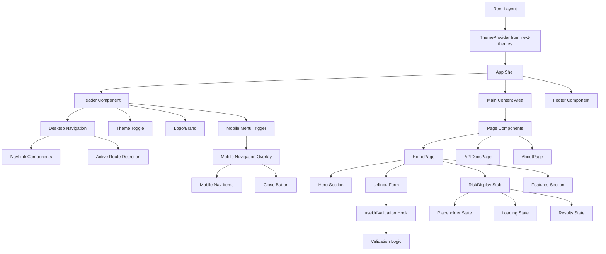
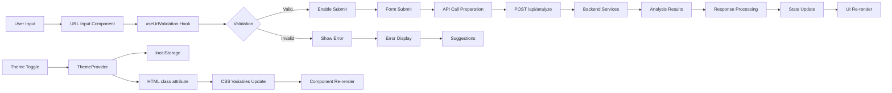
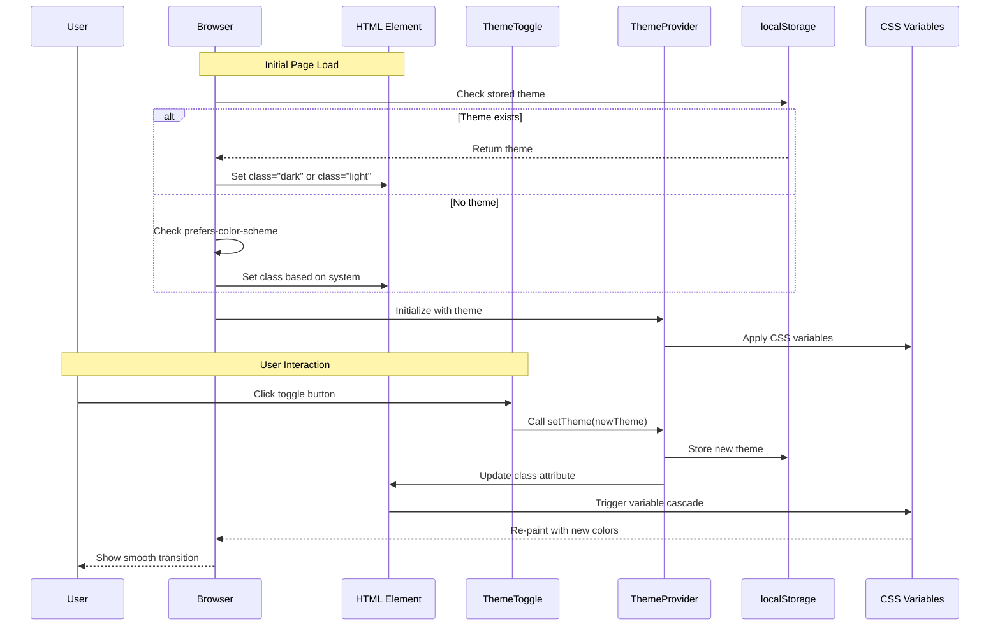
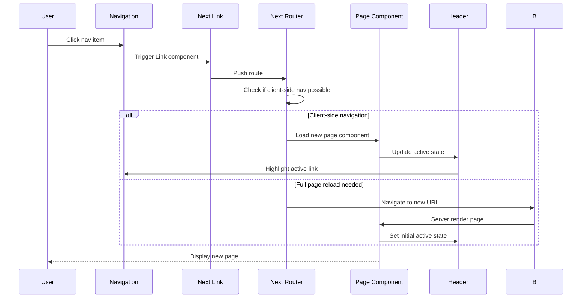
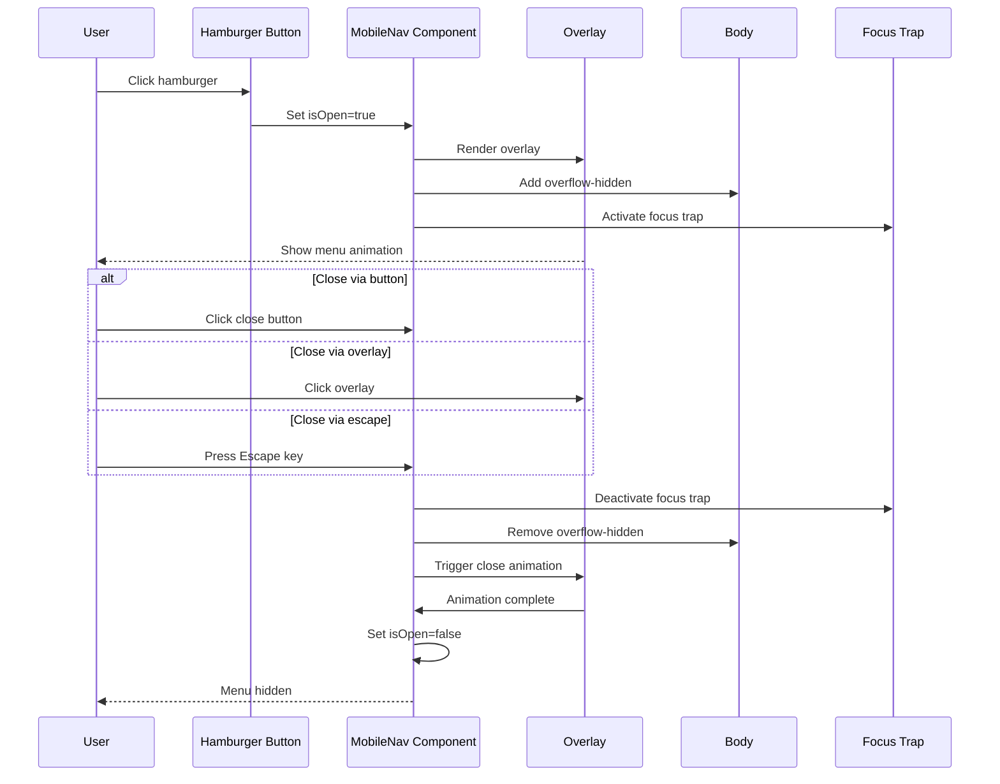
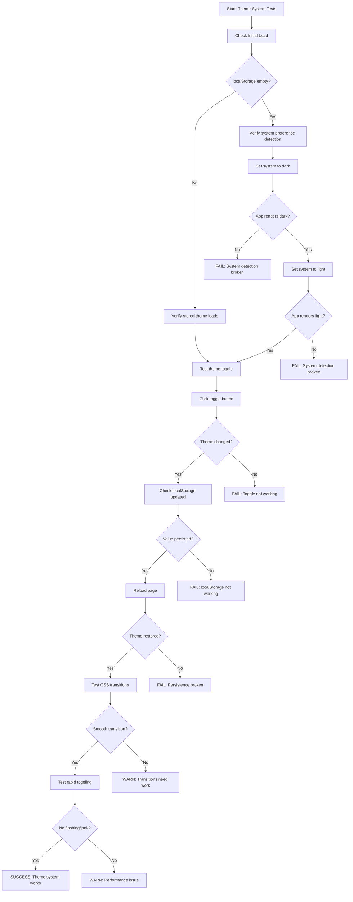
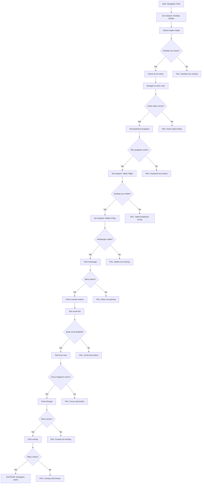
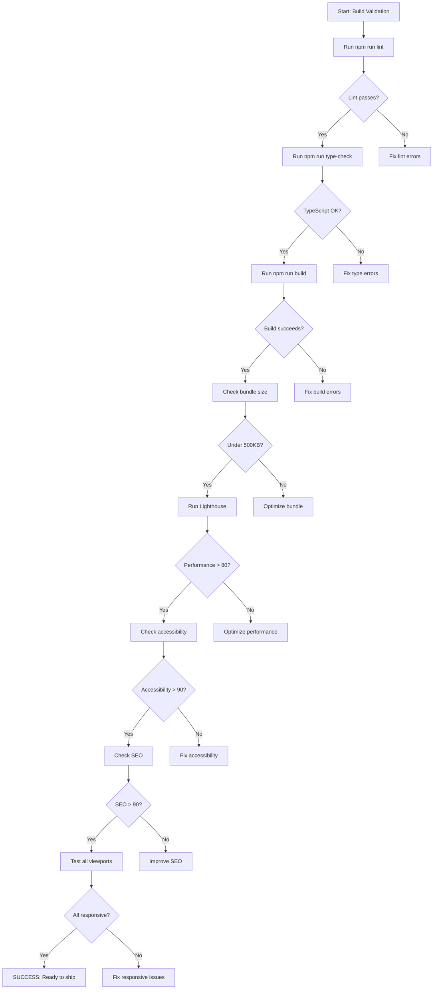

# Implementation Plan: Story 0-7 - Frontend UI Foundation Bootstrap

## Metadata
- **Story File**: story-3-2-frontend-ui-bootstrap.md
- **Created**: 2025-08-29
- **Last Updated**: 2025-08-29
- **BMad Version**: 1.0
- **Generated By**: Claude Opus 4.1

## Story Reference
Build a complete frontend UI foundation for the scam-checker application with responsive, accessible interface and consistent theming. The backend API is fully implemented, but the frontend UI layer is completely missing. This story creates all configuration files, layout structure, theme system, navigation, and stub components for future implementation.

## 1. Architectural Decisions

### 1.1 Configuration Stack
- **Next.js Config**: Use `next.config.ts` with TypeScript for type safety and better IDE support
- **Tailwind CSS v4**: Version 4.1.12 already installed, use CSS-in-JS approach with configuration
- **PostCSS**: Required for Tailwind processing with autoprefixer
- **shadcn/ui**: Component library built on Radix UI primitives for accessibility
- **next-themes**: For dark/light mode management with localStorage persistence (needs installation)
- **Rationale**: Leverages latest stable versions already in package.json, maintains consistency with existing TypeScript setup

### 1.2 Component Architecture
- **Atomic Design Pattern**: ui → layout → analysis components hierarchy for scalability
- **Server Components by Default**: All non-interactive components use RSC for performance
- **Client Components**: Only for interactive elements (theme toggle, forms, menus)
- **Type Safety**: Leverage existing comprehensive types from `/src/types/` directory
- **Rationale**: Aligns with Next.js 15 best practices, minimizes client bundle size

### 1.3 Theme Strategy  
- **CSS Variables**: Define colors in HSL format in `:root` and `.dark` classes
- **Color Palette**: HSL-based for easy theming and accessibility adjustments
- **Persistence**: localStorage via next-themes with SSR support
- **System Detection**: Respect user's OS preference as default
- **Rationale**: Industry standard approach, prevents flash of unstyled content

### 1.4 Library Selection Rationale
- **lucide-react**: Chosen for comprehensive icon set and tree-shaking support
- **clsx + tailwind-merge**: For efficient className merging without conflicts
- **framer-motion**: For smooth animations (optional enhancement)
- **@radix-ui/react-slot**: Foundation for shadcn components

## 2. Component Structure

### 2.1 Detailed File Organization
```
src/
├── app/
│   ├── layout.tsx              # Root layout with ThemeProvider, fonts, metadata
│   ├── page.tsx               # Homepage with hero section and URL input
│   ├── globals.css            # Tailwind directives and CSS variables
│   ├── loading.tsx            # Global loading state with spinner
│   ├── error.tsx              # Error boundary with reset capability
│   ├── not-found.tsx          # Custom 404 page
│   ├── api-docs/
│   │   └── page.tsx           # API documentation (stubbed with examples)
│   └── about/
│       └── page.tsx           # About page with project info
│
├── components/
│   ├── ui/                    # shadcn/ui components
│   │   ├── button.tsx         # Button with variants
│   │   ├── input.tsx          # Form input with validation states
│   │   ├── card.tsx           # Card container component
│   │   ├── badge.tsx          # Status badges
│   │   ├── tabs.tsx           # Tab navigation
│   │   ├── spinner.tsx        # Loading spinner
│   │   ├── toast.tsx          # Toast notifications
│   │   ├── dialog.tsx         # Modal dialogs
│   │   ├── dropdown-menu.tsx  # Dropdown menus
│   │   └── theme-toggle.tsx   # Dark/light mode toggle
│   │
│   ├── analysis/              # Analysis components (stubbed)
│   │   ├── url-input-form.tsx # URL input with validation
│   │   ├── risk-display.tsx   # Risk score visualization
│   │   ├── technical-details.tsx # Technical analysis display
│   │   └── explanation-panel.tsx # AI explanation display
│   │
│   └── layout/
│       ├── header.tsx         # Main navigation header
│       ├── footer.tsx         # Footer with links
│       ├── mobile-nav.tsx     # Mobile hamburger menu
│       └── navigation.tsx     # Shared nav logic and data
│
├── lib/
│   └── utils.ts               # cn() utility for className merging
│
└── providers/
    └── theme-provider.tsx     # Updated to use next-themes
```

### 2.2 Component Interface Definitions

```typescript
// Layout Component Interfaces
interface HeaderProps {
  className?: string
}

interface NavigationProps {
  items: NavItem[]
  className?: string
  orientation?: 'horizontal' | 'vertical'
}

interface NavItem {
  label: string
  href: string
  active?: boolean
  icon?: React.ComponentType
  external?: boolean
}

interface FooterProps {
  className?: string
}

interface MobileNavProps {
  items: NavItem[]
  isOpen: boolean
  onClose: () => void
}

// Theme Component Interfaces
interface ThemeToggleProps {
  className?: string
  showLabel?: boolean
}

// Analysis Component Interfaces (stubbed)
interface UrlInputFormProps {
  onSubmit?: (url: string) => Promise<void>
  disabled?: boolean
  initialValue?: string
  placeholder?: string
  className?: string
}

interface RiskDisplayProps {
  riskScore?: number
  riskLevel?: 'low' | 'medium' | 'high'
  loading?: boolean
  factors?: Array<{
    type: string
    score: number
    description: string
  }>
  className?: string
}

interface TechnicalDetailsProps {
  domainAge?: any // Use existing DomainAgeAnalysis type
  sslCertificate?: any // Use existing SSLCertificateAnalysis type
  reputation?: any // Use existing ReputationAnalysis type
  loading?: boolean
  className?: string
}

interface ExplanationPanelProps {
  aiAnalysis?: any // Use existing AIAnalysisResult type
  loading?: boolean
  className?: string
}
```

### 2.3 Module Boundaries and Responsibilities

- **UI Components**: Pure presentational, no business logic, accept all data via props
- **Layout Components**: Handle navigation state, responsive behavior, theme toggling
- **Analysis Components**: Connect to existing hooks (useUrlValidation), format API responses
- **Providers**: Manage global state (theme), wrap application root
- **Utils**: Pure functions for className merging, formatting, calculations

## 3. System Architecture Diagrams

### 3.1 Component Hierarchy and Dependencies


### 3.2 Data Flow and State Management


## 4. Interaction Sequence Diagrams

### 4.1 Complete Theme System Interaction


### 4.2 Navigation and Routing Flow


### 4.3 Mobile Menu Interaction


## 5. Implementation Pseudo-Code

### 5.1 Complete Theme System Implementation
```
FUNCTION implementThemeSystem()
    // Phase 1: Install dependencies
    EXECUTE npm install next-themes@^0.2.1
    EXECUTE npm install lucide-react@^0.344.0
    EXECUTE npm install clsx@^2.1.0 tailwind-merge@^2.2.1
    EXECUTE npm install @radix-ui/react-slot@^1.0.2
    
    // Phase 2: Create Tailwind configuration
    CREATE tailwind.config.ts WITH
        import type { Config } from 'tailwindcss'
        
        const config: Config = {
            darkMode: 'class',
            content: [
                './src/pages/**/*.{js,ts,jsx,tsx,mdx}',
                './src/components/**/*.{js,ts,jsx,tsx,mdx}',
                './src/app/**/*.{js,ts,jsx,tsx,mdx}',
            ],
            theme: {
                extend: {
                    colors: {
                        border: 'hsl(var(--border))',
                        input: 'hsl(var(--input))',
                        ring: 'hsl(var(--ring))',
                        background: 'hsl(var(--background))',
                        foreground: 'hsl(var(--foreground))',
                        primary: {
                            DEFAULT: 'hsl(var(--primary))',
                            foreground: 'hsl(var(--primary-foreground))',
                        },
                        secondary: {
                            DEFAULT: 'hsl(var(--secondary))',
                            foreground: 'hsl(var(--secondary-foreground))',
                        },
                        destructive: {
                            DEFAULT: 'hsl(var(--destructive))',
                            foreground: 'hsl(var(--destructive-foreground))',
                        },
                        muted: {
                            DEFAULT: 'hsl(var(--muted))',
                            foreground: 'hsl(var(--muted-foreground))',
                        },
                        accent: {
                            DEFAULT: 'hsl(var(--accent))',
                            foreground: 'hsl(var(--accent-foreground))',
                        },
                        popover: {
                            DEFAULT: 'hsl(var(--popover))',
                            foreground: 'hsl(var(--popover-foreground))',
                        },
                        card: {
                            DEFAULT: 'hsl(var(--card))',
                            foreground: 'hsl(var(--card-foreground))',
                        },
                    },
                    borderRadius: {
                        lg: 'var(--radius)',
                        md: 'calc(var(--radius) - 2px)',
                        sm: 'calc(var(--radius) - 4px)',
                    },
                    keyframes: {
                        'accordion-down': {
                            from: { height: '0' },
                            to: { height: 'var(--radix-accordion-content-height)' },
                        },
                        'accordion-up': {
                            from: { height: 'var(--radix-accordion-content-height)' },
                            to: { height: '0' },
                        },
                    },
                    animation: {
                        'accordion-down': 'accordion-down 0.2s ease-out',
                        'accordion-up': 'accordion-up 0.2s ease-out',
                    },
                },
            },
            plugins: [require('tailwindcss-animate')],
        }
        
        export default config
    
    // Phase 3: Create PostCSS configuration
    CREATE postcss.config.js WITH
        module.exports = {
            plugins: {
                tailwindcss: {},
                autoprefixer: {},
            },
        }
    
    // Phase 4: Setup global CSS with variables
    CREATE src/app/globals.css WITH
        @tailwind base;
        @tailwind components;
        @tailwind utilities;
        
        @layer base {
            :root {
                --background: 0 0% 100%;
                --foreground: 240 10% 3.9%;
                --card: 0 0% 100%;
                --card-foreground: 240 10% 3.9%;
                --popover: 0 0% 100%;
                --popover-foreground: 240 10% 3.9%;
                --primary: 240 5.9% 10%;
                --primary-foreground: 0 0% 98%;
                --secondary: 240 4.8% 95.9%;
                --secondary-foreground: 240 5.9% 10%;
                --muted: 240 4.8% 95.9%;
                --muted-foreground: 240 3.8% 46.1%;
                --accent: 240 4.8% 95.9%;
                --accent-foreground: 240 5.9% 10%;
                --destructive: 0 84.2% 60.2%;
                --destructive-foreground: 0 0% 98%;
                --border: 240 5.9% 90%;
                --input: 240 5.9% 90%;
                --ring: 240 5.9% 10%;
                --radius: 0.5rem;
            }
            
            .dark {
                --background: 240 10% 3.9%;
                --foreground: 0 0% 98%;
                --card: 240 10% 3.9%;
                --card-foreground: 0 0% 98%;
                --popover: 240 10% 3.9%;
                --popover-foreground: 0 0% 98%;
                --primary: 0 0% 98%;
                --primary-foreground: 240 5.9% 10%;
                --secondary: 240 3.7% 15.9%;
                --secondary-foreground: 0 0% 98%;
                --muted: 240 3.7% 15.9%;
                --muted-foreground: 240 5% 64.9%;
                --accent: 240 3.7% 15.9%;
                --accent-foreground: 0 0% 98%;
                --destructive: 0 62.8% 30.6%;
                --destructive-foreground: 0 0% 98%;
                --border: 240 3.7% 15.9%;
                --input: 240 3.7% 15.9%;
                --ring: 240 4.9% 83.9%;
            }
        }
        
        @layer base {
            * {
                @apply border-border;
            }
            body {
                @apply bg-background text-foreground;
            }
        }
    
    // Phase 5: Update theme provider
    UPDATE src/providers/theme-provider.tsx TO
        Support next-themes with proper typing
        Add suppressHydrationWarning
        Configure attribute="class"
        Set enableSystem=true
END FUNCTION
```

### 5.2 Component Creation Algorithm
```
FUNCTION createUIComponent(componentName, componentType)
    // Determine component requirements
    isInteractive = componentType IN ['form', 'toggle', 'menu', 'modal']
    needsState = componentType IN ['form', 'toggle', 'menu']
    needsAnimation = componentType IN ['modal', 'menu', 'accordion']
    
    // Build imports
    imports = []
    IF isInteractive THEN
        imports.ADD("'use client'")
    END IF
    
    IF needsState THEN
        imports.ADD("import { useState, useEffect } from 'react'")
    END IF
    
    IF componentType == 'form' THEN
        imports.ADD("import { useUrlValidation } from '@/hooks/useUrlValidation'")
    END IF
    
    IF needsAnimation THEN
        imports.ADD("import { motion, AnimatePresence } from 'framer-motion'")
    END IF
    
    imports.ADD("import { cn } from '@/lib/utils'")
    
    // Generate TypeScript interface
    interface = `
        interface ${componentName}Props {
            className?: string
            children?: React.ReactNode
            ${additionalProps}
        }
    `
    
    // Generate component
    componentBody = `
        export function ${componentName}({
            className,
            children,
            ...props
        }: ${componentName}Props) {
            ${needsState ? generateStateLogic() : ''}
            
            return (
                <div className={cn('default-classes', className)} {...props}>
                    {children}
                </div>
            )
        }
    `
    
    // Add display name for debugging
    displayName = `${componentName}.displayName = '${componentName}'`
    
    // Write file
    filePath = `src/components/${componentType}/${componentName}.tsx`
    CREATE filePath WITH
        imports.join('\n')
        interface
        componentBody
        displayName
    
    RETURN filePath
END FUNCTION
```

### 5.3 Navigation Implementation Logic
```
FUNCTION implementNavigation()
    // Define navigation structure
    navItems = [
        { label: 'Home', href: '/', icon: 'Home' },
        { label: 'API Docs', href: '/api-docs', icon: 'FileText' },
        { label: 'About', href: '/about', icon: 'Info' }
    ]
    
    // Create desktop navigation
    FUNCTION createDesktopNav()
        FOR EACH item IN navItems
            CREATE NavLink WITH
                href={item.href}
                className={cn(
                    'nav-link',
                    isActive ? 'active' : 'inactive'
                )}
                Use Next.js Link component
                Add hover and focus states
        END FOR
    END FUNCTION
    
    // Create mobile navigation
    FUNCTION createMobileNav()
        state = { isOpen: false }
        
        ON hamburgerClick
            state.isOpen = !state.isOpen
            IF state.isOpen THEN
                document.body.style.overflow = 'hidden'
                trapFocus(mobileMenuRef)
            ELSE
                document.body.style.overflow = 'unset'
                releaseFocus()
            END IF
        
        ON escapeKey
            IF state.isOpen THEN
                state.isOpen = false
                releaseFocus()
            END IF
        
        RENDER
            Hamburger button (always visible on mobile)
            IF state.isOpen THEN
                Overlay (click to close)
                Menu panel with animation
                Close button
                Navigation items (vertical)
            END IF
    END FUNCTION
    
    // Responsive logic
    FUNCTION handleResponsive()
        IF viewport < 768px THEN
            SHOW mobileNav
            HIDE desktopNav
        ELSE
            SHOW desktopNav
            HIDE mobileNav
        END IF
    END FUNCTION
END FUNCTION
```

## 6. Test Scenario Diagrams

### 6.1 Comprehensive Theme Testing Flow


### 6.2 Navigation and Responsive Testing


### 6.3 Build and Performance Validation


## 7. Code Patterns & Conventions

### 7.1 Established Patterns to Follow

```typescript
// Pattern 1: Use existing validation hook pattern
import { useUrlValidation } from '@/hooks/useUrlValidation'

function UrlInputForm() {
  const {
    url,
    setUrl,
    errors,
    isValid,
    validate,
    clearErrors
  } = useUrlValidation()
  
  // Use existing validation logic
}

// Pattern 2: Import types from centralized location
import type { 
  DomainAgeAnalysis,
  ReputationAnalysis,
  SSLCertificateAnalysis,
  AIAnalysisResult 
} from '@/types'

// Pattern 3: Use existing logger pattern
import { ServiceBuilder } from '@/lib/services/service-builder'

const services = new ServiceBuilder()
  .withEnvironment('development')
  .withDefaults()
  .build()

// Pattern 4: Follow API error structure
interface APIError {
  success: false
  error: string
  message: string
  details?: Array<{
    field: string
    message: string
    code: string
  }>
  timestamp: string
}
```

### 7.2 New Component Patterns to Establish

```typescript
// Pattern 1: Server Component (default)
// File: src/components/layout/header.tsx
import Link from 'next/link'
import { Navigation } from './navigation'
import { ThemeToggle } from '@/components/ui/theme-toggle'

export function Header() {
  // No 'use client', no hooks
  return (
    <header className="border-b">
      <div className="container mx-auto px-4">
        <Navigation />
        <ThemeToggle />
      </div>
    </header>
  )
}

// Pattern 2: Client Component (interactive)
// File: src/components/ui/theme-toggle.tsx
'use client'

import { useTheme } from 'next-themes'
import { Moon, Sun } from 'lucide-react'
import { Button } from './button'

export function ThemeToggle() {
  const { theme, setTheme } = useTheme()
  
  return (
    <Button
      variant="ghost"
      size="icon"
      onClick={() => setTheme(theme === 'dark' ? 'light' : 'dark')}
    >
      <Sun className="h-5 w-5 rotate-0 scale-100 transition-all dark:-rotate-90 dark:scale-0" />
      <Moon className="absolute h-5 w-5 rotate-90 scale-0 transition-all dark:rotate-0 dark:scale-100" />
      <span className="sr-only">Toggle theme</span>
    </Button>
  )
}

// Pattern 3: Utility function (cn)
// File: src/lib/utils.ts
import { clsx, type ClassValue } from 'clsx'
import { twMerge } from 'tailwind-merge'

export function cn(...inputs: ClassValue[]) {
  return twMerge(clsx(inputs))
}

// Pattern 4: Component with variants
// File: src/components/ui/button.tsx
import { cva, type VariantProps } from 'class-variance-authority'

const buttonVariants = cva(
  'inline-flex items-center justify-center rounded-md text-sm font-medium transition-colors',
  {
    variants: {
      variant: {
        default: 'bg-primary text-primary-foreground hover:bg-primary/90',
        destructive: 'bg-destructive text-destructive-foreground hover:bg-destructive/90',
        outline: 'border border-input bg-background hover:bg-accent',
        secondary: 'bg-secondary text-secondary-foreground hover:bg-secondary/80',
        ghost: 'hover:bg-accent hover:text-accent-foreground',
        link: 'text-primary underline-offset-4 hover:underline',
      },
      size: {
        default: 'h-10 px-4 py-2',
        sm: 'h-9 rounded-md px-3',
        lg: 'h-11 rounded-md px-8',
        icon: 'h-10 w-10',
      },
    },
    defaultVariants: {
      variant: 'default',
      size: 'default',
    },
  }
)
```

## 8. Potential Pitfalls & Mitigation Strategies

### 8.1 React 19 Compatibility Issues
**Risk**: Some UI libraries may not be fully compatible with React 19
**Detection**: Component errors, hydration mismatches, unexpected behavior
**Mitigation**:
1. Use latest versions of all dependencies
2. Test each shadcn component after installation
3. If component fails, implement custom version
4. Use `suppressHydrationWarning` where necessary
5. Fallback plan: Downgrade to React 18 if critical issues

### 8.2 Tailwind CSS v4 Breaking Changes
**Risk**: Different syntax or removed utilities from v3
**Detection**: Styles not applying, build warnings
**Mitigation**:
1. Use CSS-in-JS approach for complex styles
2. Avoid deprecated utility classes
3. Test styles after each component creation
4. Use PostCSS for any custom transformations
5. Keep tailwind.config.ts minimal and explicit

### 8.3 Dark Mode Flash on Load
**Risk**: White flash before theme loads (FOUC)
**Detection**: Visible flash when refreshing in dark mode
**Mitigation**:
1. Add blocking script in `app/layout.tsx` head:
```javascript
<script
  dangerouslySetInnerHTML={{
    __html: `
      try {
        if (localStorage.theme === 'dark' || (!('theme' in localStorage) && window.matchMedia('(prefers-color-scheme: dark)').matches)) {
          document.documentElement.classList.add('dark')
        } else {
          document.documentElement.classList.remove('dark')
        }
      } catch {}
    `,
  }}
/>
```
2. Use `suppressHydrationWarning` on html element
3. Initialize theme before React hydration
4. Use CSS transitions for smooth changes

### 8.4 Missing Next.js Configuration
**Risk**: Build failures due to missing config files
**Detection**: `next dev` or `next build` fails
**Mitigation**:
1. Create all config files before components
2. Start with minimal config, add as needed
3. Verify each config with `npm run dev`
4. Check TypeScript path resolution
5. Test build after major changes

### 8.5 shadcn/ui Installation Issues
**Risk**: Components may not install correctly
**Detection**: Missing dependencies, import errors
**Mitigation**:
1. Run `npx shadcn@latest init` first
2. Install components one at a time
3. Verify each component renders correctly
4. Manually install any missing peer deps
5. Check components.json configuration

### 8.6 Mobile Navigation Focus Trap
**Risk**: Users can tab out of mobile menu
**Detection**: Tab key escapes menu overlay
**Mitigation**:
1. Implement proper focus trap logic
2. Store last focused element
3. Restore focus on close
4. Handle edge cases (no focusable elements)
5. Test with screen readers

### 8.7 TypeScript Strict Mode Issues
**Risk**: Type errors preventing build
**Detection**: `npm run type-check` fails
**Mitigation**:
1. Use proper type imports from `/src/types`
2. Add type annotations to all props
3. Use `satisfies` operator for complex types
4. Avoid `any` type, use `unknown` if needed
5. Fix types incrementally, don't ignore

## 9. Step-by-Step Implementation Checklist

### Phase 1: Configuration Setup (30 minutes)
- [ ] Install missing dependencies:
  - [ ] `npm install next-themes@^0.2.1`
  - [ ] `npm install lucide-react@^0.344.0`
  - [ ] `npm install clsx@^2.1.0 tailwind-merge@^2.2.1`
  - [ ] `npm install @radix-ui/react-slot@^1.0.2`
  - [ ] `npm install framer-motion@^11.0.0` (optional)
- [ ] Create `next.config.ts` with TypeScript support
- [ ] Create `tailwind.config.ts` with theme configuration
- [ ] Create `postcss.config.js` with plugins
- [ ] Create `components.json` for shadcn configuration
- [ ] Run `npx shadcn@latest init` to initialize

### Phase 2: Foundation Setup (45 minutes)
- [ ] Create `src/app/globals.css` with CSS variables
- [ ] Create `src/lib/utils.ts` with cn() helper
- [ ] Update `src/providers/theme-provider.tsx` for next-themes
- [ ] Create `src/app/layout.tsx` with root layout
- [ ] Create `src/app/page.tsx` with basic homepage
- [ ] Verify `npm run dev` works

### Phase 3: Component Installation (45 minutes)
- [ ] Install shadcn components:
  - [ ] `npx shadcn@latest add button`
  - [ ] `npx shadcn@latest add input`
  - [ ] `npx shadcn@latest add card`
  - [ ] `npx shadcn@latest add badge`
  - [ ] `npx shadcn@latest add tabs`
  - [ ] `npx shadcn@latest add dialog`
  - [ ] `npx shadcn@latest add dropdown-menu`
  - [ ] `npx shadcn@latest add toast`
- [ ] Create `src/components/ui/spinner.tsx`
- [ ] Create `src/components/ui/theme-toggle.tsx`
- [ ] Create `src/components/layout/header.tsx`
- [ ] Create `src/components/layout/footer.tsx`
- [ ] Create `src/components/layout/navigation.tsx`
- [ ] Create `src/components/layout/mobile-nav.tsx`

### Phase 4: Pages and Stubs (30 minutes)
- [ ] Create `src/app/api-docs/page.tsx` (stubbed)
- [ ] Create `src/app/about/page.tsx` with content
- [ ] Create `src/app/error.tsx` error boundary
- [ ] Create `src/app/loading.tsx` loading state
- [ ] Create `src/app/not-found.tsx` 404 page
- [ ] Stub analysis components:
  - [ ] `src/components/analysis/url-input-form.tsx`
  - [ ] `src/components/analysis/risk-display.tsx`
  - [ ] `src/components/analysis/technical-details.tsx`
  - [ ] `src/components/analysis/explanation-panel.tsx`

### Phase 5: Validation and Testing (30 minutes)
- [ ] Run `npm run lint` and fix any issues
- [ ] Run `npm run type-check` and fix errors
- [ ] Run `npm run build` to verify build
- [ ] Test responsive design at breakpoints:
  - [ ] Mobile: 375px, 414px
  - [ ] Tablet: 768px, 1024px
  - [ ] Desktop: 1440px, 1920px
- [ ] Verify theme toggle and persistence
- [ ] Test keyboard navigation
- [ ] Check accessibility with axe DevTools
- [ ] Run Lighthouse audit
- [ ] Update story file with completion

## Implementation Status
- [ ] Planning Complete
- [ ] Architecture Decisions Implemented
- [ ] Component Structure Built
- [ ] Integration Points Connected
- [ ] Testing Complete
- [ ] Story Acceptance Criteria Met