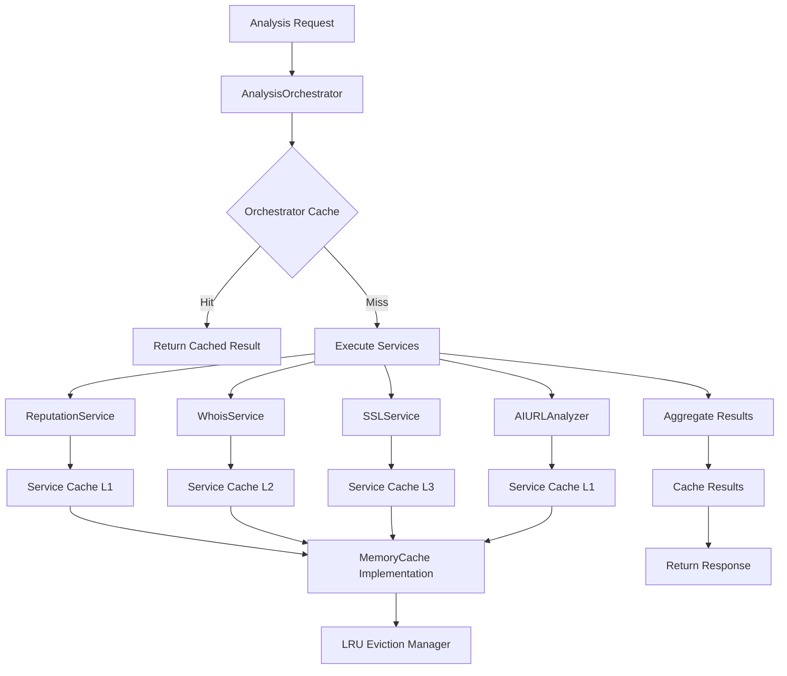
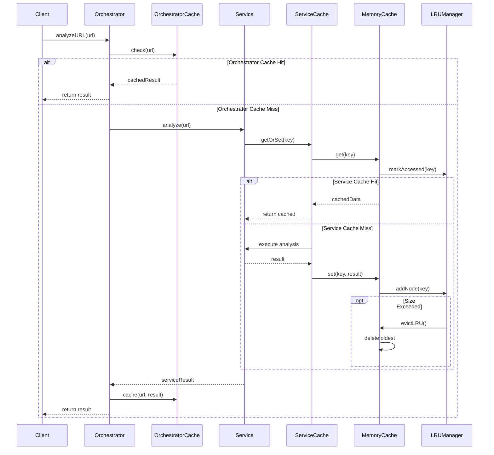
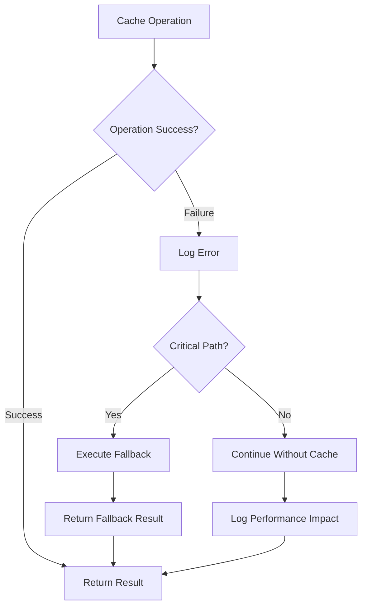

# Implementation Plan: Story 1-5 - Caching & Performance Layer

## Metadata
- **Story File**: story-1-5-caching-performance-layer.md
- **Created**: 2025-01-29
- **Last Updated**: 2025-01-29
- **BMad Version**: Core
- **Generated By**: Claude Opus 4.1

## Story Reference

This plan implements intelligent caching and performance optimization for API results across all Epic 1 stories (URL validation, WHOIS, SSL, reputation APIs). The system will provide fast responses while minimizing external API costs and respecting rate limits through a multi-layer caching architecture.

## 1. Architectural Decisions

### Cache Implementation Strategy
- **Primary Implementation**: `MemoryCache` class implementing `CacheInterface` with LRU eviction
- **Rationale**: The codebase already has `NoOpCache` and `CacheManager` abstractions established. We need to create a real implementation that plugs into this existing architecture while providing genuine caching capabilities
- **Pattern**: Adapter pattern - `MemoryCache` will adapt a JavaScript Map to the existing `CacheInterface`
- **Future Scaling**: Architecture designed to support Redis replacement without API changes

### Cache Hierarchy Design
1. **L1 Cache**: Full URL analysis results (4-hour TTL, highest value operations)
2. **L2 Cache**: Domain-level data (24-hour TTL for WHOIS, 6-hour for reputation)  
3. **L3 Cache**: SSL certificate data (12-hour TTL, intermediate update frequency)

### Library and Framework Choices
- **Core Implementation**: Native JavaScript Map with custom LRU logic
- **Rationale**: Zero external dependencies, predictable memory usage, O(1) operations
- **Memory Management**: Custom memory tracking using JSON.stringify size estimation
- **Eviction Strategy**: Doubly-linked list for O(1) LRU operations

### Module Organization Strategy
```
src/lib/cache/
├── memory-cache.ts          # Main MemoryCache implementation
├── lru-manager.ts           # LRU eviction logic
├── cache-config.ts          # Configuration management
├── cache-stats.ts           # Statistics and monitoring
├── cache-manager.ts         # Enhanced existing manager
└── index.ts                 # Exports
```

### Integration Points
- **Service Factory**: Add cache injection to service creation methods
- **Analysis Orchestrator**: Implement result-level caching for complete analyses
- **Individual Services**: Services already use `CacheManager`, need real cache implementation
- **Configuration System**: Environment-specific cache settings through existing config pattern

## 2. Component Structure

### Component Relationship Mapping


### Interface and Type Definitions

**CacheEntry Enhancement**:
```typescript
interface CacheEntry<T> {
  data: T
  expiresAt: number
  createdAt: number
  size: number          // Memory usage estimation
  accessCount: number   // Hit frequency tracking
  lastAccessed: number  // LRU tracking
}
```

**LRU Node Structure**:
```typescript
interface LRUNode {
  key: string
  prev: LRUNode | null
  next: LRUNode | null
}
```

**Cache Configuration Types**:
```typescript
interface CacheLayerConfig {
  memory: {
    maxSizeMB: number
    evictionThreshold: number
  }
  layers: Record<string, {
    ttl: number
    maxEntries: number
  }>
  warming: {
    enabled: boolean
    popularDomains: string[]
  }
}
```

### Dependency Management
- **CacheManager → MemoryCache**: Composition relationship
- **MemoryCache → LRUManager**: Dependency injection of eviction strategy
- **ServiceFactory → CacheManager**: Factory creates instances with MemoryCache
- **Services → CacheManager**: Existing dependency pattern maintained

## 3. Data Flow Strategy

### Cache Operation Sequence


### Cache Key Generation Strategy
- **URL Analysis**: `url:${normalizedURL}:${hash(analysisTypes)}`
- **Domain Data**: `domain:${domain}:${dataType}:${version}`
- **Reputation**: `reputation:${url}:${provider}:${timestamp}`
- **SSL Certs**: `ssl:${domain}:${port}:${protocol}`

### Memory Management Patterns
1. **Proactive Eviction**: Remove expired entries during get operations
2. **Size-based Eviction**: LRU removal when memory threshold exceeded
3. **Background Cleanup**: Periodic sweep for expired entries
4. **Memory Estimation**: JSON.stringify length × 2 for object overhead

## 4. Integration Points

### Service Factory Integration
**File**: `src/lib/services/service-factory.ts`

```typescript
// Add to ServiceFactory class
static createMemoryCache<T>(options: CacheOptions): CacheManager<T> {
  const memoryCache = new MemoryCache<CacheEntry<T>>(options)
  return new CacheManager<T>(options, memoryCache)
}

static createAnalysisServices(config?: ServicesConfig): AnalysisServices {
  const reputationCache = this.createMemoryCache({
    prefix: 'reputation',
    ttl: 24 * 60 * 60 * 1000,
    maxSize: 1000
  })
  
  return {
    reputation: this.createReputationService(config?.reputation),
    // ... other services
  }
}
```

### Analysis Orchestrator Integration
**Enhancement to**: `src/lib/orchestration/analysis-orchestrator.ts`

```typescript
export class AnalysisOrchestrator {
  private orchestratorCache: CacheManager<OrchestrationResult>
  
  constructor(config?: OrchestrationConfig) {
    // Add orchestrator-level caching
    this.orchestratorCache = ServiceFactory.createMemoryCache({
      prefix: 'orchestrator',
      ttl: config?.caching?.cacheTtl || 4 * 60 * 60 * 1000,
      maxSize: 500
    })
  }
}
```

### Error Handling Strategy
1. **Cache Failures**: Graceful degradation to direct API calls
2. **Memory Overflow**: Emergency cleanup and service degradation alerts
3. **Corruption Detection**: Validate cache entries before returning
4. **Service Integration**: Maintain existing error handling patterns

## 5. Error Handling Strategy

### Cache Operation Failures


### Memory Management Error Scenarios
- **Out of Memory**: Emergency eviction of 25% oldest entries
- **Corrupted Entries**: Remove corrupted entry, log warning, continue
- **Eviction Failures**: Disable caching temporarily, alert operations
- **Size Calculation Errors**: Use conservative size estimates, continue operation

## 6. Test Strategy

### Unit Test Coverage
```mermaid
graph TD
    A[MemoryCache Tests] --> B[Basic Operations]
    B --> B1[get/set/delete operations]
    B --> B2[TTL expiration behavior]
    B --> B3[has/clear/size methods]
    
    A --> C[LRU Eviction Tests]
    C --> C1[Evict on size limit]
    C --> C2[Access order tracking]
    C --> C3[Memory calculations]
    
    A --> D[Edge Cases]
    D --> D1[Concurrent access patterns]
    D --> D2[Memory overflow scenarios]
    D --> D3[Invalid data handling]
    
    A --> E[Performance Tests]
    E --> E1[O(1) operation verification]
    E --> E2[Memory efficiency under load]
    E --> E3[High concurrency scenarios]
```

### Integration Test Scenarios
1. **Service Integration**: Each service type with real cache implementation
2. **TTL Behavior**: Verify different TTL configurations per service
3. **Statistics Aggregation**: Cache hit rates and memory usage tracking
4. **Failure Recovery**: Cache failures don't break service functionality

### Test Data Fixtures
```typescript
const TEST_CACHE_CONFIG = {
  memory: { maxSizeMB: 10, evictionThreshold: 0.8 },
  layers: {
    l1: { ttl: 1000, maxEntries: 100 },
    l2: { ttl: 2000, maxEntries: 50 },
    l3: { ttl: 1500, maxEntries: 75 }
  }
}

const MOCK_ANALYSIS_RESULTS = [
  { url: 'example.com', riskScore: 25, cached: true },
  { url: 'malicious.example', riskScore: 95, cached: false }
]
```

### Performance Test Requirements
- Cache operations complete within 5ms
- Hit rate exceeds 60% for repeated analyses
- Memory usage grows predictably
- No memory leaks during 24-hour stress test

## 7. Step-by-Step Implementation

### Phase 1: Core Cache Implementation (2-3 hours)

#### Task 1.1: Create LRU Manager
**File**: `src/lib/cache/lru-manager.ts`
```typescript
export class LRUManager {
  private head: LRUNode | null = null
  private tail: LRUNode | null = null
  private nodes: Map<string, LRUNode> = new Map()
  
  // O(1) operations for add, remove, moveToHead
}
```

#### Task 1.2: Create MemoryCache Implementation  
**File**: `src/lib/cache/memory-cache.ts`
```typescript
export class MemoryCache<T> implements CacheInterface<T> {
  private storage: Map<string, CacheEntry<T>>
  private lruManager: LRUManager
  private memoryUsage: number = 0
  
  // Implement all CacheInterface methods
}
```

#### Task 1.3: Create Cache Configuration
**File**: `src/lib/cache/cache-config.ts`
```typescript
export class CacheConfig {
  static getDefaultConfig(): CacheLayerConfig
  static getEnvironmentConfig(env: string): CacheLayerConfig
  static validateConfig(config: CacheLayerConfig): boolean
}
```

### Phase 2: Service Integration (2-3 hours)

#### Task 2.1: Enhance CacheManager
**File**: `src/lib/cache/cache-manager.ts` (modify existing)
- Add memory usage tracking methods
- Implement background cleanup scheduling
- Add cache warming functionality
- Enhanced statistics collection

#### Task 2.2: Update ServiceFactory
**File**: `src/lib/services/service-factory.ts` (modify existing)
- Add `createMemoryCache()` method
- Update service creation to inject MemoryCache
- Add environment-specific cache configuration

#### Task 2.3: Add Orchestrator Caching
**File**: `src/lib/orchestration/analysis-orchestrator.ts` (modify existing)
- Add orchestrator-level cache for complete analysis results
- Implement cache key generation for URL analysis
- Add cache statistics to orchestration metrics

### Phase 3: Monitoring and Performance (1-2 hours)

#### Task 3.1: Add Cache Statistics
**File**: `src/lib/cache/cache-stats.ts`
```typescript
export class CacheStatistics {
  collectStats(): CacheMetrics
  trackHitRate(service: string, hit: boolean): void
  trackMemoryUsage(bytes: number): void
  getPerformanceReport(): PerformanceReport
}
```

#### Task 3.2: Implement Cache Warming
**File**: `src/lib/cache/cache-warming.ts`
```typescript
export class CacheWarming {
  async warmPopularDomains(domains: string[]): Promise<void>
  async scheduleBackgroundRefresh(): Promise<void>
  async preloadCriticalData(): Promise<void>
}
```

### Phase 4: Testing and Validation (2-3 hours)

#### Task 4.1: Unit Tests
- **File**: `tests/unit/lib/cache/memory-cache.test.ts`
- **File**: `tests/unit/lib/cache/lru-manager.test.ts`
- **File**: `tests/unit/lib/cache/cache-config.test.ts`

#### Task 4.2: Integration Tests
- **File**: `tests/integration/cache-service-integration.test.ts`
- **File**: `tests/integration/orchestrator-cache.test.ts`

#### Task 4.3: Performance Tests
- **File**: `tests/performance/cache-benchmark.test.ts`
- **File**: `tests/performance/memory-stress.test.ts`

### Phase 5: Final Integration and Documentation (1 hour)

#### Task 5.1: Update Exports
**File**: `src/lib/cache/index.ts`
```typescript
export { MemoryCache } from './memory-cache'
export { LRUManager } from './lru-manager'
export { CacheConfig } from './cache-config'
export { CacheStatistics } from './cache-stats'
// ... existing exports
```

#### Task 5.2: Configuration Documentation
**File**: Update existing documentation with cache configuration options

## 8. Implementation Pseudo-Code

### Core MemoryCache Implementation
```
CLASS MemoryCache IMPLEMENTS CacheInterface
    PRIVATE storage: Map<string, CacheEntry>
    PRIVATE lruManager: LRUManager
    PRIVATE memoryUsage: number
    PRIVATE maxMemory: number
    PRIVATE config: CacheConfig
    
    FUNCTION get(key: string): Promise<T | null>
        entry = storage.get(key)
        IF entry IS NULL
            RETURN null
        END IF
        
        // Check TTL expiration
        IF entry.expiresAt < getCurrentTime()
            storage.delete(key)
            lruManager.remove(key)
            memoryUsage -= entry.size
            updateStats(MISS)
            RETURN null
        END IF
        
        // Update LRU tracking
        lruManager.markAccessed(key)
        entry.lastAccessed = getCurrentTime()
        entry.accessCount++
        updateStats(HIT)
        
        RETURN entry.data
    END FUNCTION
    
    FUNCTION set(key: string, value: T, ttl?: number): Promise<void>
        estimatedSize = calculateMemorySize(value)
        actualTtl = ttl OR config.defaultTtl
        
        // Ensure memory capacity
        WHILE memoryUsage + estimatedSize > maxMemory
            evictedKey = lruManager.getLeastRecentlyUsed()
            IF evictedKey IS NULL
                THROW Error("Cannot evict, cache is corrupted")
            END IF
            
            evictedEntry = storage.get(evictedKey)
            storage.delete(evictedKey)
            lruManager.remove(evictedKey)
            memoryUsage -= evictedEntry.size
            logEviction(evictedKey)
        END WHILE
        
        // Create cache entry
        entry = {
            data: value,
            expiresAt: getCurrentTime() + actualTtl,
            createdAt: getCurrentTime(),
            size: estimatedSize,
            accessCount: 1,
            lastAccessed: getCurrentTime()
        }
        
        // Handle existing key replacement
        IF storage.has(key)
            oldEntry = storage.get(key)
            memoryUsage -= oldEntry.size
            lruManager.remove(key)
        END IF
        
        // Store new entry
        storage.set(key, entry)
        lruManager.addMostRecentlyUsed(key)
        memoryUsage += estimatedSize
        updateStats(SET)
    END FUNCTION
    
    FUNCTION cleanup(): Promise<number>
        cleanedCount = 0
        currentTime = getCurrentTime()
        
        FOR EACH key, entry IN storage
            IF entry.expiresAt < currentTime
                storage.delete(key)
                lruManager.remove(key)
                memoryUsage -= entry.size
                cleanedCount++
            END IF
        END FOR
        
        RETURN cleanedCount
    END FUNCTION
END CLASS
```

### LRU Manager Implementation
```
CLASS LRUManager
    PRIVATE head: LRUNode
    PRIVATE tail: LRUNode
    PRIVATE nodeMap: Map<string, LRUNode>
    
    CONSTRUCTOR()
        head = createSentinelNode()
        tail = createSentinelNode()
        head.next = tail
        tail.prev = head
    END CONSTRUCTOR
    
    FUNCTION addMostRecentlyUsed(key: string): void
        IF nodeMap.has(key)
            moveToHead(nodeMap.get(key))
            RETURN
        END IF
        
        newNode = createNode(key)
        nodeMap.set(key, newNode)
        addToHead(newNode)
    END FUNCTION
    
    FUNCTION markAccessed(key: string): void
        IF nodeMap.has(key)
            node = nodeMap.get(key)
            moveToHead(node)
        END IF
    END FUNCTION
    
    FUNCTION getLeastRecentlyUsed(): string | null
        IF tail.prev === head
            RETURN null
        END IF
        
        lruNode = tail.prev
        RETURN lruNode.key
    END FUNCTION
    
    FUNCTION remove(key: string): boolean
        IF NOT nodeMap.has(key)
            RETURN false
        END IF
        
        node = nodeMap.get(key)
        removeNode(node)
        nodeMap.delete(key)
        RETURN true
    END FUNCTION
    
    PRIVATE FUNCTION moveToHead(node: LRUNode): void
        removeNode(node)
        addToHead(node)
    END FUNCTION
    
    PRIVATE FUNCTION addToHead(node: LRUNode): void
        node.next = head.next
        node.prev = head
        head.next.prev = node
        head.next = node
    END FUNCTION
    
    PRIVATE FUNCTION removeNode(node: LRUNode): void
        node.prev.next = node.next
        node.next.prev = node.prev
    END FUNCTION
END CLASS
```

### Cache Warming Implementation
```
FUNCTION warmCache(popularUrls: string[]): Promise<void>
    warmingTasks = []
    
    FOR EACH url IN popularUrls
        task = ASYNC FUNCTION()
            cacheKey = buildCacheKey(url)
            existing = await cache.get(cacheKey)
            
            IF existing IS NULL OR isNearExpiry(existing, 0.2)
                TRY
                    result = await performAnalysis(url)
                    await cache.set(cacheKey, result)
                    logCacheWarming(url, SUCCESS)
                CATCH error
                    logCacheWarming(url, FAILED, error)
                END TRY
            END IF
        END ASYNC FUNCTION
        
        warmingTasks.push(task)
    END FOR
    
    // Execute with concurrency limit
    await executeWithConcurrency(warmingTasks, MAX_CONCURRENT_WARMING)
END FUNCTION

FUNCTION scheduleBackgroundRefresh(): void
    setInterval(ASYNC FUNCTION()
        popularDomains = await getPopularDomains()
        await warmCache(popularDomains)
        
        cleanedCount = await cache.cleanup()
        logCleanup(cleanedCount)
        
        cacheStats = cache.getStatistics()
        logCacheStatistics(cacheStats)
    END ASYNC FUNCTION, REFRESH_INTERVAL)
END FUNCTION
```

## 9. Code Patterns and Conventions

### Existing Pattern Adoption
- **Error Handling**: Follow existing service error handling pattern with try-catch and logger
- **Async Operations**: Use existing async/await patterns throughout codebase
- **Type Safety**: Maintain strict TypeScript typing with shared types in `/shared/types`
- **Configuration**: Follow existing environment-based configuration pattern
- **Logging**: Use existing Logger class for all cache-related logging

### Reusable Components
- **CacheInterface**: Already defined, maintain compatibility
- **Logger**: Reuse existing logger instance for consistency
- **ServiceFactory**: Extend existing factory pattern for cache creation
- **Configuration**: Integrate with existing config management system

### Naming Conventions
- **Classes**: PascalCase (MemoryCache, LRUManager)
- **Methods**: camelCase (getOrSet, markAccessed)
- **Interfaces**: PascalCase with descriptive suffixes (CacheStatistics)
- **Constants**: UPPER_SNAKE_CASE (MAX_MEMORY_SIZE, DEFAULT_TTL)

## 10. Potential Pitfalls and Mitigation

### Technical Risks

#### Memory Leak Prevention
- **Pitfall**: Unbounded memory growth from Map retention
- **Mitigation**: Implement hard memory limits with aggressive LRU eviction
- **Monitoring**: Track memory usage growth rates and alert on anomalies
- **Testing**: 24-hour stress tests with memory profiling

#### Cache Coherence Issues
- **Pitfall**: Serving stale data after external changes
- **Mitigation**: Conservative TTL settings and background refresh for popular items
- **Invalidation**: Implement manual cache invalidation for critical updates
- **Monitoring**: Track data freshness metrics and alert on staleness

#### Performance Degradation
- **Pitfall**: Cache operations adding latency instead of reducing it
- **Mitigation**: Ensure all operations are O(1) with performance benchmarks
- **Circuit Breaker**: Disable caching if operations exceed 10ms threshold
- **Monitoring**: Track cache operation latencies and hit rates

### Operational Risks

#### Memory Pressure in Production
- **Pitfall**: Cache consuming too much application memory
- **Mitigation**: Environment-specific memory limits and monitoring
- **Auto-scaling**: Reduce cache size under memory pressure
- **Alerting**: Monitor memory usage and alert operators

#### Cache Corruption
- **Pitfall**: Corrupted cache entries causing application errors  
- **Mitigation**: Validate entries before returning, graceful degradation
- **Recovery**: Clear corrupted entries and log for investigation
- **Prevention**: Use checksums for critical cache entries

### Development Pitfalls

#### Race Conditions
- **Pitfall**: Concurrent access causing data corruption
- **Mitigation**: Atomic operations and proper async handling
- **Testing**: Concurrent access testing with multiple threads
- **Synchronization**: Use Map operations which are atomic for single operations

#### Configuration Complexity
- **Pitfall**: Overly complex configuration leading to misconfigurations
- **Mitigation**: Sensible defaults and validation
- **Documentation**: Clear examples for common configurations
- **Testing**: Configuration validation tests

## 11. Maintenance and Extensibility

### Future Extension Points
- **Redis Integration**: CacheInterface allows transparent Redis replacement
- **Distributed Caching**: Multi-instance cache coordination hooks
- **Analytics**: Cache behavior analysis and optimization recommendations
- **A/B Testing**: Configuration A/B testing for cache performance

### Backward Compatibility Requirements
- **API Stability**: CacheInterface must remain stable
- **Configuration**: New config options must have sensible defaults
- **Migration**: Provide migration path from NoOpCache to MemoryCache
- **Monitoring**: Metrics format stability for dashboard integration

### Knowledge Transfer Requirements
- **Architecture Decision Records**: Document cache design decisions
- **Operational Runbooks**: Cache monitoring and troubleshooting guides
- **Performance Baselines**: Document expected performance characteristics
- **Configuration Guide**: Environment-specific configuration examples

## Implementation Status Tracking

- [ ] Planning Complete
- [ ] Architecture Decisions Implemented  
- [ ] Component Structure Built
- [ ] Integration Points Connected
- [ ] Testing Complete
- [ ] Story Acceptance Criteria Met

**Next Steps**: Begin implementation with Phase 1 (Core Cache Implementation) starting with LRU Manager creation.