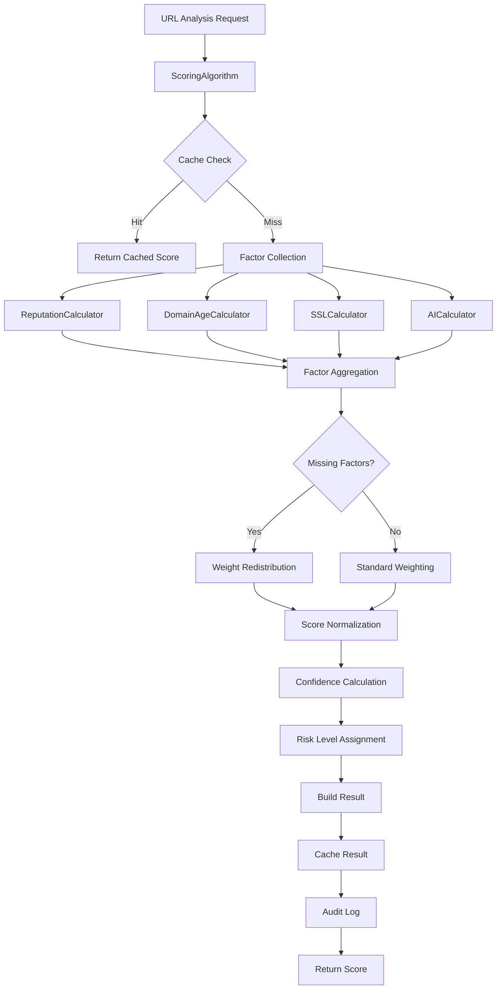
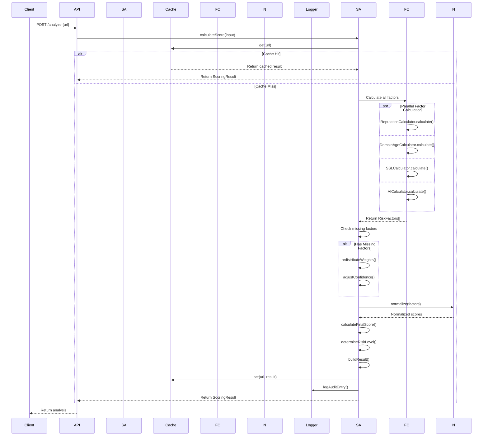
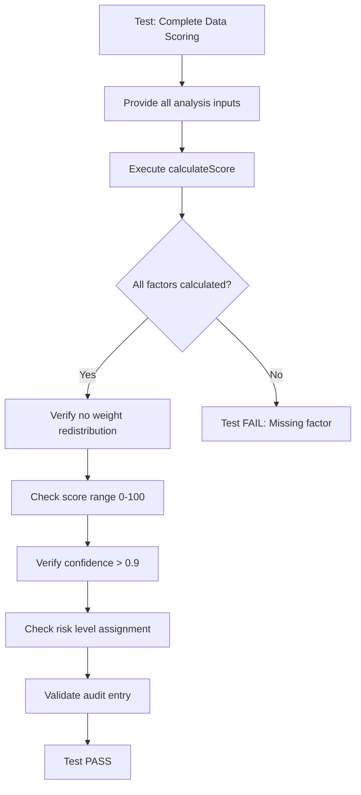
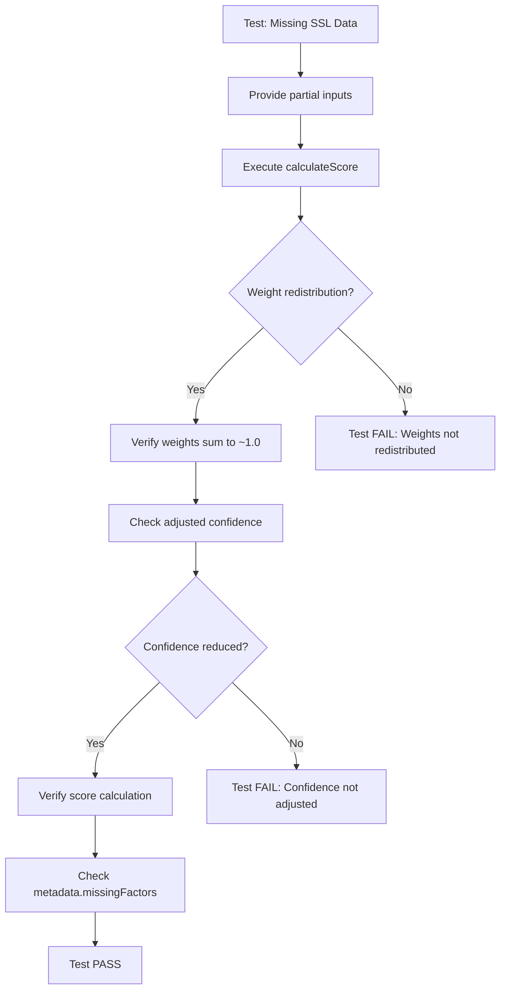

# Implementation Plan: Story 2-1 - Multi-Factor Scoring Algorithm

## Metadata
- **Story File**: story-2-1-multi-factor-scoring-algorithm.md
- **Created**: 2025-08-29
- **Last Updated**: 2025-08-29
- **BMad Version**: Core v1.0
- **Generated By**: Claude Opus 4.1

## Story Reference
Story 2-1 implements a sophisticated multi-factor scoring algorithm that combines domain age, SSL certificate quality, reputation analysis, and AI insights with configurable weights to generate accurate 0-100 risk scores. The algorithm must handle missing data gracefully, normalize scores consistently, and process in under 100ms.

## 1. Architectural Decisions

### 1.1 Design Pattern Selection
- **Strategy Pattern**: For different normalization methods (linear, logarithmic, sigmoid)
  - Rationale: Allows switching normalization algorithms at runtime based on configuration
  - Example from codebase: Similar to cache implementation selection in `CacheManager`
  
- **Builder Pattern**: For constructing complex `ScoringResult` objects
  - Rationale: Ensures valid scoring results with all required metadata
  - Example from codebase: Similar to service construction patterns in `ReputationService`

- **Chain of Responsibility**: For factor score calculation pipeline
  - Rationale: Each factor calculator can be independently tested and modified
  - Implementation: Sequential processing with early exit on critical failures

### 1.2 Library and Framework Choices
- **No new external dependencies required** - Leverage existing TypeScript capabilities
- **Existing utilities to reuse**:
  - `Logger` from `src/lib/logger` for audit trail and debugging
  - `CacheManager` for caching computed scores (1-hour TTL for scores)
  - Existing type definitions from `src/types/scoring.ts`

### 1.3 Module Organization Strategy
```
src/lib/scoring/
├── scoring-algorithm.ts          # Main scoring orchestrator
├── factor-calculators/
│   ├── reputation-calculator.ts  # Reputation factor scoring
│   ├── domain-age-calculator.ts  # Domain age factor scoring
│   ├── ssl-calculator.ts         # SSL certificate factor scoring
│   └── ai-calculator.ts          # AI analysis factor scoring
├── normalizers/
│   ├── normalizer.interface.ts   # Normalizer contract
│   ├── linear-normalizer.ts      # Linear normalization
│   ├── logarithmic-normalizer.ts # Log normalization
│   └── sigmoid-normalizer.ts     # Sigmoid normalization
├── config/
│   ├── config-validator.ts       # Configuration validation
│   └── config-manager.ts         # Runtime config management
└── utils/
    ├── weight-redistributor.ts   # Weight redistribution logic
    └── confidence-calculator.ts  # Confidence calculation
```

## 2. Component Structure

### 2.1 Core Interfaces and Classes

```typescript
// scoring-algorithm.ts
export class ScoringAlgorithm {
  constructor(
    private config: ScoringConfig,
    private cache?: CacheManager<ScoringResult>,
    private logger?: Logger
  )
  
  async calculateScore(input: ScoringInput): Promise<ScoringResult>
  private normalizeScores(factors: RiskFactor[]): RiskFactor[]
  private redistributeWeights(available: RiskFactorType[]): Record<RiskFactorType, number>
  private calculateOverallConfidence(factors: RiskFactor[]): number
  private buildAuditEntry(result: ScoringResult): ScoringAuditEntry
}

// factor-calculators/base-calculator.ts
export abstract class BaseFactorCalculator {
  abstract calculateScore(data: any): Promise<RiskFactor>
  protected normalizeToRange(value: number, min: number, max: number): number
  protected calculateConfidence(dataQuality: number, dataAge?: number): number
}
```

### 2.2 Dependency Management
- **Dependency Injection**: Constructor-based for testability
- **Service Registration**: Use factory pattern similar to existing `ServiceFactory`
- **Lifecycle Management**: Singleton for algorithm, new instances for calculators

## 3. System Architecture Diagram



## 4. Data Flow Sequence Diagram



## 5. Implementation Pseudo-Code

### 5.1 Core Scoring Algorithm

```
FUNCTION calculateScore(input: ScoringInput): ScoringResult
    // Check cache first
    cacheKey = buildCacheKey(input.url)
    cachedResult = cache.get(cacheKey)
    IF cachedResult EXISTS AND NOT isExpired(cachedResult) THEN
        RETURN cachedResult
    END IF
    
    // Initialize scoring context
    startTime = getCurrentTimeMs()
    availableFactors = []
    missingFactors = []
    riskFactors = []
    
    // Parallel factor calculation
    PARALLEL
        IF input.reputation EXISTS THEN
            reputationFactor = calculateReputationFactor(input.reputation)
            riskFactors.add(reputationFactor)
            availableFactors.add('reputation')
        ELSE
            missingFactors.add('reputation')
        END IF
        
        IF input.whois EXISTS THEN
            domainAgeFactor = calculateDomainAgeFactor(input.whois)
            riskFactors.add(domainAgeFactor)
            availableFactors.add('domain_age')
        ELSE
            missingFactors.add('domain_age')
        END IF
        
        IF input.ssl EXISTS THEN
            sslFactor = calculateSSLFactor(input.ssl)
            riskFactors.add(sslFactor)
            availableFactors.add('ssl_certificate')
        ELSE
            missingFactors.add('ssl_certificate')
        END IF
        
        IF input.ai EXISTS THEN
            aiFactor = calculateAIFactor(input.ai)
            riskFactors.add(aiFactor)
            availableFactors.add('ai_analysis')
        ELSE
            missingFactors.add('ai_analysis')
        END IF
    END PARALLEL
    
    // Handle missing data
    IF missingFactors.length > 0 THEN
        IF config.missingDataStrategy == 'redistribute' THEN
            redistributedWeights = redistributeWeights(availableFactors, missingFactors)
            FOR EACH factor IN riskFactors
                factor.weight = redistributedWeights[factor.type]
            END FOR
        ELSE IF config.missingDataStrategy == 'penalty' THEN
            // Apply penalty score for missing factors
            FOR EACH missingType IN missingFactors
                penaltyFactor = createPenaltyFactor(missingType)
                riskFactors.add(penaltyFactor)
            END FOR
        ELSE // 'default' strategy
            // Use default scores for missing factors
            FOR EACH missingType IN missingFactors
                defaultFactor = createDefaultFactor(missingType)
                riskFactors.add(defaultFactor)
            END FOR
        END IF
    END IF
    
    // Normalize individual scores
    normalizedFactors = []
    FOR EACH factor IN riskFactors
        normalizedScore = normalizeScore(factor.score, config.normalization)
        factor.normalizedScore = normalizedScore
        normalizedFactors.add(factor)
    END FOR
    
    // Calculate weighted final score
    weightedSum = 0
    totalWeight = 0
    FOR EACH factor IN normalizedFactors
        weightedSum = weightedSum + (factor.normalizedScore * factor.weight)
        totalWeight = totalWeight + factor.weight
    END FOR
    
    finalScore = ROUND(weightedSum / totalWeight)
    finalScore = MIN(MAX(finalScore, 0), 100) // Clamp to 0-100
    
    // Calculate overall confidence
    confidence = calculateOverallConfidence(normalizedFactors, missingFactors)
    
    // Determine risk level
    riskLevel = CASE finalScore
        WHEN <= config.thresholds.lowRiskMax THEN 'low'
        WHEN <= config.thresholds.mediumRiskMax THEN 'medium'
        ELSE 'high'
    END CASE
    
    // Build result object
    processingTime = getCurrentTimeMs() - startTime
    result = {
        url: input.url,
        finalScore: finalScore,
        riskLevel: riskLevel,
        confidence: confidence,
        riskFactors: normalizedFactors,
        metadata: {
            totalProcessingTimeMs: processingTime,
            configUsed: hashConfig(config),
            missingFactors: missingFactors,
            redistributedWeights: redistributedWeights,
            normalizationMethod: config.normalization.method,
            timestamp: new Date()
        },
        breakdown: {
            weightedScores: extractWeightedScores(normalizedFactors),
            normalizedScores: extractNormalizedScores(normalizedFactors),
            rawScores: extractRawScores(riskFactors),
            totalWeight: totalWeight
        }
    }
    
    // Cache and audit
    cache.set(cacheKey, result, 3600000) // 1 hour TTL
    logger.info('Score calculated', buildAuditEntry(result))
    
    RETURN result
END FUNCTION
```

### 5.2 Factor Calculation Examples

```
FUNCTION calculateReputationFactor(reputationData): RiskFactor
    analysis = reputationData.analysis
    baseScore = analysis.score // 0-100 from reputation service
    
    // Apply reputation-specific adjustments
    IF analysis.threatMatches.length == 0 THEN
        adjustedScore = baseScore * 0.8 // Reduce score for clean reputation
    ELSE IF analysis.threatMatches.includes('MALWARE') THEN
        adjustedScore = MIN(baseScore * 1.5, 100) // Increase for malware
    ELSE IF analysis.threatMatches.includes('SOCIAL_ENGINEERING') THEN
        adjustedScore = MIN(baseScore * 1.3, 100) // Increase for phishing
    ELSE
        adjustedScore = baseScore
    END IF
    
    RETURN {
        type: 'reputation',
        score: adjustedScore,
        confidence: analysis.confidence,
        weight: config.weights.reputation,
        description: generateReputationDescription(analysis),
        available: true,
        processingTimeMs: reputationData.processingTimeMs
    }
END FUNCTION

FUNCTION calculateDomainAgeFactor(whoisData): RiskFactor
    analysis = whoisData.analysis
    domainAgeInDays = analysis.ageInDays
    
    // Score based on domain age thresholds
    score = CASE domainAgeInDays
        WHEN <= 30 THEN RANDOM(70, 100) // 0-30 days: High risk
        WHEN <= 90 THEN RANDOM(40, 70)  // 31-90 days: Medium risk
        WHEN <= 365 THEN RANDOM(20, 40) // 91-365 days: Low-medium risk
        ELSE RANDOM(0, 20)               // >365 days: Low risk
    END CASE
    
    // Adjust for registration patterns
    IF analysis.registrationPattern == 'suspicious' THEN
        score = MIN(score * 1.2, 100)
    END IF
    
    // Calculate confidence based on data quality
    confidence = CASE
        WHEN analysis.dataSource == 'authoritative' THEN 0.95
        WHEN analysis.dataSource == 'cached' THEN 0.85
        ELSE 0.70
    END CASE
    
    RETURN {
        type: 'domain_age',
        score: score,
        confidence: confidence,
        weight: config.weights.domain_age,
        description: generateDomainAgeDescription(analysis),
        available: true,
        processingTimeMs: whoisData.processingTimeMs
    }
END FUNCTION
```

## 6. Test Scenario Diagrams

### 6.1 Test Flow for Complete Data Scenario



### 6.2 Test Flow for Missing Data Handling



## 7. Code Patterns and Conventions

### 7.1 Existing Patterns to Follow
- **Service Construction**: Follow `ReputationService` pattern with config injection
- **Caching Pattern**: Use `CacheManager` with getOrSet pattern
- **Error Handling**: Use try-catch with Logger for non-critical failures
- **Type Imports**: Import types from `src/types/` directory
- **Async/Await**: All external calls use async/await pattern

### 7.2 Naming Conventions
```typescript
// File naming: kebab-case
scoring-algorithm.ts
reputation-calculator.ts

// Class naming: PascalCase
export class ScoringAlgorithm
export class ReputationCalculator

// Method naming: camelCase
calculateScore()
redistributeWeights()

// Constants: UPPER_SNAKE_CASE
const DEFAULT_CONFIDENCE_PENALTY = 0.1
const MAX_PROCESSING_TIME_MS = 100
```

## 8. Potential Pitfalls and Mitigation

### 8.1 Performance Pitfalls
- **Pitfall**: Sequential factor calculation causing >100ms processing
- **Mitigation**: Use Promise.all() for parallel factor calculation
- **Implementation**: 
  ```typescript
  const factors = await Promise.all([
    this.reputationCalc.calculate(input.reputation),
    this.domainAgeCalc.calculate(input.whois),
    // ...
  ])
  ```

### 8.2 Data Quality Issues
- **Pitfall**: Missing data causing score instability
- **Mitigation**: Implement weight redistribution with confidence adjustment
- **Implementation**: Track missing factors and reduce confidence by 0.1 per missing

### 8.3 Configuration Errors
- **Pitfall**: Invalid weight configurations (sum != 1.0)
- **Mitigation**: Validate configuration on initialization
- **Implementation**: 
  ```typescript
  validateWeights(weights) {
    const sum = Object.values(weights).reduce((a, b) => a + b, 0)
    if (Math.abs(sum - 1.0) > WEIGHT_CONSTRAINTS.TOTAL_WEIGHT_TOLERANCE) {
      throw new Error('Weights must sum to 1.0')
    }
  }
  ```

### 8.4 Cache Invalidation
- **Pitfall**: Stale scores after configuration changes
- **Mitigation**: Include config hash in cache key
- **Implementation**: Cache key = `scoring:${url}:${configHash}`

## 9. Step-by-Step Implementation Order

### Phase 1: Core Infrastructure (Day 1)
1. Create directory structure under `src/lib/scoring/`
2. Implement `config-validator.ts` with weight validation
3. Create base `normalizer.interface.ts` and `linear-normalizer.ts`
4. Implement `confidence-calculator.ts` utility
5. Write unit tests for validators and utilities

### Phase 2: Factor Calculators (Day 1-2)
6. Implement `base-calculator.ts` abstract class
7. Create `reputation-calculator.ts` extending base
8. Create `domain-age-calculator.ts` extending base
9. Create `ssl-calculator.ts` extending base
10. Create `ai-calculator.ts` extending base
11. Write unit tests for each calculator

### Phase 3: Main Algorithm (Day 2)
12. Implement `weight-redistributor.ts` utility
13. Create main `scoring-algorithm.ts` class
14. Implement cache integration
15. Add audit logging
16. Write integration tests

### Phase 4: Advanced Features (Day 3)
17. Implement `logarithmic-normalizer.ts`
18. Implement `sigmoid-normalizer.ts`
19. Create `config-manager.ts` for runtime updates
20. Add performance monitoring
21. Write E2E tests with known URLs

### Phase 5: Validation (Day 3)
22. Test with known legitimate URLs (expect 0-30 scores)
23. Test with known scam URLs (expect 70-100 scores)
24. Performance testing (<100ms requirement)
25. Load testing for concurrent requests
26. Document configuration tuning guide

## 10. Validation Checklist

- [ ] All factor calculators implement BaseFactorCalculator
- [ ] Weight redistribution maintains sum ≈ 1.0
- [ ] Confidence reduces by 0.1 per missing factor
- [ ] Scores always in 0-100 range
- [ ] Processing time < 100ms for 95% of requests
- [ ] Cache hit rate > 50% in production scenarios
- [ ] Audit entries contain all required metadata
- [ ] Configuration changes invalidate cache
- [ ] All normalization methods produce 0-100 output
- [ ] Risk level thresholds are configurable

## Implementation Status
- [ ] Planning Complete
- [ ] Architecture Decisions Implemented
- [ ] Component Structure Built
- [ ] Integration Points Connected
- [ ] Testing Complete
- [ ] Story Acceptance Criteria Met