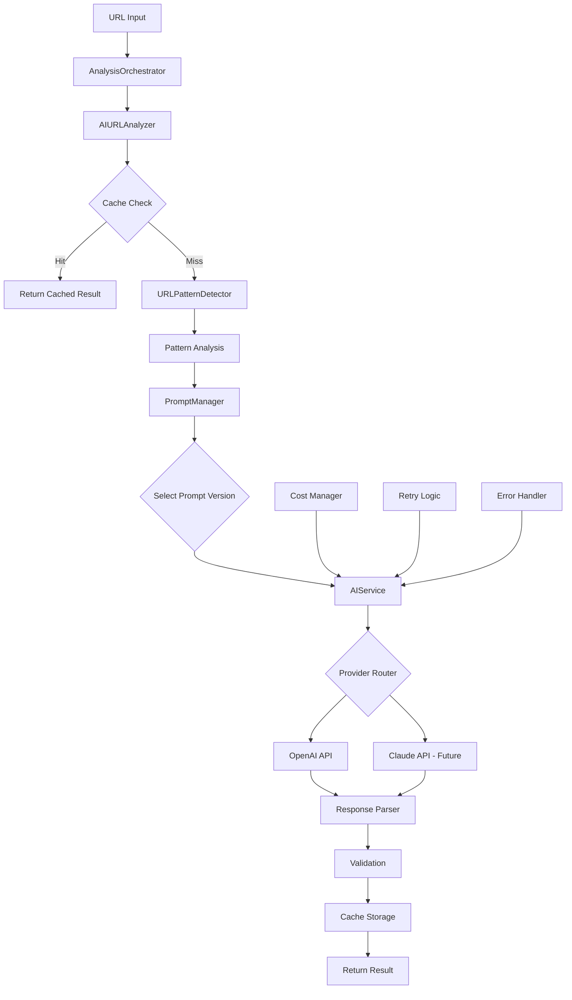
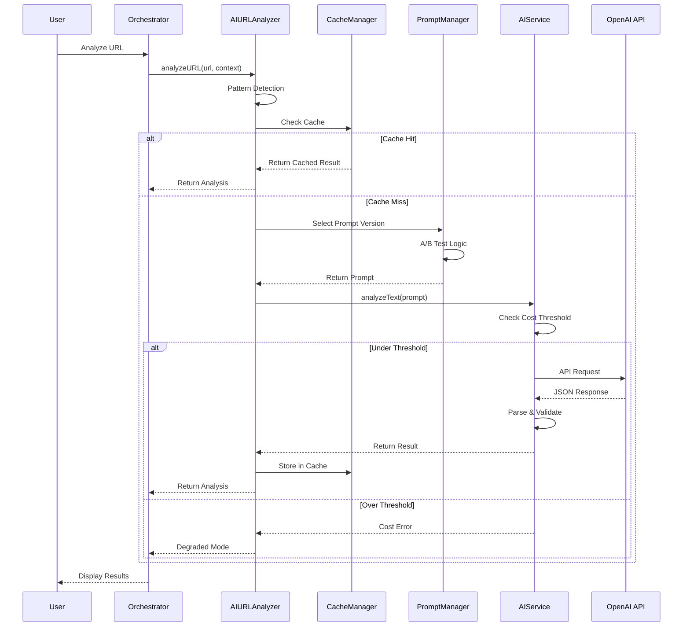
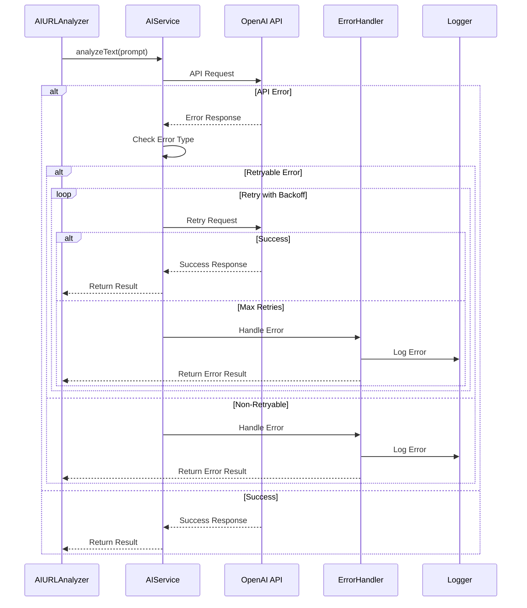
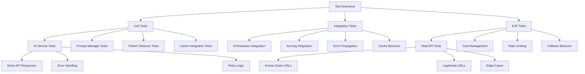
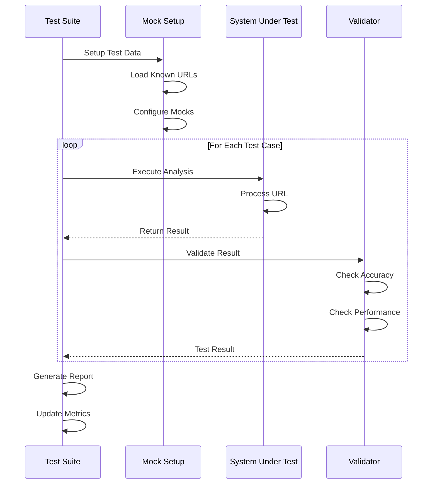

# Implementation Plan: AI URL Risk Analysis Integration

## Metadata
- **Story File**: story-2-2-ai-content-analysis-integration.md
- **Created**: 2025-08-29
- **Last Updated**: 2025-08-29
- **BMad Version**: v1.0
- **Generated By**: Claude (opus)

## Story Reference
This story implements AI-powered URL risk analysis to detect sophisticated scams without content fetching. The system leverages OpenAI/Claude APIs to analyze URL patterns, identify scam indicators, and provide structured risk assessments integrated with the multi-factor scoring algorithm.

## Implementation Status Assessment

### Already Implemented Components
1. **Core AI Infrastructure** ✅
   - AIService class with OpenAI integration
   - Retry logic and error handling
   - Cost tracking and thresholds
   - Token usage monitoring

2. **AI URL Analyzer** ✅
   - URL analysis with caching
   - Pattern detection integration
   - Prompt versioning support
   - Performance metrics tracking

3. **Prompt Management System** ✅
   - A/B testing framework
   - Version control for prompts
   - Performance comparison metrics
   - Dynamic prompt selection

4. **URL Pattern Detection** ✅
   - Homograph detection
   - Typosquatting analysis
   - Phishing pattern recognition
   - Brand impersonation detection

### Remaining Implementation Tasks
1. **Prompt Optimization & Testing**
   - Refine URL analysis prompts for accuracy
   - Create test dataset of known scam/legitimate URLs
   - Implement prompt performance tracking
   - A/B test different prompt versions

2. **Integration Testing**
   - E2E service tests with real AI APIs
   - Cost management validation
   - Rate limiting verification
   - Fallback behavior testing

3. **Performance Optimization**
   - Response time optimization
   - Cache warming strategies
   - Batch processing capabilities
   - Cost reduction strategies

## Architecture Decisions

### 1. AI Provider Strategy
**Decision**: Multi-provider support with OpenAI as primary, Claude as future option
**Rationale**: 
- OpenAI provides mature, stable API with JSON mode
- Provider abstraction allows future Claude integration
- Failover capability for resilience
**Implementation**: AIService class with provider-specific execution methods

### 2. Prompt Engineering Architecture
**Decision**: Versioned prompt system with A/B testing capabilities
**Rationale**:
- Enables continuous prompt improvement
- Allows performance comparison between versions
- Supports gradual rollout of new prompts
**Implementation**: PromptManager with version tracking and performance metrics

### 3. Caching Strategy
**Decision**: Multi-layer caching with prompt version awareness
**Rationale**:
- Reduces API costs significantly
- Improves response times for repeat queries
- Version-aware caching prevents stale results
**Implementation**: CacheManager integration with version-specific keys

### 4. Cost Management Approach
**Decision**: Per-request cost tracking with configurable thresholds
**Rationale**:
- Prevents unexpected API charges
- Enables budget enforcement
- Provides usage analytics
**Implementation**: Real-time cost calculation with circuit breaker pattern

## Component Structure

### System Architecture Diagram



### Data Flow Architecture

```mermaid
graph LR
    A[URL Request] --> B[Parse URL Components]
    B --> C[Technical Context]
    C --> D[Pattern Detection]
    D --> E[AI Analysis Request]
    E --> F[Prompt Generation]
    F --> G[AI API Call]
    G --> H[Response Parsing]
    H --> I[Result Validation]
    I --> J[Cache Update]
    J --> K[Scoring Integration]
```



## Interaction Sequence Diagrams

### URL Analysis Flow



### Error Handling Flow



## Implementation Pseudo-Code

### Enhanced URL Analysis Algorithm

```
FUNCTION analyzeURLWithAI(url, parsedUrl, technicalContext)
    // Step 1: Pattern Detection
    patternAnalysis = detectURLPatterns(url, parsedUrl)
    
    // Step 2: Cache Key Generation
    promptVersion = selectPromptVersion(userId)
    cacheKey = generateCacheKey(url, promptVersion, patternAnalysis)
    
    // Step 3: Cache Check
    IF cacheEnabled AND cachedResult = cache.get(cacheKey) THEN
        updateMetrics("cache_hit", promptVersion)
        RETURN cachedResult
    END IF
    
    // Step 4: Prepare AI Request
    analysisRequest = {
        url: url,
        domain: parsedUrl.domain,
        path: parsedUrl.path,
        parameters: parsedUrl.parameters,
        patternAnalysis: patternAnalysis,
        technicalContext: technicalContext
    }
    
    // Step 5: Generate Prompt
    prompt = generatePrompt(analysisRequest, promptVersion)
    
    // Step 6: Cost Check
    estimatedCost = estimateTokenCost(prompt)
    IF totalCost + estimatedCost > costThreshold THEN
        LOG("Cost threshold exceeded")
        RETURN degradedAnalysis(patternAnalysis)
    END IF
    
    // Step 7: AI Analysis with Retry
    retryCount = 0
    WHILE retryCount < maxRetries
        TRY
            response = callAIAPI(prompt)
            parsedResponse = parseJSONResponse(response)
            
            // Step 8: Validate Response
            IF NOT validateAIResponse(parsedResponse) THEN
                THROW ValidationError("Invalid response format")
            END IF
            
            // Step 9: Enhance with Pattern Analysis
            enhancedResult = {
                ...parsedResponse,
                patternScore: patternAnalysis.suspiciousScore,
                detectedPatterns: patternAnalysis.patterns,
                confidence: calculateConfidence(parsedResponse, patternAnalysis)
            }
            
            // Step 10: Cache Result
            IF cacheEnabled THEN
                cache.set(cacheKey, enhancedResult, ttl)
            END IF
            
            // Step 11: Update Metrics
            updateMetrics("success", promptVersion, response.cost)
            
            RETURN enhancedResult
            
        CATCH error
            IF isRetryableError(error) AND retryCount < maxRetries THEN
                retryCount++
                WAIT exponentialBackoff(retryCount)
            ELSE
                LOG("AI analysis failed", error)
                RETURN fallbackAnalysis(patternAnalysis)
            END IF
        END TRY
    END WHILE
END FUNCTION
```

### Prompt Version Selection Algorithm

```
FUNCTION selectPromptVersion(userId, forceVersion)
    // Override for testing
    IF forceVersion EXISTS THEN
        RETURN getPromptVersion(forceVersion)
    END IF
    
    // A/B Testing Logic
    userHash = hash(userId || randomSeed)
    experimentGroup = userHash % 100
    
    // Determine version based on traffic allocation
    IF experimentGroup < controlGroupPercentage THEN
        version = "v1.0" // Control version
        isExperiment = false
    ELSE IF experimentGroup < controlGroupPercentage + testGroupPercentage THEN
        version = "v1.1" // Test version
        isExperiment = true
    ELSE
        // Use best performing version
        version = getBestPerformingVersion()
        isExperiment = false
    END IF
    
    RETURN {
        version: version,
        isExperiment: isExperiment,
        selectionReason: determineReason(experimentGroup)
    }
END FUNCTION
```

## Test Scenario Diagrams

### Comprehensive Test Coverage



### Test Data Flow



## Code Patterns and Conventions

### 1. Service Integration Pattern
```typescript
// Follow existing ServiceFactory pattern
const aiAnalyzer = ServiceFactory.createAIURLAnalyzer({
  cache: cacheManager,
  config: aiConfig
})
```

### 2. Error Handling Pattern
```typescript
// Consistent error structure
interface ServiceError {
  code: AIErrorCode
  message: string
  retryable?: boolean
}
```

### 3. Result Structure Pattern
```typescript
// Consistent result format
interface ServiceResult<T> {
  success: boolean
  data: T | null
  error?: ServiceError
  fromCache: boolean
  metadata: ResultMetadata
}
```

### 4. Logging Pattern
```typescript
// Structured logging with context
logger.info('AI analysis completed', {
  url: sanitizedUrl,
  riskScore: result.riskScore,
  processingTime: metrics.time,
  cost: metrics.cost
})
```

## Potential Pitfalls and Mitigation

### 1. API Cost Overruns
**Risk**: Unexpected high API costs from excessive requests
**Mitigation**:
- Implement strict per-request cost limits
- Use aggressive caching strategy
- Monitor daily/monthly spend
- Circuit breaker pattern for cost threshold

### 2. Prompt Injection Attacks
**Risk**: Malicious URLs attempting to manipulate AI responses
**Mitigation**:
- Sanitize URL inputs before prompt inclusion
- Use structured prompts with clear boundaries
- Validate response format strictly
- Never execute or interpret AI responses as code

### 3. Rate Limiting Issues
**Risk**: API rate limits causing service degradation
**Mitigation**:
- Implement request queuing
- Use exponential backoff for retries
- Monitor rate limit headers
- Fallback to pattern-based analysis

### 4. Cache Poisoning
**Risk**: Invalid data cached causing persistent errors
**Mitigation**:
- Validate responses before caching
- Implement cache versioning
- TTL-based expiration
- Cache invalidation mechanisms

### 5. Performance Degradation
**Risk**: Slow AI responses affecting user experience
**Mitigation**:
- Implement aggressive timeouts
- Parallel service execution
- Progressive enhancement approach
- Cached result serving

## Step-by-Step Implementation

### Phase 1: Prompt Optimization (Immediate Priority)
- [ ] Create test dataset of 100+ URLs (50 scam, 50 legitimate)
- [ ] Refine prompt in url-analysis-prompt.ts for better accuracy
- [ ] Implement prompt performance tracking
- [ ] A/B test at least 3 prompt variations
- [ ] Document winning prompt version

### Phase 2: Integration Testing
- [ ] Create E2E test in tests/e2e/services/ai-service.e2e.ts
- [ ] Test with real OpenAI API (test environment)
- [ ] Validate cost tracking accuracy
- [ ] Test rate limiting behavior
- [ ] Verify fallback mechanisms

### Phase 3: Performance Optimization
- [ ] Optimize response parsing speed
- [ ] Implement request batching for bulk analysis
- [ ] Add cache warming for common URLs
- [ ] Profile and optimize token usage

### Phase 4: Monitoring & Observability
- [ ] Add detailed performance metrics
- [ ] Implement cost alerting
- [ ] Create accuracy tracking dashboard
- [ ] Set up prompt performance monitoring

### Phase 5: Documentation & Deployment
- [ ] Document API configuration
- [ ] Create runbook for cost management
- [ ] Update deployment scripts
- [ ] Perform load testing

## Implementation Status
- [ ] Planning Complete
- [ ] Architecture Decisions Implemented
- [x] Component Structure Built (Partial)
- [x] Integration Points Connected (Partial)
- [ ] Testing Complete
- [ ] Story Acceptance Criteria Met