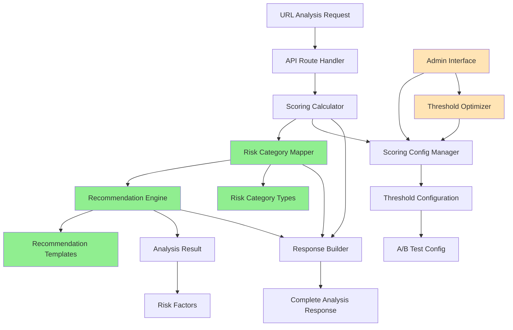
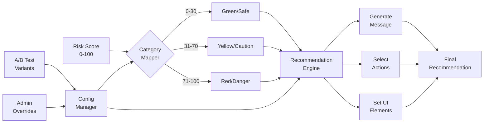
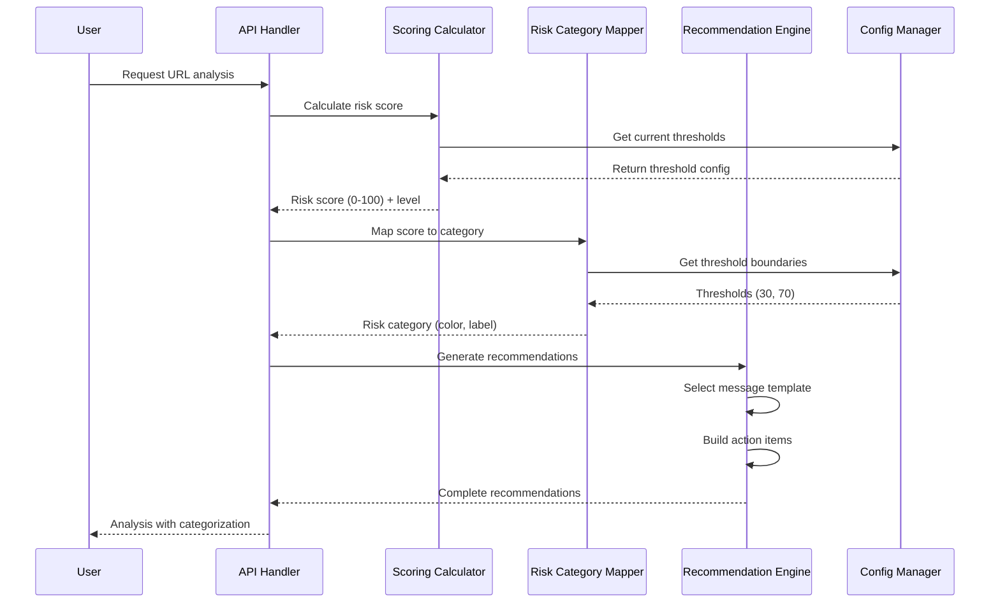
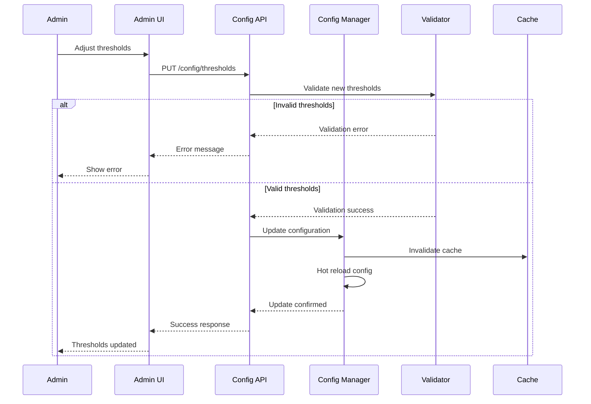
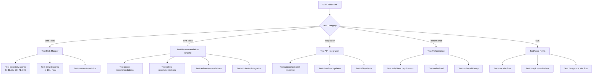

# Implementation Plan: Story 2-3 - Risk Categorization & Thresholds

## Metadata
- **Story File**: story-2-3-risk-categorization-thresholds.md
- **Created**: 2025-08-29
- **Last Updated**: 2025-08-29
- **BMad Version**: Core
- **Generated By**: Claude Opus 4.1

## Story Summary
Implement three-tier color-coded risk categorization (Green/Yellow/Red) with configurable thresholds, recommendation engine, and appropriate user guidance for different risk levels. The system must process categorization in under 10ms and provide immediate threshold adjustment capabilities.

## 1. Architectural Decisions

### 1.1 Build on Existing Infrastructure
**Decision**: Extend the existing `ScoringCalculator` and `ScoringConfigManager` rather than creating new systems.
**Rationale**: The codebase already has sophisticated threshold management, A/B testing, and validation. Creating parallel systems would introduce complexity and potential inconsistencies.
**Reference**: `src/lib/scoring/scoring-calculator.ts:565` - existing `determineRiskLevel()` method

### 1.2 Color Mapping Strategy
**Decision**: Add a `RiskCategoryMapper` utility class that maps internal risk levels to color-coded categories.
**Rationale**: Maintains backward compatibility while adding visual categorization layer.
**Pattern**: Adapter pattern - transforms internal representation to UI-friendly format.

### 1.3 Recommendation Engine Architecture
**Decision**: Implement as a separate service (`RecommendationEngine`) that consumes risk categorization data.
**Rationale**: Single Responsibility Principle - keeps recommendation logic separate from scoring logic.
**Integration**: Will be injected into the API route handler alongside scoring calculator.

### 1.4 Configuration Storage
**Decision**: Extend existing `ScoringConfig` interface to include recommendation templates.
**Rationale**: Leverages existing config validation and hot-reload capabilities.
**Location**: Configuration in environment variables with database override capability (as per tech notes).

## 2. Component Structure

### 2.1 New Components to Create

```typescript
// src/shared/types/risk-categorization.ts
export interface RiskCategory {
  level: 'low' | 'medium' | 'high'
  color: 'green' | 'yellow' | 'red'
  label: 'Safe' | 'Caution' | 'Danger'
  scoreRange: {
    min: number
    max: number
  }
}

export interface RiskRecommendation {
  category: RiskCategory
  message: string
  recommendations: string[]
  severity: 'info' | 'warning' | 'danger'
  uiElements: {
    badge: string
    icon: string
    colorClass: string
  }
}

// src/lib/categorization/risk-category-mapper.ts
export class RiskCategoryMapper {
  mapToCategory(score: number, config: ScoringConfig): RiskCategory
  getColorForLevel(level: RiskLevel): 'green' | 'yellow' | 'red'
  getLabelForLevel(level: RiskLevel): 'Safe' | 'Caution' | 'Danger'
}

// src/lib/recommendations/recommendation-engine.ts
export class RecommendationEngine {
  generateRecommendations(category: RiskCategory, analysisResult: AnalysisResult): RiskRecommendation
  getMessageTemplate(category: RiskCategory): string
  getActionItems(category: RiskCategory, riskFactors: RiskFactor[]): string[]
}

// src/lib/recommendations/recommendation-templates.ts
export const RECOMMENDATION_TEMPLATES = {
  green: {
    message: "This site appears to be safe based on our analysis.",
    baseRecommendations: [
      "Standard browsing precautions apply",
      "Keep your browser and security software updated"
    ]
  },
  yellow: {
    message: "Exercise caution when visiting this site.",
    baseRecommendations: [
      "Avoid entering sensitive information",
      "Verify site legitimacy before proceeding",
      "Check for secure connection (HTTPS)"
    ]
  },
  red: {
    message: "High risk detected - we recommend avoiding this site.",
    baseRecommendations: [
      "Do not enter personal information",
      "Consider alternative sources",
      "Report suspicious activity if encountered"
    ]
  }
}
```

### 2.2 Component Integration Points

## 3. System Architecture Diagrams

### 3.1 Component Dependency Graph



### 3.2 Data Flow Architecture



## 4. Interaction Sequence Diagrams

### 4.1 Risk Categorization Flow



### 4.2 Threshold Configuration Update



## 5. Implementation Pseudo-Code

### 5.1 Risk Category Mapping Algorithm

```
CLASS RiskCategoryMapper
    FUNCTION mapToCategory(score: number, config: ScoringConfig): RiskCategory
        // Validate input
        IF score < 0 OR score > 100 THEN
            THROW Error("Score must be between 0 and 100")
        END IF
        
        // Get thresholds from config
        lowMax = config.thresholds.lowRiskMax     // Default: 30
        mediumMax = config.thresholds.mediumRiskMax // Default: 69
        
        // Determine category
        IF score <= lowMax THEN
            category = {
                level: 'low',
                color: 'green',
                label: 'Safe',
                scoreRange: { min: 0, max: lowMax }
            }
        ELSE IF score <= mediumMax THEN
            category = {
                level: 'medium',
                color: 'yellow',
                label: 'Caution',
                scoreRange: { min: lowMax + 1, max: mediumMax }
            }
        ELSE
            category = {
                level: 'high',
                color: 'red',
                label: 'Danger',
                scoreRange: { min: mediumMax + 1, max: 100 }
            }
        END IF
        
        RETURN category
    END FUNCTION
END CLASS
```

### 5.2 Recommendation Generation Algorithm

```
CLASS RecommendationEngine
    FUNCTION generateRecommendations(
        category: RiskCategory, 
        analysisResult: AnalysisResult
    ): RiskRecommendation
        
        // Get base template for category
        template = RECOMMENDATION_TEMPLATES[category.color]
        
        // Build recommendation message
        message = template.message
        
        // Build base recommendations
        recommendations = [...template.baseRecommendations]
        
        // Add specific recommendations based on risk factors
        IF analysisResult.factors.reputation.score > 70 THEN
            recommendations.push("Site has known malicious history")
        END IF
        
        IF analysisResult.factors.ssl.hasIssues THEN
            recommendations.push("SSL certificate issues detected")
        END IF
        
        IF analysisResult.factors.domain_age.days < 30 THEN
            recommendations.push("Newly registered domain - extra caution advised")
        END IF
        
        IF analysisResult.factors.ai_analysis.phishing_probability > 0.7 THEN
            recommendations.push("Potential phishing attempt detected")
        END IF
        
        // Determine severity
        severity = CASE category.color
            WHEN 'green' THEN 'info'
            WHEN 'yellow' THEN 'warning'
            WHEN 'red' THEN 'danger'
        END CASE
        
        // Set UI elements
        uiElements = {
            badge: category.label.toUpperCase(),
            icon: getIconForCategory(category.color),
            colorClass: `risk-${category.color}`
        }
        
        // Build final recommendation
        RETURN {
            category: category,
            message: message,
            recommendations: recommendations,
            severity: severity,
            uiElements: uiElements
        }
    END FUNCTION
    
    FUNCTION getIconForCategory(color: string): string
        RETURN CASE color
            WHEN 'green' THEN 'check-circle'
            WHEN 'yellow' THEN 'alert-triangle'
            WHEN 'red' THEN 'x-octagon'
        END CASE
    END FUNCTION
END CLASS
```

## 6. Test Scenarios

### 6.1 Test Flow Chart



### 6.2 Mock Test Scenarios

```typescript
// Test data fixtures
const TEST_SCENARIOS = {
  safeSite: {
    score: 15,
    expectedCategory: 'green',
    expectedLabel: 'Safe',
    factors: {
      reputation: { score: 10 },
      ssl: { hasIssues: false },
      domain_age: { days: 365 },
      ai_analysis: { phishing_probability: 0.1 }
    }
  },
  cautionSite: {
    score: 50,
    expectedCategory: 'yellow',
    expectedLabel: 'Caution',
    factors: {
      reputation: { score: 45 },
      ssl: { hasIssues: true },
      domain_age: { days: 45 },
      ai_analysis: { phishing_probability: 0.5 }
    }
  },
  dangerSite: {
    score: 85,
    expectedCategory: 'red',
    expectedLabel: 'Danger',
    factors: {
      reputation: { score: 80 },
      ssl: { hasIssues: true },
      domain_age: { days: 5 },
      ai_analysis: { phishing_probability: 0.9 }
    }
  }
}
```

## 7. Step-by-Step Implementation Guide

### Phase 1: Core Categorization (Priority: High)

1. **Create type definitions** (`src/shared/types/risk-categorization.ts`)
   - Define `RiskCategory` interface
   - Define `RiskRecommendation` interface
   - Export type utilities

2. **Implement RiskCategoryMapper** (`src/lib/categorization/risk-category-mapper.ts`)
   - Create class with dependency injection for config
   - Implement `mapToCategory()` method
   - Add color and label mapping methods
   - Write comprehensive unit tests

3. **Update ScoringCalculator integration**
   - Inject RiskCategoryMapper into calculator
   - Add category mapping to response
   - Maintain backward compatibility

### Phase 2: Recommendation Engine (Priority: High)

4. **Create recommendation templates** (`src/lib/recommendations/recommendation-templates.ts`)
   - Define templates for each category
   - Include base messages and actions
   - Add risk-factor-specific recommendations

5. **Implement RecommendationEngine** (`src/lib/recommendations/recommendation-engine.ts`)
   - Create engine class with template injection
   - Implement `generateRecommendations()` method
   - Add factor-specific logic
   - Write unit tests with mocked data

6. **Integrate with API route** (`src/app/api/analyze/route.ts`)
   - Add recommendation engine to handler
   - Include recommendations in response
   - Update response types

### Phase 3: UI Components (Priority: Medium)

7. **Create risk badge component** (`src/components/risk-badge.tsx`)
   - Use shadcn/ui badge as base
   - Add color variants for risk levels
   - Include icon support

8. **Create recommendation display** (`src/components/risk-recommendations.tsx`)
   - Display message prominently
   - List action items clearly
   - Apply appropriate styling

9. **Update analysis results component**
   - Integrate risk badge
   - Display recommendations
   - Add visual indicators

### Phase 4: Configuration & Admin (Priority: Low)

10. **Extend configuration system**
    - Add recommendation templates to config
    - Support threshold overrides
    - Implement validation rules

11. **Create admin interface** (if time permits)
    - Threshold adjustment UI
    - A/B test configuration
    - Performance monitoring

## 8. Code Patterns & Conventions

### 8.1 Follow Existing Patterns

```typescript
// Follow dependency injection pattern from existing codebase
export class RecommendationEngine {
  constructor(
    private readonly config: ScoringConfig,
    private readonly logger: Logger
  ) {}
}

// Use existing error handling pattern
try {
  const recommendations = await engine.generateRecommendations(category, result)
} catch (error) {
  logger.error('Failed to generate recommendations', { error })
  // Return safe defaults
  return getDefaultRecommendations(category)
}

// Follow existing validation pattern using Zod
const ThresholdUpdateSchema = z.object({
  lowRiskMax: z.number().min(0).max(100),
  mediumRiskMax: z.number().min(0).max(100),
}).refine(data => data.lowRiskMax < data.mediumRiskMax, {
  message: "Low risk max must be less than medium risk max"
})
```

### 8.2 Naming Conventions

- Components: PascalCase (`RiskBadge.tsx`)
- Hooks: camelCase with 'use' prefix (`useRiskCategory.ts`)
- Types: PascalCase interfaces (`RiskCategory`)
- Constants: UPPER_SNAKE_CASE (`RECOMMENDATION_TEMPLATES`)

## 9. Potential Pitfalls & Mitigation

### 9.1 Performance Pitfalls

**Pitfall**: Recommendation generation could exceed 10ms requirement
**Mitigation**: 
- Pre-compile recommendation templates at startup
- Use memoization for repeated categorizations
- Implement result caching with proper invalidation

### 9.2 Configuration Pitfalls

**Pitfall**: Invalid threshold configurations causing miscategorization
**Mitigation**:
- Implement strict validation with Zod schemas
- Add unit tests for boundary conditions
- Provide safe default fallbacks

### 9.3 UI Consistency Pitfalls

**Pitfall**: Inconsistent color usage across components
**Mitigation**:
- Define color constants in shared location
- Use CSS variables for theming
- Create reusable color utility functions

### 9.4 Integration Pitfalls

**Pitfall**: Breaking changes to existing API consumers
**Mitigation**:
- Add new fields without removing existing ones
- Version the API if breaking changes needed
- Provide migration guide for consumers

## 10. Validation Checklist

- [ ] Risk categories map correctly for all score ranges
- [ ] Recommendations generate appropriate messages
- [ ] Performance meets sub-10ms requirement
- [ ] Threshold updates take effect immediately
- [ ] UI components display correct colors
- [ ] Backward compatibility maintained
- [ ] All edge cases handled
- [ ] Comprehensive test coverage achieved

## Implementation Status
- [ ] Planning Complete
- [ ] Architecture Decisions Implemented
- [ ] Component Structure Built
- [ ] Integration Points Connected
- [ ] Testing Complete
- [ ] Story Acceptance Criteria Met