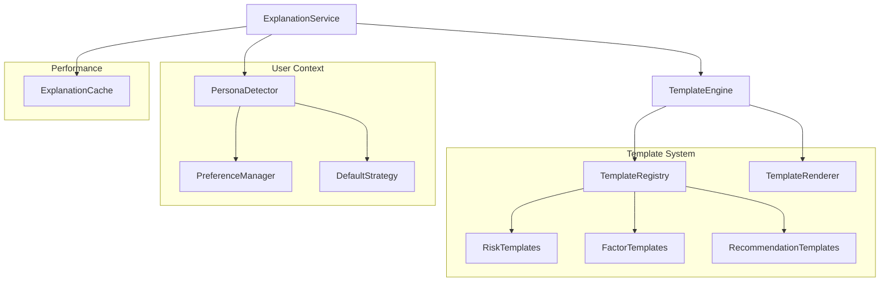
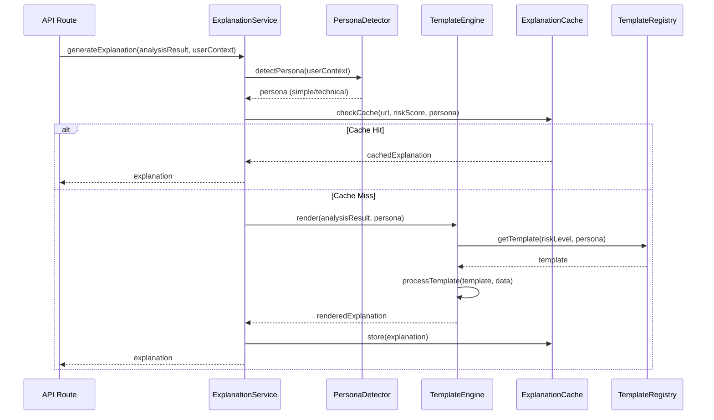
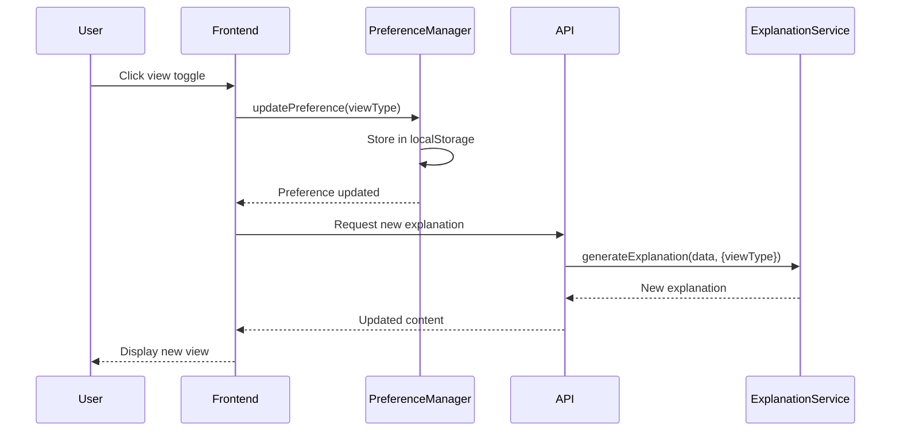
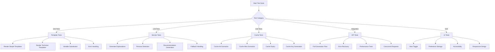

# Implementation Plan: Story 2-4 - Explanation Generation System

## Metadata
- **Story File**: story-2-4-explanation-generation-system.md
- **Created**: 2025-08-29
- **Last Updated**: 2025-08-29
- **BMad Version**: v1.0
- **Generated By**: claude-opus-4-1-20250805

## Story Reference
Story 2-4 implements a comprehensive explanation generation system that creates clear, user-appropriate explanations for risk assessments. The system must support dual-audience explanations (simple and technical views), dynamic content generation based on analysis results, and structured templates for consistent messaging.

## Current State Analysis

The codebase currently has:
1. **Basic explanation generation** in `/app/api/analyze/route.ts` (lines 725-830) - a simple function that generates explanations based on risk level
2. **Risk scoring system** with detailed factor descriptions in `ScoringCalculator`
3. **No template system** - explanations are hardcoded strings
4. **No dual-audience support** - single explanation format only
5. **No explanation caching** separate from main analysis caching
6. **No UI components** for displaying explanations with different views

## Architectural Decisions

### 1. Template Engine Selection
**Decision**: Use a TypeScript-based template system with Handlebars-like syntax
**Rationale**: 
- Maintains type safety throughout the template rendering process
- Allows dynamic content generation with variable substitution
- Supports conditional logic and iteration for complex explanations
- Existing codebase uses TypeScript exclusively - no need for external dependencies
- **Reference**: Similar to how `ScoringCalculator` handles dynamic score descriptions

### 2. Service Architecture Pattern
**Decision**: Create a dedicated `ExplanationService` following existing service patterns
**Rationale**:
- Follows established service patterns (see `ReputationService`, `SSLAnalyzer`)
- Enables clean separation of concerns
- Facilitates testing and mocking
- Aligns with existing `ServiceBuilder` pattern for dependency injection
- **Example**: Pattern matches `src/lib/analysis/reputation-service.ts` structure

### 3. User Persona Detection Strategy
**Decision**: Implement preference-based detection with smart defaults
**Rationale**:
- Start with explicit user preference (stored in localStorage/cookie)
- Default to simple view for first-time users
- Allow runtime toggling between views
- Future enhancement: behavior-based detection
- **Implementation**: Similar to how config preferences are handled in frontend

### 4. Caching Strategy
**Decision**: Implement dedicated explanation cache using existing cache infrastructure
**Rationale**:
- Leverage existing `CacheService` patterns
- Cache by `url + riskScore + viewType` composite key
- 1-hour TTL for consistency with main analysis cache
- Reduces template rendering overhead
- **Pattern**: Follow caching approach in `AnalysisOrchestrator`

## Component Structure

### System Architecture Diagram



### Module Organization

```
src/
├── lib/
│   ├── explanation/
│   │   ├── explanation-service.ts         # Main service
│   │   ├── template-engine.ts            # Template rendering engine
│   │   ├── persona-detector.ts           # User persona detection
│   │   ├── explanation-cache.ts          # Dedicated cache
│   │   ├── templates/
│   │   │   ├── registry.ts               # Template registry
│   │   │   ├── risk-templates.ts         # Risk level templates
│   │   │   ├── factor-templates.ts       # Factor-specific templates
│   │   │   └── recommendation-templates.ts # Recommendation templates
│   │   └── utils/
│   │       ├── context-builder.ts        # Build template context
│   │       └── explanation-formatter.ts   # Format final output
│   └── constants/
│       └── explanation-constants.ts       # Constants and configs
├── types/
│   └── explanation.ts                     # TypeScript interfaces
└── tests/
    ├── unit/
    │   └── lib/
    │       └── explanation/
    │           ├── explanation-service.test.ts
    │           ├── template-engine.test.ts
    │           └── persona-detector.test.ts
    └── integration/
        └── explanation-integration.test.ts
```

## Data Flow Strategy

### Main Explanation Generation Flow



### User View Toggle Flow



## Interface Definitions

```typescript
// types/explanation.ts
export interface ExplanationResult {
  mainMessage: string
  factors: FactorExplanation[]
  recommendations: string[]
  technicalDetails?: TechnicalDetails
  confidenceNote: string
  viewType: 'simple' | 'technical'
  metadata: ExplanationMetadata
}

export interface FactorExplanation {
  type: RiskFactorType
  title: string
  description: string
  impact: 'positive' | 'neutral' | 'negative'
  severity?: 'low' | 'medium' | 'high'
  details?: string[]
}

export interface TechnicalDetails {
  scoreBreakdown: ScoreBreakdown
  confidenceFactors: ConfidenceFactor[]
  analysisMetadata: AnalysisMetadata
  rawData?: Record<string, unknown>
}

export interface ExplanationTemplate {
  id: string
  persona: 'simple' | 'technical'
  riskLevel: RiskLevel
  template: string
  variables: string[]
  priority: number
}

export interface ExplanationContext {
  url: string
  riskLevel: RiskLevel
  riskScore: number
  factors: RiskFactor[]
  confidence: number
  timestamp: Date
  persona: 'simple' | 'technical'
}

export interface ExplanationConfig {
  cacheEnabled: boolean
  cacheTTL: number
  defaultPersona: 'simple' | 'technical'
  enableTechnicalDetails: boolean
  maxRecommendations: number
}

export interface PersonaPreference {
  viewType: 'simple' | 'technical'
  autoDetect: boolean
  lastUpdated: Date
}
```

## Implementation Pseudo-Code

### Core ExplanationService Implementation

```
CLASS ExplanationService
    PRIVATE templateEngine: TemplateEngine
    PRIVATE personaDetector: PersonaDetector
    PRIVATE cache: ExplanationCache
    PRIVATE logger: Logger
    PRIVATE config: ExplanationConfig
    
    CONSTRUCTOR(config: ExplanationConfig)
        this.config = config
        this.templateEngine = new TemplateEngine()
        this.personaDetector = new PersonaDetector(config.defaultPersona)
        this.cache = new ExplanationCache(config.cacheTTL)
        this.logger = new Logger()
    END CONSTRUCTOR
    
    FUNCTION generateExplanation(analysisResult, userContext)
        TRY
            // Start timing for performance monitoring
            startTime = performance.now()
            
            // Detect user persona
            persona = personaDetector.detectPersona(userContext)
            LOG("Detected persona: " + persona)
            
            // Build cache key
            cacheKey = buildCacheKey(analysisResult.url, analysisResult.riskScore, persona)
            
            // Check cache if enabled
            IF config.cacheEnabled THEN
                cachedExplanation = cache.get(cacheKey)
                IF cachedExplanation EXISTS AND NOT expired THEN
                    LOG("Explanation cache hit for " + cacheKey)
                    RETURN cachedExplanation
                END IF
            END IF
            
            // Prepare template context
            context = buildTemplateContext(analysisResult, persona)
            
            // Generate main explanation
            mainExplanation = generateMainExplanation(context)
            
            // Generate factor explanations
            factorExplanations = []
            FOR EACH factor IN analysisResult.factors
                IF factor.available THEN
                    factorExp = generateFactorExplanation(factor, persona)
                    factorExplanations.push(factorExp)
                END IF
            END FOR
            
            // Generate recommendations
            recommendations = generateRecommendations(
                analysisResult.riskLevel,
                analysisResult.factors,
                persona
            )
            
            // Build technical details if needed
            technicalDetails = NULL
            IF persona === 'technical' AND config.enableTechnicalDetails THEN
                technicalDetails = buildTechnicalDetails(analysisResult)
            END IF
            
            // Build confidence note
            confidenceNote = buildConfidenceNote(
                analysisResult.confidence,
                analysisResult.metadata.missingFactors,
                persona
            )
            
            // Assemble final result
            result = {
                mainMessage: mainExplanation,
                factors: factorExplanations,
                recommendations: limitRecommendations(recommendations, config.maxRecommendations),
                technicalDetails: technicalDetails,
                confidenceNote: confidenceNote,
                viewType: persona,
                metadata: {
                    generatedAt: new Date(),
                    processingTimeMs: performance.now() - startTime,
                    templateVersion: templateEngine.getVersion(),
                    cached: false
                }
            }
            
            // Cache result if enabled
            IF config.cacheEnabled THEN
                cache.set(cacheKey, result, config.cacheTTL)
                LOG("Cached explanation for " + cacheKey)
            END IF
            
            // Log performance metrics
            LOG("Explanation generated", {
                url: analysisResult.url,
                persona: persona,
                processingTime: result.metadata.processingTimeMs
            })
            
            RETURN result
            
        CATCH error
            LOG_ERROR("Explanation generation failed", error)
            RETURN generateFallbackExplanation(analysisResult, persona)
        END TRY
    END FUNCTION
    
    PRIVATE FUNCTION generateMainExplanation(context)
        // Select appropriate template based on risk level and persona
        template = templateEngine.selectTemplate(
            context.riskLevel,
            context.persona,
            'main'
        )
        
        // Render template with context
        rendered = templateEngine.render(template, context)
        
        RETURN rendered
    END FUNCTION
    
    PRIVATE FUNCTION generateFactorExplanation(factor, persona)
        // Determine impact based on score
        impact = determineFactorImpact(factor)
        
        // Get factor-specific template
        template = templateEngine.selectTemplate(
            factor.type,
            persona,
            'factor'
        )
        
        // Build factor context
        factorContext = {
            type: factor.type,
            score: factor.score,
            confidence: factor.confidence,
            description: factor.description,
            impact: impact,
            ...extractFactorSpecificData(factor)
        }
        
        // Render explanation
        description = templateEngine.render(template, factorContext)
        
        RETURN {
            type: factor.type,
            title: getFactorTitle(factor.type, persona),
            description: description,
            impact: impact,
            severity: calculateSeverity(factor.score, impact),
            details: persona === 'technical' ? getFactorDetails(factor) : NULL
        }
    END FUNCTION
    
    PRIVATE FUNCTION generateRecommendations(riskLevel, factors, persona)
        recommendations = []
        
        // Add risk-level based recommendations
        SWITCH riskLevel
            CASE 'high':
                recommendations.push(...getHighRiskRecommendations(persona))
            CASE 'medium':
                recommendations.push(...getMediumRiskRecommendations(persona))
            CASE 'low':
                recommendations.push(...getLowRiskRecommendations(persona))
        END SWITCH
        
        // Add factor-specific recommendations
        FOR EACH factor IN factors
            IF factor.available AND factor.score > 60 THEN
                factorRecs = getFactorRecommendations(factor.type, factor.score, persona)
                recommendations.push(...factorRecs)
            END IF
        END FOR
        
        // Remove duplicates and prioritize
        recommendations = removeDuplicates(recommendations)
        recommendations = prioritizeRecommendations(recommendations, riskLevel)
        
        RETURN recommendations
    END FUNCTION
    
    PRIVATE FUNCTION buildTechnicalDetails(analysisResult)
        RETURN {
            scoreBreakdown: {
                weightedScores: analysisResult.breakdown.weightedScores,
                normalizedScores: analysisResult.breakdown.normalizedScores,
                rawScores: analysisResult.breakdown.rawScores,
                totalWeight: analysisResult.breakdown.totalWeight
            },
            confidenceFactors: extractConfidenceFactors(analysisResult),
            analysisMetadata: {
                processingTime: analysisResult.metadata.totalProcessingTimeMs,
                configUsed: analysisResult.metadata.configUsed,
                normalizationMethod: analysisResult.metadata.normalizationMethod,
                missingFactors: analysisResult.metadata.missingFactors
            },
            rawData: {
                factors: analysisResult.factors,
                timestamp: analysisResult.metadata.timestamp
            }
        }
    END FUNCTION
    
    PRIVATE FUNCTION buildConfidenceNote(confidence, missingFactors, persona)
        IF persona === 'simple' THEN
            IF confidence >= 0.8 THEN
                RETURN "We have high confidence in this assessment."
            ELSE IF confidence >= 0.6 THEN
                RETURN "We have moderate confidence in this assessment."
            ELSE
                RETURN "Limited data was available for this assessment."
            END IF
        ELSE // technical
            confidencePercent = Math.round(confidence * 100)
            note = "Analysis confidence: " + confidencePercent + "%"
            
            IF missingFactors.length > 0 THEN
                note += ". Missing data: " + missingFactors.join(", ")
            END IF
            
            RETURN note
        END IF
    END FUNCTION
END CLASS
```

### Template Engine Implementation

```
CLASS TemplateEngine
    PRIVATE registry: TemplateRegistry
    PRIVATE renderer: TemplateRenderer
    PRIVATE version: string
    
    CONSTRUCTOR()
        this.registry = new TemplateRegistry()
        this.renderer = new TemplateRenderer()
        this.version = "1.0.0"
        this.loadTemplates()
    END CONSTRUCTOR
    
    FUNCTION selectTemplate(criteriaType, persona, templateType)
        // Find matching templates
        candidates = registry.findTemplates({
            criteriaType: criteriaType,
            persona: persona,
            type: templateType
        })
        
        // Sort by priority
        candidates.sort((a, b) => b.priority - a.priority)
        
        // Return highest priority template
        IF candidates.length > 0 THEN
            RETURN candidates[0]
        ELSE
            RETURN registry.getDefaultTemplate(templateType, persona)
        END IF
    END FUNCTION
    
    FUNCTION render(template, context)
        TRY
            // Validate required variables
            missingVars = validateTemplateVariables(template, context)
            IF missingVars.length > 0 THEN
                LOG_WARN("Missing template variables", missingVars)
            END IF
            
            // Process template
            rendered = renderer.process(template.template, context)
            
            // Post-process for formatting
            rendered = formatOutput(rendered, context.persona)
            
            RETURN rendered
            
        CATCH error
            LOG_ERROR("Template rendering failed", error)
            RETURN "Unable to generate explanation"
        END TRY
    END FUNCTION
    
    PRIVATE FUNCTION loadTemplates()
        // Load risk level templates
        registry.registerTemplate({
            id: "risk-high-simple",
            persona: "simple",
            riskLevel: "high",
            template: "⚠️ High risk detected! This site shows multiple warning signs that are commonly associated with scams. {{primaryConcern}}",
            variables: ["primaryConcern"],
            priority: 10
        })
        
        registry.registerTemplate({
            id: "risk-high-technical",
            persona: "technical",
            riskLevel: "high",
            template: "Risk Score: {{riskScore}}/100 (HIGH). Analysis indicates significant security concerns. Primary factors: {{factorList}}",
            variables: ["riskScore", "factorList"],
            priority: 10
        })
        
        // ... Load all other templates
    END FUNCTION
END CLASS
```

## Test Scenarios

### Test Flow Diagram



### Test Data Scenarios

```
TEST_SCENARIO: High Risk Site with All Factors
    INPUT:
        url: "http://suspicious-site.com"
        riskScore: 85
        riskLevel: "high"
        factors: [
            {type: "domain_age", score: 90, available: true},
            {type: "ssl_certificate", score: 80, available: true},
            {type: "reputation", score: 95, available: true},
            {type: "ai_analysis", score: 88, available: true}
        ]
        confidence: 0.92
    
    EXPECTED_SIMPLE:
        mainMessage: Contains "High risk" and warning
        factors: 4 explanations in simple language
        recommendations: At least 3 actionable items
        
    EXPECTED_TECHNICAL:
        mainMessage: Contains score "85/100"
        technicalDetails: Present with full breakdown
        factors: Detailed technical explanations

TEST_SCENARIO: Medium Risk with Missing Data
    INPUT:
        url: "https://unknown-site.org"
        riskScore: 55
        riskLevel: "medium"
        factors: [
            {type: "domain_age", score: 60, available: true},
            {type: "ssl_certificate", score: 0, available: false},
            {type: "reputation", score: 0, available: false},
            {type: "ai_analysis", score: 50, available: true}
        ]
        confidence: 0.45
        
    EXPECTED:
        confidenceNote: Mentions limited data
        factors: Only 2 explanations (available factors)
        recommendations: Include suggestion to verify manually
```

## Step-by-Step Implementation

### Phase 1: Foundation (Day 1)

1. **Create Type Definitions** (30 minutes)
   - [ ] Create `types/explanation.ts` with all interfaces
   - [ ] Update existing types to reference new interfaces
   - [ ] Add JSDoc comments for all types
   - [ ] Verify no type conflicts with existing code

2. **Implement Template Registry** (1 hour)
   - [ ] Create `templates/registry.ts` with base structure
   - [ ] Implement template storage and retrieval methods
   - [ ] Add template validation logic
   - [ ] Create unit tests for registry operations

3. **Build Template Renderer** (1 hour)
   - [ ] Create `template-engine.ts` with rendering logic
   - [ ] Implement variable substitution
   - [ ] Add conditional logic support
   - [ ] Create comprehensive unit tests

### Phase 2: Core Services (Day 1-2)

4. **Implement Persona Detector** (45 minutes)
   - [ ] Create `persona-detector.ts`
   - [ ] Implement preference storage using localStorage
   - [ ] Add default strategy logic
   - [ ] Create unit tests for all scenarios

5. **Build Explanation Cache** (45 minutes)
   - [ ] Create `explanation-cache.ts`
   - [ ] Implement cache key generation
   - [ ] Add TTL management
   - [ ] Create cache tests

6. **Create Template Content** (1.5 hours)
   - [ ] Write all risk level templates (simple & technical)
   - [ ] Create factor-specific templates
   - [ ] Write recommendation templates
   - [ ] Validate all templates

### Phase 3: Integration (Day 2)

7. **Build ExplanationService** (2 hours)
   - [ ] Create main service class
   - [ ] Integrate all components
   - [ ] Implement error handling
   - [ ] Add comprehensive logging
   - [ ] Create unit tests

8. **Update API Route** (30 minutes)
   - [ ] Replace existing `generateExplanation` function
   - [ ] Integrate ExplanationService
   - [ ] Maintain backward compatibility
   - [ ] Test API responses

### Phase 4: Frontend (Day 2-3)

9. **Create UI Components** (2 hours)
   - [ ] Build ExplanationDisplay component
   - [ ] Add ViewToggle component
   - [ ] Implement preference persistence
   - [ ] Add loading states
   - [ ] Ensure responsive design

10. **Add Accessibility Features** (1 hour)
    - [ ] Add ARIA labels
    - [ ] Ensure keyboard navigation
    - [ ] Test with screen readers
    - [ ] Validate color contrast

### Phase 5: Testing & Polish (Day 3)

11. **Integration Testing** (1.5 hours)
    - [ ] Create integration test suite
    - [ ] Test full explanation flow
    - [ ] Test error scenarios
    - [ ] Validate performance

12. **User Testing & Refinement** (2 hours)
    - [ ] Conduct user testing sessions
    - [ ] Gather feedback on clarity
    - [ ] Refine templates based on feedback
    - [ ] Final validation

## Code Patterns & Conventions

### Follow Existing Patterns

1. **Service Pattern** (from `ReputationService`):
```typescript
export class ExplanationService {
  private readonly logger: Logger
  
  constructor(
    private readonly config: ExplanationConfig,
    logger?: Logger
  ) {
    this.logger = logger || new Logger()
  }
  
  async generateExplanation(
    input: ExplanationInput
  ): Promise<ExplanationResult> {
    const timer = this.logger.timer('Generate explanation')
    try {
      // Implementation
      timer.end()
      return result
    } catch (error) {
      this.logger.error('Failed to generate explanation', { error })
      throw error
    }
  }
}
```

2. **Error Handling** (from existing services):
```typescript
try {
  // Operation
} catch (error) {
  this.logger.error('Operation failed', {
    error: error instanceof Error ? error : new Error(String(error)),
    context: relevantData
  })
  // Return fallback or rethrow
}
```

3. **Testing Structure** (from `scoring-calculator.test.ts`):
```typescript
describe('ExplanationService', () => {
  let service: ExplanationService
  
  beforeEach(() => {
    service = new ExplanationService(mockConfig)
  })
  
  describe('generateExplanation', () => {
    it('should generate simple explanation for high risk', async () => {
      // Test implementation
    })
  })
})
```

## Potential Pitfalls & Mitigation Strategies

### 1. Template Complexity Management
**Risk**: Templates become overly complex with nested conditionals
**Mitigation**:
- Limit template logic to simple if/else
- Use template composition over complex single templates
- Regular code review of templates
- Maximum template size limit (500 chars)

### 2. Performance Degradation
**Risk**: Template rendering adds significant latency
**Mitigation**:
- Pre-compile templates on service initialization
- Aggressive caching with appropriate TTL
- Monitor p95 rendering times
- Fallback to simple templates if timeout

### 3. Content Inconsistency
**Risk**: Different explanations for similar risk profiles
**Mitigation**:
- Standardized variable names across templates
- Content validation tests for all risk levels
- Regular review of generated explanations
- A/B testing for content effectiveness

### 4. Persona Misdetection
**Risk**: Wrong persona leads to poor UX
**Mitigation**:
- Always default to simple view
- Prominent toggle in UI
- Persist preference across sessions
- Analytics to track toggle usage

### 5. Cache Invalidation Issues
**Risk**: Stale explanations served from cache
**Mitigation**:
- Include risk score in cache key
- Conservative TTL (1 hour)
- Cache bypass header support
- Monitor cache hit rates

### 6. Accessibility Failures
**Risk**: Complex explanations not screen-reader friendly
**Mitigation**:
- Semantic HTML in all templates
- ARIA labels for interactive elements
- Regular accessibility audits
- User testing with assistive technology

## Performance Considerations

1. **Target Metrics**:
   - Explanation generation: < 50ms p95
   - Cache hit rate: > 80%
   - Template rendering: < 10ms
   - Total API response: < 200ms with explanation

2. **Optimization Strategies**:
   - Pre-compile all templates on startup
   - Use string concatenation over complex templating
   - Batch factor explanation generation
   - Lazy load technical details

3. **Monitoring Points**:
   - Template rendering duration
   - Cache hit/miss rates
   - Persona detection accuracy
   - User view toggle frequency

## Implementation Status
- [ ] Planning Complete
- [ ] Architecture Decisions Implemented
- [ ] Component Structure Built
- [ ] Integration Points Connected
- [ ] Testing Complete
- [ ] Story Acceptance Criteria Met

## Notes

- This implementation plan provides prescriptive guidance for implementing the explanation generation system
- All architectural decisions are based on existing codebase patterns
- The phased approach allows for incremental development and testing
- Focus on user experience with both technical and non-technical audiences
- Performance and accessibility are primary concerns throughout implementation