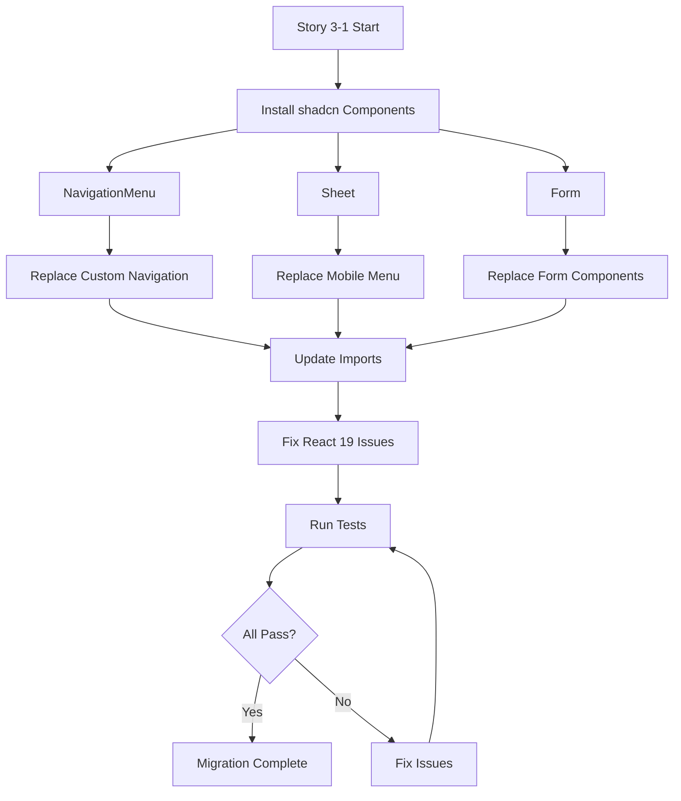
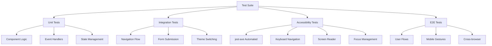
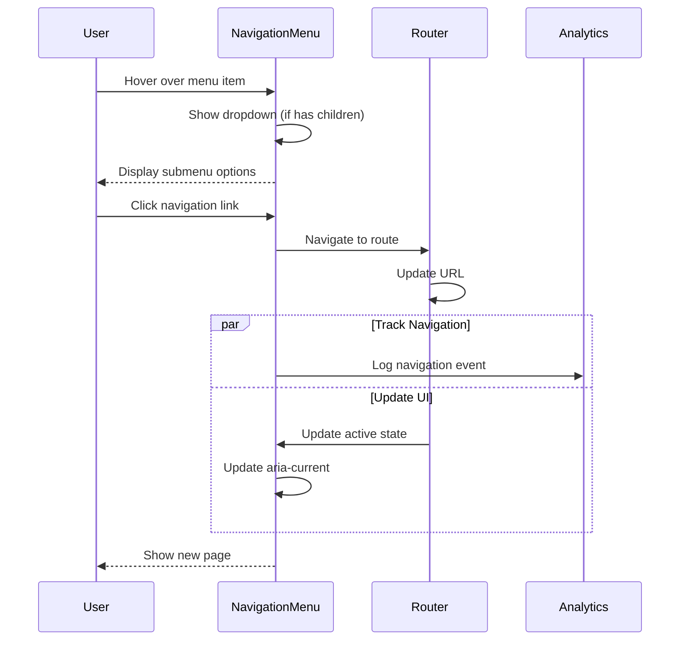
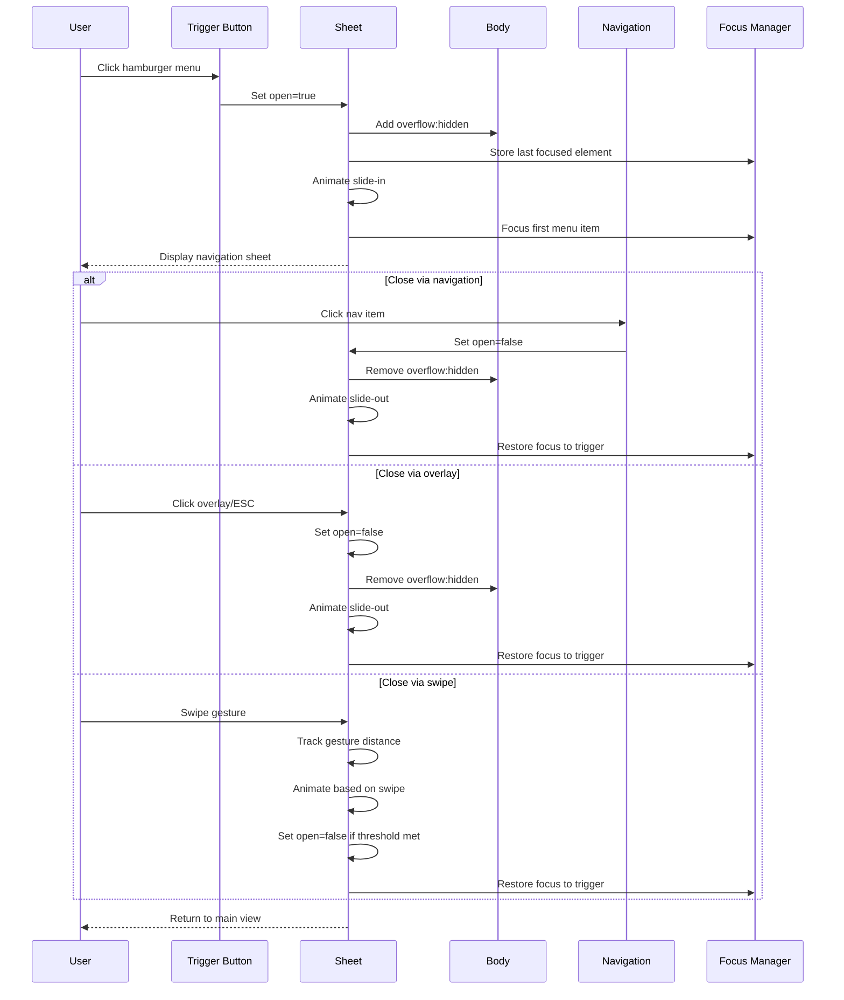
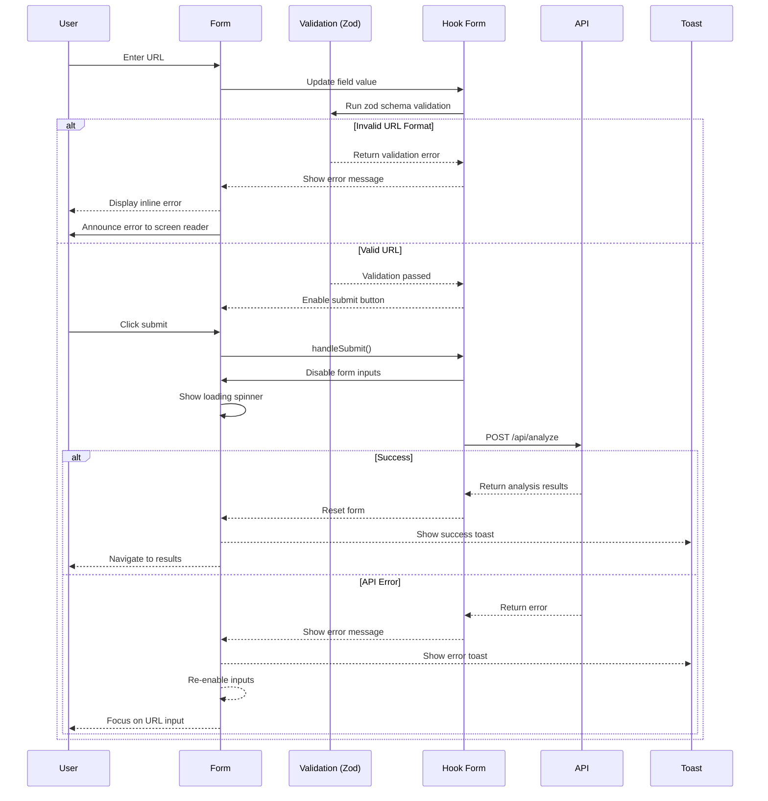
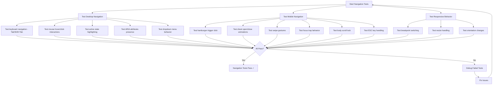
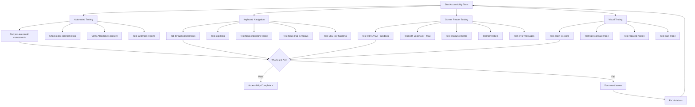

# Implementation Plan: Story 3-1 Foundation Fixes & shadcn Migration

## Metadata

- **Story File**: story-3-1-foundation-fixes-shadcn-migration.md
- **Created**: 2025-08-31
- **Last Updated**: 2025-08-31 (Revised for direct replacement)
- **BMad Version**: 4.40.1
- **Generated By**: Claude Opus 4.1

## Story Reference

Migrate the existing UI foundation to use proper shadcn/ui components, ensuring React 19 compatibility, WCAG 2.1 AA accessibility standards, and comprehensive test coverage. This includes replacing custom navigation with NavigationMenu, implementing Sheet for mobile menu, migrating forms to use shadcn Form components with react-hook-form, and fixing all React 19 deprecation warnings.

## Plan Amendments (Direct Replacement Approach)

### Changes from Original Plan
1. **No Feature Flags**: Removed all feature flag logic - components will be directly replaced
2. **Immediate Migration**: All components updated in a single implementation pass
3. **Simplified Testing**: No A/B testing or gradual rollout - test once after full migration
4. **Faster Timeline**: Reduced from 5 days to 1-2 days total implementation time
5. **Direct File Updates**: Modify existing component files rather than creating parallel versions

### Benefits of Direct Replacement
- Simpler codebase without conditional logic
- No maintenance of dual implementations
- Faster migration completion
- Cleaner git history
- Reduced testing complexity

## 1. Architectural Decisions

### 1.1 Component Migration Strategy
**Decision**: Direct replacement of all components in one comprehensive update
**Rationale**: Simpler implementation without feature flag complexity, faster migration
**Implementation**:
- Replace all custom components with shadcn equivalents immediately
- Update all imports and references in a single pass
- Test thoroughly before committing changes
- No dual implementations or gradual rollout needed

### 1.2 shadcn/ui Component Selection
**Decision**: Use official shadcn/ui components with minimal customization
**Rationale**: Ensures consistency, maintainability, and receives upstream updates
**Required Components**:
- `navigation-menu` - Replace custom navigation with proper dropdown support
- `sheet` - Replace mobile menu overlay with accessible drawer
- `form` - Standardize form handling with react-hook-form integration
- `toast` - Already installed, needs React 19 compatibility fixes
- `button`, `input`, `card` - Already installed, need accessibility attribute updates

### 1.3 React 19 Compatibility Approach
**Decision**: Update deprecated patterns incrementally with TypeScript enforcement
**Rationale**: TypeScript will catch most deprecations at compile time, reducing runtime errors
**Key Changes**:
- Replace `defaultProps` with default parameters in function signatures
- Update `children` type from `React.ReactNode` to proper types
- Fix `forwardRef` usage with proper generic typing
- Update event handlers to use new React 19 delegation patterns
- Remove string refs if any exist

### 1.4 Testing Architecture
**Decision**: Jest + React Testing Library with accessibility assertions
**Rationale**: Existing setup that just needs enhancement for comprehensive accessibility testing
**Implementation**:
- Add `@testing-library/jest-dom` custom matchers
- Include `jest-axe` for automated WCAG testing
- Test keyboard navigation explicitly with userEvent
- Mock shadcn components at Radix primitive level for unit tests
- Add visual regression tests for UI consistency

### 1.5 State Management for Migration
**Decision**: Use local component state with Context for theme/navigation state
**Rationale**: Keeps migration simple without introducing new state management
**Implementation**:
- Navigation open/close state in Sheet component
- Form state managed by react-hook-form
- Theme state remains in next-themes
- No global state management needed for this story

## 2. Component Structure Definitions

### 2.1 NavigationMenu Implementation
```typescript
// src/components/layout/navigation-shadcn.tsx
interface NavigationMenuProps {
  items: NavItem[]
  className?: string
  ariaLabel?: string
  orientation?: 'horizontal' | 'vertical'
}

interface NavItem {
  label: string
  href: string
  icon?: LucideIcon
  external?: boolean
  ariaLabel?: string
  children?: NavItem[] // For dropdown support
}

// Component structure:
<NavigationMenu className={cn("z-50", className)} aria-label={ariaLabel}>
  <NavigationMenuList>
    {items.map((item) => (
      <NavigationMenuItem key={item.href}>
        {item.children ? (
          <>
            <NavigationMenuTrigger>{item.label}</NavigationMenuTrigger>
            <NavigationMenuContent>
              {item.children.map((child) => (
                <NavigationMenuLink key={child.href} href={child.href}>
                  {child.label}
                </NavigationMenuLink>
              ))}
            </NavigationMenuContent>
          </>
        ) : (
          <NavigationMenuLink href={item.href}>
            {item.icon && <item.icon className="mr-2 h-4 w-4" />}
            {item.label}
          </NavigationMenuLink>
        )}
      </NavigationMenuItem>
    ))}
  </NavigationMenuList>
</NavigationMenu>
```

### 2.2 Sheet Component (Mobile Menu)
```typescript
// src/components/layout/mobile-nav-shadcn.tsx
interface MobileNavProps {
  items: NavItem[]
  open?: boolean
  onOpenChange?: (open: boolean) => void
  side?: 'left' | 'right'
  className?: string
}

// Component structure:
<Sheet open={open} onOpenChange={onOpenChange}>
  <SheetTrigger asChild>
    <Button 
      variant="ghost" 
      size="icon"
      aria-label="Open navigation menu"
      className="md:hidden"
    >
      <Menu className="h-5 w-5" />
    </Button>
  </SheetTrigger>
  <SheetContent side={side} className="w-[300px] sm:w-[400px]">
    <SheetHeader>
      <SheetTitle>Navigation</SheetTitle>
      <SheetDescription className="sr-only">
        Main navigation menu
      </SheetDescription>
    </SheetHeader>
    <nav className="flex flex-col gap-4 mt-8">
      {items.map((item) => (
        <Link
          key={item.href}
          href={item.href}
          onClick={() => onOpenChange?.(false)}
          className="flex items-center gap-2 text-lg font-medium"
        >
          {item.icon && <item.icon className="h-5 w-5" />}
          {item.label}
        </Link>
      ))}
    </nav>
  </SheetContent>
</Sheet>
```

### 2.3 Form Components Structure
```typescript
// src/components/analysis/url-input-form-shadcn.tsx
import { useForm } from 'react-hook-form'
import { zodResolver } from '@hookform/resolvers/zod'
import * as z from 'zod'

const formSchema = z.object({
  url: z.string()
    .min(1, 'URL is required')
    .url('Please enter a valid URL')
    .refine((url) => {
      try {
        const parsed = new URL(url)
        return ['http:', 'https:'].includes(parsed.protocol)
      } catch {
        return false
      }
    }, 'URL must start with http:// or https://')
})

interface UrlInputFormProps {
  onSubmit: (url: string) => Promise<void>
  disabled?: boolean
  className?: string
}

// Updated component structure (replace existing):
export function UrlInputForm({ onSubmit, disabled, className }: UrlInputFormProps) {
  const form = useForm<z.infer<typeof formSchema>>({
    resolver: zodResolver(formSchema),
    defaultValues: { url: '' },
    mode: 'onChange'
  })

  return (
    <Form {...form}>
      <form onSubmit={form.handleSubmit(async (data) => {
        await onSubmit(data.url)
      })} className={cn("space-y-4", className)}>
        <FormField
          control={form.control}
          name="url"
          render={({ field }) => (
            <FormItem>
              <FormLabel>URL to Analyze</FormLabel>
              <FormControl>
                <div className="relative">
                  <Input
                    {...field}
                    type="url"
                    placeholder="https://example.com"
                    disabled={disabled || form.formState.isSubmitting}
                    className="pr-24"
                    aria-describedby="url-description url-error"
                  />
                  <Button
                    type="submit"
                    disabled={disabled || form.formState.isSubmitting || !form.formState.isValid}
                    className="absolute right-0 top-0"
                  >
                    {form.formState.isSubmitting ? (
                      <Spinner className="h-4 w-4" />
                    ) : (
                      'Analyze'
                    )}
                  </Button>
                </div>
              </FormControl>
              <FormDescription id="url-description">
                Enter a URL to check for potential security risks
              </FormDescription>
              <FormMessage id="url-error" role="alert" />
            </FormItem>
          )}
        />
      </form>
    </Form>
  )
}
```

## 3. System Architecture Diagrams

### 3.1 Component Migration Flow


### 3.2 Component Dependency Graph
```mermaid
graph LR
    A[App Layout] --> B[Header Component]
    B --> C{Navigation Type}
    C -->|Desktop| D[NavigationMenu]
    C -->|Mobile| E[Sheet + MobileNav]
    
    D --> F[@radix-ui/react-navigation-menu]
    E --> G[@radix-ui/react-dialog]
    
    A --> H[Main Content]
    H --> I[URL Input Form]
    I --> J[Form Component]
    J --> K[react-hook-form]
    J --> L[@hookform/resolvers]
    J --> M[zod validation]
    
    B --> N[ThemeToggle]
    N --> O[next-themes]
    
    F --> P[Radix Primitives]
    G --> P
    P --> Q[React 19 DOM]
```

### 3.3 Testing Architecture


## 4. Interaction Sequence Diagrams

### 4.1 Navigation Menu Interaction


### 4.2 Mobile Menu Sheet Interaction


### 4.3 Form Submission with Validation


## 5. Implementation Pseudo-Code

### 5.1 Navigation Menu Migration
```
FUNCTION migrateNavigation()
    // Step 1: Install shadcn navigation-menu (if not already installed)
    IF NOT EXISTS @/components/ui/navigation-menu.tsx THEN
        EXECUTE: npx shadcn@latest add navigation-menu
    END IF
    
    // Step 2: Update existing navigation component
    OPEN FILE: src/components/layout/navigation.tsx
    
    // Step 3: Implement navigation structure
    DEFINE navigationItems = [
        { label: "Home", href: "/", icon: Home },
        { label: "API Docs", href: "/api-docs", icon: FileText },
        { label: "About", href: "/about", icon: Info }
    ]
    
    FOR EACH navItem IN navigationItems
        IF navItem.hasChildren THEN
            CREATE NavigationMenuItem with trigger
            SET aria-expanded based on open state
            FOR EACH child IN navItem.children
                ADD NavigationMenuLink to content
                SET aria-current="page" if active
            END FOR
        ELSE
            CREATE NavigationMenuItem with direct link
            USE Next.js Link for client-side navigation
            SET aria-current="page" if pathname matches
        END IF
    END FOR
    
    // Step 4: Add accessibility attributes
    SET aria-label="Main navigation" on NavigationMenu
    SET role="navigation" on container
    ENSURE Tab/Shift+Tab keyboard navigation works
    ADD Escape key handler to close dropdowns
    
    // Step 5: Integrate with existing routing
    USE usePathname() hook from next/navigation
    COMPARE pathname with item.href for active state
    APPLY active styles using cn() utility
    
    // Step 6: Replace navigation in Header component
    REMOVE import of './navigation'
    IMPORT NavigationMenu from '@/components/ui/navigation-menu'
    UPDATE all references to use new NavigationMenu
    DELETE old navigation.tsx file
END FUNCTION
```

### 5.2 Mobile Menu Sheet Implementation
```
FUNCTION implementMobileSheet()
    // Step 1: Install sheet component
    EXECUTE: npx shadcn@latest add sheet
    
    // Step 2: Update existing mobile navigation component
    OPEN FILE: src/components/layout/mobile-nav.tsx
    
    // Step 3: Setup sheet structure
    INITIALIZE state: 
        open = false
        lastFocusedElement = null
    
    ON hamburgerClick
        SET lastFocusedElement = document.activeElement
        SET open = true
        LOCK body scroll (overflow: hidden)
        ANNOUNCE "Navigation menu opened" to screen readers
        FOCUS first navigation item after animation
    END ON
    
    ON closeRequest (overlay click, ESC, nav item click)
        SET open = false
        UNLOCK body scroll
        RESTORE focus to lastFocusedElement
        ANNOUNCE "Navigation menu closed" to screen readers
    END ON
    
    // Step 4: Implement swipe gestures for mobile
    INITIALIZE touch tracking:
        startX = 0
        currentX = 0
        isDragging = false
    
    ON touchStart
        SET startX = touch.clientX
        SET isDragging = true
        DISABLE scroll during drag
    END ON
    
    ON touchMove
        IF isDragging THEN
            SET currentX = touch.clientX
            SET translateX = Math.max(0, currentX - startX)
            APPLY transform: translateX(${translateX}px)
            
            IF translateX > SWIPE_THRESHOLD THEN
                ADD closing visual feedback
            END IF
        END IF
    END ON
    
    ON touchEnd
        IF isDragging THEN
            IF currentX - startX > SWIPE_THRESHOLD THEN
                TRIGGER close animation
                SET open = false
            ELSE
                ANIMATE back to open position
            END IF
            SET isDragging = false
            ENABLE scroll
        END IF
    END ON
    
    // Step 5: Focus trap implementation
    ON Tab key press
        GET focusable elements in sheet
        IF current focus is last element AND not shift THEN
            PREVENT default
            FOCUS first element
        ELSE IF current focus is first element AND shift THEN
            PREVENT default
            FOCUS last element
        END IF
    END ON
END FUNCTION
```

### 5.3 Form Component Migration
```
FUNCTION migrateFormComponents()
    // Step 1: Install form components
    EXECUTE: npx shadcn@latest add form
    EXECUTE: npm install react-hook-form @hookform/resolvers
    
    // Step 2: Update url-input-form.tsx component
    OPEN FILE: src/components/analysis/url-input-form.tsx
    
    // Step 3: Define Zod schema with comprehensive validation
    CREATE urlSchema = z.object({
        url: z.string()
            .min(1, "URL is required")
            .transform(val => {
                // Auto-add protocol if missing
                IF !val.startsWith('http') THEN
                    RETURN 'https://' + val
                END IF
                RETURN val
            })
            .pipe(
                z.string().url("Please enter a valid URL")
            )
            .refine(async (url) => {
                // Check for malicious patterns
                RETURN !containsSQLInjection(url) && !containsXSS(url)
            }, "URL contains potentially malicious content")
    })
    
    // Step 3: Setup react-hook-form with configuration
    INITIALIZE form = useForm({
        resolver: zodResolver(urlSchema),
        defaultValues: { url: "" },
        mode: "onChange", // Real-time validation
        reValidateMode: "onChange",
        criteriaMode: "all" // Show all errors
    })
    
    // Step 4: Handle form submission with error recovery
    ON form.handleSubmit(data)
        TRY
            SET isSubmitting = true
            DISABLE all form inputs
            SHOW loading spinner in button
            
            // Add timeout for slow connections
            response = AWAIT Promise.race([
                apiClient.analyze(data.url),
                new Promise((_, reject) => 
                    setTimeout(() => reject(new Error('Timeout')), 30000)
                )
            ])
            
            IF response.success THEN
                SHOW success toast: "Analysis complete!"
                RESET form to initial state
                NAVIGATE to results page with data
            ELSE
                SET form.setError('url', {
                    type: 'manual',
                    message: response.error
                })
            END IF
        CATCH error
            IF error.message === 'Timeout' THEN
                SET form.setError('url', {
                    type: 'manual',
                    message: 'Request timed out. Please try again.'
                })
            ELSE IF error.code === 'NETWORK_ERROR' THEN
                SET form.setError('url', {
                    type: 'manual',
                    message: 'Network error. Check your connection.'
                })
            ELSE
                SET form.setError('url', {
                    type: 'manual',
                    message: 'An unexpected error occurred.'
                })
            END IF
            LOG error to monitoring service
        FINALLY
            SET isSubmitting = false
            ENABLE form inputs
            IF error THEN
                FOCUS URL input field
            END IF
        END TRY
    END ON
    
    // Step 5: Real-time validation feedback with debouncing
    ON field.onChange
        CANCEL previous debounce timer
        START new debounce timer (100ms)
        
        ON debounce timeout
            RUN validation
            IF hasError THEN
                SHOW error message with icon
                ADD aria-invalid="true" to input
                ANNOUNCE error to screen reader
                
                IF error.type === 'missing_protocol' THEN
                    SHOW suggestion: "Did you mean https://...?"
                ELSE IF error.type === 'invalid_domain' THEN
                    CHECK for typos and suggest corrections
                END IF
            ELSE
                SHOW success checkmark
                ADD aria-invalid="false" to input
            END IF
        END ON
    END ON
    
    // Step 6: Keyboard shortcuts
    ON keyboard event
        IF key === 'Enter' AND form.isValid THEN
            TRIGGER form submission
        ELSE IF key === 'Escape' THEN
            CLEAR form if has value
            BLUR input field
        END IF
    END ON
END FUNCTION
```

### 5.4 React 19 Compatibility Fixes
```
FUNCTION fixReact19Deprecations()
    // Step 1: Find and replace defaultProps
    FOR EACH component IN src/components/**
        IF component.defaultProps EXISTS THEN
            MOVE defaults to function parameters
            // Before: Component.defaultProps = { size: 'md' }
            // After: function Component({ size = 'md' }) {}
        END IF
    END FOR
    
    // Step 2: Update forwardRef usage
    FOR EACH forwardRef IN codebase
        UPDATE to use generic syntax
        // Before: forwardRef((props, ref) => {})
        // After: forwardRef<HTMLDivElement, Props>((props, ref) => {})
    END FOR
    
    // Step 3: Fix children prop types
    FOR EACH component WITH children
        IF children type is React.ReactNode THEN
            UPDATE based on usage:
            - React.ReactElement for single elements
            - React.ReactElement[] for multiple
            - React.ReactNode for mixed content
        END IF
    END FOR
    
    // Step 4: Update event handlers
    FOR EACH event handler
        IF using inline arrow functions THEN
            CONSIDER moving to useCallback for performance
        END IF
        UPDATE event types to latest React types
    END FOR
    
    // Step 5: Remove string refs if any
    FOR EACH ref IN codebase
        IF ref is string THEN
            REPLACE with useRef() hook
            UPDATE ref access from this.refs[name] to ref.current
        END IF
    END FOR
END FUNCTION
```

## 6. Test Scenario Diagrams

### 6.1 Navigation Testing Flow


### 6.2 Form Validation Testing
```mermaid
graph TD
    A[Start Form Tests] --> B[Test Valid URLs]
    B --> B1[https://example.com]
    B --> B2[http://test.org]
    B --> B3[www.site.net - auto-protocol]
    B --> B4[subdomain.example.com]
    B --> B5[example.com:8080/path]
    
    A --> C[Test Invalid URLs]
    C --> C1[Empty string]
    C --> C2[javascript:alert()]
    C --> C3[<script>alert()</script>]
    C --> C4['; DROP TABLE users]
    C --> C5[Not a URL at all]
    
    A --> D[Test Edge Cases]
    D --> D1[International domains - IDN]
    D --> D2[Very long URLs - 2000+ chars]
    D --> D3[Special characters in path]
    D --> D4[Multiple subdomains]
    D --> D5[IP addresses]
    
    A --> E[Test Accessibility]
    E --> E1[Screen reader announcements]
    E --> E2[Error message association]
    E --> E3[Keyboard submission - Enter key]
    E --> E4[Focus management on error]
    E --> E5[ARIA attributes]
    
    A --> F[Test User Experience]
    F --> F1[Loading states]
    F --> F2[Error recovery]
    F --> F3[Auto-correction suggestions]
    F --> F4[Debounced validation]
    
    B1 --> G{Validate Results}
    C1 --> G
    D1 --> G
    E1 --> G
    F1 --> G
    
    G -->|All Pass| H[Form Tests Complete ✓]
    G -->|Failures| I[Investigate Failures]
    I --> J[Fix Issues]
    J --> A
```

### 6.3 Accessibility Testing Flow


## 7. Code Patterns & Conventions

### 7.1 Existing Patterns to Follow
```typescript
// Component Organization
src/components/
  ui/           # Base shadcn components
  layout/       # Layout components
  analysis/     # Feature-specific components

// Import ordering
import React from 'react'                    // React
import { useRouter } from 'next/navigation'  // Next.js
import { Button } from '@/components/ui'     // Internal UI
import { cn } from '@/lib/utils'             // Utilities
import type { ComponentProps } from './types' // Types

// Naming conventions
ComponentName.tsx        // PascalCase for components
useHookName.ts          // camelCase with 'use' prefix
utilityFunction.ts      // camelCase for utilities
CONSTANT_VALUE          // UPPER_SNAKE_CASE for constants

// File structure within component
1. Imports
2. Type definitions
3. Constants
4. Component function
5. Named exports
```

### 7.2 shadcn Integration Patterns
```typescript
// Always use cn() for className merging
import { cn } from '@/lib/utils'

<NavigationMenu 
  className={cn(
    "default-classes from-shadcn",
    "custom-overrides",
    className // Allow parent overrides
  )}
>

// Proper forwardRef for React 19
import * as React from 'react'

const Component = React.forwardRef<
  HTMLDivElement,
  React.HTMLAttributes<HTMLDivElement> & {
    customProp?: string
  }
>(({ className, customProp, ...props }, ref) => {
  return (
    <div 
      ref={ref} 
      className={cn("base-styles", className)} 
      {...props}
    />
  )
})
Component.displayName = "Component"

// Use CSS variables for theming (defined in globals.css)
<div className="bg-background text-foreground border-border">
  <h1 className="text-primary">Title</h1>
  <p className="text-muted-foreground">Description</p>
</div>

// Composition pattern for complex components
export function ComplexComponent({ children, ...props }) {
  return (
    <Card {...props}>
      <CardHeader>
        <CardTitle>Title</CardTitle>
      </CardHeader>
      <CardContent>{children}</CardContent>
    </Card>
  )
}
```

### 7.3 Testing Patterns
```typescript
// Test file organization
import { render, screen, fireEvent, waitFor } from '@testing-library/react'
import userEvent from '@testing-library/user-event'
import { axe, toHaveNoViolations } from 'jest-axe'
import { NavigationMenu } from './navigation-menu'

expect.extend(toHaveNoViolations)

describe('NavigationMenu', () => {
  // Accessibility tests
  it('should have no accessibility violations', async () => {
    const { container } = render(<NavigationMenu items={[]} />)
    const results = await axe(container)
    expect(results).toHaveNoViolations()
  })

  // Keyboard navigation tests
  it('should handle keyboard navigation', async () => {
    const user = userEvent.setup()
    render(<NavigationMenu items={mockItems} />)
    
    const firstLink = screen.getByRole('link', { name: /home/i })
    await user.tab()
    expect(firstLink).toHaveFocus()
    
    await user.keyboard('{Enter}')
    expect(mockNavigate).toHaveBeenCalledWith('/')
  })

  // Component behavior tests
  it('should show dropdown on hover', async () => {
    const user = userEvent.setup()
    render(<NavigationMenu items={itemsWithChildren} />)
    
    const trigger = screen.getByRole('button', { name: /products/i })
    await user.hover(trigger)
    
    await waitFor(() => {
      expect(screen.getByRole('menu')).toBeVisible()
    })
  })

  // Mobile responsiveness tests
  it('should show hamburger menu on mobile', () => {
    // Mock mobile viewport
    window.matchMedia = jest.fn().mockImplementation(query => ({
      matches: query === '(max-width: 768px)',
      media: query,
      addEventListener: jest.fn(),
      removeEventListener: jest.fn(),
    }))
    
    render(<Header />)
    expect(screen.getByLabelText(/open navigation/i)).toBeInTheDocument()
  })
})

// Mock Radix UI components for unit tests
jest.mock('@radix-ui/react-navigation-menu', () => ({
  Root: ({ children, ...props }) => <nav {...props}>{children}</nav>,
  List: ({ children }) => <ul>{children}</ul>,
  Item: ({ children }) => <li>{children}</li>,
  Trigger: ({ children, ...props }) => <button {...props}>{children}</button>,
  Content: ({ children }) => <div>{children}</div>,
  Link: ({ children, ...props }) => <a {...props}>{children}</a>,
}))
```

### 7.4 Performance Patterns
```typescript
// Lazy load heavy components
const TechnicalDetails = React.lazy(() => 
  import('@/components/analysis/technical-details')
)

// Memoize expensive computations
const expensiveValue = React.useMemo(() => 
  computeExpensiveValue(data), 
  [data]
)

// Use callback for stable function references
const handleSubmit = React.useCallback(async (url: string) => {
  await analyzeUrl(url)
}, [analyzeUrl])

// Optimize re-renders with memo
export const NavigationItem = React.memo(({ item, isActive }) => {
  return <Link href={item.href}>{item.label}</Link>
})
```

## 8. Potential Pitfalls & Mitigation

### 8.1 React 19 Breaking Changes
**Pitfall**: Direct children manipulation deprecated
**Mitigation**: 
```typescript
// Don't do this
React.Children.map(children, child => 
  React.cloneElement(child, { extra: prop })
)

// Do this instead
const childrenWithProps = React.Children.map(children, child => {
  if (React.isValidElement(child)) {
    return React.cloneElement(child, { extra: prop })
  }
  return child
})
```

**Pitfall**: defaultProps deprecated
**Mitigation**:
```typescript
// Don't do this
Component.defaultProps = { size: 'medium' }

// Do this instead
function Component({ size = 'medium', ...props }) {}
```

**Pitfall**: Legacy context API removed
**Mitigation**: Already using modern Context API, no changes needed

### 8.2 shadcn Component Issues
**Pitfall**: CSS variable conflicts with existing styles
**Mitigation**: 
- Check globals.css for conflicting variable names
- Namespace custom variables: `--custom-*` vs `--shadcn-*`
- Use shadcn's CSS variable system consistently

**Pitfall**: Radix UI portal elements breaking layout
**Mitigation**:
```typescript
// Configure portal container in layout.tsx
<body>
  <div id="portal-root" />
  {children}
</body>

// Use portal root in components
<NavigationMenuContent container={document.getElementById('portal-root')} />
```

**Pitfall**: Theme switching not working with shadcn
**Mitigation**: Ensure next-themes wraps the entire app properly:
```typescript
// app/layout.tsx
<ThemeProvider attribute="class" defaultTheme="system" enableSystem>
  {children}
</ThemeProvider>
```

### 8.3 Mobile Performance
**Pitfall**: Sheet animation janky on low-end devices
**Mitigation**:
```css
/* Use GPU-accelerated properties */
.sheet-content {
  transform: translateX(100%);
  will-change: transform;
}

/* Respect reduced motion */
@media (prefers-reduced-motion: reduce) {
  .sheet-content {
    animation: none;
    transition: none;
  }
}
```

### 8.4 Testing Challenges
**Pitfall**: Radix UI portals hard to test
**Mitigation**:
```typescript
// Use within() to query portal content
import { within } from '@testing-library/react'

const portalRoot = document.getElementById('portal-root')
const { getByRole } = within(portalRoot)
const menu = getByRole('menu')
```

**Pitfall**: Async animations breaking tests
**Mitigation**:
```typescript
// Wait for animations to complete
await waitFor(() => {
  expect(element).toBeVisible()
}, { timeout: 1000 })

// Or mock animations in test setup
jest.mock('framer-motion', () => ({
  motion: {
    div: ({ children, ...props }) => <div {...props}>{children}</div>
  }
}))
```

## 9. Implementation Steps

### Phase 1: Setup & Navigation (2-3 hours)
- [ ] Install NavigationMenu: `npx shadcn@latest add navigation-menu` (already done)
- [ ] Replace existing navigation.tsx with shadcn implementation
- [ ] Update header.tsx to use new NavigationMenu
- [ ] Add keyboard navigation support
- [ ] Write comprehensive unit tests
- [ ] Verify WCAG 2.1 AA compliance
- [ ] Delete old navigation component

### Phase 2: Mobile Menu (2-3 hours)
- [ ] Install Sheet: `npx shadcn@latest add sheet`
- [ ] Replace existing mobile-nav.tsx with Sheet implementation
- [ ] Implement hamburger menu trigger
- [ ] Add swipe gesture support
- [ ] Implement focus trap
- [ ] Add body scroll lock
- [ ] Test on real devices (iOS, Android)

### Phase 3: Form Components (3-4 hours)
- [ ] Install Form: `npx shadcn@latest add form`
- [ ] Install dependencies: `npm install react-hook-form @hookform/resolvers`
- [ ] Update url-input-form.tsx to use shadcn Form
- [ ] Setup Zod validation schema
- [ ] Implement real-time validation
- [ ] Add error handling and recovery
- [ ] Test all validation scenarios

### Phase 4: React 19 Fixes (2 hours)
- [ ] Audit codebase for deprecation warnings
- [ ] Replace defaultProps with default parameters
- [ ] Fix forwardRef typing
- [ ] Update children prop types
- [ ] Remove any string refs
- [ ] Run full test suite
- [ ] Check TypeScript compilation

### Phase 5: Testing & Documentation (2-3 hours)
- [ ] Achieve 80%+ test coverage
- [ ] Run accessibility audit with jest-axe
- [ ] Test with screen readers (NVDA, VoiceOver)
- [ ] Performance testing with Lighthouse
- [ ] Update component documentation
- [ ] Create migration guide for team
- [ ] Prepare deployment plan

## 10. Success Criteria

### Functional Requirements
- ✅ NavigationMenu component fully replaces custom navigation
- ✅ Sheet component handles mobile menu with gestures
- ✅ Form components use react-hook-form with Zod validation
- ✅ All components directly replaced with shadcn
- ✅ Existing functionality preserved

### Technical Requirements
- ✅ Zero React 19 deprecation warnings
- ✅ Zero TypeScript compilation errors
- ✅ Zero ESLint violations
- ✅ 80%+ test coverage achieved
- ✅ All tests passing

### Accessibility Requirements
- ✅ WCAG 2.1 AA compliance verified
- ✅ Keyboard navigation fully functional
- ✅ Screen reader compatibility confirmed
- ✅ Focus management implemented correctly
- ✅ Color contrast ratios meet standards

### Performance Requirements
- ✅ No increase in bundle size > 10KB
- ✅ First Input Delay < 100ms
- ✅ No layout shift from component changes
- ✅ Smooth animations at 60fps
- ✅ Mobile performance optimized

## Implementation Status

- [x] Planning Complete
- [ ] Architecture Decisions Implemented
- [ ] Component Structure Built
- [ ] Integration Points Connected
- [ ] Testing Complete
- [ ] Story Acceptance Criteria Met

## Revised Timeline

**Total Implementation Time**: 12-15 hours (1-2 days)

- Phase 1: Navigation (2-3 hours)
- Phase 2: Mobile Menu (2-3 hours)
- Phase 3: Forms (3-4 hours)
- Phase 4: React 19 Fixes (2 hours)
- Phase 5: Testing (2-3 hours)

---

This revised implementation plan provides comprehensive guidance for directly migrating to shadcn/ui components without feature flags. The direct replacement approach simplifies implementation while ensuring React 19 compatibility, accessibility standards, and high code quality.