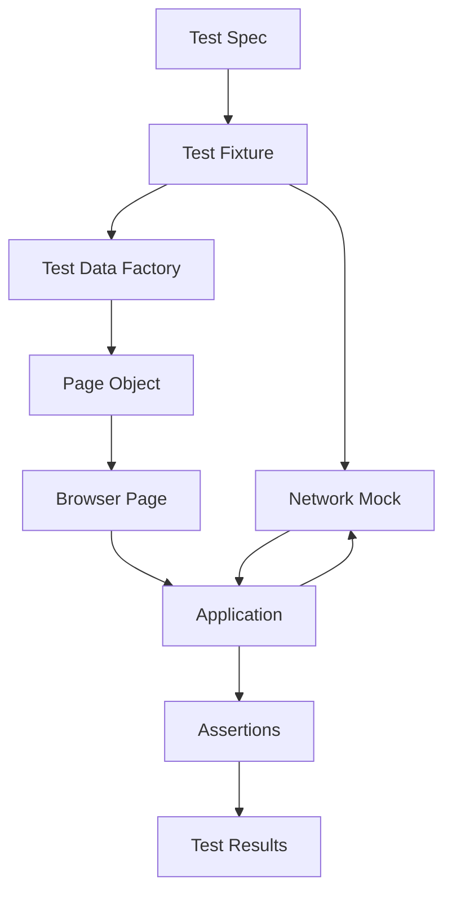
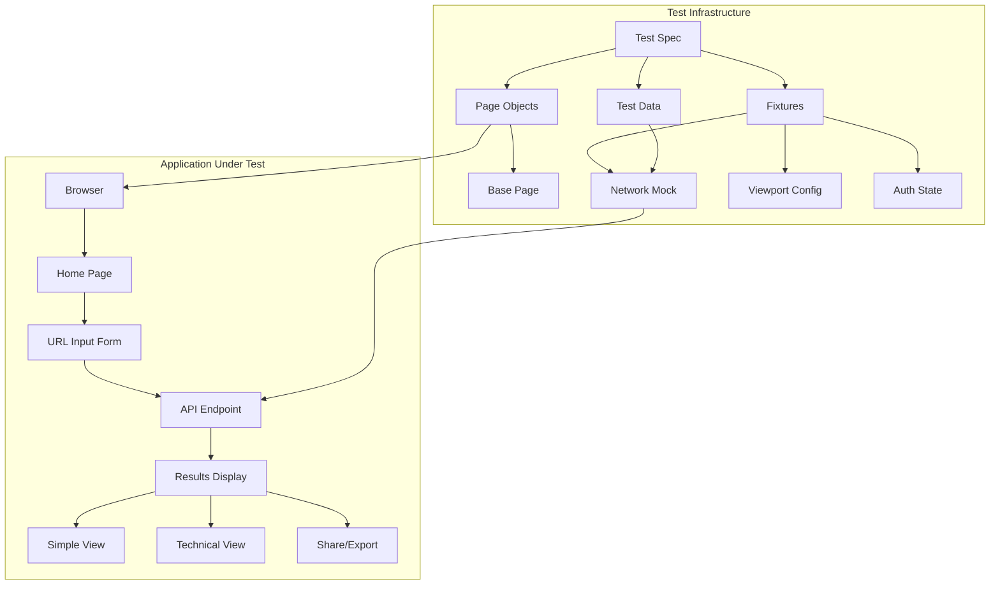
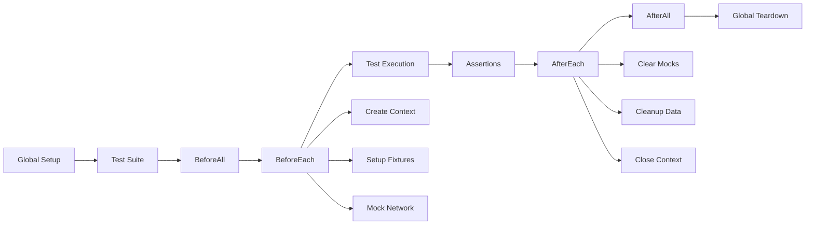
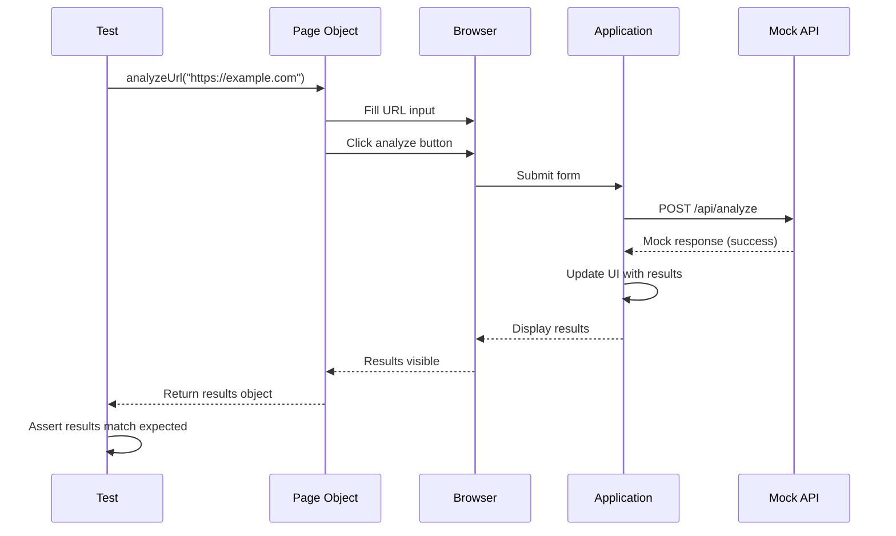
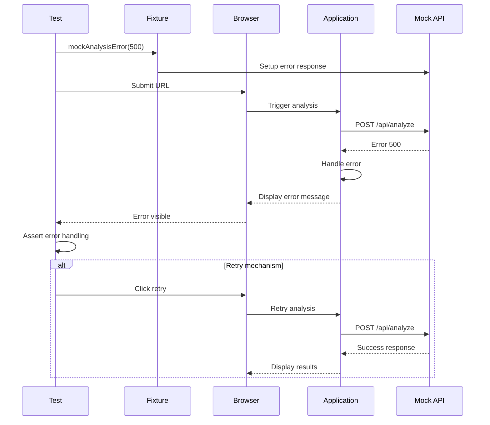
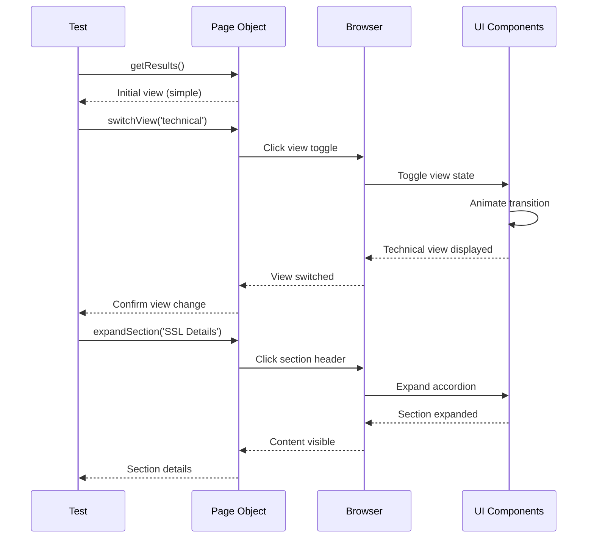
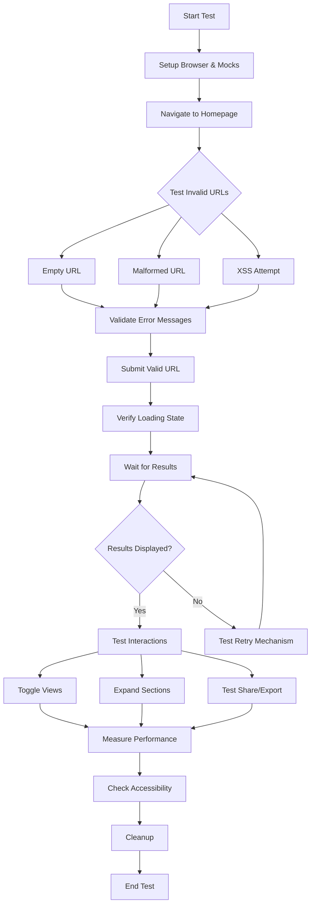
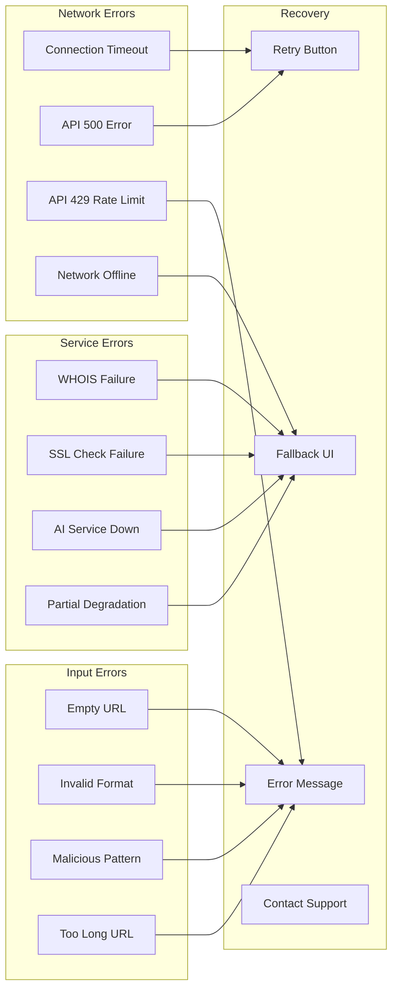
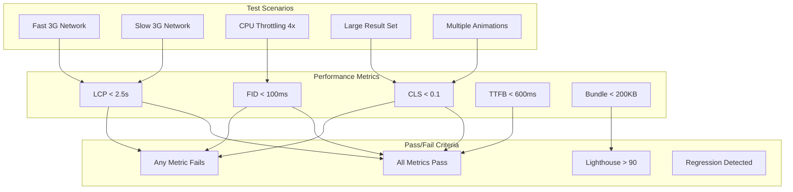

# Implementation Plan: Story 3-14 User Flows E2E Testing

## Metadata

- **Story File**: story-3-14-user-flows-e2e-testing.md
- **Created**: 2025-09-02
- **Last Updated**: 2025-09-02
- **BMad Version**: v4.40.1
- **Generated By**: Claude Opus 4.1

## Story Reference

Comprehensive E2E test coverage for complete user journeys in the scam checker application, ensuring reliable functionality across all user scenarios, browsers, and interaction patterns with performance and accessibility validation.

## 1. Architectural Decisions

### 1.1 Design Pattern Selection

**Page Object Model (POM) Pattern**
- **Rationale**: Encapsulates page-specific logic, improves maintainability, reduces duplication
- **Existing Pattern**: Similar to API client pattern in `tests/e2e/api/helpers/api-client.ts`
- **Adaptation**: Create page classes for each major UI component with methods for interaction and assertions

**Test Fixture Pattern**
- **Rationale**: Provides consistent test setup/teardown, enables network mocking, manages test data
- **Existing Pattern**: Jest fixtures in `tests/e2e/api/helpers/test-config.ts`
- **Adaptation**: Playwright fixtures for authentication, network stubs, viewport configuration

**Builder Pattern for Test Data**
- **Rationale**: Flexible test data creation with sensible defaults
- **Existing Pattern**: None identified, new pattern introduction
- **Adaptation**: Test data builders for analysis results, error scenarios, performance metrics

### 1.2 Library and Framework Choices

**Core Testing Stack**:
- Playwright 1.55.0 (already installed) - Cross-browser E2E testing
- @playwright/test assertions - Built-in assertion library
- playwright-axe (new dependency) - Accessibility testing integration
- lighthouse (new dependency) - Performance metrics collection

**Utility Libraries**:
- faker 9.3.0 (new dependency) - Realistic test data generation
- wait-for-expect 3.0.2 (new dependency) - Retry assertions for async operations

**Version Compatibility**:
- All libraries compatible with Node.js 22.x and TypeScript 5.9.2
- Playwright 1.55.0 supports Chrome 131, Firefox 134, Safari 18.2

### 1.3 Module Organization Strategy

```
tests/e2e/
├── fixtures/                    # Shared test fixtures
│   ├── auth.fixture.ts         # Authentication state management
│   ├── network.fixture.ts      # Network mocking utilities
│   └── viewport.fixture.ts     # Device/viewport configurations
├── pages/                      # Page Object Models
│   ├── base.page.ts           # Base page class with common methods
│   ├── home.page.ts           # Homepage interactions
│   ├── analysis.page.ts       # Analysis form and results
│   └── components/            # Reusable component POMs
│       ├── url-input.ts       # URL input form component
│       ├── results-display.ts # Results display component
│       └── risk-gauge.ts      # Risk gauge component
├── user-flows/                 # Stubbed deterministic tests
│   ├── complete-analysis.spec.ts
│   ├── results-interaction.spec.ts
│   ├── error-scenarios.spec.ts
│   ├── accessibility.spec.ts
│   └── performance.spec.ts
├── live/                       # Live-local integration tests
│   ├── real-analysis.spec.ts
│   └── service-integration.spec.ts
├── helpers/                    # Test utilities
│   ├── test-data.ts           # Test data factories
│   ├── assertions.ts          # Custom assertions
│   └── performance.ts         # Performance measurement utilities
└── cross-browser/             # Browser-specific tests
    └── compatibility.spec.ts
```

### 1.4 API Contract Analysis

**No Breaking Changes** - This story adds test coverage only, no API modifications required.

## 2. Component Structure

### 2.1 Detailed Module Design

**Base Page Object** (`tests/e2e/pages/base.page.ts`):
```typescript
export abstract class BasePage {
  constructor(protected page: Page) {}
  
  async navigate(path: string): Promise<void>
  async waitForLoad(): Promise<void>
  async takeScreenshot(name: string): Promise<void>
  async checkAccessibility(): Promise<AxeResults>
  async measurePerformance(): Promise<PerformanceMetrics>
  protected async waitForSelector(selector: string): Promise<void>
}
```

**Analysis Page Object** (`tests/e2e/pages/analysis.page.ts`):
```typescript
export class AnalysisPage extends BasePage {
  // Locators
  readonly urlInput: Locator
  readonly analyzeButton: Locator
  readonly loadingIndicator: Locator
  readonly resultsContainer: Locator
  readonly viewToggle: Locator
  
  // Methods
  async analyzeUrl(url: string): Promise<void>
  async waitForResults(): Promise<void>
  async getResults(): Promise<AnalysisResult>
  async switchView(view: 'simple' | 'technical'): Promise<void>
  async expandSection(section: string): Promise<void>
  async shareResults(method: ShareMethod): Promise<void>
  async exportResults(format: ExportFormat): Promise<void>
}
```

**Test Fixture** (`tests/e2e/fixtures/network.fixture.ts`):
```typescript
export const networkFixture = {
  mockAnalysisSuccess: async (page: Page, response: AnalysisResult): Promise<void>
  mockAnalysisError: async (page: Page, error: ApiError): Promise<void>
  mockServiceTimeout: async (page: Page, service: string): Promise<void>
  mockPartialDegradation: async (page: Page, failedServices: string[]): Promise<void>
}
```

### 2.2 Interface and Type Definitions

```typescript
// tests/e2e/types/test-types.ts

export interface TestAnalysisResult {
  url: string
  riskScore: number
  riskLevel: 'low' | 'medium' | 'high'
  riskStatus: 'safe' | 'caution' | 'danger'
  factors: RiskFactor[]
  timestamp: string
}

export interface PerformanceMetrics {
  lcp: number  // Largest Contentful Paint
  fid: number  // First Input Delay
  cls: number  // Cumulative Layout Shift
  ttfb: number // Time to First Byte
  fcp: number  // First Contentful Paint
}

export interface AccessibilityViolation {
  id: string
  impact: 'minor' | 'moderate' | 'serious' | 'critical'
  description: string
  nodes: NodeResult[]
}

export interface TestScenario {
  name: string
  setup: () => Promise<void>
  execute: () => Promise<void>
  assertions: () => Promise<void>
  teardown: () => Promise<void>
}
```

### 2.3 Dependency Management

**Direct Dependencies**:
- `AnalysisPage` → `BasePage` (inheritance)
- `ResultsDisplay` → `RiskGauge`, `ShareExport` (composition)
- Test specs → Page Objects → Fixtures

**Service Registration**:
- Fixtures registered in `playwright.config.ts` as test.use()
- Page objects instantiated per test with page context
- Test data factories as singleton instances

## 3. Data Flow Strategy

### 3.1 Test Data Flow



### 3.2 State Management

- **Authentication State**: Stored in `storageState.json` via global setup
- **Test Data**: Generated per test, cleaned up in afterEach
- **Network State**: Mocked routes cleared after each test
- **Browser Context**: Fresh context per test for isolation

## 4. System Architecture Diagrams

### 4.1 Component Relationship Mapping



### 4.2 Test Execution Flow



## 5. Interaction Sequence Diagrams

### 5.1 Complete Analysis Flow (AC-1)



### 5.2 Error Handling Flow (AC-3)



### 5.3 View Switching Interaction (AC-2)



## 6. Implementation Pseudo-Code

### 6.1 Core Test Flow Algorithm

```
FUNCTION testCompleteUserJourney()
    // Setup
    page = await createBrowserContext()
    analysisPage = new AnalysisPage(page)
    testData = generateTestUrl()
    
    // Navigation
    await analysisPage.navigate('/')
    await analysisPage.waitForLoad()
    
    // Input validation
    PARALLEL
        await analysisPage.enterUrl('')
        expectedError = await analysisPage.getValidationError()
        ASSERT expectedError.contains('URL is required')
    AND
        await analysisPage.enterUrl('invalid-url')
        expectedError = await analysisPage.getValidationError()
        ASSERT expectedError.contains('valid URL')
    END PARALLEL
    
    // Valid analysis
    mockResponse = createMockAnalysisResult(testData.url)
    await networkFixture.mockAnalysisSuccess(page, mockResponse)
    
    await analysisPage.analyzeUrl(testData.url)
    await analysisPage.waitForResults()
    
    results = await analysisPage.getResults()
    
    // Assertions
    ASSERT results.url == testData.url
    ASSERT results.riskScore BETWEEN 0 AND 100
    ASSERT results.riskLevel IN ['low', 'medium', 'high']
    
    // View interactions
    await analysisPage.switchView('technical')
    technicalVisible = await analysisPage.isTechnicalViewVisible()
    ASSERT technicalVisible == true
    
    // Performance check
    metrics = await analysisPage.measurePerformance()
    ASSERT metrics.lcp < 2500  // LCP < 2.5s
    ASSERT metrics.fid < 100   // FID < 100ms
    ASSERT metrics.cls < 0.1   // CLS < 0.1
    
    // Cleanup
    await page.close()
END FUNCTION
```

### 6.2 Cross-Browser Testing Algorithm

```
FUNCTION testCrossBrowser()
    browsers = ['chromium', 'firefox', 'webkit']
    
    FOR EACH browser IN browsers
        context = await createContext(browser)
        page = await context.newPage()
        
        TRY
            // Run core test scenarios
            await testUrlInput(page)
            await testResultsDisplay(page)
            await testInteractions(page)
            
            // Browser-specific checks
            IF browser == 'webkit' THEN
                await testSafariSpecificFeatures(page)
            ELSE IF browser == 'firefox' THEN
                await testFirefoxCompatibility(page)
            END IF
            
            // Visual regression
            screenshot = await page.screenshot()
            ASSERT visuallyMatches(screenshot, browser + '-baseline.png')
            
        CATCH error
            LOG "Browser test failed: " + browser + " - " + error
            THROW error
        FINALLY
            await context.close()
        END TRY
    END FOR
END FUNCTION
```

### 6.3 Accessibility Testing Algorithm

```
FUNCTION testAccessibility()
    page = await createPage()
    analysisPage = new AnalysisPage(page)
    
    // Navigate and setup
    await analysisPage.navigate('/')
    await mockSuccessfulAnalysis(page)
    await analysisPage.analyzeUrl('https://example.com')
    await analysisPage.waitForResults()
    
    // Keyboard navigation
    await page.keyboard.press('Tab')
    focusedElement = await page.evaluate(() => document.activeElement.tagName)
    ASSERT focusedElement == 'INPUT'  // URL input focused
    
    await page.keyboard.type('https://test.com')
    await page.keyboard.press('Enter')
    ASSERT await analysisPage.isAnalyzing() == true
    
    // Screen reader compatibility
    ariaLive = await page.getAttribute('[role="status"]', 'aria-live')
    ASSERT ariaLive == 'polite'
    
    // Axe accessibility scan
    results = await injectAxe(page)
    violations = await checkA11y(page)
    
    FOR EACH violation IN violations
        IF violation.impact IN ['serious', 'critical'] THEN
            LOG "A11y violation: " + violation.description
            FAIL "Critical accessibility issue found"
        END IF
    END FOR
    
    // Color contrast
    contrastRatios = await measureContrast(page)
    FOR EACH ratio IN contrastRatios
        ASSERT ratio >= 4.5  // WCAG AA standard
    END FOR
    
    // Focus management
    await analysisPage.switchView('technical')
    focusedAfterSwitch = await page.evaluate(() => document.activeElement)
    ASSERT focusedAfterSwitch.matches('[data-testid="technical-view"]')
END FUNCTION
```

## 7. Test Scenario Diagrams

### 7.1 Complete User Journey Test Flow



### 7.2 Error Scenario Test Coverage



### 7.3 Performance Test Boundaries



## 8. Code Patterns & Conventions

### 8.1 Existing Pattern Adoption

**Test File Naming**:
- Follow existing pattern: `*.spec.ts` for Playwright tests
- Location: `/tests/e2e/user-flows/` for stubbed tests
- Example: `complete-analysis.spec.ts`, not `complete-analysis.e2e.ts`

**Assertion Patterns**:
- Use Playwright's built-in expect API
- Custom matchers in `/tests/e2e/helpers/assertions.ts`
- Follow existing API test pattern from `analyze-route.e2e.ts`

**Configuration Management**:
- Environment variables via `process.env`
- Test configuration in dedicated config files
- Follow pattern from `tests/e2e/api/helpers/test-config.ts`

### 8.2 Reusable Components and Utilities

**Existing Utilities to Reuse**:
- `apiClient` patterns for network mocking
- Test data patterns from `test-data.ts`
- Configuration loading from `test-config.ts`

**New Reusable Components**:
```typescript
// tests/e2e/helpers/performance.ts
export class PerformanceHelper {
  static async measureCoreWebVitals(page: Page): Promise<CoreWebVitals>
  static async checkLighthouseScore(page: Page): Promise<number>
  static async compareWithBaseline(metrics: CoreWebVitals): Promise<boolean>
}

// tests/e2e/helpers/accessibility.ts
export class AccessibilityHelper {
  static async checkWCAG(page: Page, level: 'A' | 'AA' | 'AAA'): Promise<boolean>
  static async testKeyboardNavigation(page: Page): Promise<void>
  static async validateAriaLabels(page: Page): Promise<void>
}
```

## 9. Potential Pitfalls & Mitigation

### 9.1 Technical Risk Assessment

**Pitfall 1: Flaky Tests Due to Timing Issues**
- **Risk**: Tests fail intermittently due to animation/transition timing
- **Mitigation**: 
  - Use `waitForLoadState('networkidle')` 
  - Implement explicit waits with `waitForSelector`
  - Disable animations in test mode via `prefers-reduced-motion`

**Pitfall 2: Browser-Specific Failures**
- **Risk**: Tests pass in Chrome but fail in Safari/Firefox
- **Mitigation**:
  - Run all tests in CI across all browsers
  - Use browser-agnostic selectors
  - Implement browser-specific workarounds where needed

**Pitfall 3: Test Data Pollution**
- **Risk**: Tests affect each other through shared state
- **Mitigation**:
  - Fresh browser context per test
  - Unique test data per run
  - Cleanup in afterEach hooks

### 9.2 Performance and Security Considerations

**Performance Bottlenecks**:
- Parallel test execution limited by `workers: 1` in live-local
- Mitigation: Only critical paths in live-local, rest in stubbed
- Use test sharding in CI for parallel execution

**Security Vulnerabilities**:
- Never commit real API keys or sensitive data
- Use environment variables for test credentials
- Mock external services to avoid real API calls

### 9.3 Maintenance and Extensibility Planning

**Extension Points**:
- Page objects easily extended with new methods
- Fixtures composable for new test scenarios
- Test data factories support new data types

**Backward Compatibility**:
- Tests versioned with application
- Visual regression baselines updated per release
- Performance baselines tracked over time

### 9.4 Technology-Specific Guardrails

**Dependency Policy**:
- ✅ Approved new dependencies:
  - `playwright-axe`: Accessibility testing
  - `lighthouse`: Performance metrics (dev dependency only)
  - `faker`: Test data generation (dev dependency only)
  - `wait-for-expect`: Async assertion retries (dev dependency only)
- ❌ Prohibited: 
  - No production dependencies
  - No alternative E2E frameworks
  - No external test reporting services

**Do-Not-Do List**:
- Do NOT modify application code to make tests pass
- Do NOT use hardcoded wait times (use proper wait conditions)
- Do NOT test implementation details, test user behavior
- Do NOT create tests that depend on test execution order
- Do NOT commit screenshots or videos to repository

**Observability Requirements**:
- Log test execution times per scenario
- Track flaky test occurrences
- Monitor performance metric trends
- Report accessibility violation counts

**Rollout/Recovery Guidance**:
- Run stubbed tests on every PR (blocking)
- Run live-local tests nightly (non-blocking)
- Performance regression detection with 10% threshold
- Accessibility must maintain > 95 score

## 10. Implementation Status

- [ ] Planning Complete
- [ ] Architecture Decisions Implemented
- [ ] Component Structure Built
- [ ] Integration Points Connected
- [ ] Testing Complete
- [ ] Story Acceptance Criteria Met

## 11. Traceability Matrix

| AC ID | Acceptance Criterion | Test IDs | Modules/Files | Notes |
|-------|---------------------|----------|---------------|-------|
| AC-1 | Complete User Journey Testing | T-UF-001, T-UF-002, T-UF-003 | complete-analysis.spec.ts, AnalysisPage | Full workflow validation |
| AC-2 | Results Interaction Testing | T-UF-004, T-UF-005, T-UF-006 | results-interaction.spec.ts, ResultsDisplay POM | View switching, expanding sections |
| AC-3 | Error Scenario Coverage | T-UF-007, T-UF-008, T-UF-009, T-UF-010 | error-scenarios.spec.ts, network.fixture.ts | Invalid URLs, API failures, timeouts |
| AC-4 | Cross-Browser Validation | T-CB-001, T-CB-002, T-CB-003 | cross-browser/compatibility.spec.ts | Chrome, Firefox, Safari |
| AC-5 | Performance Validation | T-PF-001, T-PF-002, T-PF-003 | performance.spec.ts, PerformanceHelper | Core Web Vitals monitoring |
| AC-6 | Accessibility Validation | T-A11Y-001, T-A11Y-002, T-A11Y-003 | accessibility.spec.ts, AccessibilityHelper | WCAG 2.1 AA, keyboard nav |
| AC-7 | Mobile Experience Testing | T-MOB-001, T-MOB-002, T-MOB-003 | complete-analysis.spec.ts (mobile viewport) | Touch interactions, responsive layout |

## 12. Questions & Decisions Ledger

### Open Questions for James

| Q# | Title | Context | Question | Options | Preferred | Date |
|----|-------|---------|----------|---------|-----------|------|
| Q1 | Visual Regression Tool | Test implementation | Should we use Playwright's built-in screenshot comparison or external tool? | A) Built-in, B) Percy, C) Chromatic | A) Built-in | 2025-09-02 |
| Q2 | Test Data Source | Mock data generation | Use faker for all test data or maintain static fixtures? | A) Faker only, B) Static only, C) Hybrid | C) Hybrid | 2025-09-02 |

### Resolved Decisions

| D# | Title | Decision | Rationale | Alternatives | Date | Impacted |
|----|-------|----------|-----------|--------------|------|----------|
| D1 | Test Organization | Separate stubbed/live-local | Better isolation, faster CI | Single test suite | 2025-09-02 | All test files |
| D2 | Page Object Pattern | Implement POM for all pages | Maintainability, reusability | Direct page interactions | 2025-09-02 | All page interactions |
| D3 | Network Mocking | Use Playwright route API | Built-in, no extra deps | MSW, Nock | 2025-09-02 | Fixture implementation |