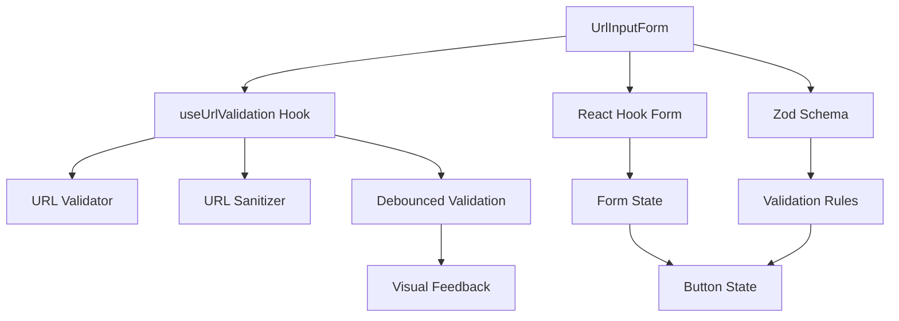
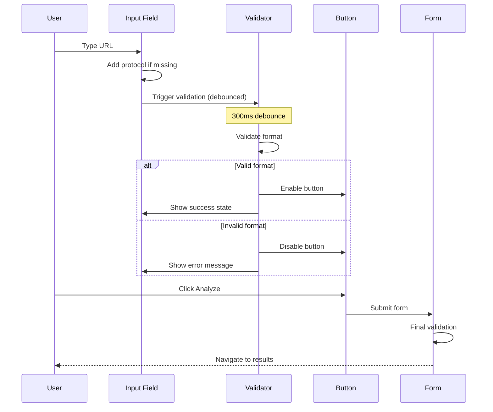
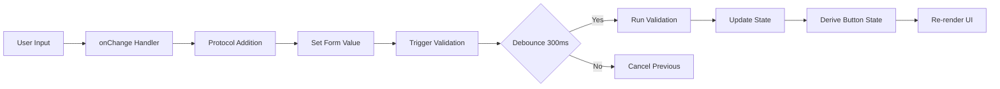
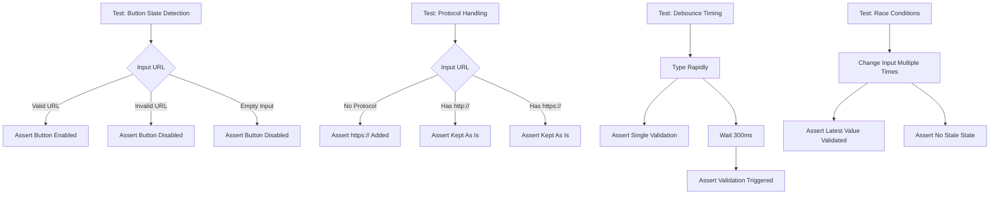

# Implementation Plan: Story 3-17 - URL Input Form Critical Bug Fixes

## Metadata

- **Story File**: story-3-17-url-input-form-critical-bug-fixes.md
- **Created**: 2025-09-01
- **Last Updated**: 2025-09-01
- **BMad Version**: 4.40.1
- **Generated By**: Claude Opus 4.1

## Story Reference

Story 3-17 addresses critical bugs in the URL input form that prevent reliable form submission and validation. The plan focuses on fixing button state detection issues, improving state management synchronization, enhancing URL protocol handling with visual feedback, and implementing better validation UX with appropriate debounce timing.

## 1. Architectural Decisions

### 1.1 State Management Strategy
**Decision**: Refactor to use controlled form state with explicit validation tracking
- **Rationale**: Current dual-state tracking (formState.isValid + watchedUrl) creates race conditions
- **Pattern**: Single source of truth with derived state calculations
- **Reference**: Existing pattern in `useUrlValidation.ts:36-276`

### 1.2 Validation Architecture
**Decision**: Implement three-stage validation pipeline
- **Stage 1**: Synchronous format validation (immediate)
- **Stage 2**: Debounced async validation (300ms)
- **Stage 3**: Server-side validation (on submit)
- **Rationale**: Balances UX responsiveness with performance
- **Reference**: Pattern established in `useUrlValidation.ts:64-163`

### 1.3 Protocol Handling
**Decision**: Early protocol normalization with visual transformation indicator
- **Implementation**: Transform in onChange handler, display in helper text
- **Rationale**: Users need immediate feedback on URL transformations
- **Library**: Use existing Zod transform pipeline (`url-input-form.tsx:28-35`)

### 1.4 Debounce Strategy
**Decision**: Increase debounce from 100ms to 300ms
- **Rationale**: 100ms is too aggressive for typing, causes UI jank
- **Standard**: Industry standard is 200-500ms for input validation
- **Reference**: Current implementation at `url-input-form.tsx:142` and `useUrlValidation.ts:27`

## 2. Component Structure

### 2.1 State Management Refactor

```typescript
// Enhanced state interface with validation tracking
interface FormState {
  url: string
  normalizedUrl: string
  validationState: 'idle' | 'validating' | 'valid' | 'invalid'
  validationTimestamp: number
  error?: string
  isSubmitting: boolean
}

// Button state derived from single source
const isButtonEnabled = useMemo(() => {
  return formState.validationState === 'valid' && 
         !formState.isSubmitting &&
         formState.url.length > 0
}, [formState])
```

### 2.2 Component Dependencies



## 3. Data Flow Strategy

### 3.1 Validation Flow Sequence



### 3.2 State Synchronization



## 4. Implementation Pseudo-Code

### 4.1 Enhanced Form State Management

```
FUNCTION enhancedUrlInputForm()
    // Initialize unified state
    formState = {
        url: '',
        normalizedUrl: '',
        validationState: 'idle',
        validationTimestamp: 0,
        error: null,
        isSubmitting: false
    }
    
    // Setup validation with proper debouncing
    validationTimer = null
    
    FUNCTION handleInputChange(value)
        // Clear previous timer
        IF validationTimer EXISTS THEN
            clearTimeout(validationTimer)
        END IF
        
        // Normalize URL immediately for display
        normalizedUrl = value
        IF NOT value.startsWith('http') THEN
            normalizedUrl = 'https://' + value
        END IF
        
        // Update state
        formState.url = value
        formState.normalizedUrl = normalizedUrl
        formState.validationState = 'validating'
        
        // Show transformation feedback
        IF value != normalizedUrl THEN
            showTransformationHint(value + ' → ' + normalizedUrl)
        END IF
        
        // Debounced validation
        validationTimer = setTimeout(() => {
            validateUrl(normalizedUrl)
        }, 300)
    END FUNCTION
    
    FUNCTION validateUrl(url)
        TRY
            // Stage 1: Synchronous validation
            IF NOT isValidUrlFormat(url) THEN
                formState.validationState = 'invalid'
                formState.error = getFormatError(url)
                RETURN
            END IF
            
            // Stage 2: Async validation (if needed)
            result = await performAsyncValidation(url)
            
            IF result.isValid THEN
                formState.validationState = 'valid'
                formState.error = null
                formState.validationTimestamp = Date.now()
            ELSE
                formState.validationState = 'invalid'
                formState.error = result.error
            END IF
            
        CATCH error
            formState.validationState = 'invalid'
            formState.error = 'Validation failed'
        END TRY
    END FUNCTION
    
    FUNCTION deriveButtonState()
        RETURN formState.validationState == 'valid' AND
               NOT formState.isSubmitting AND
               formState.url.length > 0
    END FUNCTION
    
    FUNCTION handleSubmit()
        IF NOT deriveButtonState() THEN
            RETURN // Prevent submission
        END IF
        
        formState.isSubmitting = true
        
        TRY
            // Final validation before submit
            IF Date.now() - formState.validationTimestamp > 5000 THEN
                await validateUrl(formState.normalizedUrl)
            END IF
            
            IF formState.validationState == 'valid' THEN
                result = await analyzeUrl(formState.normalizedUrl)
                navigateToResults(result)
            END IF
        FINALLY
            formState.isSubmitting = false
        END TRY
    END FUNCTION
END FUNCTION
```

### 4.2 Validation State Machine

```
STATECHART UrlValidation
    INITIAL STATE idle
    
    STATE idle {
        ON input_change -> validating
    }
    
    STATE validating {
        ENTRY: showLoadingIndicator()
        
        ON validation_success -> valid
        ON validation_error -> invalid
        ON input_change -> validating (restart)
        
        AFTER 300ms -> perform_validation
    }
    
    STATE valid {
        ENTRY: enableButton(), showSuccessIndicator()
        
        ON input_change -> validating
        ON submit -> submitting
    }
    
    STATE invalid {
        ENTRY: disableButton(), showError()
        
        ON input_change -> validating
    }
    
    STATE submitting {
        ENTRY: disableAll(), showProgress()
        
        ON success -> complete
        ON error -> invalid
    }
END STATECHART
```

## 5. Test Strategy

### 5.1 Test Scenario Flow



### 5.2 Unit Test Coverage

```typescript
// Test IDs mapped to Acceptance Criteria
describe('UrlInputForm', () => {
  // AC-1: Fix Button State Detection
  test('T-3-17-001: button enables only when form valid', ...)
  test('T-3-17-002: button responds to first click', ...)
  
  // AC-2: Reliable State Management
  test('T-3-17-003: no race condition between states', ...)
  test('T-3-17-004: state syncs on mount', ...)
  
  // AC-3: Protocol Handling
  test('T-3-17-005: auto-adds https protocol', ...)
  test('T-3-17-006: shows transformation feedback', ...)
  
  // AC-4: Validation UX
  test('T-3-17-007: debounces at 300ms', ...)
  test('T-3-17-008: shows progressive states', ...)
  
  // AC-5: Debugging
  test('T-3-17-009: debug utilities work', ...)
})
```

## 6. Implementation Steps

### Step 1: Fix State Management (AC-1, AC-2)
1. Refactor `url-input-form.tsx` to use single state source
2. Remove complex `isValid` calculation (line 176)
3. Implement `useEffect` for mount synchronization
4. Add validation timestamp tracking

### Step 2: Improve Protocol Handling (AC-3)
1. Move protocol addition to onChange handler
2. Add transformation hint component
3. Update Zod schema for better UX
4. Implement client-side validation

### Step 3: Enhance Validation UX (AC-4)
1. Update debounce to 300ms in both files
2. Add progressive validation states
3. Implement helpful error messages
4. Add visual status indicators

### Step 4: Add Debug Utilities (AC-5)
1. Create debug panel component
2. Add state logging utilities
3. Implement form state inspector
4. Add performance metrics

### Step 5: Testing
1. Write unit tests for all changes
2. Test interaction patterns
3. Verify debounce behavior
4. Test edge cases

## 7. Code Patterns & Conventions

### 7.1 Follow Existing Patterns
- Use `cn()` utility for className composition (`url-input-form.tsx:21`)
- Follow shadcn/ui component patterns
- Use React Hook Form with Zod resolver
- Maintain TypeScript strict mode compliance

### 7.2 Naming Conventions
- Components: PascalCase (`UrlInputForm`)
- Hooks: camelCase with 'use' prefix (`useUrlValidation`)
- State variables: camelCase (`validationState`)
- Constants: UPPER_SNAKE_CASE

## 8. Potential Pitfalls & Mitigation

### 8.1 Technical Risks
**Risk**: Debounce timing affects perceived performance
- **Mitigation**: Show immediate "validating" state, optimize validation logic
- **Monitoring**: Track validation duration metrics

**Risk**: Race conditions with rapid input changes
- **Mitigation**: Cancel previous validations, use validation timestamps
- **Prevention**: Implement proper cleanup in useEffect

### 8.2 UX Risks
**Risk**: Users confused by URL transformations
- **Mitigation**: Clear visual feedback showing transformation
- **Design**: Helper text with arrow showing change

**Risk**: Button state changes feel laggy
- **Mitigation**: Optimistic UI updates where safe
- **Fallback**: Revert on validation failure

## 9. API Contract Changes

No API contract changes required - this story focuses on frontend form improvements only.

## 10. Traceability Matrix

| AC ID | Acceptance Criterion | Test IDs | Modules/Files | Notes |
|-------|---------------------|----------|---------------|-------|
| AC-1 | Fix Button State Detection | T-3-17-001, T-3-17-002 | url-input-form.tsx:175-176 | Replace isValid logic |
| AC-2 | Reliable State Management | T-3-17-003, T-3-17-004 | url-input-form.tsx:139-152 | Add useEffect sync |
| AC-3 | URL Protocol Handling | T-3-17-005, T-3-17-006 | url-input-form.tsx:28-35 | Move to onChange |
| AC-4 | Better Validation UX | T-3-17-007, T-3-17-008 | useUrlValidation.ts:27, url-input-form.tsx:142 | 300ms debounce |
| AC-5 | Form State Debugging | T-3-17-009 | New debug component | Development aid |

## 11. Dependency Policy

### Approved Dependencies
- No new dependencies required

### Prohibited Changes
- Do not modify shared validation schemas without review
- Do not change API contract without backend coordination
- Do not alter existing shadcn/ui component internals

## 12. Observability Requirements

### Metrics to Track
- Validation duration (p50, p95, p99)
- Button click success rate
- Form submission success rate
- Protocol transformation frequency

### Logging Points
- Validation start/end with duration
- Button state changes
- Form submission attempts
- Validation errors with context

## 13. Rollout/Recovery

### Feature Toggle
Not required - bug fixes to existing functionality

### Rollback Plan
- Revert git commit if critical issues found
- No database migrations to rollback
- No API changes to coordinate

## 14. Questions & Decisions Ledger

### Open Questions for James
None - all architectural decisions have been made

### Resolved Decisions

| D# | Title | Decision | Rationale | Alternatives Considered | Date | Impacted Sections |
|----|-------|----------|-----------|------------------------|------|-------------------|
| D1 | Debounce timing | 300ms | Balance between UX and performance | 200ms (too fast), 500ms (too slow) | 2025-09-01 | AC-4, Tests |
| D2 | State management | Single source of truth | Eliminates race conditions | Keep dual state (complex) | 2025-09-01 | AC-1, AC-2 |
| D3 | Protocol handling | Early normalization | Better UX with immediate feedback | Server-only (poor UX) | 2025-09-01 | AC-3 |

## Implementation Status

- [ ] Planning Complete
- [ ] Architecture Decisions Implemented
- [ ] Component Structure Built
- [ ] Integration Points Connected
- [ ] Testing Complete
- [ ] Story Acceptance Criteria Met