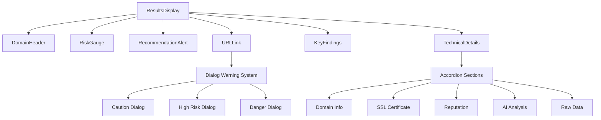
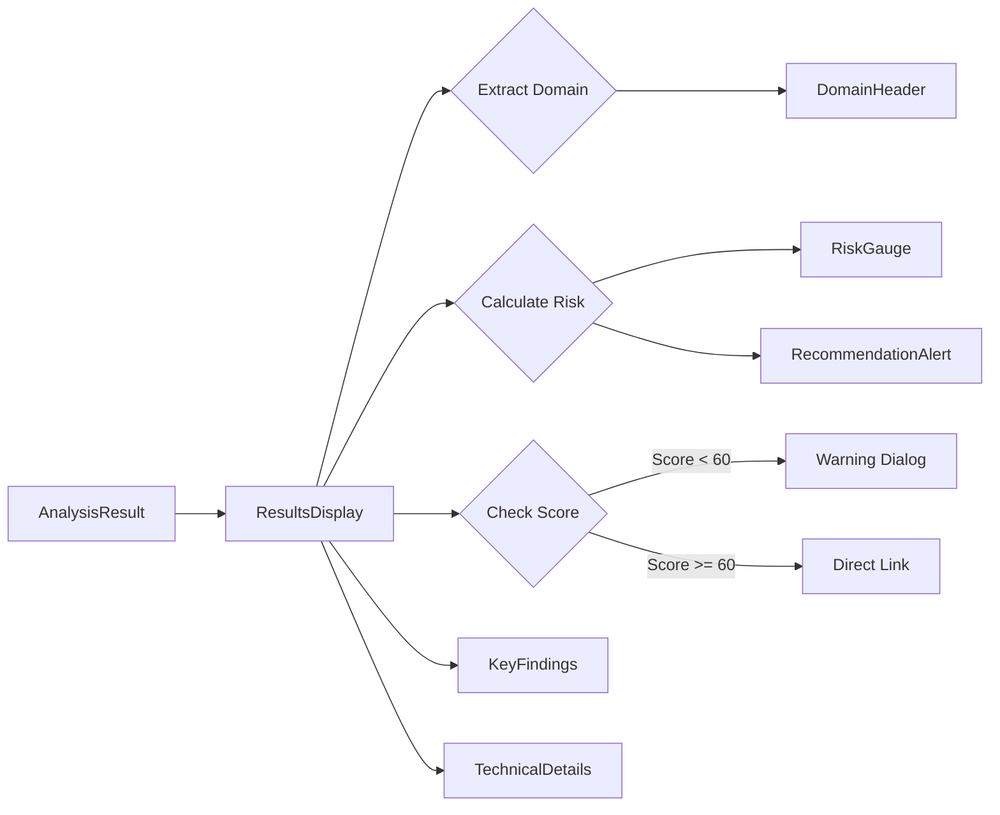
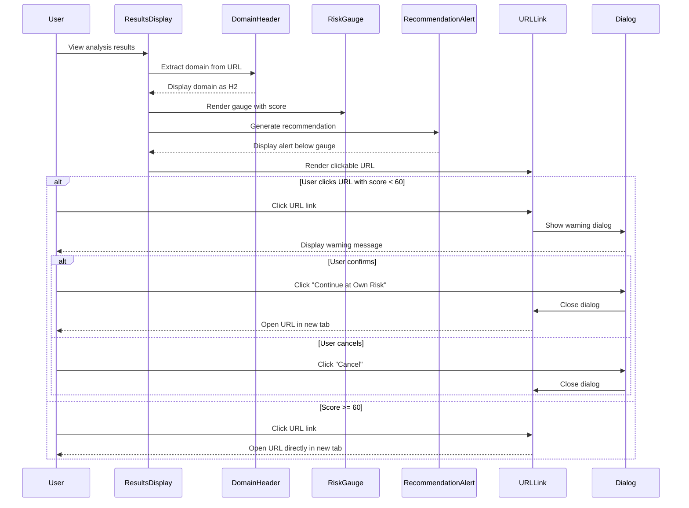
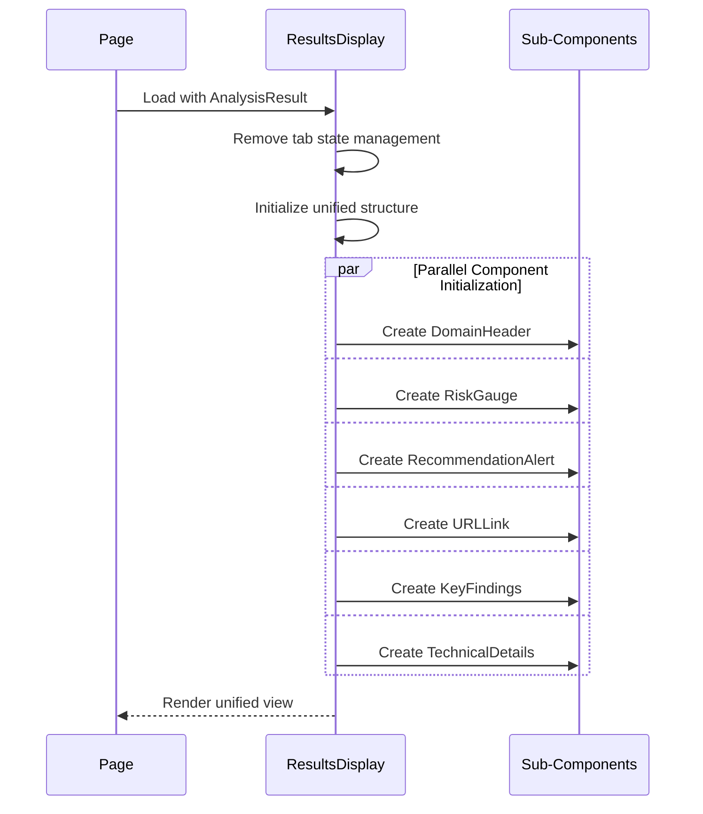
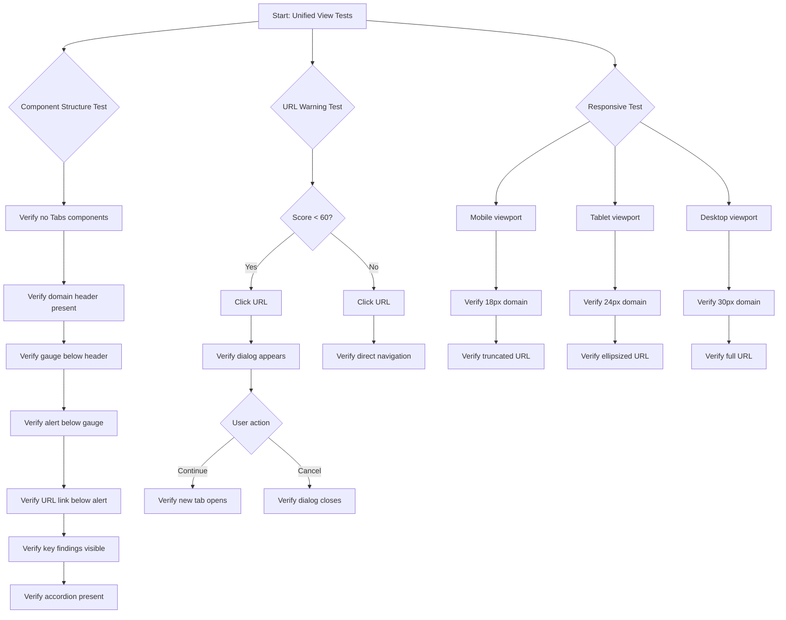

# Implementation Plan: Story 3-18 - Unified Analysis Results View

## Metadata

- **Story File**: story-3-18-unified-analysis-results-view.md
- **Created**: 2025-09-02
- **Last Updated**: 2025-09-02
- **BMad Version**: 1.0
- **Generated By**: Claude Opus 4.1

## Story Reference

This story implements a unified analysis results view that replaces the dual Simple/Technical tab system with a single progressive disclosure interface. The unified view features a domain header, prominent risk gauge, dynamic recommendation alert, interactive URL link with safety warnings, and expandable technical details accordion.

## 1. Architectural Decisions

### 1.1 Design Pattern Selection

**Progressive Disclosure Pattern**: Single unified view with content revealed based on importance hierarchy
- **Rationale**: Eliminates cognitive overhead of view switching while maintaining access to all information
- **Reference**: Similar to TechnicalDetails accordion pattern already in codebase (src/components/analysis/technical-details.tsx)

**Component Composition Pattern**: Compose unified view from existing sub-components
- **Rationale**: Maximizes code reuse, maintains consistency, reduces new code introduction
- **Reference**: Current ResultsDisplay already composes SimpleView and TechnicalDetails

**Dialog-Based Warning Pattern**: Modal warnings for risky URL navigation
- **Rationale**: Forces user acknowledgment before potentially dangerous actions
- **Reference**: shadcn Dialog component with destructive button variants

### 1.2 Library and Framework Choices

**UI Components**: 
- shadcn/ui Dialog for URL warnings (already installed)
- shadcn/ui Alert for dynamic recommendations (in use)
- shadcn/ui Accordion for technical details (in use)
- shadcn/ui Button with Link icon for URL component

**State Management**: React useState hooks for dialog state
- **Rationale**: Simple local state sufficient for dialog visibility

**URL Parsing**: Native URL constructor for domain extraction
- **Rationale**: Built-in browser API, handles edge cases, no new dependencies

### 1.3 Module Organization Strategy

```
src/components/analysis/
├── results-display.tsx          # Modified: Remove tabs, add unified structure
├── simple-view.tsx              # Deprecated: Extract components then remove
├── technical-details.tsx        # Preserved: Main expandable content
├── risk-gauge.tsx              # Preserved: Visual gauge component
├── key-findings.tsx            # Preserved: Bullet-point findings
├── domain-header.tsx           # NEW: Domain extraction and display
├── url-link.tsx                # NEW: Interactive URL with warnings
└── recommendation-alert.tsx    # NEW: Dynamic risk-based alert
```

### 1.4 API Endpoint Contract Analysis

No API changes required - this is purely a frontend UI restructuring that consumes the same AnalysisResult data structure.

## 2. Component Structure

### 2.1 Detailed Module Design

**DomainHeader Component**:
```typescript
// src/components/analysis/domain-header.tsx
interface DomainHeaderProps {
  url: string
  className?: string
}

export function DomainHeader({ url, className }: DomainHeaderProps) {
  // Extract domain using URL constructor
  // Handle edge cases (IP addresses, subdomains, IDN)
  // Return H2 with responsive typography classes
}
```

**URLLink Component**:
```typescript
// src/components/analysis/url-link.tsx
interface URLLinkProps {
  url: string
  score: number
  className?: string
}

export function URLLink({ url, score, className }: URLLinkProps) {
  // State for dialog visibility
  // Truncation logic based on screen size
  // Warning dialog for scores < 60
  // Click handler with conditional navigation
}
```

**RecommendationAlert Component**:
```typescript
// src/components/analysis/recommendation-alert.tsx
interface RecommendationAlertProps {
  score: number
  status: 'safe' | 'moderate' | 'caution' | 'danger'
  className?: string
}

export function RecommendationAlert({ score, status, className }: RecommendationAlertProps) {
  // Dynamic alert variant based on score
  // Dynamic message content
  // Return Alert component with appropriate styling
}
```

### 2.2 Interface and Type Definitions

```typescript
// src/types/analysis-display.ts (additions)
export interface WarningDialogConfig {
  title: string
  message: string
  variant: 'caution' | 'highRisk' | 'danger'
  continueLabel?: string
}

export interface ResponsiveDisplayConfig {
  mobile: string
  tablet: string
  desktop: string
  wide: string
}
```

### 2.3 Dependency Management

- DomainHeader → None (pure function)
- URLLink → shadcn Dialog, Button, useState
- RecommendationAlert → shadcn Alert, AlertDescription, AlertTitle
- ResultsDisplay → All new components + existing (minus SimpleView)

## 3. System Architecture Diagrams

### 3.1 Component Relationship Mapping



### 3.2 Data Flow Architecture



## 4. Interaction Sequence Diagrams

### 4.1 User Flow Sequences



### 4.2 Component Initialization Sequence



## 5. Implementation Pseudo-Code

### 5.1 Core Algorithm Pseudo-Code

```
FUNCTION extractDomain(url)
    TRY
        parsedUrl = new URL(url)
        hostname = parsedUrl.hostname
        
        // Remove www prefix if present
        IF hostname.startsWith('www.') THEN
            hostname = hostname.substring(4)
        END IF
        
        // Handle IP addresses
        IF isIPAddress(hostname) THEN
            RETURN hostname
        END IF
        
        // Handle internationalized domains (IDN)
        IF containsNonASCII(hostname) THEN
            RETURN decodeIDN(hostname)
        END IF
        
        RETURN hostname
    CATCH
        // Fallback for malformed URLs
        RETURN extractBasicDomain(url)
    END TRY
END FUNCTION

FUNCTION determineURLDisplay(url, screenSize)
    SWITCH screenSize
        CASE 'mobile':
            RETURN truncateToLength(extractDomain(url), 20)
        CASE 'tablet':
            RETURN truncateMiddle(url, 50)
        CASE 'desktop':
            RETURN truncateEnd(url, 80)
        CASE 'wide':
            RETURN url  // Full display
    END SWITCH
END FUNCTION

FUNCTION generateRecommendation(score, status)
    alertConfig = {
        variant: null,
        title: null,
        message: null
    }
    
    IF score >= 80 THEN
        alertConfig.variant = 'info'
        alertConfig.title = 'Recommendation'
        alertConfig.message = 'Standard security checks passed. Always verify before sharing personal information.'
    ELSE IF score >= 60 THEN
        alertConfig.variant = 'warning'
        alertConfig.title = 'Proceed with Caution'
        alertConfig.message = 'Some concerns detected but no major red flags. Use standard web safety practices.'
    ELSE IF score >= 40 THEN
        alertConfig.variant = 'destructive'
        alertConfig.title = 'Be Careful'
        alertConfig.message = 'Multiple risk indicators detected. Avoid entering sensitive information.'
    ELSE IF score >= 20 THEN
        alertConfig.variant = 'destructive'
        alertConfig.title = 'High Risk'
        alertConfig.message = 'Significant security concerns detected. Only proceed if you trust the source.'
    ELSE
        alertConfig.variant = 'destructive'
        alertConfig.title = 'Danger'
        alertConfig.message = 'Critical security threats detected. This site may attempt to steal your information.'
    END IF
    
    RETURN alertConfig
END FUNCTION

FUNCTION handleURLClick(url, score)
    IF score < 60 THEN
        dialogConfig = getWarningDialogConfig(score)
        showDialog(dialogConfig)
        
        IF userConfirms THEN
            window.open(url, '_blank', 'noopener,noreferrer')
        END IF
    ELSE
        // Direct navigation for safe URLs
        window.open(url, '_blank', 'noopener,noreferrer')
    END IF
END FUNCTION
```

## 6. Test Scenario Diagrams

### 6.1 Test Case Flow Charts



## 7. Step-by-Step Implementation

### Phase 1: Create New Components (Tasks 1-3)

1. **Create DomainHeader Component**
   - File: `src/components/analysis/domain-header.tsx`
   - Extract domain from URL prop
   - Handle edge cases (IP, IDN, subdomains)
   - Apply responsive typography (text-lg sm:text-2xl lg:text-3xl)
   - Add proper H2 semantic markup

2. **Create URLLink Component**
   - File: `src/components/analysis/url-link.tsx`
   - Add Link icon from lucide-react
   - Implement responsive truncation logic
   - Add Dialog component for warnings
   - Create three dialog variants (caution/high-risk/danger)
   - Handle click events conditionally

3. **Create RecommendationAlert Component**
   - File: `src/components/analysis/recommendation-alert.tsx`
   - Map score ranges to alert variants
   - Generate dynamic content based on score
   - Use Info icon for safe, AlertTriangle for caution, XCircle for danger

### Phase 2: Refactor ResultsDisplay (Tasks 4-6)

4. **Remove Tab System**
   - Remove Tabs, TabsList, TabsTrigger, TabsContent imports
   - Remove useViewToggle hook
   - Remove view state management
   - Remove tab-related JSX structure

5. **Implement Unified Structure**
   ```tsx
   <div className="space-y-4">
     <DomainHeader url={result.url} />
     <RiskGauge score={result.score} status={result.status} />
     <RecommendationAlert score={result.score} status={result.status} />
     <URLLink url={result.url} score={result.score} />
     <KeyFindings findings={result.findings} />
     <TechnicalDetails result={result} />
   </div>
   ```

6. **Extract Components from SimpleView**
   - Move KeyFindings usage to ResultsDisplay
   - Extract recommendation logic to new component
   - Preserve action buttons in ResultsDisplay footer
   - Mark SimpleView for deprecation

### Phase 3: Testing & Cleanup (Tasks 7-9)

7. **Write Component Tests**
   - Test domain extraction edge cases
   - Test URL truncation at breakpoints
   - Test warning dialog thresholds
   - Test recommendation content generation

8. **Integration Testing**
   - Verify unified structure renders
   - Test responsive behavior
   - Verify all existing functionality preserved
   - Test accessibility with screen readers

9. **Cleanup**
   - Remove SimpleView component and tests
   - Update documentation
   - Remove unused imports
   - Run lint and type-check

## 8. Code Patterns & Conventions

### 8.1 Existing Pattern Adoption

**Component File Structure**: Follow existing pattern
```tsx
"use client"
import statements
interface Props
export function ComponentName
```

**Prop Interfaces**: Always define with explicit types
```typescript
export interface ComponentProps {
  required: string
  optional?: boolean
  className?: string  // Always include for styling flexibility
}
```

**Conditional Styling**: Use cn() utility
```typescript
className={cn(
  "base-classes",
  condition && "conditional-classes",
  className
)}
```

**Event Handlers**: Use useCallback for optimization
```typescript
const handleClick = useCallback(() => {
  // handler logic
}, [dependencies])
```

### 8.2 Reusable Components and Utilities

**Existing to Reuse**:
- `cn()` utility for class merging
- `Badge` component for status display
- `Alert` component structure
- `Button` component variants
- Error boundary pattern

**New Utilities to Create**:
```typescript
// src/lib/url-utils.ts
export function extractDomain(url: string): string
export function truncateURL(url: string, mode: 'mobile' | 'tablet' | 'desktop'): string
export function isIPAddress(hostname: string): boolean
```

## 9. Potential Pitfalls & Mitigation

### 9.1 Technical Risk Assessment

**Risk**: Domain extraction failures on malformed URLs
- **Mitigation**: Try-catch with fallback to simple string parsing
- **Implementation**: Return original URL if parsing fails

**Risk**: Dialog z-index conflicts with other modals
- **Mitigation**: Use shadcn's built-in portal rendering
- **Implementation**: Dialog renders in document.body portal

**Risk**: Responsive typography breaks layout
- **Mitigation**: Test all breakpoints with long/short domains
- **Implementation**: Add max-width and text-overflow: ellipsis

### 9.2 Performance Considerations

**Risk**: Re-renders on every state change
- **Mitigation**: Memoize expensive computations
- **Implementation**: useMemo for domain extraction and truncation

**Risk**: Multiple dialog instances created
- **Mitigation**: Single dialog instance with dynamic content
- **Implementation**: One Dialog component with conditional content

### 9.3 Maintenance and Extensibility

**Extension Points**:
- Add more warning dialog variants via config
- Customize recommendation messages via props
- Add animation transitions between states

**Deprecation Strategy**:
- Mark SimpleView as deprecated in v1.2
- Remove in v2.0 after migration period
- Preserve git history for reference

### 9.4 Technology-Specific Guardrails

**Dependency Policy**:
- ✅ Approved: No new dependencies needed
- ❌ Prohibited: Do not add animation libraries (use framer-motion already in project)
- ❌ Prohibited: Do not add URL parsing libraries (use native URL)

**Do-Not-Do List**:
- Do not refactor unrelated components
- Do not change API response structure
- Do not modify test infrastructure
- Do not update global styles

**Observability Requirements**:
- Log warning dialog interactions: `console.log('[URLLink] Warning shown for score:', score)`
- Track dialog confirmation rate for analytics
- Monitor domain extraction failures

**Rollout/Recovery**:
- Feature flag: `NEXT_PUBLIC_UNIFIED_VIEW_ENABLED`
- Rollback: Revert ResultsDisplay to previous commit
- Testing: Stage on localhost:3000 before production

## 10. Traceability Matrix

| AC ID | Acceptance Criterion | Test IDs | Modules/Files/Classes/Functions | Notes |
|-------|---------------------|----------|----------------------------------|--------|
| AC-1 | Remove Dual-View System | T-318-001, T-318-INT-A | ResultsDisplay.tsx (remove Tabs), useViewToggle (remove) | Verify no tab components remain |
| AC-2 | Add Domain Header | T-318-002, T-318-RESP-A | DomainHeader.tsx, extractDomain() | Test IDN, IP addresses |
| AC-3 | Integrate Risk Gauge | T-318-003 | ResultsDisplay.tsx (structure), RiskGauge.tsx | Position below header |
| AC-4 | Reposition Recommendation | T-318-004, T-318-DYN-A | RecommendationAlert.tsx, generateRecommendation() | Dynamic content by score |
| AC-5 | Add Interactive URL | T-318-005, T-318-WARN-A | URLLink.tsx, handleURLClick(), Dialog components | Warning dialogs < 60 |
| AC-6 | Key Findings Section | T-318-006 | ResultsDisplay.tsx, KeyFindings.tsx | Extract from SimpleView |
| AC-7 | Technical Accordion | T-318-007 | TechnicalDetails.tsx (preserve) | No changes needed |
| AC-8 | Preserve Functionality | T-318-008, T-318-INT-B | ShareExport.tsx, all action buttons | Regression testing |

## 11. Questions & Decisions Ledger

### Open Questions for James
None at this time - plan is comprehensive based on requirements.

### Resolved Decisions

| D# | Title | Decision | Rationale | Alternatives Considered | Date | Impacted Sections |
|----|-------|----------|-----------|------------------------|------|-------------------|
| D1 | Domain extraction method | Native URL API | Built-in, handles edge cases | url-parse library | 2025-09-02 | DomainHeader, AC-2 |
| D2 | Warning dialog threshold | Score < 60 | Aligns with caution/danger ranges | < 50, < 40 | 2025-09-02 | URLLink, AC-5 |
| D3 | Component deprecation | Extract then remove SimpleView | Safer migration path | Immediate removal | 2025-09-02 | Phase 2, AC-1 |
| D4 | Responsive strategy | Tailwind classes | Consistent with codebase | CSS-in-JS, styled-components | 2025-09-02 | All components |

## Implementation Status

- [ ] Planning Complete ✓
- [ ] Architecture Decisions Implemented
- [ ] Component Structure Built
- [ ] Integration Points Connected
- [ ] Testing Complete
- [ ] Story Acceptance Criteria Met