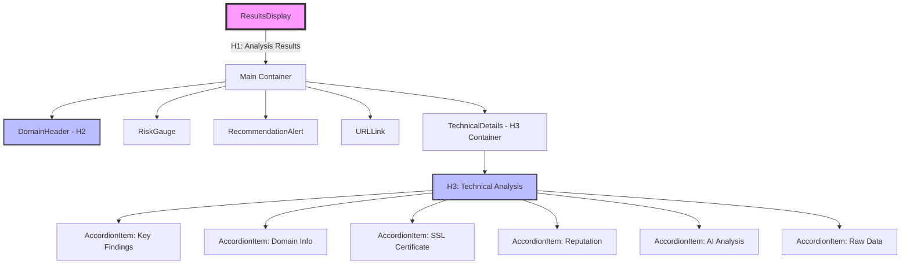
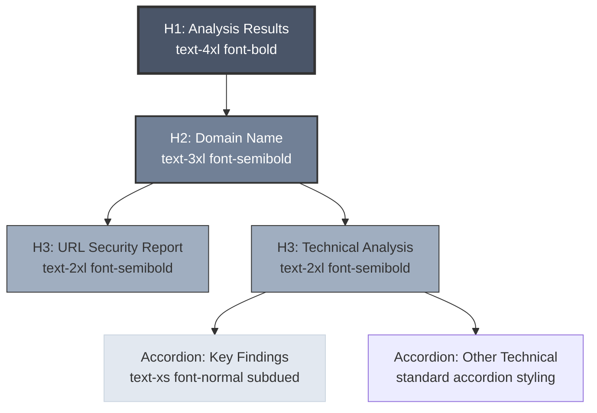
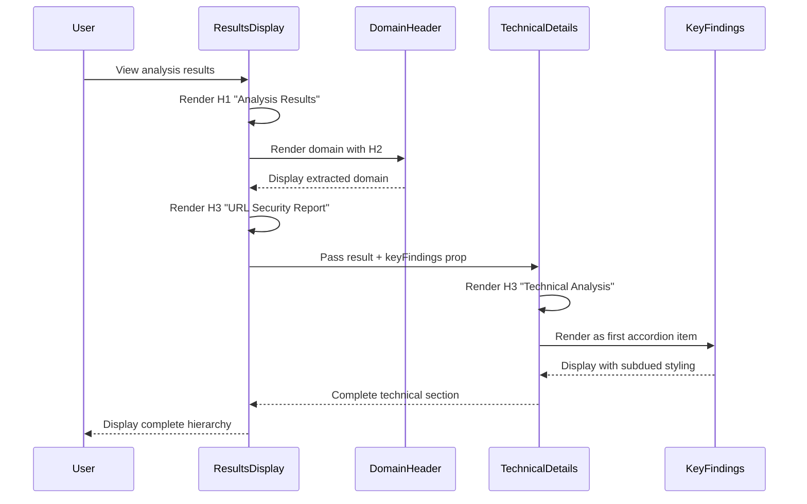
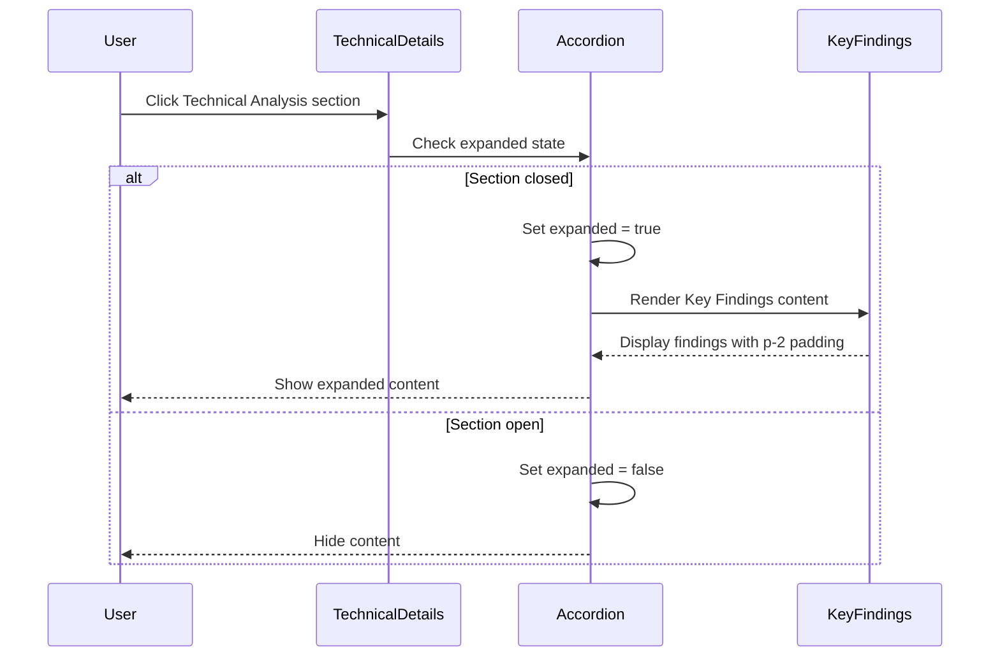
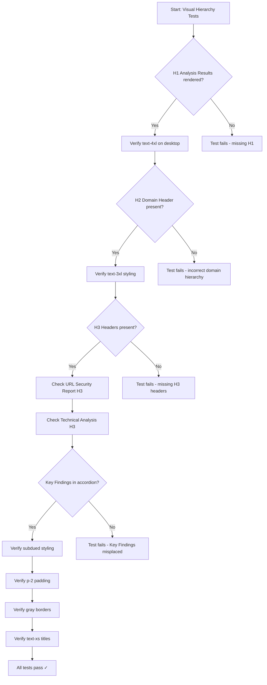
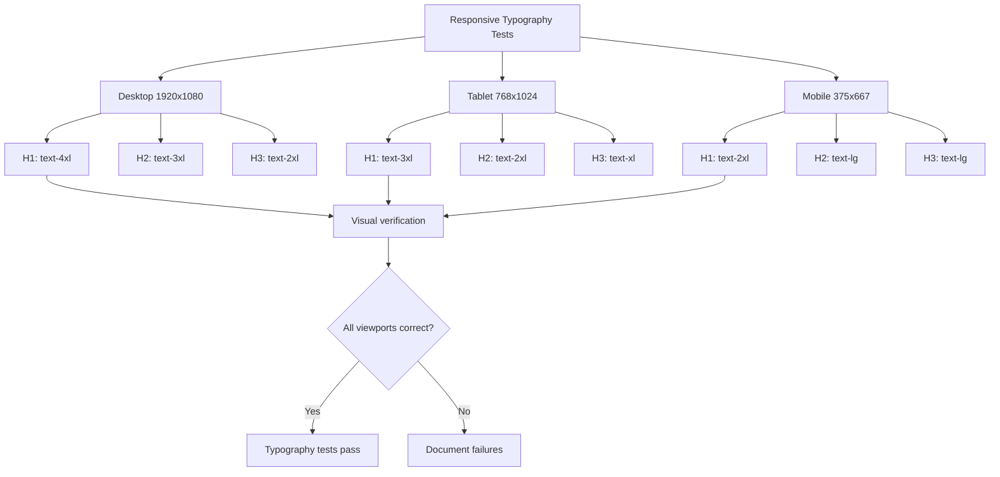

# Implementation Plan: Analysis Results Visual Hierarchy Improvements

## Metadata

- **Story File**: story-3-19-analysis-results-visual-hierarchy-improvements.md
- **Created**: 2025-09-03
- **Last Updated**: 2025-09-03
- **BMad Version**: Core v1.0
- **Generated By**: claude-opus-4-1-20250805

## Story Reference

This story addresses critical visual hierarchy issues in the Analysis Results view discovered during UX evaluation. The implementation focuses on establishing proper heading hierarchy (H1→H2→H3), repositioning Key Findings as a subdued component within Technical Analysis, and ensuring responsive typography compliance across all viewports.

## Implementation Plan Sections

### 1. Architectural Decisions

#### 1.1 Design Pattern Selection

**Component Restructuring Pattern**
- **Pattern**: Presentational Component Hierarchy Refactoring
- **Rationale**: Existing components (`ResultsDisplay`, `KeyFindings`, `TechnicalDetails`) already follow React composition patterns. We're adjusting their hierarchy and styling without changing data flow
- **Existing Examples**: `DomainHeader` component already uses proper H2 semantic structure at `src/components/analysis/domain-header.tsx`

**State Management Approach**
- **Pattern**: No state changes required - maintain existing Zustand patterns
- **Rationale**: Visual hierarchy changes are purely presentational; no new state management needed
- **Existing Pattern**: Component state for accordion expansion already exists in `technical-details.tsx`

#### 1.2 Library and Framework Choices

**Dependencies**: No new dependencies required
- React 19.1.1 - existing component framework
- Tailwind CSS 4.1.12 - for responsive typography utilities
- shadcn/ui components - existing `Accordion`, `AccordionItem`, `AccordionTrigger`, `AccordionContent`
- lucide-react - existing icons

**Rejected Alternatives**:
- CSS-in-JS solutions: Project uses Tailwind utilities consistently
- New component libraries: shadcn/ui already provides needed accordion components

#### 1.3 Module Organization Strategy

**File Structure**: Modify existing files in-place
```
src/components/analysis/
  ├── results-display.tsx       # Update heading hierarchy
  ├── key-findings.tsx          # Reduce visual prominence
  └── technical-details.tsx     # Restructure as parent container
```

**No new files required** - all changes within existing component boundaries

#### 1.4 API Endpoint Contract Analysis

**No API changes**: This is a frontend-only visual hierarchy update
- No backend modifications required
- No data structure changes
- No new API endpoints or modified schemas
- Maintains backward compatibility with existing data flow

### 2. Component Structure

#### 2.1 Detailed Module Design

**ResultsDisplay Component** (`src/components/analysis/results-display.tsx`)

Public Interface (unchanged):
```typescript
export interface ResultsDisplayProps {
  result: AnalysisResult | null
  isLoading: boolean
  error?: Error
  onShare?: (method: ShareMethod) => void
  onExport?: (format: ExportFormat) => void
  onRetry?: () => void
  onAnalyzeNew?: () => void
  className?: string
}
```

Internal Structure Updates:
- Line 171: Change "Analysis Results" from `<p className="text-sm text-muted-foreground">` to `<h1 className="text-4xl font-bold leading-tight md:text-3xl sm:text-2xl">`
- Line 172-174: Update "URL Security Report" from H2 to H3 with responsive classes
- Line 192: Verify DomainHeader maintains H2 (already implemented correctly)
- Line 197-201: Remove KeyFindings from main flow
- Line 202: Pass KeyFindings data to TechnicalDetails as new prop

**TechnicalDetails Component** (`src/components/analysis/technical-details.tsx`)

Modified Interface:
```typescript
interface TechnicalDetailsProps {
  result?: AnalysisResult
  loading?: boolean
  className?: string
  keyFindings?: Finding[]  // NEW PROP
}
```

Structure Changes:
- Lines 123-132: Update "Technical Analysis" from Card title to H3 section header
- Line 134: Insert KeyFindings as first AccordionItem before existing items
- Maintain existing accordion items order after KeyFindings

**KeyFindings Component** (`src/components/analysis/key-findings.tsx`)

Visual Styling Updates (no interface changes):
- Lines 65-83: Update `getTypeStyles` function to use subdued colors
- Line 143-146: Change border classes from colored to neutral
- Line 141: Update padding from `p-3` to `p-2`
- Line 160: Change title text size from `text-sm font-medium` to `text-xs font-normal`

#### 2.2 Interface and Type Definitions

No new type definitions required. Existing types remain:
- `AnalysisResult` - unchanged
- `Finding` - unchanged
- `ShareMethod` - unchanged
- `ExportFormat` - unchanged

#### 2.3 Dependency Management

Component dependency flow remains unchanged:
```
ResultsDisplay
  ├── DomainHeader (unchanged)
  ├── RiskGauge (unchanged)
  ├── RecommendationAlert (unchanged)
  ├── URLLink (unchanged)
  └── TechnicalDetails (modified to include KeyFindings)
       └── KeyFindings (moved here, visually reduced)
```

### 3. System Architecture Diagrams

#### 3.1 Component Relationship Mapping



#### 3.2 Visual Hierarchy Flow



### 4. Interaction Sequence Diagrams

#### 4.1 User Flow Sequence - Viewing Analysis Results



#### 4.2 Accordion Expansion Interaction



### 5. Implementation Pseudo-Code

#### 5.1 Core Algorithm for Hierarchy Updates

```
FUNCTION updateResultsDisplay(props)
    // Heading hierarchy update
    IF props.result EXISTS THEN
        // Render primary heading as H1
        RENDER <h1 className={getResponsiveH1Classes()}>
            "Analysis Results"
        </h1>
        
        // Domain header maintains H2 (no change)
        RENDER <DomainHeader url={result.url} />
        
        // URL Security Report becomes H3
        RENDER <h3 className={getResponsiveH3Classes()}>
            "URL Security Report"
        </h3>
        
        // Extract key findings for technical section
        keyFindings = result.findings.filter(f => f.severity != 'low').slice(0, 5)
        
        // Pass findings to technical details
        RENDER <TechnicalDetails 
            result={result}
            keyFindings={keyFindings}  // NEW PROP
        />
    END IF
END FUNCTION

FUNCTION updateTechnicalDetails(props)
    // Restructure as H3 container
    RENDER <h3 className={getResponsiveH3Classes()}>
        <Server icon /> "Technical Analysis"
    </h3>
    
    RENDER <Accordion type="multiple">
        // Key Findings as first item
        IF props.keyFindings EXISTS THEN
            RENDER <AccordionItem value="key-findings">
                <AccordionTrigger>
                    "Key Findings"
                </AccordionTrigger>
                <AccordionContent>
                    <KeyFindings 
                        findings={props.keyFindings}
                        expandable={true}
                        className="subdued-styling"
                    />
                </AccordionContent>
            </AccordionItem>
        END IF
        
        // Existing accordion items follow
        RENDER existing accordion items (domain, ssl, reputation, ai, raw)
    </Accordion>
END FUNCTION

FUNCTION updateKeyFindingsStyles(finding)
    // Reduce visual prominence
    borderColor = "border-gray-200 dark:border-gray-700"  // Neutral
    padding = "p-2"  // Reduced from p-3
    titleSize = "text-xs font-normal"  // Reduced from text-sm font-medium
    bgOpacity = finding.type == 'positive' ? "bg-emerald-50/25" :
                finding.type == 'negative' ? "bg-orange-50/25" :
                "bg-blue-50/25"
    
    RETURN {
        border: borderColor,
        padding: padding,
        titleClass: titleSize,
        background: bgOpacity
    }
END FUNCTION
```

#### 5.2 Responsive Typography Helper Functions

```typescript
// results-display.tsx
function getResponsiveH1Classes(): string {
  return "text-2xl font-bold leading-tight sm:text-3xl md:text-4xl"
}

function getResponsiveH3Classes(): string {
  return "text-lg font-semibold leading-snug sm:text-xl md:text-2xl"
}

// technical-details.tsx
function renderTechnicalAnalysisHeader(): JSX.Element {
  return (
    <h3 className={getResponsiveH3Classes()}>
      <Server className="h-5 w-5 inline mr-2" />
      Technical Analysis
    </h3>
  )
}

// key-findings.tsx - style updates
const subdued_styles = {
  positive: {
    border: "border-gray-200 dark:border-gray-700",
    bg: "bg-emerald-50/25 dark:bg-emerald-950/10",
    badge: "bg-emerald-100/50 text-emerald-800"
  },
  negative: {
    border: "border-gray-200 dark:border-gray-700",
    bg: severity === 'high' ? "bg-red-50/25" : "bg-orange-50/25",
    badge: severity === 'high' ? "bg-red-100/50" : "bg-orange-100/50"
  }
}
```

### 6. Test Scenario Diagrams

#### 6.1 Visual Hierarchy Test Flow



#### 6.2 Responsive Typography Test Matrix



### 7. Step-by-Step Implementation

#### Phase 1: Update Primary Heading Hierarchy (AC 1, 2, 3)

1. **File**: `src/components/analysis/results-display.tsx`
   - [ ] Line 171: Replace `<p>` with `<h1 className="text-2xl font-bold leading-tight sm:text-3xl md:text-4xl">Analysis Results</h1>`
   - [ ] Line 172-174: Change H2 to H3: `<h3 className="text-lg font-semibold leading-snug sm:text-xl md:text-2xl">URL Security Report</h3>`
   - [ ] Verify DomainHeader already uses H2 (line 193)
   - [ ] Run `npm run check` to validate TypeScript
   - [ ] Test responsive classes with browser DevTools

#### Phase 2: Restructure Technical Analysis (AC 6)

2. **File**: `src/components/analysis/technical-details.tsx`
   - [ ] Add `keyFindings?: Finding[]` to TechnicalDetailsProps interface
   - [ ] Line 125-127: Replace Card title with H3: `<h3 className="text-lg font-semibold leading-snug sm:text-xl md:text-2xl flex items-center gap-2"><Server className="h-5 w-5" />Technical Analysis</h3>`
   - [ ] Line 134: Before first AccordionItem, add Key Findings accordion item
   - [ ] Import KeyFindings component at top of file
   - [ ] Run `npm run check`

#### Phase 3: Integrate Key Findings (AC 4)

3. **File**: `src/components/analysis/results-display.tsx`
   - [ ] Line 197-201: Remove KeyFindings from main render
   - [ ] Line 202: Add keyFindings prop to TechnicalDetails: `keyFindings={result.findings.filter(f => f.severity !== 'low').slice(0, 5)}`
   - [ ] Run `npm run check`

4. **File**: `src/components/analysis/technical-details.tsx`
   - [ ] After line 134, add:
   ```tsx
   {keyFindings && keyFindings.length > 0 && (
     <AccordionItem value="key-findings">
       <AccordionTrigger className="hover:no-underline">
         <div className="flex items-center gap-2">
           <AlertCircle className="h-4 w-4" />
           Key Findings
           <Badge variant="outline" className="ml-2">
             {keyFindings.length}
           </Badge>
         </div>
       </AccordionTrigger>
       <AccordionContent>
         <KeyFindings 
           findings={keyFindings}
           expandable={false}
           className="space-y-2"
         />
       </AccordionContent>
     </AccordionItem>
   )}
   ```

#### Phase 4: Reduce Key Findings Visual Prominence (AC 5)

5. **File**: `src/components/analysis/key-findings.tsx`
   - [ ] Lines 65-83: Update getTypeStyles function:
     - Replace colored borders with `border-gray-200 dark:border-gray-700`
     - Change background opacity from `/50` to `/25`
     - Update badge colors to be more muted
   - [ ] Line 143: Change padding from `p-3` to `p-2`
   - [ ] Line 160: Change `font-medium text-sm` to `font-normal text-xs`
   - [ ] Run `npm run check`

#### Phase 5: Testing & Validation (AC 7, 8, 9)

6. **Unit Tests**: `tests/unit/components/analysis/`
   - [ ] Create/update `results-display.test.tsx`
     - Test H1 rendering for "Analysis Results"
     - Test H3 rendering for "URL Security Report"
     - Test keyFindings prop passing to TechnicalDetails
   - [ ] Update `technical-details.test.tsx`
     - Test Key Findings accordion item rendering
     - Test H3 Technical Analysis header
   - [ ] Update `key-findings.test.tsx`
     - Test subdued styling classes
     - Test reduced padding and font sizes
   - [ ] Run `npm run test:unit`

7. **Visual Verification with Playwright MCP**
   - [ ] Start dev server: `npm run dev`
   - [ ] Navigate to localhost:3000
   - [ ] Analyze "https://wikipedia.com"
   - [ ] Use Playwright MCP to verify:
     - Desktop (1920x1080): H1=4xl, H2=3xl, H3=2xl
     - Tablet (768x1024): H1=3xl, H2=2xl, H3=xl
     - Mobile (375x667): H1=2xl, H2=lg, H3=lg
   - [ ] Capture screenshots for Dev Agent Record

8. **Accessibility Testing**
   - [ ] Verify heading hierarchy with axe DevTools
   - [ ] Test keyboard navigation through accordion
   - [ ] Verify ARIA labels maintained
   - [ ] Check color contrast ratios meet WCAG AA

### 8. Code Patterns & Conventions

#### 8.1 Existing Patterns to Follow

**Responsive Typography Pattern** (from codebase):
```typescript
// Pattern: Mobile-first responsive classes
className="text-base sm:text-lg md:text-xl lg:text-2xl"
```

**Accordion Pattern** (from technical-details.tsx):
```typescript
<AccordionItem value="unique-key">
  <AccordionTrigger className="hover:no-underline">
    <div className="flex items-center gap-2">
      <Icon className="h-4 w-4" />
      Section Title
      <Badge>Status</Badge>
    </div>
  </AccordionTrigger>
  <AccordionContent>
    {/* Content */}
  </AccordionContent>
</AccordionItem>
```

**Color Utility Pattern** (Tailwind + Dark mode):
```typescript
// Always include dark mode variant
className="border-gray-200 dark:border-gray-700"
className="bg-emerald-50/25 dark:bg-emerald-950/10"
```

#### 8.2 Reusable Components

Existing utilities to reuse:
- `cn()` from `@/lib/utils` for className composition
- Badge component from `@/components/ui/badge`
- Accordion components from `@/components/ui/accordion`
- Icons from `lucide-react`

### 9. Potential Pitfalls & Mitigation

#### 9.1 Technical Risks

**Risk 1: Breaking existing accordion state management**
- **Pitfall**: Adding Key Findings to accordion might break expand/collapse state
- **Mitigation**: Reuse existing accordion value pattern, ensure unique value="key-findings"
- **Validation**: Test accordion state persistence across all items

**Risk 2: Responsive typography breakpoints**
- **Pitfall**: Tailwind breakpoints might not match all devices exactly
- **Mitigation**: Use sm: (640px), md: (768px), lg: (1024px) consistently
- **Test**: Verify on actual devices, not just browser DevTools

**Risk 3: Dark mode color contrast**
- **Pitfall**: Subdued colors might be too low contrast in dark mode
- **Mitigation**: Test all color combinations with WCAG contrast checker
- **Fallback**: Keep minimum 4.5:1 contrast ratio

#### 9.2 Performance Considerations

- **No performance impact expected**: Changes are CSS-only
- **Bundle size**: No new dependencies, minimal CSS utility additions
- **Render performance**: Component structure unchanged, no additional re-renders

#### 9.3 Maintenance Planning

- **Documentation**: Update component JSDoc comments with new prop
- **Storybook**: If exists, update stories for new visual hierarchy
- **Design tokens**: Consider extracting heading sizes to config

#### 9.4 Technology-Specific Guardrails

**Dependency Policy**:
- ✅ Approved: Existing shadcn/ui components, Tailwind utilities
- ❌ Prohibited: New component libraries, CSS-in-JS solutions, custom CSS files

**Do-Not-Do List**:
- Do NOT modify shared types in `/types/analysis-display.ts`
- Do NOT change component APIs beyond documented additions
- Do NOT modify test infrastructure or configuration
- Do NOT update front-end-spec.md (owned by UX Expert)

**Observability Requirements**:
- No new logging required (visual-only changes)
- Maintain existing error boundaries
- Keep existing loading states

**Rollout/Recovery**:
- Changes are client-side only, instant rollback via git revert if needed
- No feature flags required
- No database migrations or API changes

## Implementation Status

- [ ] Planning Complete
- [ ] Architecture Decisions Implemented
- [ ] Component Structure Built
- [ ] Integration Points Connected
- [ ] Testing Complete
- [ ] Story Acceptance Criteria Met

## Traceability Matrix

| AC ID | Acceptance Criterion | Test IDs | Modules/Files/Functions | Notes |
|-------|---------------------|----------|------------------------|-------|
| AC-1 | Analysis Results H1 styling | T-319-001, T-319-INT-A | results-display.tsx:171 | Responsive typography required |
| AC-2 | Domain Name H2 prominence | T-319-002 | domain-header.tsx (verify) | Already correct, needs verification |
| AC-3 | URL Security Report H3 | T-319-003, T-319-INT-A | results-display.tsx:172-174 | Change from H2 to H3 |
| AC-4 | Key Findings repositioning | T-319-004, T-319-INT-B | technical-details.tsx:134 | Move to accordion |
| AC-5 | Key Findings visual reduction | T-319-005 | key-findings.tsx:65-83,143,160 | Subdued colors, reduced padding |
| AC-6 | Technical Analysis structure | T-319-006, T-319-INT-B | technical-details.tsx:125-127 | H3 container implementation |
| AC-7 | Responsive typography | T-319-007, T-319-E2E-A | All heading elements | Test across viewports |
| AC-8 | Accessibility preservation | T-319-008, T-319-E2E-B | All components | ARIA, keyboard nav |

## Questions & Decisions Ledger

### Open Questions for James

None at this time - implementation path is clear based on existing patterns.

### Resolved Decisions

| D# | Title | Decision | Rationale | Alternatives Considered | Date | Impacted Sections |
|----|-------|----------|-----------|------------------------|------|-------------------|
| D1 | Component structure | Modify existing components | Maintains backward compatibility | Create new components | 2025-09-03 | All components |
| D2 | Key Findings integration | Use accordion pattern | Consistent with other technical sections | Custom collapsible | 2025-09-03 | Technical Details |
| D3 | Responsive breakpoints | Use Tailwind defaults | Project standard | Custom breakpoints | 2025-09-03 | All headings |