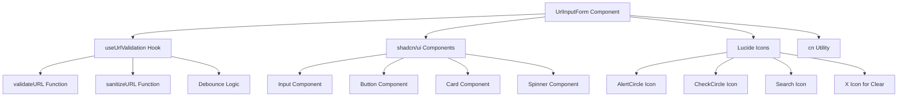
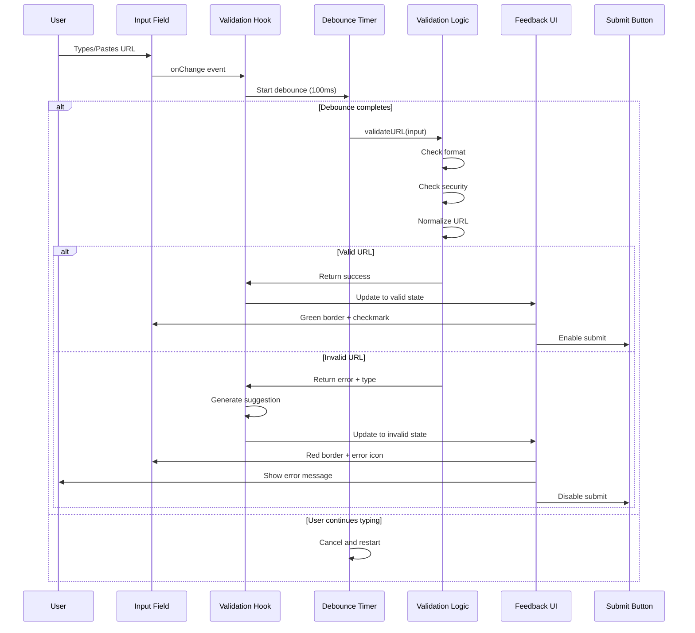
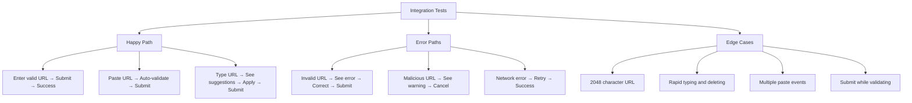
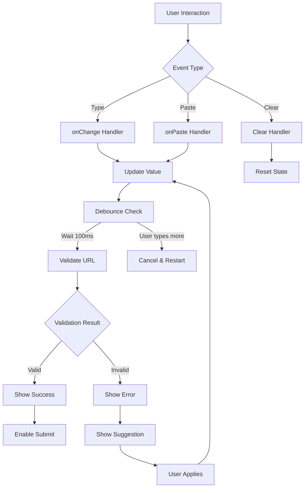
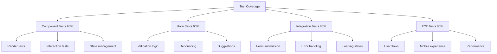

# Implementation Plan: Story 3-2 - URL Analysis Form with Backend Integration

## Metadata

- **Story File**: story-3-2-url-analysis-form-backend-integration.md
- **Created**: 2025-01-30
- **Last Updated**: 2025-01-30
- **BMad Version**: 1.0
- **Generated By**: Claude Opus 4.1

## Story Reference

Story 3-1 focuses on creating a clean, intuitive URL input form with immediate validation feedback. The goal is to enable users to easily submit URLs for analysis while understanding any input issues before analysis begins. This involves real-time validation, visual feedback, auto-correction capabilities, and mobile-responsive design.

## Implementation Plan Sections

## 1. Architectural Decisions

### Design Pattern Selection
**Pattern:** Enhanced React Component with Hook-based State Management
- **Rationale:** Leverages existing `UrlInputForm` component and `useUrlValidation` hook, maintaining consistency with current architecture
- **Existing Examples:** Current implementation in `src/components/analysis/url-input-form.tsx`
- **Adaptation:** Enhance existing component rather than creating new one, following the codebase principle of reusing components

### Component Architecture
```
UrlInputForm (Enhanced)
├── Input Field (shadcn/ui Input)
├── Validation Feedback (custom composition)
│   ├── Visual Indicators (border colors via cn())
│   ├── Error Messages (inline with Lucide icons)
│   └── Success Indicators (CheckCircle from Lucide)
├── Submit Button (shadcn/ui Button)
└── Loading States (shadcn/ui Spinner)
```

### State Management Strategy
- **Local State:** Component-level state for UI feedback using React.useState
- **Validation Hook:** `useUrlValidation` for debounced validation logic
- **No Global State:** Form is self-contained, passes validated URL up through callback
- **Rationale:** Maintains separation of concerns and component reusability

### Library Choices
- **shadcn/ui:** Already in use for Input, Button, Card components
- **Lucide React:** Existing icon library (AlertCircle, CheckCircle, Search)
- **cn utility:** Existing class name utility for conditional styling
- **No new dependencies:** All functionality achievable with current stack

## 2. Component Structure

### 2.1 Enhanced Component Interfaces

```typescript
// Enhanced props for UrlInputForm
interface EnhancedUrlInputFormProps {
  onSubmit: (url: string) => Promise<void>
  disabled?: boolean
  initialValue?: string
  autoFocus?: boolean        // New: Auto-focus on mount
  showSuggestions?: boolean   // New: Show auto-correction suggestions
  autoCorrect?: boolean       // New: Apply corrections automatically
  className?: string
  placeholder?: string
}

// Validation state for real-time feedback
interface ValidationState {
  status: 'idle' | 'validating' | 'valid' | 'invalid'
  error?: string
  errorType?: 'invalid-format' | 'unsupported-protocol' | 'invalid-domain' | 'security-risk' | 'too-long'
  suggestion?: string
  normalizedUrl?: string
  validatedAt?: number
}

// Visual feedback configuration
interface VisualFeedback {
  borderClass: string
  focusClass: string
  icon?: React.ReactNode
  message?: string
  messageType: 'error' | 'success' | 'info'
  showPulse?: boolean
}
```

### 2.2 Component Dependencies Map



## 3. Data Flow Strategy

### 3.1 Input Validation Flow



### 3.2 State Transitions

```typescript
// State machine for validation states
const validationStateMachine = {
  idle: {
    on: {
      START_TYPING: 'validating',
      PASTE: 'validating'
    }
  },
  validating: {
    on: {
      VALIDATION_SUCCESS: 'valid',
      VALIDATION_ERROR: 'invalid',
      CLEAR: 'idle',
      TYPE_MORE: 'validating'
    }
  },
  valid: {
    on: {
      EDIT: 'validating',
      SUBMIT: 'submitting',
      CLEAR: 'idle'
    }
  },
  invalid: {
    on: {
      EDIT: 'validating',
      APPLY_SUGGESTION: 'validating',
      CLEAR: 'idle'
    }
  },
  submitting: {
    on: {
      SUBMIT_SUCCESS: 'idle',
      SUBMIT_ERROR: 'valid'
    }
  }
}
```

## 4. Integration Points

### 4.1 Backend Validation Integration
- **Client-side validation:** Mirrors server-side rules from `validateURL`
- **Validation options:** `{ allowPrivateIPs: false, allowLocalhost: false, maxLength: 2048 }`
- **Error mapping:** Client errors match server error types for consistency

### 4.2 Analysis Pipeline Integration
```typescript
// Integration with parent component
const handleValidatedSubmit = async (normalizedUrl: string) => {
  try {
    // Parent handles API call
    await onSubmit(normalizedUrl)
    // Form resets on success
    clearForm()
  } catch (error) {
    // Form shows submission error
    setSubmissionError(error.message)
  }
}
```

### 4.3 Loading State Coordination
- Form shows loading during validation (100ms debounce)
- Parent shows loading during analysis (API call)
- Clear separation of responsibilities

## 5. Error Handling Strategy

### 5.1 Error Message Mapping
```typescript
const errorMessages: Record<string, string> = {
  // Format errors
  'empty': 'Please enter a URL',
  'invalid-format': 'Please enter a valid URL (e.g., https://example.com)',
  
  // Protocol errors  
  'unsupported-protocol': 'URL must start with http:// or https://',
  'http-suggestion': 'For security, consider using https:// instead of http://',
  
  // Domain errors
  'invalid-domain': 'URL appears to be malformed - please check the format',
  'missing-tld': 'Domain must have a valid top-level domain (e.g., .com)',
  
  // Security errors
  'security-risk': 'This URL may pose a security risk',
  'private-ip': 'Private IP addresses are not allowed',
  'localhost': 'Localhost URLs are not allowed',
  
  // Length errors
  'too-long': 'URL too long - please use a shorter URL (max 2048 characters)',
  
  // Network errors
  'validation-timeout': 'Validation is taking longer than expected',
  'validation-failed': 'Unable to validate URL. Please try again'
}
```

### 5.2 Error Recovery Strategies
```typescript
const errorRecoveryActions = {
  'invalid-format': {
    action: 'suggest',
    handler: (url) => generateFormatSuggestion(url)
  },
  'unsupported-protocol': {
    action: 'auto-fix',
    handler: (url) => url.replace(/^http:/, 'https:')
  },
  'missing-tld': {
    action: 'suggest',
    handler: (url) => `${url}.com`
  },
  'validation-failed': {
    action: 'retry',
    handler: () => retryValidation()
  }
}
```

## 6. Test Strategy

### 6.1 Unit Test Scenarios

```typescript
describe('UrlInputForm', () => {
  // Validation tests
  describe('URL Validation', () => {
    test('validates correct HTTPS URLs')
    test('validates correct HTTP URLs with warning')
    test('rejects invalid URL formats')
    test('rejects malicious protocols')
    test('handles URLs without protocol')
    test('validates international domains')
    test('enforces max length of 2048 characters')
  })
  
  // Real-time feedback tests
  describe('Real-time Feedback', () => {
    test('shows validation after 100ms debounce')
    test('updates border color based on validation state')
    test('displays appropriate icons for each state')
    test('shows error messages for invalid URLs')
    test('shows success indicator for valid URLs')
  })
  
  // Auto-correction tests
  describe('Auto-correction', () => {
    test('adds https:// to URLs without protocol')
    test('suggests corrections for common typos')
    test('handles paste events with auto-correction')
    test('preserves user input when auto-correct is disabled')
  })
  
  // Mobile tests
  describe('Mobile Experience', () => {
    test('input field is minimum 48px height')
    test('uses URL keyboard on mobile devices')
    test('prevents zoom on iOS Safari')
    test('clear button is easily tappable')
  })
  
  // Accessibility tests
  describe('Accessibility', () => {
    test('announces validation errors to screen readers')
    test('maintains focus after validation')
    test('supports keyboard navigation')
    test('has proper ARIA labels')
  })
  
  // Performance tests
  describe('Performance', () => {
    test('validation completes under 100ms')
    test('handles rapid input changes without lag')
    test('cleans up timeouts on unmount')
    test('prevents memory leaks')
  })
})
```

### 6.2 Integration Test Flows



## 7. Step-by-Step Implementation

### Phase 1: Enhance Core Validation (Day 1)

1. **Update useUrlValidation hook**
   ```typescript
   // In src/hooks/useUrlValidation.ts
   - Reduce debounce from 300ms to 100ms
   - Add immediate validation for paste events
   - Implement enhanced suggestion generation
   - Add validation status tracking
   ```

2. **Enhance validation feedback types**
   ```typescript
   // Add to types/url.ts
   - Add ValidationState interface
   - Add VisualFeedback interface
   - Update URLValidationFeedback type
   ```

### Phase 2: Enhance UI Component (Day 1)

3. **Update UrlInputForm component**
   ```typescript
   // In src/components/analysis/url-input-form.tsx
   - Add autoFocus prop and implementation
   - Add paste event handler
   - Integrate enhanced validation hook
   - Add clear button with X icon
   ```

4. **Implement visual feedback system**
   ```typescript
   // In same component file
   - Create visualStates configuration
   - Add dynamic border classes using cn()
   - Add validation icons (CheckCircle, AlertCircle)
   - Implement message display logic
   ```

### Phase 3: Mobile & Accessibility (Day 2)

5. **Add mobile optimizations**
   ```css
   // In component styles
   - Set min-height: 48px for touch targets
   - Set font-size: 16px to prevent iOS zoom
   - Add responsive padding adjustments
   ```

6. **Implement accessibility features**
   ```typescript
   // In component
   - Add aria-invalid attribute
   - Add aria-describedby for errors
   - Implement proper focus management
   - Add screen reader announcements
   ```

### Phase 4: Testing & Polish (Day 2)

7. **Write comprehensive tests**
   ```typescript
   // In tests/components/UrlInputForm.test.tsx
   - Unit tests for all validation scenarios
   - Integration tests for user flows
   - Performance tests for validation speed
   - Accessibility tests with jest-axe
   ```

8. **Performance optimization**
   ```typescript
   // Final optimizations
   - Profile and optimize re-renders
   - Ensure cleanup of timeouts
   - Test with large URLs
   - Verify mobile performance
   ```

## 8. Code Patterns & Conventions

### Following Existing Patterns

1. **Class name composition**
   ```typescript
   className={cn(
     'base-classes',
     condition && 'conditional-classes',
     className // Allow override
   )}
   ```

2. **Error handling pattern**
   ```typescript
   try {
     await operation()
   } catch (err) {
     setError(err instanceof Error ? err.message : 'An error occurred')
   }
   ```

3. **Loading state pattern**
   ```typescript
   {isLoading ? (
     <><Spinner size="sm" className="mr-2" />Loading...</>
   ) : (
     <><Icon className="h-4 w-4 mr-2" />Action</>
   )}
   ```

4. **Hook usage pattern**
   ```typescript
   const { state, setValue, validate, clear } = useUrlValidation({
     debounceMs: 100,
     validateOnChange: true,
     autoCorrect: true
   })
   ```

## 9. Potential Pitfalls & Mitigation

### Critical Pitfalls to Avoid

1. **Race Condition in Validation**
   - **Risk:** Multiple validation calls interfering
   - **Mitigation:** Use AbortController to cancel previous validations
   ```typescript
   const validationRef = useRef<AbortController>()
   // Cancel previous validation before starting new one
   ```

2. **iOS Safari Input Zoom**
   - **Risk:** Page zooms when input focused
   - **Mitigation:** Set font-size to exactly 16px
   ```css
   input { font-size: 16px; }
   ```

3. **Memory Leaks from Timeouts**
   - **Risk:** Unmounted component with active timeouts
   - **Mitigation:** Clear all timeouts in useEffect cleanup
   ```typescript
   useEffect(() => {
     return () => clearTimeout(debounceRef.current)
   }, [])
   ```

4. **Paste Event Handling**
   - **Risk:** Paste events bypass normal validation flow
   - **Mitigation:** Add dedicated paste handler with immediate validation
   ```typescript
   const handlePaste = (e) => {
     const pasted = e.clipboardData.getData('text')
     validateImmediately(pasted)
   }
   ```

5. **Conflicting Visual States**
   - **Risk:** Multiple states active simultaneously
   - **Mitigation:** Use single source of truth for visual state
   ```typescript
   const visualState = getVisualState(validationStatus)
   ```

## Architecture Diagrams

### Component Interaction Flow



### Test Coverage Map



## Implementation Status

- [ ] Planning Complete
- [ ] Architecture Decisions Implemented
- [ ] Component Structure Built
- [ ] Integration Points Connected
- [ ] Testing Complete
- [ ] Story Acceptance Criteria Met

## Success Metrics

- Validation response time < 100ms
- All WCAG 2.1 AA accessibility tests pass
- Mobile touch targets >= 48px
- Zero memory leaks in profiling
- 90%+ test coverage
- All acceptance criteria verified