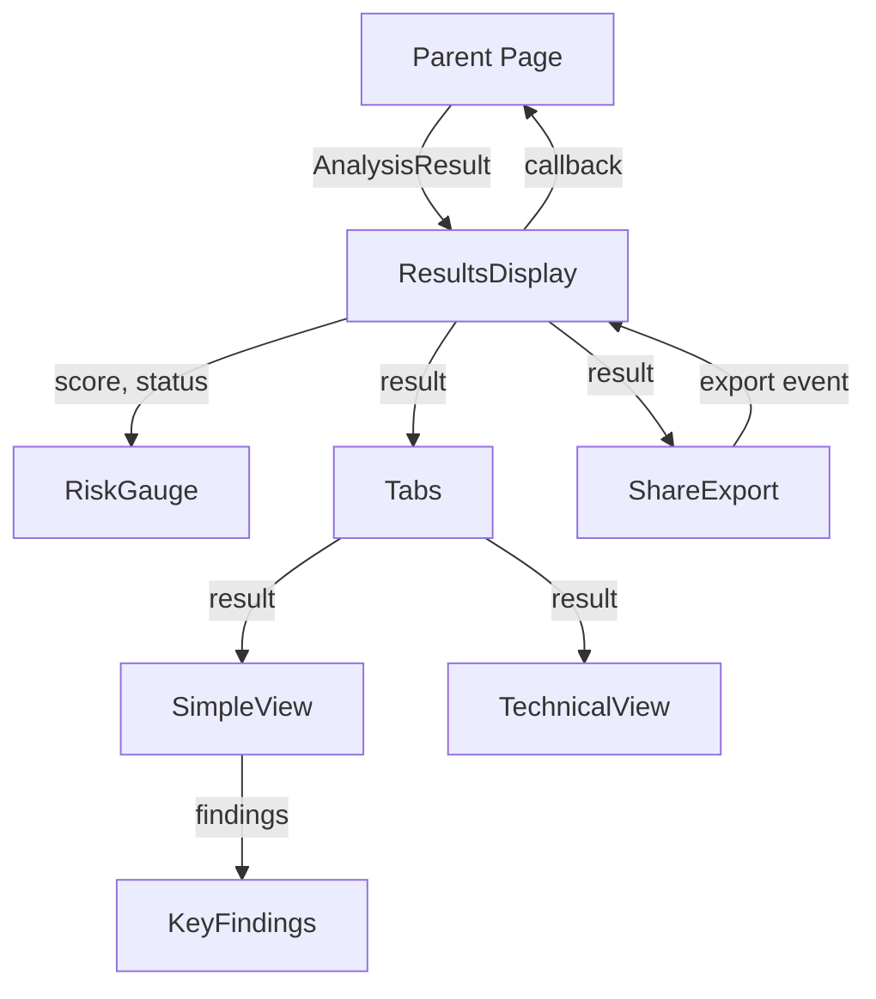
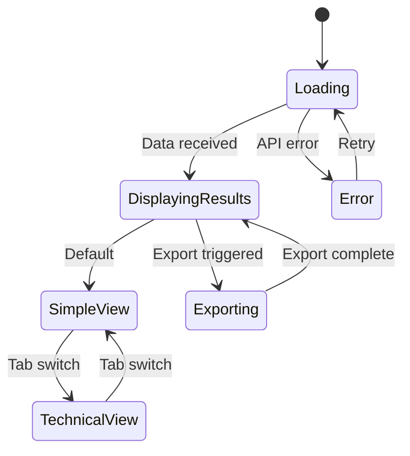

# Implementation Plan: Story 3-3 - Results Display with Dual-View System

## Metadata

- **Story File**: story-3-3-results-display-dual-view-system.md
- **Created**: 2025-08-31
- **Last Updated**: 2025-08-31
- **BMad Version**: 4.40.1
- **Generated By**: Claude Opus 4.1

## Story Reference

Story 3-3 implements a comprehensive results display system with dual-view interface (simple/technical), animated risk score gauge, key findings display, share/export functionality, and real-time backend integration. The system provides progressive disclosure allowing both general users and technical users to understand URL analysis results at their preferred level of detail.

## Implementation Plan Sections

### 1. Architectural Decisions

#### 1.1 Component Architecture Pattern
- **Decision**: Composition-based architecture using shadcn/ui components
- **Rationale**: Aligns with project's component guidelines, ensures consistency, reduces custom code
- **Implementation**: All UI components will be shadcn/ui or compositions thereof
- **Example**: `ResultsDisplay` composes `Tabs`, `Card`, `Badge`, `Accordion` from shadcn

#### 1.2 State Management Strategy
- **Decision**: Local React state with props drilling for view toggles and data
- **Rationale**: Keeps components simple, avoids unnecessary global state complexity
- **Implementation**: 
  - View state (`simple`/`technical`) managed in `ResultsDisplay`
  - Analysis data passed as props from parent page
  - Export actions bubble up via callbacks

#### 1.3 Animation Framework
- **Decision**: Framer Motion for complex animations, CSS transitions for simple ones
- **Rationale**: Framer Motion provides smooth, performant animations for the risk gauge
- **Implementation**:
  - Risk gauge uses Framer Motion `motion.svg` with `animate` prop
  - Tab transitions use Tailwind transition classes
  - Loading states use shadcn Skeleton with CSS animations

#### 1.4 Data Integration Pattern
- **Decision**: Progressive enhancement with graceful degradation
- **Rationale**: Ensures usability even with partial results or network issues
- **Implementation**:
  - Display available data immediately
  - Show loading indicators for pending sections
  - Error boundaries at component level

#### 1.5 Export Strategy
- **Decision**: Client-side PDF generation with jsPDF
- **Rationale**: No server dependency, immediate generation, works offline
- **Implementation**:
  - jsPDF for PDF document creation
  - html2canvas for capturing visual elements
  - Native browser APIs for link sharing

### 2. Component Structure

#### 2.1 Component Hierarchy

```
src/components/analysis/
├── results-display.tsx          # Main orchestrator component
├── risk-gauge.tsx               # Animated circular progress
├── simple-view.tsx              # User-friendly view
├── key-findings.tsx             # Top risk factors display
├── share-export.tsx             # Export/share functionality
└── partial-results.tsx          # Handles incomplete data
```

#### 2.2 Component Interfaces

```typescript
// results-display.tsx
export interface ResultsDisplayProps {
  result: AnalysisResult | null
  isLoading: boolean
  error?: Error
  onShare?: (method: ShareMethod) => void
  onExport?: (format: ExportFormat) => void
}

// risk-gauge.tsx
export interface RiskGaugeProps {
  score: number
  status: 'safe' | 'moderate' | 'caution' | 'danger'
  size?: 'sm' | 'md' | 'lg'
  animate?: boolean
  showNumeric?: boolean
}

// simple-view.tsx
export interface SimpleViewProps {
  result: AnalysisResult
  onViewDetails?: () => void
}

// key-findings.tsx
export interface KeyFindingsProps {
  findings: Finding[]
  maxItems?: number
  expandable?: boolean
}

// share-export.tsx
export interface ShareExportProps {
  result: AnalysisResult
  onShare: (method: ShareMethod) => void
  onExport: (format: ExportFormat) => void
}
```

#### 2.3 Type Definitions

```typescript
// types/analysis-display.ts
export interface AnalysisResult {
  url: string
  score: number
  status: RiskStatus
  confidence: number
  findings: Finding[]
  technicalData: TechnicalData
  timestamp: Date
}

export interface Finding {
  id: string
  type: 'positive' | 'negative' | 'neutral'
  severity: 'low' | 'medium' | 'high'
  title: string
  description: string
  icon: string
  details?: string
}

export interface TechnicalData {
  domainAge: DomainAgeData
  ssl: SSLData
  reputation: ReputationData
  ai: AIAnalysisData
  raw: Record<string, unknown>
}

export type ShareMethod = 'link' | 'twitter' | 'facebook' | 'email'
export type ExportFormat = 'pdf' | 'json' | 'csv'
```

### 3. Data Flow Strategy

#### 3.1 Component Data Flow



#### 3.2 State Transitions



### 4. Integration Points

#### 4.1 API Response Mapping

```typescript
// Transform API response to display format
function mapApiResponseToResult(apiResponse: ApiAnalysisResponse): AnalysisResult {
  return {
    url: apiResponse.url,
    score: apiResponse.scoring.finalScore,
    status: mapScoreToStatus(apiResponse.scoring.finalScore),
    confidence: apiResponse.scoring.confidence,
    findings: extractKeyFindings(apiResponse),
    technicalData: {
      domainAge: apiResponse.whois,
      ssl: apiResponse.ssl,
      reputation: apiResponse.reputation,
      ai: apiResponse.ai,
      raw: apiResponse
    },
    timestamp: new Date(apiResponse.timestamp)
  }
}

function mapScoreToStatus(score: number): RiskStatus {
  if (score >= 80) return 'safe'
  if (score >= 60) return 'moderate'
  if (score >= 40) return 'caution'
  return 'danger'
}
```

#### 4.2 Real-time Update Handling

```typescript
// WebSocket connection for progressive results
const useProgressiveResults = (analysisId: string) => {
  const [result, setResult] = useState<Partial<AnalysisResult>>({})
  
  useEffect(() => {
    const ws = new WebSocket(`wss://api.scamchecker.com/analysis/${analysisId}`)
    
    ws.onmessage = (event) => {
      const update = JSON.parse(event.data)
      setResult(prev => ({
        ...prev,
        ...update,
        findings: [...(prev.findings || []), ...(update.findings || [])]
      }))
    }
    
    return () => ws.close()
  }, [analysisId])
  
  return result
}
```

### 5. Error Handling Strategy

#### 5.1 Error Boundaries

```typescript
// Component-level error boundary
export class ResultsErrorBoundary extends Component {
  state = { hasError: false, error: null }
  
  static getDerivedStateFromError(error: Error) {
    return { hasError: true, error }
  }
  
  render() {
    if (this.state.hasError) {
      return (
        <Alert variant="destructive">
          <AlertTitle>Unable to display results</AlertTitle>
          <AlertDescription>
            {this.state.error?.message || 'An unexpected error occurred'}
          </AlertDescription>
        </Alert>
      )
    }
    
    return this.props.children
  }
}
```

#### 5.2 Partial Results Handling

```typescript
// Display available data with loading indicators
function PartialResults({ result }: { result: Partial<AnalysisResult> }) {
  return (
    <div className="space-y-4">
      {result.score !== undefined ? (
        <RiskGauge score={result.score} animate />
      ) : (
        <Skeleton className="h-48 w-48 rounded-full" />
      )}
      
      {result.findings ? (
        <KeyFindings findings={result.findings} />
      ) : (
        <div className="space-y-2">
          <Skeleton className="h-4 w-full" />
          <Skeleton className="h-4 w-3/4" />
        </div>
      )}
    </div>
  )
}
```

### 6. Test Strategy

#### 6.1 Unit Tests

```typescript
// tests/unit/components/analysis/RiskGauge.test.tsx
describe('RiskGauge', () => {
  test('animates from 0 to target score', async () => {
    render(<RiskGauge score={85} animate />)
    
    // Initial state
    expect(screen.getByText('0')).toBeInTheDocument()
    
    // After animation completes
    await waitFor(() => {
      expect(screen.getByText('85')).toBeInTheDocument()
    }, { timeout: 2000 })
  })
  
  test('applies correct color for score ranges', () => {
    const { rerender } = render(<RiskGauge score={25} />)
    expect(screen.getByTestId('gauge-arc')).toHaveStyle({ stroke: '#ef4444' })
    
    rerender(<RiskGauge score={50} />)
    expect(screen.getByTestId('gauge-arc')).toHaveStyle({ stroke: '#f59e0b' })
    
    rerender(<RiskGauge score={85} />)
    expect(screen.getByTestId('gauge-arc')).toHaveStyle({ stroke: '#10b981' })
  })
})

// tests/unit/components/analysis/ResultsDisplay.test.tsx
describe('ResultsDisplay', () => {
  test('switches between simple and technical views', async () => {
    render(<ResultsDisplay result={mockResult} isLoading={false} />)
    
    expect(screen.getByTestId('simple-view')).toBeVisible()
    expect(screen.queryByTestId('technical-view')).not.toBeInTheDocument()
    
    await userEvent.click(screen.getByRole('tab', { name: /technical/i }))
    
    expect(screen.queryByTestId('simple-view')).not.toBeInTheDocument()
    expect(screen.getByTestId('technical-view')).toBeVisible()
  })
  
  test('handles export to PDF', async () => {
    const onExport = jest.fn()
    render(<ResultsDisplay result={mockResult} onExport={onExport} />)
    
    await userEvent.click(screen.getByRole('button', { name: /export/i }))
    await userEvent.click(screen.getByRole('menuitem', { name: /pdf/i }))
    
    expect(onExport).toHaveBeenCalledWith('pdf')
  })
})
```

#### 6.2 Integration Tests

```typescript
// tests/integration/analysis-results-flow.test.tsx
describe('Analysis Results Flow', () => {
  test('displays progressive results as they arrive', async () => {
    const { result } = renderHook(() => useProgressiveResults('test-id'))
    
    // Simulate WebSocket messages
    act(() => {
      mockWebSocket.send({ score: 75 })
    })
    expect(result.current.score).toBe(75)
    
    act(() => {
      mockWebSocket.send({ findings: [mockFinding1] })
    })
    expect(result.current.findings).toHaveLength(1)
    
    act(() => {
      mockWebSocket.send({ findings: [mockFinding2] })
    })
    expect(result.current.findings).toHaveLength(2)
  })
})
```

#### 6.3 E2E Tests

```typescript
// tests/e2e/results-display.spec.ts
import { test, expect } from '@playwright/test'

test.describe('Results Display', () => {
  test('shows animated risk gauge on analysis completion', async ({ page }) => {
    await page.goto('/analyze?url=example.com')
    
    // Wait for analysis to complete
    await page.waitForSelector('[data-testid="risk-gauge"]')
    
    // Verify gauge animation
    const scoreElement = page.locator('[data-testid="score-display"]')
    const initialScore = await scoreElement.textContent()
    expect(Number(initialScore)).toBeLessThan(10)
    
    // Wait for animation to complete
    await page.waitForTimeout(2000)
    const finalScore = await scoreElement.textContent()
    expect(Number(finalScore)).toBeGreaterThan(0)
  })
  
  test('exports results to PDF', async ({ page }) => {
    await page.goto('/results/test-analysis')
    
    // Trigger export
    const downloadPromise = page.waitForEvent('download')
    await page.click('[data-testid="export-button"]')
    await page.click('text=Export as PDF')
    
    const download = await downloadPromise
    expect(download.suggestedFilename()).toContain('.pdf')
  })
})
```

### 7. Step-by-Step Implementation

#### Step 1: Install Required Dependencies
```bash
# shadcn components
npx shadcn@latest add tabs accordion badge progress separator tooltip popover dialog alert skeleton

# Additional dependencies
npm install framer-motion@^11.0.0 jspdf@^2.5.1 html2canvas@^1.4.1
```

#### Step 2: Create Risk Gauge Component
1. Create `src/components/analysis/risk-gauge.tsx`
2. Implement SVG-based circular progress
3. Add Framer Motion animations
4. Implement color interpolation logic
5. Add numeric display in center

#### Step 3: Create Simple View Component
1. Create `src/components/analysis/simple-view.tsx`
2. Use Card for layout structure
3. Add Badge for status display
4. Implement key findings list
5. Add "View Technical Details" button

#### Step 4: Create Key Findings Component
1. Create `src/components/analysis/key-findings.tsx`
2. Map finding types to Lucide icons
3. Implement severity-based coloring
4. Add expandable details with Tooltip
5. Handle empty state

#### Step 5: Enhance Technical View
1. Update `src/components/analysis/technical-details.tsx`
2. Add Accordion for collapsible sections
3. Implement data tables for metrics
4. Add JSON viewer for raw data
5. Include copy-to-clipboard functionality

#### Step 6: Create Share/Export Component
1. Create `src/components/analysis/share-export.tsx`
2. Implement Dialog for export options
3. Add PDF generation with jsPDF
4. Implement shareable link generation
5. Add social media share buttons

#### Step 7: Create Main Results Display
1. Create `src/components/analysis/results-display.tsx`
2. Integrate all sub-components
3. Implement Tabs for view switching
4. Add error boundaries
5. Wire up data flow

#### Step 8: Add Tests
1. Create unit tests for each component
2. Add integration tests for data flow
3. Create E2E tests for user flows
4. Add performance tests for animations

### 8. Code Patterns & Conventions

#### 8.1 Component Naming
- PascalCase for component files and exports
- Prefix with feature area (e.g., `AnalysisRiskGauge`)
- Use `.tsx` extension for all React components

#### 8.2 State Management
```typescript
// Use custom hooks for complex state logic
const useViewToggle = (defaultView: 'simple' | 'technical' = 'simple') => {
  const [view, setView] = useState(defaultView)
  const [scrollPositions, setScrollPositions] = useState<Record<string, number>>({})
  
  const toggleView = useCallback((newView: typeof view) => {
    // Save current scroll position
    setScrollPositions(prev => ({
      ...prev,
      [view]: window.scrollY
    }))
    
    setView(newView)
    
    // Restore previous scroll position
    if (scrollPositions[newView]) {
      window.scrollTo(0, scrollPositions[newView])
    }
  }, [view, scrollPositions])
  
  return { view, toggleView }
}
```

#### 8.3 Error Handling Pattern
```typescript
// Consistent error handling across components
const handleAsyncAction = async (
  action: () => Promise<void>,
  errorMessage: string
) => {
  try {
    await action()
  } catch (error) {
    console.error(errorMessage, error)
    showToast(errorMessage, 'error')
  }
}
```

### 9. Potential Pitfalls & Mitigation

#### 9.1 Performance Issues
- **Risk**: Animation jank on low-end devices
- **Mitigation**: 
  - Implement `prefers-reduced-motion` support
  - Use CSS transforms instead of layout properties
  - Throttle animation updates to 60fps

#### 9.2 Memory Leaks
- **Risk**: WebSocket connections not properly closed
- **Mitigation**:
  - Always clean up in useEffect return
  - Use AbortController for fetch requests
  - Clear timers and intervals

#### 9.3 Export Failures
- **Risk**: PDF generation fails with large datasets
- **Mitigation**:
  - Implement pagination for large exports
  - Provide text/JSON fallback options
  - Show progress indicator for long operations

#### 9.4 Accessibility Issues
- **Risk**: Animations not accessible to screen readers
- **Mitigation**:
  - Add ARIA live regions for score updates
  - Provide text alternatives for visual elements
  - Ensure keyboard navigation works

### 10. Implementation Status

- [ ] Planning Complete
- [ ] Architecture Decisions Implemented
- [ ] Component Structure Built
- [ ] Integration Points Connected
- [ ] Testing Complete
- [ ] Story Acceptance Criteria Met

## Traceability Matrix

| AC ID | Acceptance Criterion | Test IDs | Modules/Files/Classes/Functions | Notes |
|-------|---------------------|----------|----------------------------------|-------|
| AC-1 | Animated Risk Score Gauge | T-3-3-001, T-3-3-002, T-3-3-INT-A | risk-gauge.tsx, animateScore(), interpolateColor() | Edge cases: 0, 100, rapid changes |
| AC-2 | Dual-View Toggle System | T-3-3-003, T-3-3-004 | results-display.tsx, Tabs, useViewToggle() | Preserve scroll position |
| AC-3 | Key Findings Display | T-3-3-005, T-3-3-INT-B | key-findings.tsx, simple-view.tsx, mapFindings() | Max 5 items, expandable |
| AC-4 | Detailed Technical Breakdown | T-3-3-006 | technical-details.tsx, Accordion, formatTechnicalData() | Lazy load sections |
| AC-5 | Share/Export Functionality | T-3-3-007, T-3-3-008 | share-export.tsx, generatePDF(), createShareLink() | Handle large exports |
| AC-6 | Real-time Data Integration | T-3-3-009, T-3-3-INT-C | results-display.tsx, useProgressiveResults() | WebSocket fallback to polling |
| AC-7 | Error State Handling | T-3-3-010 | ResultsErrorBoundary, PartialResults | Graceful degradation |

## Questions & Decisions Ledger

### Open Questions for James

| Q# | Title | Context | Question | Options | Preferred | Date |
|----|-------|---------|----------|---------|-----------|------|
| Q1 | PDF Library Choice | Share/Export implementation | Should we use jsPDF or react-pdf? | jsPDF (simpler) / react-pdf (more features) | jsPDF | 2025-08-31 |
| Q2 | Animation Performance | Risk Gauge | Use Canvas or SVG for gauge? | Canvas (better perf) / SVG (easier styling) | SVG with optimization | 2025-08-31 |

### Resolved Decisions

| D# | Title | Decision | Rationale | Alternatives | Date | Impacted |
|----|-------|----------|-----------|--------------|------|----------|
| D1 | State Management | Local React state | Simple, no global state needed | Zustand, Context API | 2025-08-31 | All components |
| D2 | Export Format | Client-side generation | No server dependency, works offline | Server-side API | 2025-08-31 | ShareExport |

## Dependency Policy

### Explicitly Approved Dependencies
- `framer-motion@^11.0.0` - Animation library for risk gauge
- `jspdf@^2.5.1` - PDF generation
- `html2canvas@^1.4.1` - Screenshot for PDF export

### Prohibited Changes
- No custom animation libraries beyond Framer Motion
- No additional state management libraries
- No server-side export dependencies
- No custom chart libraries (use SVG/Canvas)

## Observability Requirements

### Logging
- Log view toggle events with current score and view
- Log export format and success/failure
- Track animation frame rate if below 30fps
- Record partial result handling events

### Metrics
- View toggle frequency and patterns
- Export format popularity
- Animation performance (FPS)
- Error boundary triggers

### Thresholds
- Animation FPS: Alert if < 30fps for > 5 seconds
- Export time: Alert if > 10 seconds
- Component render time: Alert if > 500ms

## Rollout/Recovery Guidance

### Feature Toggles
```typescript
const FEATURES = {
  ANIMATED_GAUGE: process.env.NEXT_PUBLIC_FEATURE_ANIMATED_GAUGE === 'true',
  PDF_EXPORT: process.env.NEXT_PUBLIC_FEATURE_PDF_EXPORT === 'true',
  PROGRESSIVE_RESULTS: process.env.NEXT_PUBLIC_FEATURE_PROGRESSIVE === 'true'
}
```

### Rollback Plan
1. Disable feature flags if issues detected
2. Fall back to simple text-based results display
3. Disable exports if PDF generation fails
4. Use static gauge if animation causes issues

### Recovery Steps
1. Monitor error rates in first 24 hours
2. Check performance metrics for degradation
3. Gather user feedback on new UI
4. Prepared to rollback via feature flags