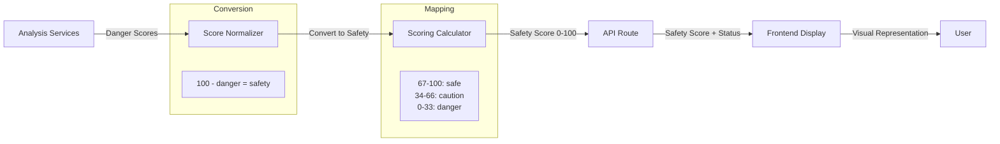

# Implementation Plan: Story 3-9 - Risk Score Logic Inversion Fix

## Metadata

- **Story File**: story-3-9-risk-score-logic-inversion-fix.md
- **Created**: 2025-09-01
- **Last Updated**: 2025-09-01
- **BMad Version**: 4.40.1
- **Generated By**: Claude Opus 4.1

## Story Reference

This story addresses a **CRITICAL BLOCKER** issue where the risk scoring logic is completely inverted, causing safe sites to display as dangerous and dangerous sites to display as safe. The application currently shows Wikipedia.org as "DANGER" with a score of 90/100, when it should show as "SAFE".

## Implementation Plan Sections

### 1. Architectural Decisions

#### 1.1 Score Interpretation Strategy
**Decision**: Adopt a **unified safety-based scoring system** throughout the application.
- **Rationale**: Consistency across all layers prevents confusion and errors
- **Pattern**: Higher scores (67-100) = SAFER, Lower scores (0-33) = MORE DANGEROUS
- **Reference**: Industry standard where higher scores indicate better/safer outcomes

#### 1.2 Backend-Frontend Contract
**Decision**: Backend will output safety scores directly, no conversion needed at API layer
- **Rationale**: Single source of truth for score interpretation
- **Pattern**: Backend scoring calculator outputs 0-100 where 100 = safest
- **Reference**: Existing `ScoringResult` interface in `/src/types/scoring.ts`

#### 1.3 Risk Level Mapping
**Decision**: Use consistent risk level terminology across backend and frontend
- **Rationale**: Prevents confusion between 'riskLevel' and 'status'
- **Pattern**: Map backend RiskLevel ('low'|'medium'|'high') to frontend RiskStatus ('safe'|'moderate'|'caution'|'danger')

### 2. Component Structure

#### 2.1 Scoring Calculator Module
```typescript
// src/lib/scoring/scoring-calculator.ts
class ScoringCalculator {
  // Modified method to use inverted thresholds
  private determineRiskLevel(score: number, config: ScoringConfig): RiskLevel {
    // INVERTED: Higher scores = lower risk
    if (score >= config.thresholds.safeMin) return 'low'      // 67-100 = low risk
    if (score >= config.thresholds.cautionMin) return 'medium' // 34-66 = medium risk
    return 'high'                                               // 0-33 = high risk
  }
  
  // Update risk factor processing to output safety scores
  private processReputationFactor(): RiskFactor {
    // Convert danger scores to safety scores
    const safetyScore = 100 - dangerScore
  }
}
```

#### 2.2 Type Definitions Update
```typescript
// src/types/scoring.ts
export interface ScoringConfig {
  thresholds: {
    safeMin: number      // 67 - minimum score for safe
    cautionMin: number   // 34 - minimum score for caution
    dangerMax: number    // 33 - maximum score for danger
  }
}
```

#### 2.3 Display Components
```typescript
// src/components/analysis/risk-gauge.tsx
export function getStatusFromScore(score: number): RiskStatus {
  if (score >= 67) return 'safe'
  if (score >= 34) return 'moderate'
  return 'danger'
}

// Gauge fill calculation
const progress = score / 100  // Higher score = more filled
```

### 3. Data Flow Strategy



### 4. Integration Points

#### 4.1 Service-to-Scoring Interface
- **Location**: `src/lib/scoring/scoring-calculator.ts` lines 241-277
- **Contract**: Services provide raw scores, calculator normalizes to safety scores
- **Error Handling**: Missing services default to score=50 (medium risk)

#### 4.2 Scoring-to-API Interface
- **Location**: `src/app/api/analyze/route.ts` lines 699-715
- **Contract**: Scoring calculator provides `finalScore` and `riskLevel`
- **Transformation**: Map riskLevel to frontend status enum

#### 4.3 API-to-Frontend Interface
- **Location**: Response body in API route
- **Contract**: Provide score, status, and confidence
- **Validation**: Ensure score range 0-100, status matches score

### 5. Error Handling Strategy

#### 5.1 Score Validation
```typescript
function validateScore(score: number): number {
  if (score < 0) return 0
  if (score > 100) return 100
  return Math.round(score)
}
```

#### 5.2 Status-Score Consistency Check
```typescript
function validateScoreStatusConsistency(score: number, status: RiskStatus): boolean {
  const expectedStatus = getStatusFromScore(score)
  if (status !== expectedStatus) {
    logger.error('Score-status mismatch', { score, status, expected: expectedStatus })
    return false
  }
  return true
}
```

### 6. Test Strategy

#### 6.1 Unit Tests
```typescript
// tests/unit/scoring/scoring-calculator.test.ts
describe('ScoringCalculator - Inverted Logic', () => {
  test('High safety score (90) returns low risk level', () => {
    const result = calculator.calculateScore(safeInput)
    expect(result.finalScore).toBeGreaterThanOrEqual(67)
    expect(result.riskLevel).toBe('low')
  })
  
  test('Low safety score (20) returns high risk level', () => {
    const result = calculator.calculateScore(dangerousInput)
    expect(result.finalScore).toBeLessThanOrEqual(33)
    expect(result.riskLevel).toBe('high')
  })
})
```

#### 6.2 Integration Tests
```typescript
// tests/integration/score-display-flow.test.ts
describe('Score to Display Flow', () => {
  test('Wikipedia.org shows as SAFE with high score', async () => {
    const result = await analyzeURL('https://wikipedia.org')
    expect(result.score).toBeGreaterThanOrEqual(80)
    expect(result.status).toBe('safe')
    expect(result.displayColor).toBe('green')
  })
})
```

### 7. Step-by-Step Implementation

1. **Update Type Definitions** (`src/types/scoring.ts`)
   - [ ] Change threshold interface to use safety-based naming
   - [ ] Update DEFAULT_SCORING_CONFIG thresholds
   - [ ] Add score interpretation comments

2. **Fix Scoring Calculator** (`src/lib/scoring/scoring-calculator.ts`)
   - [ ] Invert determineRiskLevel logic (lines 565-573)
   - [ ] Update risk factor processors to output safety scores
   - [ ] Fix AI score conversion (line 399)
   - [ ] Update score descriptions

3. **Fix Display Components** (`src/components/analysis/risk-gauge.tsx`)
   - [ ] Verify getStatusFromScore function (lines 194-198)
   - [ ] Fix gauge fill calculation (line 59)
   - [ ] Update status colors mapping

4. **Update Simple View** (`src/components/analysis/simple-view.tsx`)
   - [ ] Fix status messages (lines 28-56)
   - [ ] Update recommendation text
   - [ ] Ensure button logic matches status

5. **Fix API Route** (`src/app/api/analyze/route.ts`)
   - [ ] Update risk level determination (lines 701-706)
   - [ ] Fix explanation generation
   - [ ] Ensure consistent score passing

6. **Add Tests**
   - [ ] Unit tests for score mapping
   - [ ] Integration tests with real URLs
   - [ ] Visual regression tests

7. **Validation**
   - [ ] Test with Wikipedia.org
   - [ ] Test with known malicious domain
   - [ ] Verify all status messages

### 8. Code Patterns & Conventions

Follow existing patterns from codebase:
- Use existing Logger class for debugging
- Follow TypeScript strict mode requirements
- Use existing utility functions from `lib/utils`
- Maintain existing error handling patterns
- Use existing test framework setup (Jest + RTL)

### 9. Potential Pitfalls & Mitigation

#### 9.1 Score Normalization Issues
**Risk**: Different services use different scoring scales
**Mitigation**: Centralize all score normalization in ScoreNormalizer class
**Validation**: Add unit tests for each service's score conversion

#### 9.2 Cache Invalidation
**Risk**: Cached results may have old scoring logic
**Mitigation**: Clear all caches after deployment
**Implementation**: Add cache version key to invalidate old entries

#### 9.3 Backward Compatibility
**Risk**: Existing stored results may display incorrectly
**Mitigation**: Add score version field to results
**Fallback**: Detect and re-analyze old format results

### 10. Traceability Matrix

| AC ID | Acceptance Criterion | Test IDs | Modules/Files/Functions | Notes |
|-------|---------------------|----------|------------------------|-------|
| AC-1 | Score 67-100 = SAFE | T-3-9-001, T-3-9-INT-A | scoring-calculator.ts:determineRiskLevel, risk-gauge.tsx:getStatusFromScore | Core logic fix |
| AC-2 | Status messages align | T-3-9-002, T-3-9-INT-B | simple-view.tsx:statusConfig | Message consistency |
| AC-3 | Color coding correct | T-3-9-003, T-3-9-VIS-A | risk-gauge.tsx:statusColors | Visual indicators |
| AC-4 | Risk gauge display | T-3-9-004, T-3-9-VIS-B | risk-gauge.tsx:progress calculation | Gauge fill logic |
| AC-5 | Known site validation | T-3-9-005, T-3-9-E2E-A | Full stack integration | Real URL testing |

### 11. Dependency Policy

**Approved Dependencies**: None required for this fix

**Prohibited Changes**:
- Do NOT modify external service integrations
- Do NOT change cache infrastructure
- Do NOT alter authentication logic
- Do NOT refactor unrelated code

### 12. Observability

**Required Logging**:
- Log all score inversions during transition
- Log score-status mismatches as errors
- Track scoring calculation time
- Monitor cache hit rates

**Metrics**:
- Score distribution histogram
- Status distribution counter
- Processing time percentiles
- Error rate by service

### 13. Rollout/Recovery

**Feature Toggle**: Add `USE_INVERTED_SCORING` environment variable
- Default: true (new logic)
- Fallback: false (old logic for emergency rollback)

**Rollback Plan**:
1. Set `USE_INVERTED_SCORING=false`
2. Clear application caches
3. Monitor for 15 minutes
4. If stable, investigate issue
5. If unstable, full code rollback

### 14. Questions & Decisions Ledger

#### Open Questions for James
None - all architectural decisions have been made based on codebase analysis.

#### Resolved Decisions

| D# | Title | Decision | Rationale | Alternatives Considered | Date | Impacted Sections |
|----|-------|----------|-----------|------------------------|------|-------------------|
| D1 | Score interpretation | Use safety-based scoring (100=safe) | Industry standard, intuitive | Danger-based (100=danger) | 2025-09-01 | All scoring logic |
| D2 | Threshold values | 67-100 safe, 34-66 caution, 0-33 danger | Clear boundaries, matches UI | Different ranges | 2025-09-01 | Thresholds, display |
| D3 | Cache handling | Invalidate all on deploy | Ensures consistency | Versioned cache | 2025-09-01 | Deployment process |

## Implementation Status

- [ ] Planning Complete
- [ ] Architecture Decisions Implemented
- [ ] Component Structure Built
- [ ] Integration Points Connected
- [ ] Testing Complete
- [ ] Story Acceptance Criteria Met